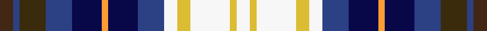

This page is one **sett** — a single exact thread-count. It belongs to the [tartan](/setts/do4dbi2dy8dbi8db9lo2db9dbi8w4ly4w12ly2w4/)
(the same proportion at any scale), whose colour order is pattern [BBGBBYBBWYWYW](/stripes/bbgbbybbwywyw/).

Part of the [Unidentified Gordon variant](/tartans/unidentified-gordon-variant/) tartan — the named design grouping this sett with its other cloths.

Sourced from register-of-tartans.  It is a [13 stripe tartan](/stripes/stripes13/).

Original link https://www.tartanregister.gov.uk/tartanDetails.aspx?ref=4299

## Register references

External register numbers recorded for this tartan.

- Scottish Register of Tartans: [4299](https://www.tartanregister.gov.uk/tartanDetails.aspx?ref=4299)
- Scottish Tartans World Register: 1730

## Thread count
DO/8 DBi4 DY16 DBi16 DB18 LO4 DB18 DBi16 W8 LY8 W24 LY4 W/8

One full sett is **288 threads**.

## Palette
<table><thead><tr><th>Colour</th><th>Shade</th><th>OKLCh</th></tr></thead><tbody><tr><td>B</td><td><code style="background-color:#2C4084;">#2C4084</code> <small style="color:#888">#2C4084</small></td><td><small style="color:#888">oklch(39.4% 0.117 268.3)</small></td></tr><tr><td>DB</td><td><code style="background-color:#080848;">#080848</code> <small style="color:#888">#080848</small></td><td><small style="color:#888">oklch(20.2% 0.112 270.4)</small></td></tr><tr><td>DO</td><td><code style="background-color:#DCBC32;">#DCBC32</code> <small style="color:#888">#DCBC32</small></td><td><small style="color:#888">oklch(80.0% 0.150 95.2)</small></td></tr><tr><td>K</td><td><code style="background-color:#412714;">#412714</code> <small style="color:#888">#412714</small></td><td><small style="color:#888">oklch(30.1% 0.050 55.7)</small></td></tr><tr><td>LN</td><td><code style="background-color:#F7F7F7;">#F7F7F7</code> <small style="color:#888">#F7F7F7</small></td><td><small style="color:#888">oklch(97.6% 0.000 89.9)</small></td></tr><tr><td>R</td><td><code style="background-color:#FF9C34;">#FF9C34</code> <small style="color:#888">#FF9C34</small></td><td><small style="color:#888">oklch(77.9% 0.161 61.8)</small></td></tr><tr><td>T</td><td><code style="background-color:#3A2B0D;">#3A2B0D</code> <small style="color:#888">#3A2B0D</small></td><td><small style="color:#888">oklch(30.0% 0.049 82.0)</small></td></tr></tbody></table>

# Sample pattern

## Nearest variants

The nearest existing variants by ΔTartan distance, with this cloth at the top so the swatches line up against it.

ΔTartan

Threads

Variant

Sett

—

288

<a href="/variants/s13/do4dbi2dy8dbi8db9lo2db9dbi8w4ly4w12ly2w4~x2~dbi1605267-db0804274/">Unidentified Gordon variant</a>

1.20

—

<a href="/variants/s13/do4dbi2o8dbi8db9b2db9dbi8w4oi4w12oi2w4~x2~dbi1604274-o2102055-db0805267-oi2104058/">Unidentified, Gordon variant</a>

## Neighbour map

Every grey dot is one of 13620 variants placed by the first two principal components of the ΔTartan feature space (42% of its variance). Red is this tartan; blue dots are its nearest — click one to open its page.

<svg viewBox="0 0 640 380" role="img" style="max-width:100%;height:auto;border:1px solid #e0e0e0;border-radius:4px;display:block" xmlns="http://www.w3.org/2000/svg"><image href="/nn/cloud.v1.png" width="640" height="380"/><a href="/variants/s13/do4dbi2o8dbi8db9b2db9dbi8w4oi4w12oi2w4~x2~dbi1604274-o2102055-db0805267-oi2104058/"><circle cx="14.0" cy="190.6" r="4" fill="#3465a4"><title>Unidentified, Gordon variant</title></circle></a><circle cx="22.1" cy="202.3" r="5" fill="#c00000"/><text x="320" y="376" text-anchor="middle" font-size="11" fill="#999">ground</text><text x="11" y="190" text-anchor="middle" font-size="11" fill="#999" transform="rotate(-90 11 190)">complexity</text></svg>

ID: /variants/s13/do4dbi2dy8dbi8db9lo2db9dbi8w4ly4w12ly2w4~x2~dbi1605267-db0804274/
