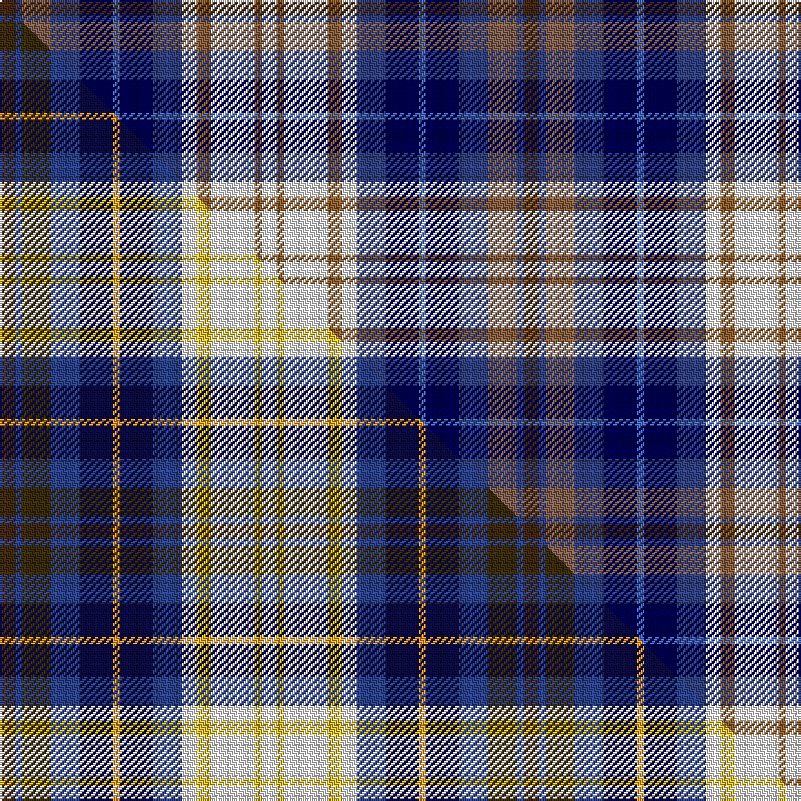

This is one **variant** — a specific cloth: this exact thread count and colourway, with its own
provenance below. It is one weaving of the [sett](/tartans/u/un/unidentified-gordon-variant/) (the scale-free proportion — the
same cloth at any scale or shade), whose colour order is pattern [BBRBBBBBWRWRW](/stripes/bbrbbbbbwrwrw/).

Part of the [Unidentified Gordon variant](/tartans/u/un/unidentified-gordon-variant/) tartan — the named design grouping this sett with its other cloths.

Sourced from weddslist.  It is a [13 stripe tartan](/stripes/stripes13/).

Original link [http://www.weddslist.com/cgi-bin/tartans/pg.pl?source=sts](http://www.weddslist.com/cgi-bin/tartans/pg.pl?source=sts)

Dataset <small>— provenance for this record, inherited from the source manifest</small>

<dl class="dataset-prov">
<dt>source</dt><dd><a href="/sources/weddslist/">Weddslist</a></dd>
<dt>data captured from</dt><dd><a href="https://github.com/thetartan/tartan-database/blob/master/data/weddslist/data.csv">https://github.com/thetartan/tartan-database/blob/master/data/weddslist/data.csv</a></dd>
<dt>data date</dt><dd>2016-11-17 <small>(dataset default)</small></dd>
<dt>licence</dt><dd><a href="https://creativecommons.org/licenses/by-nc-nd/4.0/">CC BY-NC-ND 4.0</a></dd>
</dl>

Capture chain <small>— the hands this data passed through, oldest first; each capture carries its own licence</small>

<ol class="capture-chain">
<li><a href="https://www.weddslist.com/tartans/">Weddslist</a> <small>the living privately compiled reference</small></li>
<li><a href="https://github.com/thetartan/tartan-database">thetartan/tartan-database</a> <small>2016-2017</small> · <a href="https://creativecommons.org/licenses/by-nc-nd/4.0/">CC BY-NC-ND 4.0</a> <small>Levko Kravets's frozen compilation — the capture we vendored, and where its CC licence text came from</small></li>
<li>this dictionary <small>captured 2026-06-10 · commit 5bf86c7566</small> <small>each re-capture is a git commit to data/sources</small></li>
</ol>

## Thread count
DO/8 DBi4 O16 DBi16 DB18 B4 DB18 DBi16 W8 Oi8 W24 Oi4 W/8

One full sett is **288 threads**.

## Palette
<table><thead><tr><th>Colour</th><th>Shade</th><th>OKLCh</th></tr></thead><tbody><tr><td>DB</td><td><code style="background-color:#304080;">#304080</code> <small style="color:#888">#304080</small></td><td><small style="color:#888">oklch(39.4% 0.109 270.2)</small></td></tr><tr><td>DB</td><td><code style="background-color:#000050;">#000050</code> <small style="color:#888">#000050</small></td><td><small style="color:#888">oklch(19.5% 0.135 264.1)</small></td></tr><tr><td>DO</td><td><code style="background-color:#412714;">#412714</code> <small style="color:#888">#412714</small></td><td><small style="color:#888">oklch(30.1% 0.050 55.7)</small></td></tr><tr><td>W</td><td><code style="background-color:#F7F7F7;">#F7F7F7</code> <small style="color:#888">#F7F7F7</small></td><td><small style="color:#888">oklch(97.6% 0.000 89.9)</small></td></tr><tr><td>O</td><td><code style="background-color:#906030;">#906030</code> <small style="color:#888">#906030</small></td><td><small style="color:#888">oklch(53.1% 0.089 63.7)</small></td></tr><tr><td>O</td><td><code style="background-color:#806050;">#806050</code> <small style="color:#888">#806050</small></td><td><small style="color:#888">oklch(51.7% 0.049 47.8)</small></td></tr><tr><td>B</td><td><code style="background-color:#466CC8;">#466CC8</code> <small style="color:#888">#466CC8</small></td><td><small style="color:#888">oklch(55.1% 0.149 265.0)</small></td></tr></tbody></table>

# Sample pattern

## Compared to the master

This cloth is one sett of its design; the master sett (the exemplar the design is anchored on) is below for comparison.

Its **ΔTartan distance** from the master is **1.20** — the same measure the nearest-tartans table ranks by (0 is identical; a re-scale of the same cloth is near 0, a recolour or a different proportion further).

<figure class="master-compare" style="margin:0">

this sett
master sett ★

<figcaption style="color:#888;font-size:smaller">One weave of this sett against the <a href="/setts/do4dbi2dy8dbi8db9lo2db9dbi8w4ly4w12ly2w4/">master sett ★</a>, split on the diagonal: a shared proportion runs seamlessly across it with only the shades shifting; a different proportion breaks on it.</figcaption>
</figure>

## Nearest tartan variants

The nearest existing variants by ΔTartan distance, with this cloth at the top so the swatches line up against it.

ΔTartan

Threads

Variant

Sett

—

288

<a href="/variants/s13/do4dbi2o8dbi8db9b2db9dbi8w4oi4w12oi2w4~x2~dbi1604274-o2102055-db0805267-oi2104058/">Unidentified, Gordon variant</a>

<a href="/ttd/edit/#slug=do4dbi2dy8dbi8db9lo2db9dbi8w4ly4w12ly2w4~x2~dbi1605267-db0804274&amp;base=do4dbi2o8dbi8db9b2db9dbi8w4oi4w12oi2w4~x2~dbi1604274-o2102055-db0805267-oi2104058" title="compare in the TTD">1.20</a>

288

<a href="/variants/s13/do4dbi2dy8dbi8db9lo2db9dbi8w4ly4w12ly2w4~x2~dbi1605267-db0804274/">Unidentified Gordon variant</a>

<a href="/ttd/edit/#slug=k3lb14r11db3k10w2k10db3dg6r3b14db3~x2~r2308029-dg1704158&amp;base=do4dbi2o8dbi8db9b2db9dbi8w4oi4w12oi2w4~x2~dbi1604274-o2102055-db0805267-oi2104058" title="compare in the TTD">3.54</a>

316

<a href="/variants/s12/k3lb14r11db3k10w2k10db3dg6r3b14db3~x2~r2308029-dg1704158/">Cascade Summers, (The Resort at the Mountain)</a>

<a href="/ttd/edit/#slug=w18lb22db15y6g10dp5g6r5~x2&amp;base=do4dbi2o8dbi8db9b2db9dbi8w4oi4w12oi2w4~x2~dbi1604274-o2102055-db0805267-oi2104058" title="compare in the TTD">3.60</a>

302

<a href="/variants/s8/w18lb22db15y6g10dp5g6r5~x2/">Queensland</a>

<a href="/ttd/edit/#slug=y4r23db3r3db16lb15b27lb8b5lb13w4~db1108266-b1611266&amp;base=do4dbi2o8dbi8db9b2db9dbi8w4oi4w12oi2w4~x2~dbi1604274-o2102055-db0805267-oi2104058" title="compare in the TTD">3.83</a>

234

<a href="/variants/s11/y4r23db3r3db16lb15b27lb8b5lb13w4~db1108266-b1511266/">Shanghai Scottish</a>

<a href="/ttd/edit/#slug=db3y3n15lb8w8db6n15lb6y3dg6r3~x2&amp;base=do4dbi2o8dbi8db9b2db9dbi8w4oi4w12oi2w4~x2~dbi1604274-o2102055-db0805267-oi2104058" title="compare in the TTD">3.85</a>

292

<a href="/variants/s11/db3y3n15lb8w8db6n15lb6y3dg6r3~x2/">Saltcoats (Saskatchewan)</a>

<a href="/ttd/edit/#slug=g5db3lb3g5w4dy2lb1dy2db1r1~x6~g2203152&amp;base=do4dbi2o8dbi8db9b2db9dbi8w4oi4w12oi2w4~x2~dbi1604274-o2102055-db0805267-oi2104058" title="compare in the TTD">3.86</a>

288

<a href="/variants/s10/g5db3lb3g5w4dy2lb1dy2db1r1~x6~g2203152/">Northern College (Ontario)</a>

<a href="/ttd/edit/#slug=w3lb4db3y1g2lp1g1r1~x12&amp;base=do4dbi2o8dbi8db9b2db9dbi8w4oi4w12oi2w4~x2~dbi1604274-o2102055-db0805267-oi2104058" title="compare in the TTD">3.87</a>

336

<a href="/variants/s8/w3lb4db3y1g2lp1g1r1~x12/">Queensland (District)</a>

<a href="/ttd/edit/#slug=db4ly2db4lb6w2k2lb6w2k2lb13ly3k4ly3k8db6w2r4~x2&amp;base=do4dbi2o8dbi8db9b2db9dbi8w4oi4w12oi2w4~x2~dbi1604274-o2102055-db0805267-oi2104058" title="compare in the TTD">3.91</a>

276

<a href="/variants/s17/db4ly2db4lb6w2k2lb6w2k2lb13ly3k4ly3k8db6w2r4~x2/">Clauwaert (Personal)</a>

<a href="/ttd/edit/#slug=db4lb8k2lb5lr2lb5dg8dr7dg2dr7dg3~x2~lb3203246-lr3200000&amp;base=do4dbi2o8dbi8db9b2db9dbi8w4oi4w12oi2w4~x2~dbi1604274-o2102055-db0805267-oi2104058" title="compare in the TTD">3.91</a>

198

<a href="/variants/s11/db4lbi8k2lbi5lb2lbi5dg8dr7dg2dr7dg3~x2~lbi3203246-lb3200000/">DunBroch (Corporate)</a>

<a href="/ttd/edit/#slug=db3y3n15lb8w7db6n15lb6y3dg6r3~x2&amp;base=do4dbi2o8dbi8db9b2db9dbi8w4oi4w12oi2w4~x2~dbi1604274-o2102055-db0805267-oi2104058" title="compare in the TTD">3.98</a>

288

<a href="/variants/s11/db3y3n15lb8w7db6n15lb6y3dg6r3~x2/">Saltcoats (Saskatchewan) (District?)</a>

## Neighbour map

Every grey dot is one of 13656 variants placed by the first two principal components of the ΔTartan feature space (42% of its variance). Red is this tartan; blue dots are its nearest — click one to open its page. The map is a flat projection of a many-dimensional space — [how to read it](/posts/neighbourhood-maps/).

<svg viewBox="0 0 640 380" role="img" style="max-width:100%;height:auto;border:1px solid #e0e0e0;border-radius:4px;display:block" xmlns="http://www.w3.org/2000/svg"><image href="/nn/cloud.v1.png" width="640" height="380"/><a href="/variants/s13/do4dbi2dy8dbi8db9lo2db9dbi8w4ly4w12ly2w4~x2~dbi1605267-db0804274/"><circle cx="22.0" cy="202.3" r="4" fill="#3465a4"><title>Unidentified Gordon variant</title></circle></a><a href="/variants/s12/k3lb14r11db3k10w2k10db3dg6r3b14db3~x2~r2308029-dg1704158/"><circle cx="14.0" cy="156.1" r="4" fill="#3465a4"><title>Cascade Summers, (The Resort at the Mountain)</title></circle></a><a href="/variants/s8/w18lb22db15y6g10dp5g6r5~x2/"><circle cx="14.0" cy="220.4" r="4" fill="#3465a4"><title>Queensland</title></circle></a><a href="/variants/s11/y4r23db3r3db16lb15b27lb8b5lb13w4~db1108266-b1511266/"><circle cx="88.7" cy="173.5" r="4" fill="#3465a4"><title>Shanghai Scottish</title></circle></a><a href="/variants/s11/db3y3n15lb8w8db6n15lb6y3dg6r3~x2/"><circle cx="92.2" cy="202.0" r="4" fill="#3465a4"><title>Saltcoats (Saskatchewan)</title></circle></a><a href="/variants/s10/g5db3lb3g5w4dy2lb1dy2db1r1~x6~g2203152/"><circle cx="78.6" cy="223.5" r="4" fill="#3465a4"><title>Northern College (Ontario)</title></circle></a><a href="/variants/s8/w3lb4db3y1g2lp1g1r1~x12/"><circle cx="14.0" cy="228.1" r="4" fill="#3465a4"><title>Queensland (District)</title></circle></a><a href="/variants/s17/db4ly2db4lb6w2k2lb6w2k2lb13ly3k4ly3k8db6w2r4~x2/"><circle cx="28.9" cy="158.0" r="4" fill="#3465a4"><title>Clauwaert (Personal)</title></circle></a><a href="/variants/s11/db4lbi8k2lbi5lb2lbi5dg8dr7dg2dr7dg3~x2~lbi3203246-lb3200000/"><circle cx="42.5" cy="225.4" r="4" fill="#3465a4"><title>DunBroch (Corporate)</title></circle></a><a href="/variants/s11/db3y3n15lb8w7db6n15lb6y3dg6r3~x2/"><circle cx="97.9" cy="202.0" r="4" fill="#3465a4"><title>Saltcoats (Saskatchewan) (District?)</title></circle></a><circle cx="14.0" cy="190.6" r="5" fill="#c00000"/><text x="320" y="376" text-anchor="middle" font-size="11" fill="#999">ground</text><text x="11" y="190" text-anchor="middle" font-size="11" fill="#999" transform="rotate(-90 11 190)">complexity</text></svg>

ID: /variants/s13/do4dbi2o8dbi8db9b2db9dbi8w4oi4w12oi2w4~x2~dbi1604274-o2102055-db0805267-oi2104058/
