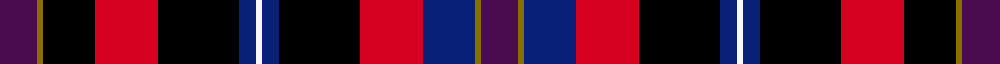

This is one **variant** — a specific cloth: this exact thread count and colourway, with its own
provenance below. It is one weaving of the [sett](/setts/dp13y2k18r22k28db6w2db6k28r22db18y2dp13/) (the scale-free proportion — the
same cloth at any scale or shade), whose colour order is pattern [BGBRKBWBKRKGB](/stripes/bgbrkbwbkrkgb/).

Sourced from register-of-tartans.  It is a [13 stripe tartan](/stripes/stripes13/).

Original link [https://www.tartanregister.gov.uk/tartanDetails.aspx?ref=10683](https://www.tartanregister.gov.uk/tartanDetails.aspx?ref=10683)

## Provenance

Earliest known date: Created to commemorate the 3rd European Congress of Immunology, held in Glasgow in September 2012. The inspiration for this tartan comes from the City of Glasgow tartan, first woven in 1790 by Wilsons of Bannockburn. This modern interpretation incorporates the Congress colours of purple and lime green, and also features the white on blue of the Scottish Saltire. The width of the blue band is 12 threads to mark the year 2012. The colours of the tartan also embrace those of the EFIS (European Federation of Immunological Societies) and the BSI (British Society for Immunology).

2 attestations — the source records this cloth was collapsed from (oldest owns this page)

<ul>
<li>08/08/2012 — European Congress of Immunology 2012 (register-of-tartans, <a href="https://www.tartanregister.gov.uk/tartanDetails.aspx?ref=10683">record</a>)  <em>Created to commemorate the 3rd European Congress of Immunology, held in Glasgow in September 2012. The inspiration for this tartan comes from the City of Glasgow tartan, first woven in 1790 by Wilsons of Bannockburn. This modern interpretation incorporates the Congress colours of purple and lime green, and also features the white on blue of the Scottish Saltire. The width of the blue band is 12 threads to mark the year 2012. The colours of the tartan also embrace those of the EFIS (European Federation of Immunological Societies) and the BSI (British Society for Immunology).</em></li>
<li>undated — European Congress of Immunology Corporate Tartan (house-of-tartan, <a href="http://www.house-of-tartan.scotland.net/house/TartanViewjs.asp?colr=Def&tnam=10683">record</a>) </li>
</ul>

Dataset <small>— provenance for this record, inherited from the source manifest</small>

<dl class="dataset-prov">
<dt>source</dt><dd><a href="/sources/register-of-tartans/">Scottish Register of Tartans</a></dd>
<dt>data captured from</dt><dd><a href="https://github.com/thetartan/tartan-database/blob/master/data/register-of-tartans/data.csv">https://github.com/thetartan/tartan-database/blob/master/data/register-of-tartans/data.csv</a></dd>
<dt>data date</dt><dd>08/08/2012 <small>(this record)</small></dd>
<dt>licence</dt><dd><a href="https://www.tartanregister.gov.uk/copyright">Crown copyright</a></dd>
</dl>

Capture chain <small>— the hands this data passed through, oldest first; each capture carries its own licence</small>

<ol class="capture-chain">
<li><a href="https://www.tartanregister.gov.uk/">Scottish Register of Tartans</a> · <a href="https://www.tartanregister.gov.uk/copyright">Crown copyright</a> <small>the living register — still published by National Records of Scotland</small></li>
<li><a href="https://github.com/thetartan/tartan-database">thetartan/tartan-database</a> <small>2016-2017</small> · <a href="https://creativecommons.org/licenses/by-nc-nd/4.0/">CC BY-NC-ND 4.0</a> <small>Levko Kravets's frozen compilation — the capture we vendored, and where its CC licence text came from</small></li>
<li>this dictionary <small>captured 2026-06-10 · commit 5bf86c7566</small> <small>each re-capture is a git commit to data/sources</small></li>
</ol>

## Register references

External register numbers recorded for this tartan.

- Scottish Register of Tartans: [10683](https://www.tartanregister.gov.uk/tartanDetails.aspx?ref=10683)

## Thread count
DP/13 Y2 K18 R22 K28 DB6 W2 DB6 K28 R22 DB18 Y2 DP/13

One full sett is **334 threads**.

## Palette
<table><thead><tr><th>Colour</th><th>Shade</th><th>OKLCh</th></tr></thead><tbody><tr><td>DB</td><td><code style="background-color:#082077;">#082077</code> <small style="color:#888">#082077</small></td><td><small style="color:#888">oklch(30.0% 0.149 265.1)</small></td></tr><tr><td>K</td><td><code style="background-color:#000000;">#000000</code> <small style="color:#888">#000000</small></td><td><small style="color:#888">oklch(0.0% 0.000 0.0)</small></td></tr><tr><td>DP</td><td><code style="background-color:#4B0B4F;">#4B0B4F</code> <small style="color:#888">#4B0B4F</small></td><td><small style="color:#888">oklch(30.1% 0.125 325.4)</small></td></tr><tr><td>R</td><td><code style="background-color:#D60020;">#D60020</code> <small style="color:#888">#D60020</small></td><td><small style="color:#888">oklch(55.2% 0.224 25.5)</small></td></tr><tr><td>W</td><td><code style="background-color:#F7F7F7;">#F7F7F7</code> <small style="color:#888">#F7F7F7</small></td><td><small style="color:#888">oklch(97.6% 0.000 89.9)</small></td></tr><tr><td>Y</td><td><code style="background-color:#8B6E00;">#8B6E00</code> <small style="color:#888">#8B6E00</small></td><td><small style="color:#888">oklch(55.1% 0.113 90.4)</small></td></tr></tbody></table>

# Sample pattern

## Nearest tartan variants

The nearest existing variants by ΔTartan distance, with this cloth at the top so the swatches line up against it.

ΔTartan

Threads

Variant

Sett

—

334

<a href="/variants/s13/dp13y2k18r22k28db6w2db6k28r22db18y2dp13/">European Congress of Immunology 2012</a>

<a href="/ttd/edit/#slug=gi2r11k3r4k7gi2k3dp4k3dp11k3dg1g1gi1~x2~gi2505139-g2408144&amp;base=dp13y2k18r22k28db6w2db6k28r22db18y2dp13" title="compare in the TTD">2.33</a>

218

<a href="/variants/s14/y2r11k3r4k7y2k3dp4k3dp11k3dg1g1y1~x2~y2505139-g2408144/">King, Garry (Personal)</a>

<a href="/ttd/edit/#slug=k4g2w2dp22k16r8k3r4k3dy4k3~x2&amp;base=dp13y2k18r22k28db6w2db6k28r22db18y2dp13" title="compare in the TTD">2.53</a>

270

<a href="/variants/s11/k4g2w2dp22k16r8k3r4k3dy4k3~x2/">Hines Snr, Raymond Lee (Personal)</a>

<a href="/ttd/edit/#slug=db6o4k13o4db6w1db6o4k6ly1k6o4db6k1~x4~ly3106085&amp;base=dp13y2k18r22k28db6w2db6k28r22db18y2dp13" title="compare in the TTD">2.65</a>

516

<a href="/variants/s14/db6o4k13o4db6w1db6o4k6ly1k6o4db6k1~x4~ly3106085/">Amnesty International Corporate Tartan</a>

<a href="/ttd/edit/#slug=db20lb6k8y2k4w4k4db13r7k4r4w2~x2~db0804274&amp;base=dp13y2k18r22k28db6w2db6k28r22db18y2dp13" title="compare in the TTD">2.67</a>

268

<a href="/variants/s12/db20lb6k8y2k4w4k4db13r7k4r4w2~x2~db0804274/">Stuart/Stewart Black</a>

<a href="/ttd/edit/#slug=r2dp5r2dp10k16m6lb2dpi14k1dpi14k6dp12k16m1~x2~dp0804317-dpi1508310&amp;base=dp13y2k18r22k28db6w2db6k28r22db18y2dp13" title="compare in the TTD">2.80</a>

422

<a href="/variants/s14/r2dp5r2dp10k16m6lb2dpi14k1dpi14k6dp12k16m1~x2~dp0804317-dpi1508310/">Katie Targett-Adams</a>

<a href="/ttd/edit/#slug=dg10y6dg20k20db20k6db8r6db20r6w4r16w4db6w1~x2&amp;base=dp13y2k18r22k28db6w2db6k28r22db18y2dp13" title="compare in the TTD">3.13</a>

590

<a href="/variants/s15/dg10y6dg20k20db20k6db8r6db20r6w4r16w4db6w1~x2/">Watson - Kirby (Personal)</a>

<a href="/ttd/edit/#slug=db6y1r18k6r4k4dp8dg1dp8k1db5~x2~db1003265-dp1206332&amp;base=dp13y2k18r22k28db6w2db6k28r22db18y2dp13" title="compare in the TTD">3.17</a>

226

<a href="/variants/s11/db6y1r18k6r4k4dp8dg1dp8k1db5~x2~db1003265-dp1206332/">Bute Heather, Autumn</a>

<a href="/ttd/edit/#slug=r6db2r6g10y1k10db6k1db2k1db6r6w2k2r2~x2&amp;base=dp13y2k18r22k28db6w2db6k28r22db18y2dp13" title="compare in the TTD">3.26</a>

236

<a href="/variants/s15/r6db2r6g10y1k10db6k1db2k1db6r6w2k2r2~x2/">MacPherson #7</a>

<a href="/ttd/edit/#slug=k9w6k46db24r8db6r6db6r16g6r6y6&amp;base=dp13y2k18r22k28db6w2db6k28r22db18y2dp13" title="compare in the TTD">3.28</a>

275

<a href="/variants/s12/k9w6k46db24r8db6r6db6r16g6r6y6/">Fowdar (Personal)</a>

<a href="/ttd/edit/#slug=dg3g3r22k5db22y2~x2~dg1806142-g2408144&amp;base=dp13y2k18r22k28db6w2db6k28r22db18y2dp13" title="compare in the TTD">3.29</a>

424

<a href="/variants/s10/dg3g3r22k5db22y2db22k5r22g3~x2~dg1806142-g2408144/">MacLeod Society of Scotland Clan Tartan</a>

## Neighbour map

Every grey dot is one of 13621 variants placed by the first two principal components of the ΔTartan feature space (42% of its variance). Red is this tartan; blue dots are its nearest — click one to open its page.

<svg viewBox="0 0 640 380" role="img" style="max-width:100%;height:auto;border:1px solid #e0e0e0;border-radius:4px;display:block" xmlns="http://www.w3.org/2000/svg"><image href="/nn/cloud.v1.png" width="640" height="380"/><a href="/variants/s14/y2r11k3r4k7y2k3dp4k3dp11k3dg1g1y1~x2~y2505139-g2408144/"><circle cx="93.4" cy="124.2" r="4" fill="#3465a4"><title>King, Garry (Personal)</title></circle></a><a href="/variants/s11/k4g2w2dp22k16r8k3r4k3dy4k3~x2/"><circle cx="140.1" cy="118.5" r="4" fill="#3465a4"><title>Hines Snr, Raymond Lee (Personal)</title></circle></a><a href="/variants/s14/db6o4k13o4db6w1db6o4k6ly1k6o4db6k1~x4~ly3106085/"><circle cx="107.4" cy="144.7" r="4" fill="#3465a4"><title>Amnesty International Corporate Tartan</title></circle></a><a href="/variants/s12/db20lb6k8y2k4w4k4db13r7k4r4w2~x2~db0804274/"><circle cx="103.8" cy="136.0" r="4" fill="#3465a4"><title>Stuart/Stewart Black</title></circle></a><a href="/variants/s14/r2dp5r2dp10k16m6lb2dpi14k1dpi14k6dp12k16m1~x2~dp0804317-dpi1508310/"><circle cx="135.4" cy="125.5" r="4" fill="#3465a4"><title>Katie Targett-Adams</title></circle></a><a href="/variants/s15/dg10y6dg20k20db20k6db8r6db20r6w4r16w4db6w1~x2/"><circle cx="92.5" cy="123.3" r="4" fill="#3465a4"><title>Watson - Kirby (Personal)</title></circle></a><a href="/variants/s11/db6y1r18k6r4k4dp8dg1dp8k1db5~x2~db1003265-dp1206332/"><circle cx="140.3" cy="119.0" r="4" fill="#3465a4"><title>Bute Heather, Autumn</title></circle></a><a href="/variants/s15/r6db2r6g10y1k10db6k1db2k1db6r6w2k2r2~x2/"><circle cx="58.0" cy="135.3" r="4" fill="#3465a4"><title>MacPherson #7</title></circle></a><a href="/variants/s12/k9w6k46db24r8db6r6db6r16g6r6y6/"><circle cx="100.0" cy="132.2" r="4" fill="#3465a4"><title>Fowdar (Personal)</title></circle></a><a href="/variants/s10/dg3g3r22k5db22y2db22k5r22g3~x2~dg1806142-g2408144/"><circle cx="158.3" cy="139.0" r="4" fill="#3465a4"><title>MacLeod Society of Scotland Clan Tartan</title></circle></a><circle cx="118.2" cy="130.8" r="5" fill="#c00000"/><text x="320" y="376" text-anchor="middle" font-size="11" fill="#999">ground</text><text x="11" y="190" text-anchor="middle" font-size="11" fill="#999" transform="rotate(-90 11 190)">complexity</text></svg>

ID: /variants/s13/dp13y2k18r22k28db6w2db6k28r22db18y2dp13/
