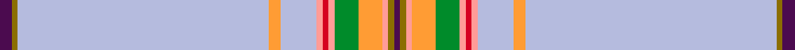

This page is one **sett** — a single exact thread-count. It belongs to the [tartan](/setts/dp2y1lb42lo2lb6lr1r1lr1g4lo4lr1y1dp1/)
(the same proportion at any scale), whose colour order is pattern [BGWYWYRYGYYGB](/stripes/bgwywyrygyygb/).

Sourced from tartans-authority.  It is a [13 stripe tartan](/stripes/stripes13/).

Original link http://www.tartansauthority.com/tartan-ferret/display/7323/

## Register references

External register numbers recorded for this tartan.

- Scottish Tartans Authority (ITI): 7323

## Thread count
DP/4 Y2 LB84 LO4 LB12 LR2 R2 LR2 G8 LO8 LR2 Y2 DP/2

One full sett is **262 threads**.

## Palette
<table><thead><tr><th>Colour</th><th>Shade</th><th>OKLCh</th></tr></thead><tbody><tr><td>LB</td><td><code style="background-color:#B5BBDE;">#B5BBDE</code> <small style="color:#888">#B5BBDE</small></td><td><small style="color:#888">oklch(79.9% 0.050 277.6)</small></td></tr><tr><td>G</td><td><code style="background-color:#008B2A;">#008B2A</code> <small style="color:#888">#008B2A</small></td><td><small style="color:#888">oklch(55.4% 0.170 145.9)</small></td></tr><tr><td>LO</td><td><code style="background-color:#FF9C34;">#FF9C34</code> <small style="color:#888">#FF9C34</small></td><td><small style="color:#888">oklch(77.9% 0.161 61.8)</small></td></tr><tr><td>DP</td><td><code style="background-color:#4B0B4F;">#4B0B4F</code> <small style="color:#888">#4B0B4F</small></td><td><small style="color:#888">oklch(30.1% 0.125 325.4)</small></td></tr><tr><td>R</td><td><code style="background-color:#D60020;">#D60020</code> <small style="color:#888">#D60020</small></td><td><small style="color:#888">oklch(55.2% 0.224 25.5)</small></td></tr><tr><td>LR</td><td><code style="background-color:#FF9C97;">#FF9C97</code> <small style="color:#888">#FF9C97</small></td><td><small style="color:#888">oklch(79.3% 0.119 23.2)</small></td></tr><tr><td>Y</td><td><code style="background-color:#8B6E00;">#8B6E00</code> <small style="color:#888">#8B6E00</small></td><td><small style="color:#888">oklch(55.1% 0.113 90.4)</small></td></tr></tbody></table>

# Sample pattern

## Nearest tartan variants

The nearest existing variants by ΔTartan distance, with this cloth at the top so the swatches line up against it.

ΔTartan

Threads

Variant

Sett

—

262

<a href="/variants/s13/dp2y1lb42lo2lb6lr1r1lr1g4lo4lr1y1dp1~x2/">Kerr of Ardgowan Dress (Personal)</a>

<a href="/ttd/edit/#slug=t46ly1dy5ly1g5ly1dp5ly1t16r1ly4~x2~ly3307090-dy1603076&amp;base=dp2y1lb42lo2lb6lr1r1lr1g4lo4lr1y1dp1~x2" title="compare in the TTD">3.91</a>

244

<a href="/variants/s11/t46ly1dy5ly1g5ly1dp5ly1t16r1ly4~x2~ly3307090-dy1603076/">Craven County (Commemorative)</a>

## Neighbour map

Every grey dot is one of 13620 variants placed by the first two principal components of the ΔTartan feature space (42% of its variance). Red is this tartan; blue dots are its nearest — click one to open its page.

<svg viewBox="0 0 640 380" role="img" style="max-width:100%;height:auto;border:1px solid #e0e0e0;border-radius:4px;display:block" xmlns="http://www.w3.org/2000/svg"><image href="/nn/cloud.v1.png" width="640" height="380"/><a href="/variants/s11/t46ly1dy5ly1g5ly1dp5ly1t16r1ly4~x2~ly3307090-dy1603076/"><circle cx="495.1" cy="84.4" r="4" fill="#3465a4"><title>Craven County (Commemorative)</title></circle></a><circle cx="486.2" cy="47.7" r="5" fill="#c00000"/><text x="320" y="376" text-anchor="middle" font-size="11" fill="#999">ground</text><text x="11" y="190" text-anchor="middle" font-size="11" fill="#999" transform="rotate(-90 11 190)">complexity</text></svg>

ID: /variants/s13/dp2y1lb42lo2lb6lr1r1lr1g4lo4lr1y1dp1~x2/
