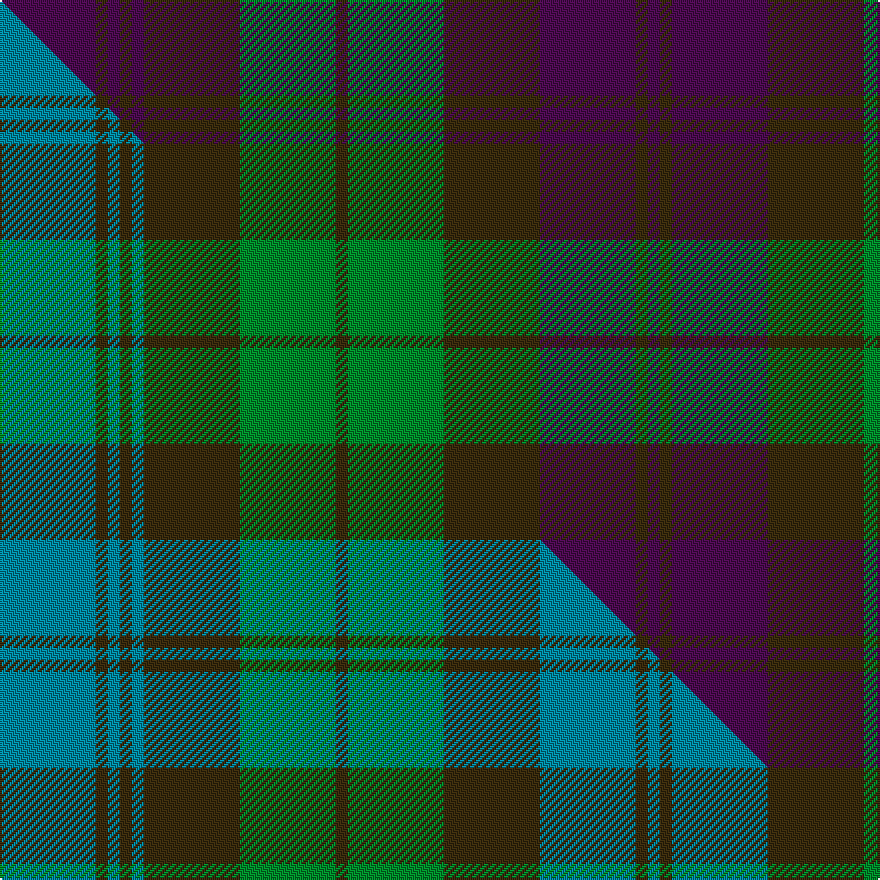

This page is one **sett** — a single exact thread-count. It belongs to the [tartan](/setts/dp8dy1dp1dy1dp1dy8g8dy1g8dy8dp8dy1dp1/)
(the same proportion at any scale), whose colour order is pattern [BGBGBGGGGGBGB](/stripes/bgbgbgggggbgb/).

Part of the [Tyneside Scottish](/tartans/tyneside-scottish/) tartan — the named design grouping this sett with its other cloths.

Sourced from tartans-authority.  It is a [13 stripe tartan](/stripes/stripes13/).

Original link http://www.tartansauthority.com/tartan-ferret/display/5085/

## Register references

External register numbers recorded for this tartan.

- Scottish Tartans Authority (ITI): 5085

## Thread count
DP/48 DY6 DP6 DY6 DP6 DY48 G48 DY6 G48 DY48 DP48 DY6 DP/6

One full sett is **606 threads**.

## Palette
<table><thead><tr><th>Colour</th><th>Shade</th><th>OKLCh</th></tr></thead><tbody><tr><td>G</td><td><code style="background-color:#008B2A;">#008B2A</code> <small style="color:#888">#008B2A</small></td><td><small style="color:#888">oklch(55.4% 0.170 145.9)</small></td></tr><tr><td>DP</td><td><code style="background-color:#4B0B4F;">#4B0B4F</code> <small style="color:#888">#4B0B4F</small></td><td><small style="color:#888">oklch(30.1% 0.125 325.4)</small></td></tr><tr><td>DY</td><td><code style="background-color:#3A2B0D;">#3A2B0D</code> <small style="color:#888">#3A2B0D</small></td><td><small style="color:#888">oklch(30.0% 0.049 82.0)</small></td></tr></tbody></table>

# Sample pattern

## Compared to the master

This cloth is one sett of its design; the master sett (the exemplar the design is anchored on) is below for comparison.

Its **ΔTartan distance** from the master is **1.52** — the same measure the nearest-tartans table ranks by (0 is identical; a re-scale of the same cloth is near 0, a recolour or a different proportion further).

<figure class="master-compare" style="margin:0">

this sett
master sett ★

<figcaption style="color:#888;font-size:smaller">One weave of this sett against the <a href="/setts/t8dy1t1dy1t1dy8g8dy1g8dy8t8dy1t1/">master sett ★</a>, split on the diagonal: a shared proportion runs seamlessly across it with only the shades shifting; a different proportion breaks on it.</figcaption>
</figure>

ID: /variants/s13/dp8dy1dp1dy1dp1dy8g8dy1g8dy8dp8dy1dp1~x6/
