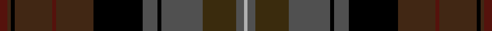

This page is one **sett** — a single exact thread-count. It belongs to the [tartan](/setts/dr2do1k1do10dr1do10k13n4k1n11dy9n2lr1/)
(the same proportion at any scale), whose colour order is pattern [BBKBBBKBKBGBY](/stripes/bbkbbbkbkbgby/).

Sourced from register-of-tartans.  It is a [13 stripe tartan](/stripes/stripes13/).

Original link https://www.tartanregister.gov.uk/tartanDetails.aspx?ref=11571

## Register references

External register numbers recorded for this tartan.

- Scottish Register of Tartans: [11571](https://www.tartanregister.gov.uk/tartanDetails.aspx?ref=11571)

## Thread count
DR/4 DO2 K2 DO20 DR2 DO20 K26 N8 K2 N22 DY18 N4 LR/2

One full sett is **258 threads**.

## Palette
<table><thead><tr><th>Colour</th><th>Shade</th><th>OKLCh</th></tr></thead><tbody><tr><td>DR</td><td><code style="background-color:#55120C;">#55120C</code> <small style="color:#888">#55120C</small></td><td><small style="color:#888">oklch(30.0% 0.099 29.3)</small></td></tr><tr><td>K</td><td><code style="background-color:#000000;">#000000</code> <small style="color:#888">#000000</small></td><td><small style="color:#888">oklch(0.0% 0.000 0.0)</small></td></tr><tr><td>N</td><td><code style="background-color:#505050;">#505050</code> <small style="color:#888">#505050</small></td><td><small style="color:#888">oklch(43.1% 0.000 89.9)</small></td></tr><tr><td>LR</td><td><code style="background-color:#B0B0B0;">#B0B0B0</code> <small style="color:#888">#B0B0B0</small></td><td><small style="color:#888">oklch(75.7% 0.000 89.9)</small></td></tr><tr><td>DO</td><td><code style="background-color:#412714;">#412714</code> <small style="color:#888">#412714</small></td><td><small style="color:#888">oklch(30.1% 0.050 55.7)</small></td></tr><tr><td>DY</td><td><code style="background-color:#3A2B0D;">#3A2B0D</code> <small style="color:#888">#3A2B0D</small></td><td><small style="color:#888">oklch(30.0% 0.049 82.0)</small></td></tr></tbody></table>

# Sample pattern

ID: /variants/s13/dr2do1k1do10dr1do10k13n4k1n11dy9n2lr1~x2~n1700000-lr3000000/
