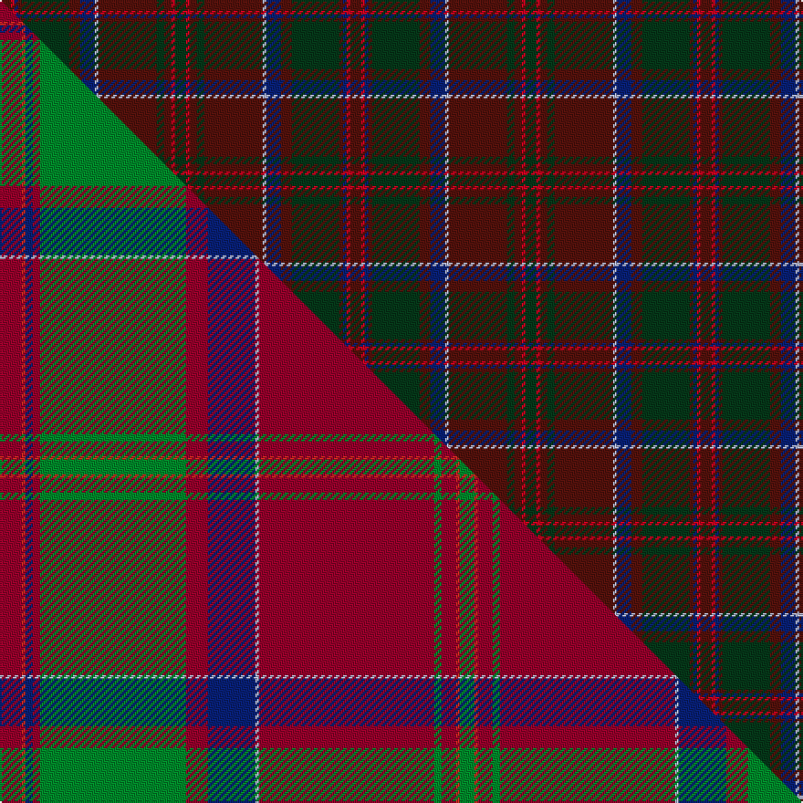

This is one **variant** — a specific cloth: this exact thread count and colourway, with its own
provenance below. It is one weaving of the [sett](/tartans/m/ma/macdonald-of-glencoe-3/) (the scale-free proportion — the
same cloth at any scale or shade), whose colour order is pattern [BRBBGBBWBGBRG](/stripes/brbbgbbwbgbrg/).

Part of the [MacDonald of Glencoe](/tartans/m/ma/macdonald-of-glencoe-3/) tartan — the named design grouping this sett with its other cloths.

Sourced from register-of-tartans.  It is a [13 stripe tartan](/stripes/stripes13/).

Original link [https://www.tartanregister.gov.uk/tartanDetails.aspx?ref=909](https://www.tartanregister.gov.uk/tartanDetails.aspx?ref=909)

Dataset <small>— provenance for this record, inherited from the source manifest</small>

<dl class="dataset-prov">
<dt>source</dt><dd><a href="/sources/register-of-tartans/">Scottish Register of Tartans</a></dd>
<dt>data captured from</dt><dd><a href="https://github.com/thetartan/tartan-database/blob/master/data/register-of-tartans/data.csv">https://github.com/thetartan/tartan-database/blob/master/data/register-of-tartans/data.csv</a></dd>
<dt>data date</dt><dd>2004 <small>(this record)</small></dd>
<dt>licence</dt><dd><a href="https://www.tartanregister.gov.uk/copyright">Crown copyright</a></dd>
</dl>

Capture chain <small>— the hands this data passed through, oldest first; each capture carries its own licence</small>

<ol class="capture-chain">
<li><a href="https://www.tartanregister.gov.uk/">Scottish Register of Tartans</a> · <a href="https://www.tartanregister.gov.uk/copyright">Crown copyright</a> <small>the living register — still published by National Records of Scotland</small></li>
<li><a href="https://github.com/thetartan/tartan-database">thetartan/tartan-database</a> <small>2016-2017</small> · <a href="https://creativecommons.org/licenses/by-nc-nd/4.0/">CC BY-NC-ND 4.0</a> <small>Levko Kravets's frozen compilation — the capture we vendored, and where its CC licence text came from</small></li>
<li>this dictionary <small>captured 2026-06-10 · commit 5bf86c7566</small> <small>each re-capture is a git commit to data/sources</small></li>
</ol>

## Register references

External register numbers recorded for this tartan.

- Scottish Register of Tartans: [909](https://www.tartanregister.gov.uk/tartanDetails.aspx?ref=909)
- Scottish Tartans Authority (ITI): 6431

## Thread count
DR/6 R2 DB2 DR2 DG26 DR6 DB8 LB2 DR32 DG4 DR4 R2 DG/6

One full sett is **192 threads**.

## Palette
<table><thead><tr><th>Colour</th><th>Shade</th><th>OKLCh</th></tr></thead><tbody><tr><td>DB</td><td><code style="background-color:#082077;">#082077</code> <small style="color:#888">#082077</small></td><td><small style="color:#888">oklch(30.0% 0.149 265.1)</small></td></tr><tr><td>DR</td><td><code style="background-color:#55120C;">#55120C</code> <small style="color:#888">#55120C</small></td><td><small style="color:#888">oklch(30.0% 0.099 29.3)</small></td></tr><tr><td>DG</td><td><code style="background-color:#053819;">#053819</code> <small style="color:#888">#053819</small></td><td><small style="color:#888">oklch(30.0% 0.075 151.3)</small></td></tr><tr><td>LB</td><td><code style="background-color:#B5BBDE;">#B5BBDE</code> <small style="color:#888">#B5BBDE</small></td><td><small style="color:#888">oklch(79.9% 0.050 277.6)</small></td></tr><tr><td>R</td><td><code style="background-color:#D60020;">#D60020</code> <small style="color:#888">#D60020</small></td><td><small style="color:#888">oklch(55.2% 0.224 25.5)</small></td></tr></tbody></table>

# Sample pattern

## Compared to the master

This cloth is one sett of its design; the master sett (the exemplar the design is anchored on) is below for comparison.

Its **ΔTartan distance** from the master is **0.65** — the same measure the nearest-tartans table ranks by (0 is identical; a re-scale of the same cloth is near 0, a recolour or a different proportion further).

<figure class="master-compare" style="margin:0">

this sett
master sett ★

<figcaption style="color:#888;font-size:smaller">One weave of this sett against the <a href="/setts/r6ri1db2r2g40r6db13lb1r48g2r4ri1g4/">master sett ★</a>, split on the diagonal: a shared proportion runs seamlessly across it with only the shades shifting; a different proportion breaks on it.</figcaption>
</figure>

## Nearest tartan variants

The nearest existing variants by ΔTartan distance, with this cloth at the top so the swatches line up against it.

ΔTartan

Threads

Variant

Sett

—

192

<a href="/variants/s13/dr3r1db1dr1dg13dr3db4lb1dr16dg2dr2r1dg3~x2/">MacDonald of Glencoe</a>

<a href="/ttd/edit/#slug=db4dr24dg2dr3dg19y2dr2db8dr2dg2w2dr2~x2&amp;base=dr3r1db1dr1dg13dr3db4lb1dr16dg2dr2r1dg3~x2" title="compare in the TTD">2.06</a>

276

<a href="/variants/s12/db4dr24dg2dr3dg19y2dr2db8dr2dg2w2dr2~x2/">Michael from Appin (Personal)</a>

<a href="/ttd/edit/#slug=dg3dr2t1dr19dg1dr1dg1dr8dg1t8dr1dg8dr1dg1dr1dg28dy1dg2o2~x2&amp;base=dr3r1db1dr1dg13dr3db4lb1dr16dg2dr2r1dg3~x2" title="compare in the TTD">3.30</a>

350

<a href="/variants/s19/dg3dr2t1dr19dg1dr1dg1dr8dg1t8dr1dg8dr1dg1dr1dg28dy1dg2o2~x2/">Brewer</a>

<a href="/ttd/edit/#slug=w1dg1dr1dg14dr1db6dr11dg1dr1lb1~x4&amp;base=dr3r1db1dr1dg13dr3db4lb1dr16dg2dr2r1dg3~x2" title="compare in the TTD">3.32</a>

296

<a href="/variants/s10/w1dg1dr1dg14dr1db6dr11dg1dr1lb1~x4/">Glen Tilt #1 (District)</a>

<a href="/ttd/edit/#slug=o12n3o3dt4o16dr3o3dr3o3dr16dt52o4&amp;base=dr3r1db1dr1dg13dr3db4lb1dr16dg2dr2r1dg3~x2" title="compare in the TTD">3.42</a>

228

<a href="/variants/s12/o12n3o3dt4o16dr3o3dr3o3dr16dt52o4/">Drumbeg</a>

<a href="/ttd/edit/#slug=lb3dy8dr2dy8db11dr2dy4r4dr27db1dr2db2dr2db13dr2~x2&amp;base=dr3r1db1dr1dg13dr3db4lb1dr16dg2dr2r1dg3~x2" title="compare in the TTD">3.53</a>

354

<a href="/variants/s15/lb3dy8dr2dy8db11dr2dy4r4dr27db1dr2db2dr2db13dr2~x2/">Strathdon</a>

<a href="/ttd/edit/#slug=dg9w2dg24dt37r3dt37dg24w2dg9o4~x2~dt1103284&amp;base=dr3r1db1dr1dg13dr3db4lb1dr16dg2dr2r1dg3~x2" title="compare in the TTD">3.63</a>

578

<a href="/variants/s10/dg9w2dg24db37r3db37dg24w2dg9o4~x2~db1103284/">Hardie</a>

<a href="/ttd/edit/#slug=dy35dg19r3g8r3dg8r3db3~x2&amp;base=dr3r1db1dr1dg13dr3db4lb1dr16dg2dr2r1dg3~x2" title="compare in the TTD">3.66</a>

252

<a href="/variants/s8/dy35dg19r3g8r3dg8r3db3~x2/">John Muir Way</a>

<a href="/ttd/edit/#slug=dr6lo1dr24dg6db2k1db2k1db12dr1~x2&amp;base=dr3r1db1dr1dg13dr3db4lb1dr16dg2dr2r1dg3~x2" title="compare in the TTD">3.83</a>

210

<a href="/variants/s10/dr6lo1dr24dg6db2k1db2k1db12dr1~x2/">MacEdward (MacGregor Hastie)</a>

<a href="/ttd/edit/#slug=r7dt2r3dg32r2dg2r2dt10r2lb2r31dt2r2dt1r6~x2~r1906028-dt1201300-dg1602166-lb3203246&amp;base=dr3r1db1dr1dg13dr3db4lb1dr16dg2dr2r1dg3~x2" title="compare in the TTD">3.85</a>

398

<a href="/variants/s15/r7dt2r3dg32r2dg2r2dt10r2lb2r31dt2r2dt1r6~x2~r1906028-dt1201300-dg1602166-lb3203246/">Drummond of Megginch - 1997 Kilt</a>

<a href="/ttd/edit/#slug=db6dr30db6dr30db6g6db6dr6db15r2g10db15r2~db1104274&amp;base=dr3r1db1dr1dg13dr3db4lb1dr16dg2dr2r1dg3~x2" title="compare in the TTD">3.87</a>

272

<a href="/variants/s13/db6dr30db6dr30db6g6db6dr6db15r2g10db15r2~db1104274/">Great Dane, The</a>

## Neighbour map

Every grey dot is one of 13656 variants placed by the first two principal components of the ΔTartan feature space (42% of its variance). Red is this tartan; blue dots are its nearest — click one to open its page. The map is a flat projection of a many-dimensional space — [how to read it](/posts/neighbourhood-maps/).

<svg viewBox="0 0 640 380" role="img" style="max-width:100%;height:auto;border:1px solid #e0e0e0;border-radius:4px;display:block" xmlns="http://www.w3.org/2000/svg"><image href="/nn/cloud.v1.png" width="640" height="380"/><a href="/variants/s12/db4dr24dg2dr3dg19y2dr2db8dr2dg2w2dr2~x2/"><circle cx="345.3" cy="181.7" r="4" fill="#3465a4"><title>Michael from Appin (Personal)</title></circle></a><a href="/variants/s19/dg3dr2t1dr19dg1dr1dg1dr8dg1t8dr1dg8dr1dg1dr1dg28dy1dg2o2~x2/"><circle cx="429.0" cy="121.6" r="4" fill="#3465a4"><title>Brewer</title></circle></a><a href="/variants/s10/w1dg1dr1dg14dr1db6dr11dg1dr1lb1~x4/"><circle cx="331.0" cy="181.0" r="4" fill="#3465a4"><title>Glen Tilt #1 (District)</title></circle></a><a href="/variants/s12/o12n3o3dt4o16dr3o3dr3o3dr16dt52o4/"><circle cx="362.6" cy="158.0" r="4" fill="#3465a4"><title>Drumbeg</title></circle></a><a href="/variants/s15/lb3dy8dr2dy8db11dr2dy4r4dr27db1dr2db2dr2db13dr2~x2/"><circle cx="324.5" cy="139.7" r="4" fill="#3465a4"><title>Strathdon</title></circle></a><a href="/variants/s10/dg9w2dg24db37r3db37dg24w2dg9o4~x2~db1103284/"><circle cx="381.5" cy="190.7" r="4" fill="#3465a4"><title>Hardie</title></circle></a><a href="/variants/s8/dy35dg19r3g8r3dg8r3db3~x2/"><circle cx="324.1" cy="205.5" r="4" fill="#3465a4"><title>John Muir Way</title></circle></a><a href="/variants/s10/dr6lo1dr24dg6db2k1db2k1db12dr1~x2/"><circle cx="400.0" cy="133.9" r="4" fill="#3465a4"><title>MacEdward (MacGregor Hastie)</title></circle></a><a href="/variants/s15/r7dt2r3dg32r2dg2r2dt10r2lb2r31dt2r2dt1r6~x2~r1906028-dt1201300-dg1602166-lb3203246/"><circle cx="450.3" cy="133.0" r="4" fill="#3465a4"><title>Drummond of Megginch - 1997 Kilt</title></circle></a><a href="/variants/s13/db6dr30db6dr30db6g6db6dr6db15r2g10db15r2~db1104274/"><circle cx="347.3" cy="193.4" r="4" fill="#3465a4"><title>Great Dane, The</title></circle></a><circle cx="388.6" cy="165.5" r="5" fill="#c00000"/><text x="320" y="376" text-anchor="middle" font-size="11" fill="#999">ground</text><text x="11" y="190" text-anchor="middle" font-size="11" fill="#999" transform="rotate(-90 11 190)">complexity</text></svg>

ID: /variants/s13/dr3r1db1dr1dg13dr3db4lb1dr16dg2dr2r1dg3~x2/
