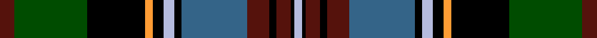

This page is one **sett** — a single exact thread-count. It belongs to the [tartan](/setts/dr4dg20k16lo2k3lb3k2t18dr6k2dr4k1lb2/)
(the same proportion at any scale), whose colour order is pattern [BGKYKWKBBKBKW](/stripes/bgkykwkbbkbkw/).

Sourced from register-of-tartans.  It is a [13 stripe tartan](/stripes/stripes13/).

Original link https://www.tartanregister.gov.uk/tartanDetails.aspx?ref=4126

2 attestations — the source records this cloth was collapsed from (oldest owns this page)

<ul>
<li>01/01/2002 — Tilley, Sir Samuel Leonard (register-of-tartans, <a href="https://www.tartanregister.gov.uk/tartanDetails.aspx?ref=4126">record</a>)  <em>One of the Fathers of the Confederation. Premier of New Brunswick and helped to form - and suggested the name for - The Dominion of Canada. Sample in Scottish Tartans Authority's Johnston Collection. Produced by Sainthill Levine and presumabley woven by WCWM.</em></li>
<li>pre 2002 — Tilley, Sir Samuel Leonard (Comm) (tartans-authority, <a href="http://www.tartansauthority.com/tartan-ferret/display/5126/">record</a>)  <em>One of the Fathers of the Confederation. Premier of New Brunswick and helped to form - and suggested the name for - The Dominion of Canada. Sample in STA Johnston Collection. Produced by Sainthill Levine and presumabley woven by WCWM.</em></li>
</ul>

## Register references

External register numbers recorded for this tartan.

- Scottish Register of Tartans: [4126](https://www.tartanregister.gov.uk/tartanDetails.aspx?ref=4126)
- Scottish Tartans Authority (ITI): 5126

## Thread count
DR/16 DG80 K64 LO8 K12 LB12 K8 T72 DR24 K8 DR16 K4 LB/8

One full sett is **640 threads**.

## Palette
<table><thead><tr><th>Colour</th><th>Shade</th><th>OKLCh</th></tr></thead><tbody><tr><td>T</td><td><code style="background-color:#346488;">#346488</code> <small style="color:#888">#346488</small></td><td><small style="color:#888">oklch(48.6% 0.078 243.0)</small></td></tr><tr><td>DR</td><td><code style="background-color:#55120C;">#55120C</code> <small style="color:#888">#55120C</small></td><td><small style="color:#888">oklch(30.0% 0.099 29.3)</small></td></tr><tr><td>LO</td><td><code style="background-color:#FF9C34;">#FF9C34</code> <small style="color:#888">#FF9C34</small></td><td><small style="color:#888">oklch(77.9% 0.161 61.8)</small></td></tr><tr><td>DG</td><td><code style="background-color:#004C00;">#004C00</code> <small style="color:#888">#004C00</small></td><td><small style="color:#888">oklch(36.1% 0.123 142.5)</small></td></tr><tr><td>K</td><td><code style="background-color:#000000;">#000000</code> <small style="color:#888">#000000</small></td><td><small style="color:#888">oklch(0.0% 0.000 0.0)</small></td></tr><tr><td>LB</td><td><code style="background-color:#B5BBDE;">#B5BBDE</code> <small style="color:#888">#B5BBDE</small></td><td><small style="color:#888">oklch(79.9% 0.050 277.6)</small></td></tr></tbody></table>

# Sample pattern

## Nearest tartan variants

The nearest existing variants by ΔTartan distance, with this cloth at the top so the swatches line up against it.

ΔTartan

Threads

Variant

Sett

—

640

<a href="/variants/s13/dr4dg20k16lo2k3lb3k2t18dr6k2dr4k1lb2~x4~dg1405139-t1903246/">Tilley, Sir Samuel Leonard</a>

<a href="/ttd/edit/#slug=dr4g20k16ly2k3lr3k2db18dr6k2dr4k1lr2~x4&amp;base=dr4dg20k16lo2k3lb3k2t18dr6k2dr4k1lb2~x4~dg1405139-t1903246" title="compare in the TTD">0.90</a>

640

<a href="/variants/s13/dr4g20k16ly2k3lr3k2db18dr6k2dr4k1lr2~x4/">Galt, Alexander, Sir</a>

<a href="/ttd/edit/#slug=r4g22k16y2k3w3k2db20r8k2r4k1w2~x2&amp;base=dr4dg20k16lo2k3lb3k2t18dr6k2dr4k1lb2~x4~dg1405139-t1903246" title="compare in the TTD">1.05</a>

344

<a href="/variants/s13/r4g22k16y2k3w3k2db20r8k2r4k1w2~x2/">Louise of Lorne #2</a>

## Neighbour map

Every grey dot is one of 13620 variants placed by the first two principal components of the ΔTartan feature space (42% of its variance). Red is this tartan; blue dots are its nearest — click one to open its page.

<svg viewBox="0 0 640 380" role="img" style="max-width:100%;height:auto;border:1px solid #e0e0e0;border-radius:4px;display:block" xmlns="http://www.w3.org/2000/svg"><image href="/nn/cloud.v1.png" width="640" height="380"/><a href="/variants/s13/dr4g20k16ly2k3lr3k2db18dr6k2dr4k1lr2~x4/"><circle cx="92.6" cy="100.4" r="4" fill="#3465a4"><title>Galt, Alexander, Sir</title></circle></a><a href="/variants/s13/r4g22k16y2k3w3k2db20r8k2r4k1w2~x2/"><circle cx="76.3" cy="88.2" r="4" fill="#3465a4"><title>Louise of Lorne #2</title></circle></a><circle cx="106.1" cy="104.8" r="5" fill="#c00000"/><text x="320" y="376" text-anchor="middle" font-size="11" fill="#999">ground</text><text x="11" y="190" text-anchor="middle" font-size="11" fill="#999" transform="rotate(-90 11 190)">complexity</text></svg>

ID: /variants/s13/dr4dg20k16lo2k3lb3k2t18dr6k2dr4k1lb2~x4~dg1405139-t1903246/
