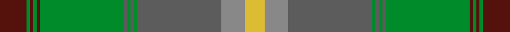

This page is one **sett** — a single exact thread-count. It belongs to the [tartan](/setts/dr8g1dr1g1dr1g25n1g1n1g1n25o7ly6/)
(the same proportion at any scale), whose colour order is pattern [BGBGBGBGBGBRY](/stripes/bgbgbgbgbgbry/).

Sourced from tartans-authority.  It is a [13 stripe tartan](/stripes/stripes13/).

Original link [https://www.tartanregister.gov.uk/tartanDetails.aspx?ref=10457](https://www.tartanregister.gov.uk/tartanDetails.aspx?ref=10457)

Dataset <small>— provenance for this record, inherited from the source manifest</small>

<dl class="dataset-prov">
<dt>source</dt><dd><a href="/sources/tartans-authority/">Scottish Tartans Authority</a></dd>
<dt>data captured from</dt><dd><a href="https://github.com/thetartan/tartan-database/blob/master/data/tartans-authority/data.csv">https://github.com/thetartan/tartan-database/blob/master/data/tartans-authority/data.csv</a></dd>
<dt>data date</dt><dd>19th July 2011 <small>(this record)</small></dd>
<dt>licence</dt><dd><a href="https://creativecommons.org/licenses/by-nc-nd/4.0/">CC BY-NC-ND 4.0</a></dd>
</dl>

Capture chain <small>— the hands this data passed through, oldest first; each capture carries its own licence</small>

<ol class="capture-chain">
<li><a href="https://www.tartansauthority.com/">Scottish Tartans Authority</a> <small>the heritage body's archive — its tartan-ferret record browser is retired (links repaired to the SRT, above)</small></li>
<li><a href="https://github.com/thetartan/tartan-database">thetartan/tartan-database</a> <small>2016-2017</small> · <a href="https://creativecommons.org/licenses/by-nc-nd/4.0/">CC BY-NC-ND 4.0</a> <small>Levko Kravets's frozen compilation — the capture we vendored, and where its CC licence text came from</small></li>
<li>this dictionary <small>captured 2026-06-10 · commit 5bf86c7566</small> <small>each re-capture is a git commit to data/sources</small></li>
</ol>

## Register references

External register numbers recorded for this tartan.

- Scottish Register of Tartans: [10457](https://www.tartanregister.gov.uk/tartanDetails?ref=10457)
- Scottish Tartans Authority (ITI): 10457

## Thread count
DR/16 G2 DR2 G2 DR2 G50 N2 G2 N2 G2 N50 O14 LY/12

One full sett is **288 threads**.

## Palette
<table><thead><tr><th>Colour</th><th>Shade</th><th>OKLCh</th></tr></thead><tbody><tr><td>DR</td><td><code style="background-color:#55120C;">#55120C</code> <small style="color:#888">#55120C</small></td><td><small style="color:#888">oklch(30.0% 0.099 29.3)</small></td></tr><tr><td>LY</td><td><code style="background-color:#DCBC32;">#DCBC32</code> <small style="color:#888">#DCBC32</small></td><td><small style="color:#888">oklch(80.0% 0.150 95.2)</small></td></tr><tr><td>G</td><td><code style="background-color:#008B2A;">#008B2A</code> <small style="color:#888">#008B2A</small></td><td><small style="color:#888">oklch(55.4% 0.170 145.9)</small></td></tr><tr><td>N</td><td><code style="background-color:#5C5C5C;">#5C5C5C</code> <small style="color:#888">#5C5C5C</small></td><td><small style="color:#888">oklch(47.5% 0.000 89.9)</small></td></tr><tr><td>O</td><td><code style="background-color:#888888;">#888888</code> <small style="color:#888">#888888</small></td><td><small style="color:#888">oklch(62.7% 0.000 89.9)</small></td></tr></tbody></table>

# Sample pattern

## Nearest tartan variants

The nearest existing variants by ΔTartan distance, with this cloth at the top so the swatches line up against it.

ΔTartan

Threads

Variant

Sett

—

288

<a href="/variants/s13/dr8g1dr1g1dr1g25n1g1n1g1n25o7ly6~x2~n1900000-o2500000/">Johansson (Personal)</a>

<a href="/ttd/edit/#slug=r8g1r1g1r1g25dt1g1dt1g1dt25yi7y6~x2~dt1500000-yi2301120&amp;base=dr8g1dr1g1dr1g25n1g1n1g1n25o7ly6~x2~n1900000-o2500000" title="compare in the TTD">0.41</a>

288

<a href="/variants/s13/r8g1r1g1r1g25dt1g1dt1g1dt25yi7y6~x2~dt1500000-yi2301120/">Johansson (Aneby, Sweden), Christian (Personal)</a>

<a href="/ttd/edit/#slug=n66m3g3m3g16dr8g3dr3r4~x2&amp;base=dr8g1dr1g1dr1g25n1g1n1g1n25o7ly6~x2~n1900000-o2500000" title="compare in the TTD">2.80</a>

296

<a href="/variants/s9/n66m3g3m3g16dr8g3dr3r4~x2/">Scottish National Hunting</a>

<a href="/ttd/edit/#slug=t5w1o9t5r4t5g20y1g1y1~x4&amp;base=dr8g1dr1g1dr1g25n1g1n1g1n25o7ly6~x2~n1900000-o2500000" title="compare in the TTD">3.46</a>

392

<a href="/variants/s10/t5w1o9t5r4t5g20y1g1y1~x4/">Hobkirk</a>

<a href="/ttd/edit/#slug=dgi6g2dr2dgi30lo2g4lo2dg2lo1dg20lo1g2dr4~x2~dgi1806142-g2408144&amp;base=dr8g1dr1g1dr1g25n1g1n1g1n25o7ly6~x2~n1900000-o2500000" title="compare in the TTD">3.56</a>

292

<a href="/variants/s13/dgi6g2dr2dgi30lo2g4lo2dg2lo1dg20lo1g2dr4~x2~dgi1806142-g2408144/">All Irish Green Irish District Tartan</a>

<a href="/ttd/edit/#slug=o2dg3dy18o2dy2o21g2dg2g2dg24lo2~x2&amp;base=dr8g1dr1g1dr1g25n1g1n1g1n25o7ly6~x2~n1900000-o2500000" title="compare in the TTD">3.69</a>

312

<a href="/variants/s11/o2dg3dy18o2dy2o21g2dg2g2dg24lo2~x2/">Methven</a>

<a href="/ttd/edit/#slug=lb5g5k4n31dg3n3dg62n3dg3n31k4g5lb5r3~x2~g2408144-dg1806142&amp;base=dr8g1dr1g1dr1g25n1g1n1g1n25o7ly6~x2~n1900000-o2500000" title="compare in the TTD">3.77</a>

652

<a href="/variants/s14/lb5g5k4n31dg3n3dg62n3dg3n31k4g5lb5r3~x2~g2408144-dg1806142/">Sheffield, City of</a>

<a href="/ttd/edit/#slug=dg2ly6g24r2dy2dg1dy6dg10g2~x2~g1906142&amp;base=dr8g1dr1g1dr1g25n1g1n1g1n25o7ly6~x2~n1900000-o2500000" title="compare in the TTD">3.80</a>

212

<a href="/variants/s9/dg2ly6g24r2dy2dg1dy6dg10g2~x2~g1906142/">Fitzgibbon</a>

<a href="/ttd/edit/#slug=w2y1r3g20r1y1r3y2dy14ly2r2ly2~x2~g1903114-ly2706114&amp;base=dr8g1dr1g1dr1g25n1g1n1g1n25o7ly6~x2~n1900000-o2500000" title="compare in the TTD">3.87</a>

204

<a href="/variants/s12/w2y1r3g20r1y1r3y2dy14ly2r2ly2~x2~g1903114-ly2706114/">Flodden</a>

<a href="/ttd/edit/#slug=g30dp3g3dp3g3dp10dg10y20lp2dg5~x2~dg1803133-y2302138&amp;base=dr8g1dr1g1dr1g25n1g1n1g1n25o7ly6~x2~n1900000-o2500000" title="compare in the TTD">3.88</a>

286

<a href="/variants/s10/g30dp3g3dp3g3dp10dg10y20lp2dg5~x2~dg1803133-y2302138/">Roddy's Highland Spirit (Fashion)</a>

<a href="/ttd/edit/#slug=r4db10g2db2g24o2g2o16g2w1~x2&amp;base=dr8g1dr1g1dr1g25n1g1n1g1n25o7ly6~x2~n1900000-o2500000" title="compare in the TTD">3.90</a>

250

<a href="/variants/s10/r4db10g2db2g24o2g2o16g2w1~x2/">Kinfauns Castle</a>

## Neighbour map

Every grey dot is one of 13621 variants placed by the first two principal components of the ΔTartan feature space (42% of its variance). Red is this tartan; blue dots are its nearest — click one to open its page.

<svg viewBox="0 0 640 380" role="img" style="max-width:100%;height:auto;border:1px solid #e0e0e0;border-radius:4px;display:block" xmlns="http://www.w3.org/2000/svg"><image href="/nn/cloud.v1.png" width="640" height="380"/><a href="/variants/s13/r8g1r1g1r1g25dt1g1dt1g1dt25yi7y6~x2~dt1500000-yi2301120/"><circle cx="308.5" cy="136.6" r="4" fill="#3465a4"><title>Johansson (Aneby, Sweden), Christian (Personal)</title></circle></a><a href="/variants/s9/n66m3g3m3g16dr8g3dr3r4~x2/"><circle cx="341.0" cy="114.9" r="4" fill="#3465a4"><title>Scottish National Hunting</title></circle></a><a href="/variants/s10/t5w1o9t5r4t5g20y1g1y1~x4/"><circle cx="290.6" cy="144.8" r="4" fill="#3465a4"><title>Hobkirk</title></circle></a><a href="/variants/s13/dgi6g2dr2dgi30lo2g4lo2dg2lo1dg20lo1g2dr4~x2~dgi1806142-g2408144/"><circle cx="352.0" cy="137.7" r="4" fill="#3465a4"><title>All Irish Green Irish District Tartan</title></circle></a><a href="/variants/s11/o2dg3dy18o2dy2o21g2dg2g2dg24lo2~x2/"><circle cx="277.2" cy="177.0" r="4" fill="#3465a4"><title>Methven</title></circle></a><a href="/variants/s14/lb5g5k4n31dg3n3dg62n3dg3n31k4g5lb5r3~x2~g2408144-dg1806142/"><circle cx="276.2" cy="108.4" r="4" fill="#3465a4"><title>Sheffield, City of</title></circle></a><a href="/variants/s9/dg2ly6g24r2dy2dg1dy6dg10g2~x2~g1906142/"><circle cx="303.8" cy="154.1" r="4" fill="#3465a4"><title>Fitzgibbon</title></circle></a><a href="/variants/s12/w2y1r3g20r1y1r3y2dy14ly2r2ly2~x2~g1903114-ly2706114/"><circle cx="244.0" cy="120.9" r="4" fill="#3465a4"><title>Flodden</title></circle></a><a href="/variants/s10/g30dp3g3dp3g3dp10dg10y20lp2dg5~x2~dg1803133-y2302138/"><circle cx="303.5" cy="205.8" r="4" fill="#3465a4"><title>Roddy's Highland Spirit (Fashion)</title></circle></a><a href="/variants/s10/r4db10g2db2g24o2g2o16g2w1~x2/"><circle cx="287.9" cy="140.7" r="4" fill="#3465a4"><title>Kinfauns Castle</title></circle></a><circle cx="298.2" cy="136.2" r="5" fill="#c00000"/><text x="320" y="376" text-anchor="middle" font-size="11" fill="#999">ground</text><text x="11" y="190" text-anchor="middle" font-size="11" fill="#999" transform="rotate(-90 11 190)">complexity</text></svg>

ID: /variants/s13/dr8g1dr1g1dr1g25n1g1n1g1n25o7ly6~x2~n1900000-o2500000/
