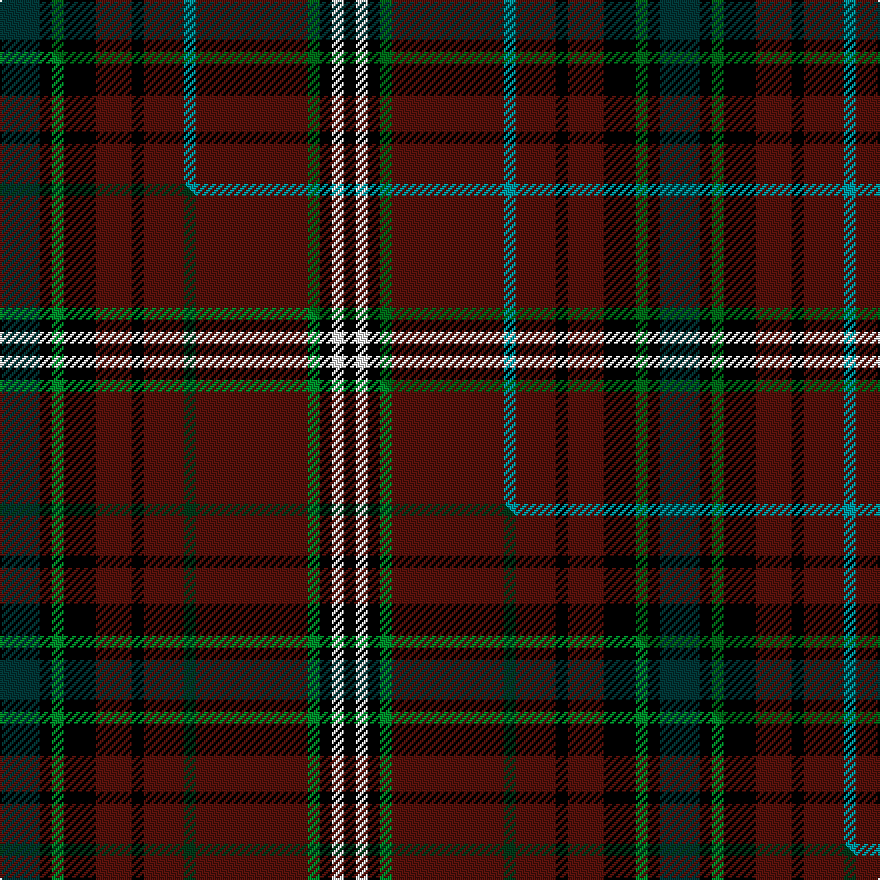

This page is one **sett** — a single exact thread-count. It belongs to the [tartan](/setts/dt10k3dg3k8dr9k3dr10g3dr28dg3k3w3k3/)
(the same proportion at any scale), whose colour order is pattern [BKGKBKBGBGKWK](/stripes/bkgkbkbgbgkwk/).

Part of the [Clifford](/tartans/clifford/) tartan — the named design grouping this sett with its other cloths.

Sourced from tartans-authority.  It is a [13 stripe tartan](/stripes/stripes13/).

Original link http://www.tartansauthority.com/tartan-ferret/display/2662/

## Register references

External register numbers recorded for this tartan.

- Scottish Tartans Authority (ITI): 2662

## Thread count
DT/20 K6 DG6 K16 DR18 K6 DR20 G6 DR56 DG6 K6 W6 K/6

One full sett is **330 threads**.

## Palette
<table><thead><tr><th>Colour</th><th>Shade</th><th>OKLCh</th></tr></thead><tbody><tr><td>G</td><td><code style="background-color:#0098A0;">#0098A0</code> <small style="color:#888">#0098A0</small></td><td><small style="color:#888">oklch(61.8% 0.105 201.4)</small></td></tr><tr><td>DT</td><td><code style="background-color:#023535;">#023535</code> <small style="color:#888">#023535</small></td><td><small style="color:#888">oklch(29.8% 0.050 194.8)</small></td></tr><tr><td>DR</td><td><code style="background-color:#55120C;">#55120C</code> <small style="color:#888">#55120C</small></td><td><small style="color:#888">oklch(30.0% 0.099 29.3)</small></td></tr><tr><td>DG</td><td><code style="background-color:#006818;">#006818</code> <small style="color:#888">#006818</small></td><td><small style="color:#888">oklch(45.0% 0.142 145.0)</small></td></tr><tr><td>K</td><td><code style="background-color:#000000;">#000000</code> <small style="color:#888">#000000</small></td><td><small style="color:#888">oklch(0.0% 0.000 0.0)</small></td></tr><tr><td>W</td><td><code style="background-color:#F7F7F7;">#F7F7F7</code> <small style="color:#888">#F7F7F7</small></td><td><small style="color:#888">oklch(97.6% 0.000 89.9)</small></td></tr></tbody></table>

# Sample pattern

## Compared to the master

This cloth is one sett of its design; the master sett (the exemplar the design is anchored on) is below for comparison.

Its **ΔTartan distance** from the master is **0.09** — the same measure the nearest-tartans table ranks by (0 is identical; a re-scale of the same cloth is near 0, a recolour or a different proportion further).

<figure class="master-compare" style="margin:0">

this sett
master sett ★

<figcaption style="color:#888;font-size:smaller">One weave of this sett against the <a href="/setts/dt10k3g3k8dr9k3dr10dg3dr28g3k3w3k3/">master sett ★</a>, split on the diagonal: a shared proportion runs seamlessly across it with only the shades shifting; a different proportion breaks on it.</figcaption>
</figure>

## Nearest tartan variants

The nearest existing variants by ΔTartan distance, with this cloth at the top so the swatches line up against it.

ΔTartan

Threads

Variant

Sett

—

330

<a href="/variants/s13/dt10k3dg3k8dr9k3dr10g3dr28dg3k3w3k3~x2~dg1806142-g2504202/">Clifford (Name)</a>

<a href="/ttd/edit/#slug=dt10k3g3k8dr9k3dr10dg3dr28g3k3w3k3~x2&amp;base=dt10k3dg3k8dr9k3dr10g3dr28dg3k3w3k3~x2~dg1806142-g2504202" title="compare in the TTD">0.90</a>

330

<a href="/variants/s13/dt10k3g3k8dr9k3dr10dg3dr28g3k3w3k3~x2/">Clifford</a>

<a href="/ttd/edit/#slug=dg10k3g3k8dr9g3dr10b3dr28g3k3w3k3~x2&amp;base=dt10k3dg3k8dr9k3dr10g3dr28dg3k3w3k3~x2~dg1806142-g2504202" title="compare in the TTD">1.08</a>

330

<a href="/variants/s13/dg10k3g3k8dr9g3dr10b3dr28g3k3w3k3~x2/">Clifford</a>

## Neighbour map

Every grey dot is one of 13620 variants placed by the first two principal components of the ΔTartan feature space (42% of its variance). Red is this tartan; blue dots are its nearest — click one to open its page.

<svg viewBox="0 0 640 380" role="img" style="max-width:100%;height:auto;border:1px solid #e0e0e0;border-radius:4px;display:block" xmlns="http://www.w3.org/2000/svg"><image href="/nn/cloud.v1.png" width="640" height="380"/><a href="/variants/s13/dt10k3g3k8dr9k3dr10dg3dr28g3k3w3k3~x2/"><circle cx="219.1" cy="131.2" r="4" fill="#3465a4"><title>Clifford</title></circle></a><a href="/variants/s13/dg10k3g3k8dr9g3dr10b3dr28g3k3w3k3~x2/"><circle cx="207.6" cy="129.0" r="4" fill="#3465a4"><title>Clifford</title></circle></a><circle cx="217.6" cy="130.7" r="5" fill="#c00000"/><text x="320" y="376" text-anchor="middle" font-size="11" fill="#999">ground</text><text x="11" y="190" text-anchor="middle" font-size="11" fill="#999" transform="rotate(-90 11 190)">complexity</text></svg>

ID: /variants/s13/dt10k3dg3k8dr9k3dr10g3dr28dg3k3w3k3~x2~dg1806142-g2504202/
