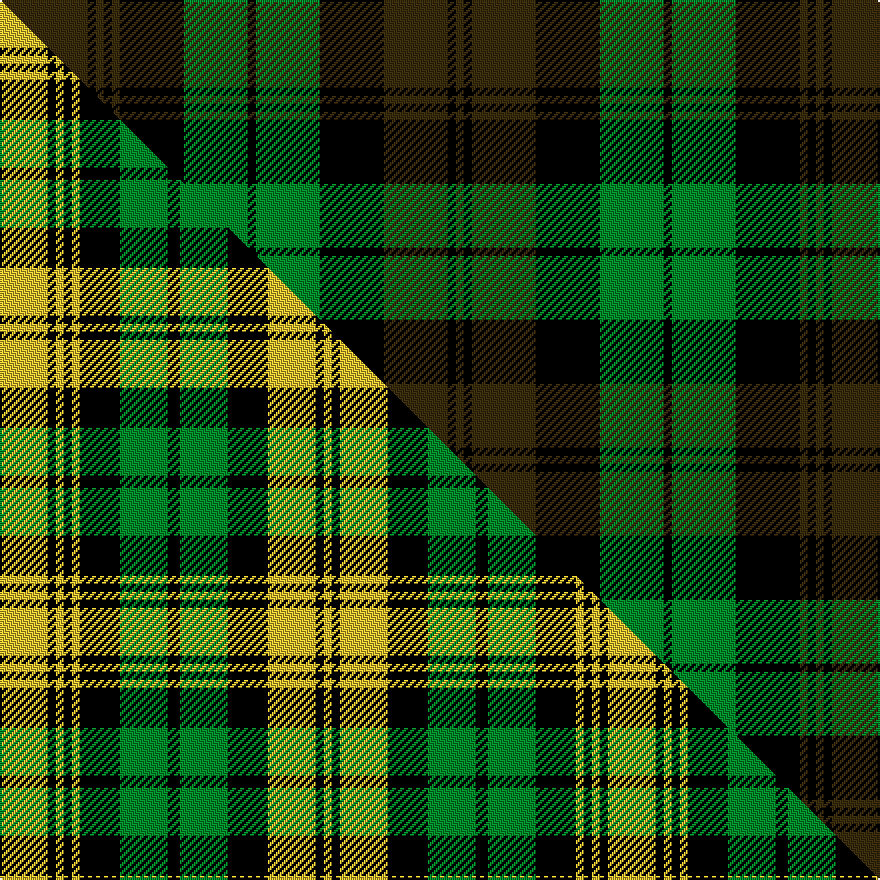

This is one **variant** — a specific cloth: this exact thread count and colourway, with its own
provenance below. It is one weaving of the [sett](/tartans/b/br/brown-watch/) (the scale-free proportion — the
same cloth at any scale or shade), whose colour order is pattern [GKGKGKGKGKGKG](/stripes/gkgkgkgkgkgkg/).

Part of the [Brown Watch](/tartans/b/br/brown-watch/) tartan — the named design grouping this sett with its other cloths.

Sourced from house-of-tartan.  It is a [13 stripe tartan](/stripes/stripes13/).

Original link [http://www.house-of-tartan.scotland.net/house/TartanViewjs.asp?colr=Def&tnam=1739](http://www.house-of-tartan.scotland.net/house/TartanViewjs.asp?colr=Def&tnam=1739)

## Provenance

Earliest known date: pre 1986 Product of J & D Paton of Tillicoultry, one of many samples presented to the Scottish Tartan Society sometime before 1986

Dataset <small>— provenance for this record, inherited from the source manifest</small>

<dl class="dataset-prov">
<dt>source</dt><dd><a href="/sources/house-of-tartan/">House of Tartan</a></dd>
<dt>data captured from</dt><dd><a href="https://github.com/thetartan/tartan-database/blob/master/data/house-of-tartan/data.csv">https://github.com/thetartan/tartan-database/blob/master/data/house-of-tartan/data.csv</a></dd>
<dt>data date</dt><dd>pre 1986 <small>(this record)</small></dd>
<dt>licence</dt><dd><a href="https://creativecommons.org/licenses/by-nc-nd/4.0/">CC BY-NC-ND 4.0</a></dd>
</dl>

Capture chain <small>— the hands this data passed through, oldest first; each capture carries its own licence</small>

<ol class="capture-chain">
<li><a href="http://www.house-of-tartan.scotland.net/">House of Tartan</a> <small>the weaver/retailer's database — the site is now offline; the URL is kept as the ultimate source's identity</small></li>
<li><a href="https://github.com/thetartan/tartan-database">thetartan/tartan-database</a> <small>2016-2017</small> · <a href="https://creativecommons.org/licenses/by-nc-nd/4.0/">CC BY-NC-ND 4.0</a> <small>Levko Kravets's frozen compilation — the capture we vendored, and where its CC licence text came from</small></li>
<li>this dictionary <small>captured 2026-06-10 · commit 5bf86c7566</small> <small>each re-capture is a git commit to data/sources</small></li>
</ol>

## Thread count
DY/44 K4 DY4 K4 DY4 K32 G32 K4 G32 K32 DY32 K4 DY/4

One full sett is **416 threads**.

## Palette
<table><thead><tr><th>Colour</th><th>Shade</th><th>OKLCh</th></tr></thead><tbody><tr><td>G</td><td><code style="background-color:#008B2A;">#008B2A</code> <small style="color:#888">#008B2A</small></td><td><small style="color:#888">oklch(55.4% 0.170 145.9)</small></td></tr><tr><td>K</td><td><code style="background-color:#000000;">#000000</code> <small style="color:#888">#000000</small></td><td><small style="color:#888">oklch(0.0% 0.000 0.0)</small></td></tr><tr><td>DY</td><td><code style="background-color:#3A2B0D;">#3A2B0D</code> <small style="color:#888">#3A2B0D</small></td><td><small style="color:#888">oklch(30.0% 0.049 82.0)</small></td></tr></tbody></table>

# Sample pattern

## Compared to the master

This cloth is one sett of its design; the master sett (the exemplar the design is anchored on) is below for comparison.

Its **ΔTartan distance** from the master is **0.51** — the same measure the nearest-tartans table ranks by (0 is identical; a re-scale of the same cloth is near 0, a recolour or a different proportion further).

<figure class="master-compare" style="margin:0">

this sett
master sett ★

<figcaption style="color:#888;font-size:smaller">One weave of this sett against the <a href="/setts/ly12k2ly2k2ly2k10g12k3g12k10ly12k2ly2/">master sett ★</a>, split on the diagonal: a shared proportion runs seamlessly across it with only the shades shifting; a different proportion breaks on it.</figcaption>
</figure>

## Nearest tartan variants

The nearest existing variants by ΔTartan distance, with this cloth at the top so the swatches line up against it.

ΔTartan

Threads

Variant

Sett

—

416

<a href="/variants/s13/dy11k1dy1k1dy1k8g8k1g8k8dy8k1dy1~x4/">Brown Watch Trade Tartan</a>

<a href="/ttd/edit/#slug=y18k3y3k3y3k13dg16k4dg16k13y16k3y3~x2&amp;base=dy11k1dy1k1dy1k8g8k1g8k8dy8k1dy1~x4" title="compare in the TTD">0.52</a>

414

<a href="/variants/s13/y18k3y3k3y3k13dg16k4dg16k13y16k3y3~x2/">Campbell Collegiate</a>

<a href="/ttd/edit/#slug=do12k2do2k2do2k10g12k3g12k10do12k2do2~x2&amp;base=dy11k1dy1k1dy1k8g8k1g8k8dy8k1dy1~x4" title="compare in the TTD">2.21</a>

304

<a href="/variants/s13/do12k2do2k2do2k10g12k3g12k10do12k2do2~x2/">Brown Watch (Fashion)</a>

<a href="/ttd/edit/#slug=o11k1o1k1o1k8g8k1g8k8o8k1o1~x2&amp;base=dy11k1dy1k1dy1k8g8k1g8k8dy8k1dy1~x4" title="compare in the TTD">2.43</a>

208

<a href="/variants/s13/o11k1o1k1o1k8g8k1g8k8o8k1o1~x2/">Brown, Watch</a>

<a href="/ttd/edit/#slug=dg7k2dg7ly1k2ly1k10ly3dr10ly3k10ly1dg11k2dg3k2~x2&amp;base=dy11k1dy1k1dy1k8g8k1g8k8dy8k1dy1~x4" title="compare in the TTD">2.74</a>

282

<a href="/variants/s16/dg7k2dg7ly1k2ly1k10ly3dr10ly3k10ly1dg11k2dg3k2~x2/">Blackburn Appalachian Htg (Personal)</a>

<a href="/ttd/edit/#slug=dt8k1dt2k1dt2k6g8k1w2k1g8k6dt8k1dt2~x4&amp;base=dy11k1dy1k1dy1k8g8k1g8k8dy8k1dy1~x4" title="compare in the TTD">2.81</a>

416

<a href="/variants/s15/dt8k1dt2k1dt2k6g8k1w2k1g8k6dt8k1dt2~x4/">74th Regiment of Foot (Mil.)</a>

<a href="/ttd/edit/#slug=dt16k3dt3k3dt3k16g15k3g15k16dt15k3dt3~x2&amp;base=dy11k1dy1k1dy1k8g8k1g8k8dy8k1dy1~x4" title="compare in the TTD">2.89</a>

418

<a href="/variants/s13/dt16k3dt3k3dt3k16g15k3g15k16dt15k3dt3~x2/">42nd Regiment (Military)</a>

<a href="/ttd/edit/#slug=k11ki1k1ki1k1ki8g8ki1g8ki8k8ki1k1~x4~k1309264-ki17&amp;base=dy11k1dy1k1dy1k8g8k1g8k8dy8k1dy1~x4" title="compare in the TTD">2.94</a>

416

<a href="/variants/s13/k11ki1k1ki1k1ki8g8ki1g8ki8k8ki1k1~x4~k1309264-ki17/">Royal Regiment of Scotland (Mltry)</a>

<a href="/ttd/edit/#slug=dr3g20k2db3k12db3k2dr20g3dr20k2db3k12db3k2g20dr3db2~x2&amp;base=dy11k1dy1k1dy1k8g8k1g8k8dy8k1dy1~x4" title="compare in the TTD">3.01</a>

530

<a href="/variants/s18/dr3g20k2db3k12db3k2dr20g3dr20k2db3k12db3k2g20dr3db2~x2/">Matthew Gloag Corporate Tartan</a>

<a href="/ttd/edit/#slug=dr20g2dr2g2dr2g8k24g2k3~x2&amp;base=dy11k1dy1k1dy1k8g8k1g8k8dy8k1dy1~x4" title="compare in the TTD">3.01</a>

214

<a href="/variants/s9/dr20g2dr2g2dr2g8k24g2k3~x2/">Carlow, County</a>

<a href="/ttd/edit/#slug=dg2t16dg2t4k4dg2k7t2k4dg17t2~x2&amp;base=dy11k1dy1k1dy1k8g8k1g8k8dy8k1dy1~x4" title="compare in the TTD">3.02</a>

240

<a href="/variants/s11/dg2t16dg2t4k4dg2k7t2k4dg17t2~x2/">Blackwater (Fashion)</a>

## Neighbour map

Every grey dot is one of 13662 variants placed by the first two principal components of the ΔTartan feature space (42% of its variance). Red is this tartan; blue dots are its nearest — click one to open its page. The map is a flat projection of a many-dimensional space — [how to read it](/posts/neighbourhood-maps/).

<svg viewBox="0 0 640 380" role="img" style="max-width:100%;height:auto;border:1px solid #e0e0e0;border-radius:4px;display:block" xmlns="http://www.w3.org/2000/svg"><image href="/nn/cloud.v1.png" width="640" height="380"/><a href="/variants/s13/y18k3y3k3y3k13dg16k4dg16k13y16k3y3~x2/"><circle cx="161.8" cy="211.6" r="4" fill="#3465a4"><title>Campbell Collegiate</title></circle></a><a href="/variants/s13/do12k2do2k2do2k10g12k3g12k10do12k2do2~x2/"><circle cx="159.2" cy="211.9" r="4" fill="#3465a4"><title>Brown Watch (Fashion)</title></circle></a><a href="/variants/s13/o11k1o1k1o1k8g8k1g8k8o8k1o1~x2/"><circle cx="172.5" cy="168.2" r="4" fill="#3465a4"><title>Brown, Watch</title></circle></a><a href="/variants/s16/dg7k2dg7ly1k2ly1k10ly3dr10ly3k10ly1dg11k2dg3k2~x2/"><circle cx="149.5" cy="159.3" r="4" fill="#3465a4"><title>Blackburn Appalachian Htg (Personal)</title></circle></a><a href="/variants/s15/dt8k1dt2k1dt2k6g8k1w2k1g8k6dt8k1dt2~x4/"><circle cx="141.6" cy="176.8" r="4" fill="#3465a4"><title>74th Regiment of Foot (Mil.)</title></circle></a><a href="/variants/s13/dt16k3dt3k3dt3k16g15k3g15k16dt15k3dt3~x2/"><circle cx="163.0" cy="219.7" r="4" fill="#3465a4"><title>42nd Regiment (Military)</title></circle></a><a href="/variants/s13/k11ki1k1ki1k1ki8g8ki1g8ki8k8ki1k1~x4~k1309264-ki17/"><circle cx="211.9" cy="184.2" r="4" fill="#3465a4"><title>Royal Regiment of Scotland (Mltry)</title></circle></a><a href="/variants/s18/dr3g20k2db3k12db3k2dr20g3dr20k2db3k12db3k2g20dr3db2~x2/"><circle cx="147.6" cy="147.6" r="4" fill="#3465a4"><title>Matthew Gloag Corporate Tartan</title></circle></a><a href="/variants/s9/dr20g2dr2g2dr2g8k24g2k3~x2/"><circle cx="240.3" cy="164.1" r="4" fill="#3465a4"><title>Carlow, County</title></circle></a><a href="/variants/s11/dg2t16dg2t4k4dg2k7t2k4dg17t2~x2/"><circle cx="201.3" cy="190.8" r="4" fill="#3465a4"><title>Blackwater (Fashion)</title></circle></a><circle cx="195.7" cy="179.0" r="5" fill="#c00000"/><text x="320" y="376" text-anchor="middle" font-size="11" fill="#999">ground</text><text x="11" y="190" text-anchor="middle" font-size="11" fill="#999" transform="rotate(-90 11 190)">complexity</text></svg>

ID: /variants/s13/dy11k1dy1k1dy1k8g8k1g8k8dy8k1dy1~x4/
