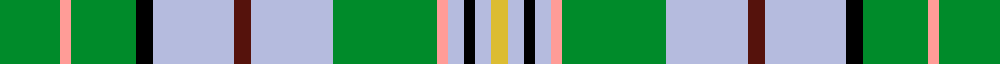

This page is one **sett** — a single exact thread-count. It belongs to the [tartan](/setts/g11lr2g12k3lb15dr3lb15g19lr2lb3k2lb3ly3/)
(the same proportion at any scale), whose colour order is pattern [GYGKWBWGYWKWY](/stripes/gygkwbwgywkwy/).

Part of the [Greylock](/tartans/greylock/) tartan — the named design grouping this sett with its other cloths.

Sourced from tartans-authority.  It is a [13 stripe tartan](/stripes/stripes13/).

Original link http://www.tartansauthority.com/tartan-ferret/display/944/

## Register references

External register numbers recorded for this tartan.

- Scottish Tartans Authority (ITI): 944

## Thread count
G/22 LR4 G24 K6 LB30 DR6 LB30 G38 LR4 LB6 K4 LB6 LY/6

One full sett is **344 threads**.

## Palette
<table><thead><tr><th>Colour</th><th>Shade</th><th>OKLCh</th></tr></thead><tbody><tr><td>B</td><td><code style="background-color:#B5BBDE;">#B5BBDE</code> <small style="color:#888">#B5BBDE</small></td><td><small style="color:#888">oklch(79.9% 0.050 277.6)</small></td></tr><tr><td>DR</td><td><code style="background-color:#55120C;">#55120C</code> <small style="color:#888">#55120C</small></td><td><small style="color:#888">oklch(30.0% 0.099 29.3)</small></td></tr><tr><td>DY</td><td><code style="background-color:#DCBC32;">#DCBC32</code> <small style="color:#888">#DCBC32</small></td><td><small style="color:#888">oklch(80.0% 0.150 95.2)</small></td></tr><tr><td>G</td><td><code style="background-color:#008B2A;">#008B2A</code> <small style="color:#888">#008B2A</small></td><td><small style="color:#888">oklch(55.4% 0.170 145.9)</small></td></tr><tr><td>K</td><td><code style="background-color:#000000;">#000000</code> <small style="color:#888">#000000</small></td><td><small style="color:#888">oklch(0.0% 0.000 0.0)</small></td></tr><tr><td>N</td><td><code style="background-color:#FF9C97;">#FF9C97</code> <small style="color:#888">#FF9C97</small></td><td><small style="color:#888">oklch(79.3% 0.119 23.2)</small></td></tr></tbody></table>

# Sample pattern

## Compared to the master

This cloth is one sett of its design; the master sett (the exemplar the design is anchored on) is below for comparison.

Its **ΔTartan distance** from the master is **0.16** — the same measure the nearest-tartans table ranks by (0 is identical; a re-scale of the same cloth is near 0, a recolour or a different proportion further).

<figure style="margin:0"><figcaption style="color:#888;font-size:smaller">this sett</figcaption></figure>
<figure style="margin:0"><figcaption style="color:#888;font-size:smaller"><a href="/setts/g11lr2g12k3lb15dr3lb15g19lr2lb3k2lb3dy3/">master sett →</a></figcaption></figure>

## Nearest variants

The nearest existing variants by ΔTartan distance, with this cloth at the top so the swatches line up against it.

ΔTartan

Threads

Variant

Sett

—

344

<a href="/variants/s13/g11lr2g12k3lb15dr3lb15g19lr2lb3k2lb3ly3~x2/">Greylock (Corporate)</a>

<a href="/ttd/edit/#slug=g11lr2g12k3lb15dr3lb15g19lr2lb3k2lb3dy3~x2&amp;base=g11lr2g12k3lb15dr3lb15g19lr2lb3k2lb3ly3~x2" title="compare in the TTD">0.00</a>

344

<a href="/variants/s13/g11lr2g12k3lb15dr3lb15g19lr2lb3k2lb3dy3~x2/">Greylock</a>

<a href="/ttd/edit/#slug=g10w2g10k3db12r3db12g15w2db3k2g3y3~x2&amp;base=g11lr2g12k3lb15dr3lb15g19lr2lb3k2lb3ly3~x2" title="compare in the TTD">1.90</a>

294

<a href="/variants/s13/g10w2g10k3db12r3db12g15w2db3k2g3y3~x2/">Greylock</a>

## Neighbour map

Every grey dot is one of 13620 variants placed by the first two principal components of the ΔTartan feature space (42% of its variance). Red is this tartan; blue dots are its nearest — click one to open its page.

<svg viewBox="0 0 640 380" role="img" style="max-width:100%;height:auto;border:1px solid #e0e0e0;border-radius:4px;display:block" xmlns="http://www.w3.org/2000/svg"><image href="/nn/cloud.v1.png" width="640" height="380"/><a href="/variants/s13/g11lr2g12k3lb15dr3lb15g19lr2lb3k2lb3dy3~x2/"><circle cx="168.8" cy="150.4" r="4" fill="#3465a4"><title>Greylock</title></circle></a><a href="/variants/s13/g10w2g10k3db12r3db12g15w2db3k2g3y3~x2/"><circle cx="149.8" cy="162.8" r="4" fill="#3465a4"><title>Greylock</title></circle></a><circle cx="171.5" cy="151.6" r="5" fill="#c00000"/><text x="320" y="376" text-anchor="middle" font-size="11" fill="#999">ground</text><text x="11" y="190" text-anchor="middle" font-size="11" fill="#999" transform="rotate(-90 11 190)">complexity</text></svg>

ID: /variants/s13/g11lr2g12k3lb15dr3lb15g19lr2lb3k2lb3ly3~x2/
