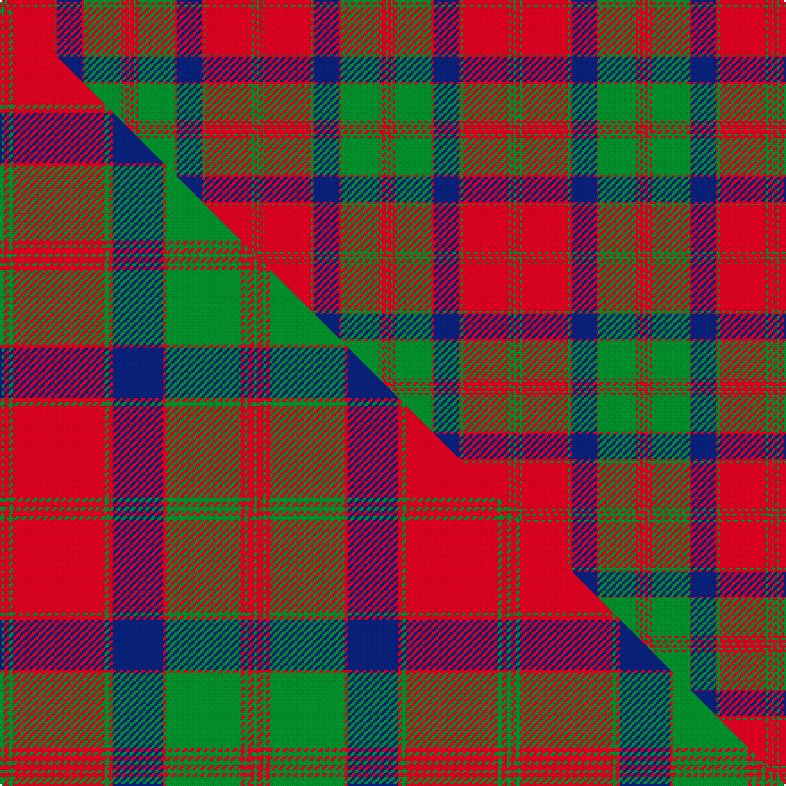

This is one **variant** — a specific cloth: this exact thread count and colourway, with its own
provenance below. It is one weaving of the [sett](/setts/g1r2g1r26g1r1db14r1g21r1g1r2g1/) (the scale-free proportion — the
same cloth at any scale or shade), whose colour order is pattern [GRGRGRBRGRGRG](/stripes/grgrgrbrgrgrg/).

Part of the [MacQuarrie 1815](/tartans/m/ma/macquarrie-1815/) tartan — the named design grouping this sett with its other cloths.

Sourced from weddslist.  It is a [13 stripe tartan](/stripes/stripes13/).

Original link [http://www.weddslist.com/cgi-bin/tartans/pg.pl?source=rb](http://www.weddslist.com/cgi-bin/tartans/pg.pl?source=rb)

Dataset <small>— provenance for this record, inherited from the source manifest</small>

<dl class="dataset-prov">
<dt>source</dt><dd><a href="/sources/weddslist/">Weddslist</a></dd>
<dt>data captured from</dt><dd><a href="https://github.com/thetartan/tartan-database/blob/master/data/weddslist/data.csv">https://github.com/thetartan/tartan-database/blob/master/data/weddslist/data.csv</a></dd>
<dt>data date</dt><dd>2016-11-17 <small>(dataset default)</small></dd>
<dt>licence</dt><dd><a href="https://creativecommons.org/licenses/by-nc-nd/4.0/">CC BY-NC-ND 4.0</a></dd>
</dl>

Capture chain <small>— the hands this data passed through, oldest first; each capture carries its own licence</small>

<ol class="capture-chain">
<li><a href="https://www.weddslist.com/tartans/">Weddslist</a> <small>the living privately compiled reference</small></li>
<li><a href="https://github.com/thetartan/tartan-database">thetartan/tartan-database</a> <small>2016-2017</small> · <a href="https://creativecommons.org/licenses/by-nc-nd/4.0/">CC BY-NC-ND 4.0</a> <small>Levko Kravets's frozen compilation — the capture we vendored, and where its CC licence text came from</small></li>
<li>this dictionary <small>captured 2026-06-10 · commit 5bf86c7566</small> <small>each re-capture is a git commit to data/sources</small></li>
</ol>

## Thread count
G/1 R2 G1 R26 G1 R1 DB14 R1 G21 R1 G1 R2 G/1

One full sett is **144 threads**.

## Palette
<table><thead><tr><th>Colour</th><th>Shade</th><th>OKLCh</th></tr></thead><tbody><tr><td>DB</td><td><code style="background-color:#082077;">#082077</code> <small style="color:#888">#082077</small></td><td><small style="color:#888">oklch(30.0% 0.149 265.1)</small></td></tr><tr><td>G</td><td><code style="background-color:#008B2A;">#008B2A</code> <small style="color:#888">#008B2A</small></td><td><small style="color:#888">oklch(55.4% 0.170 145.9)</small></td></tr><tr><td>R</td><td><code style="background-color:#D60020;">#D60020</code> <small style="color:#888">#D60020</small></td><td><small style="color:#888">oklch(55.2% 0.224 25.5)</small></td></tr></tbody></table>

# Sample pattern

## Compared to the master

This cloth is one sett of its design; the master sett (the exemplar the design is anchored on) is below for comparison.

Its **ΔTartan distance** from the master is **0.04** — the same measure the nearest-tartans table ranks by (0 is identical; a re-scale of the same cloth is near 0, a recolour or a different proportion further).

<figure class="master-compare" style="margin:0">

this sett
master sett ★

<figcaption style="color:#888;font-size:smaller">One weave of this sett against the <a href="/setts/g2r3g2r52g2r2db28r2g42r2g2r3g2/">master sett ★</a>, split on the diagonal: a shared proportion runs seamlessly across it with only the shades shifting; a different proportion breaks on it.</figcaption>
</figure>

## Nearest tartan variants

The nearest existing variants by ΔTartan distance, with this cloth at the top so the swatches line up against it.

ΔTartan

Threads

Variant

Sett

—

144

<a href="/variants/s13/g1r2g1r26g1r1db14r1g21r1g1r2g1/">MacQuarrie 1815</a>

<a href="/ttd/edit/#slug=g2r3g2r52g2r2db28r2g42r2g2r3g2~x2&amp;base=g1r2g1r26g1r1db14r1g21r1g1r2g1" title="compare in the TTD">0.04</a>

568

<a href="/variants/s13/g2r3g2r52g2r2db28r2g42r2g2r3g2~x2/">MacQuarrie #3</a>

<a href="/ttd/edit/#slug=g2r3g2r52g2r2db28r2g42r2g2r3g2&amp;base=g1r2g1r26g1r1db14r1g21r1g1r2g1" title="compare in the TTD">0.04</a>

284

<a href="/variants/s13/g2r3g2r52g2r2db28r2g42r2g2r3g2/">MacQuarrie 1815</a>

<a href="/ttd/edit/#slug=r60db2r2g63r2db2r2db20r2db2r54g2r2g40&amp;base=g1r2g1r26g1r1db14r1g21r1g1r2g1" title="compare in the TTD">1.94</a>

410

<a href="/variants/s14/r60db2r2g63r2db2r2db20r2db2r54g2r2g40/">Bruce - 1819 (Old)</a>

<a href="/ttd/edit/#slug=r9db4r89db4r4db80r9db9r4db4r4g80r4db4&amp;base=g1r2g1r26g1r1db14r1g21r1g1r2g1" title="compare in the TTD">2.09</a>

603

<a href="/variants/s14/r9db4r89db4r4db80r9db9r4db4r4g80r4db4/">Fraser of Altyre</a>

<a href="/ttd/edit/#slug=g6r2g2r24lb1db1r2db12r2db1lb1r2g24r2~x2&amp;base=g1r2g1r26g1r1db14r1g21r1g1r2g1" title="compare in the TTD">2.12</a>

312

<a href="/variants/s14/g6r2g2r24lb1db1r2db12r2db1lb1r2g24r2~x2/">Unidentified Coat</a>

<a href="/ttd/edit/#slug=db24r7g7r39db4r2db2r5g42r7db6r7~x2&amp;base=g1r2g1r26g1r1db14r1g21r1g1r2g1" title="compare in the TTD">2.22</a>

546

<a href="/variants/s12/db24r7g7r39db4r2db2r5g42r7db6r7~x2/">Drummond #2</a>

<a href="/ttd/edit/#slug=r3db2r2g38r2g2r2db10r2lb2r37db2r2db2r3~x2&amp;base=g1r2g1r26g1r1db14r1g21r1g1r2g1" title="compare in the TTD">2.33</a>

432

<a href="/variants/s15/r3db2r2g38r2g2r2db10r2lb2r37db2r2db2r3~x2/">Grant and Drummond</a>

<a href="/ttd/edit/#slug=r3db2lb1r2g24r4g2r2db8r2g2r24db2lb1r2g2~x2&amp;base=g1r2g1r26g1r1db14r1g21r1g1r2g1" title="compare in the TTD">2.35</a>

322

<a href="/variants/s16/r3db2lb1r2g24r4g2r2db8r2g2r24db2lb1r2g2~x2/">Stewart of Appin - 1906</a>

<a href="/ttd/edit/#slug=r3db2w1r2g24r4g2r2db8r2g2r24db2w1r2g2~x2&amp;base=g1r2g1r26g1r1db14r1g21r1g1r2g1" title="compare in the TTD">2.37</a>

322

<a href="/variants/s16/r3db2w1r2g24r4g2r2db8r2g2r24db2w1r2g2~x2/">Stewart of Appin</a>

<a href="/ttd/edit/#slug=g38r3g3r3db9r3lb2r40db3r3db2r6~x2&amp;base=g1r2g1r26g1r1db14r1g21r1g1r2g1" title="compare in the TTD">2.49</a>

372

<a href="/variants/s12/g38r3g3r3db9r3lb2r40db3r3db2r6~x2/">MacLintock</a>

## Neighbour map

Every grey dot is one of 13621 variants placed by the first two principal components of the ΔTartan feature space (42% of its variance). Red is this tartan; blue dots are its nearest — click one to open its page.

<svg viewBox="0 0 640 380" role="img" style="max-width:100%;height:auto;border:1px solid #e0e0e0;border-radius:4px;display:block" xmlns="http://www.w3.org/2000/svg"><image href="/nn/cloud.v1.png" width="640" height="380"/><a href="/variants/s13/g2r3g2r52g2r2db28r2g42r2g2r3g2~x2/"><circle cx="322.2" cy="117.9" r="4" fill="#3465a4"><title>MacQuarrie #3</title></circle></a><a href="/variants/s13/g2r3g2r52g2r2db28r2g42r2g2r3g2/"><circle cx="322.2" cy="117.9" r="4" fill="#3465a4"><title>MacQuarrie 1815</title></circle></a><a href="/variants/s14/r60db2r2g63r2db2r2db20r2db2r54g2r2g40/"><circle cx="356.6" cy="120.9" r="4" fill="#3465a4"><title>Bruce - 1819 (Old)</title></circle></a><a href="/variants/s14/r9db4r89db4r4db80r9db9r4db4r4g80r4db4/"><circle cx="286.3" cy="122.8" r="4" fill="#3465a4"><title>Fraser of Altyre</title></circle></a><a href="/variants/s14/g6r2g2r24lb1db1r2db12r2db1lb1r2g24r2~x2/"><circle cx="281.1" cy="114.7" r="4" fill="#3465a4"><title>Unidentified Coat</title></circle></a><a href="/variants/s12/db24r7g7r39db4r2db2r5g42r7db6r7~x2/"><circle cx="290.7" cy="152.9" r="4" fill="#3465a4"><title>Drummond #2</title></circle></a><a href="/variants/s15/r3db2r2g38r2g2r2db10r2lb2r37db2r2db2r3~x2/"><circle cx="311.4" cy="104.3" r="4" fill="#3465a4"><title>Grant and Drummond</title></circle></a><a href="/variants/s16/r3db2lb1r2g24r4g2r2db8r2g2r24db2lb1r2g2~x2/"><circle cx="306.6" cy="104.9" r="4" fill="#3465a4"><title>Stewart of Appin - 1906</title></circle></a><a href="/variants/s16/r3db2w1r2g24r4g2r2db8r2g2r24db2w1r2g2~x2/"><circle cx="301.6" cy="103.3" r="4" fill="#3465a4"><title>Stewart of Appin</title></circle></a><a href="/variants/s12/g38r3g3r3db9r3lb2r40db3r3db2r6~x2/"><circle cx="329.4" cy="123.0" r="4" fill="#3465a4"><title>MacLintock</title></circle></a><circle cx="324.6" cy="118.9" r="5" fill="#c00000"/><text x="320" y="376" text-anchor="middle" font-size="11" fill="#999">ground</text><text x="11" y="190" text-anchor="middle" font-size="11" fill="#999" transform="rotate(-90 11 190)">complexity</text></svg>

ID: /variants/s13/g1r2g1r26g1r1db14r1g21r1g1r2g1/
