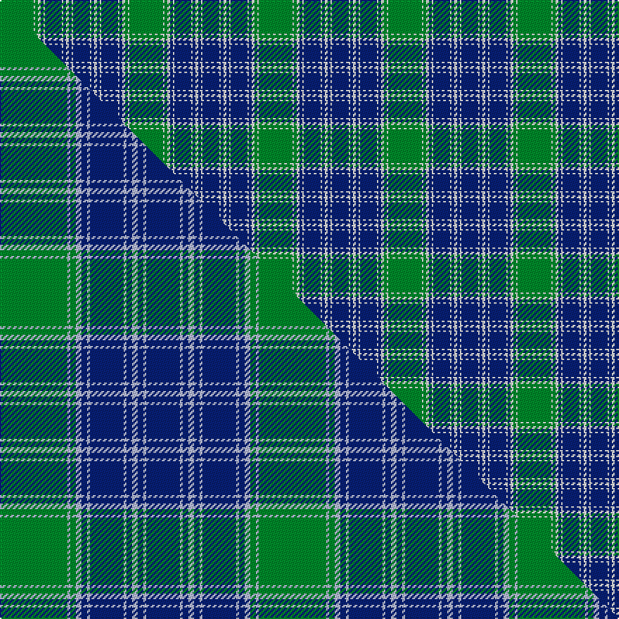

This page is one **sett** — a single exact thread-count. It belongs to the [tartan](/setts/g24w1g2w2db2w1db12w1db2w2db2w1db12/)
(the same proportion at any scale), whose colour order is pattern [BWBWBWBWBWGWG](/stripes/bwbwbwbwbwgwg/).

Part of the [MacDonald, Lord of the Isles Hunting](/tartans/macdonald-lord-of-the-isles-hunting/) tartan — the named design grouping this sett with its other cloths.

Sourced from weddslist.  It is a [13 stripe tartan](/stripes/stripes13/).

Original link http://www.weddslist.com/cgi-bin/tartans/pg.pl?source=rb

2 attestations — the source records this cloth was collapsed from (oldest owns this page)

<ul>
<li>undated — MacDonald Lord of the Isles Hunting (weddslist, <a href="http://www.weddslist.com/cgi-bin/tartans/pg.pl?source=rb">record</a>) </li>
<li>undated — MacDonald Lord of the Isles Hunting (weddslist, <a href="http://www.weddslist.com/cgi-bin/tartans/pg.pl?source=x">record</a>) </li>
</ul>

## Thread count
G/24 W1 G2 W2 DB2 W1 DB12 W1 DB2 W2 DB2 W1 DB/12

One full sett is **92 threads**.

## Palette
<table><thead><tr><th>Colour</th><th>Shade</th><th>OKLCh</th></tr></thead><tbody><tr><td>DB</td><td><code style="background-color:#082077;">#082077</code> <small style="color:#888">#082077</small></td><td><small style="color:#888">oklch(30.0% 0.149 265.1)</small></td></tr><tr><td>G</td><td><code style="background-color:#008B2A;">#008B2A</code> <small style="color:#888">#008B2A</small></td><td><small style="color:#888">oklch(55.4% 0.170 145.9)</small></td></tr><tr><td>W</td><td><code style="background-color:#F7F7F7;">#F7F7F7</code> <small style="color:#888">#F7F7F7</small></td><td><small style="color:#888">oklch(97.6% 0.000 89.9)</small></td></tr></tbody></table>

# Sample pattern

## Compared to the master

This cloth is one sett of its design; the master sett (the exemplar the design is anchored on) is below for comparison.

Its **ΔTartan distance** from the master is **0.59** — the same measure the nearest-tartans table ranks by (0 is identical; a re-scale of the same cloth is near 0, a recolour or a different proportion further).

<figure class="master-compare" style="margin:0">

this sett
master sett ★

<figcaption style="color:#888;font-size:smaller">One weave of this sett against the <a href="/setts/g24lb1g2lb2db2lb1db12lb1db2lb2db2lb1db12/">master sett ★</a>, split on the diagonal: a shared proportion runs seamlessly across it with only the shades shifting; a different proportion breaks on it.</figcaption>
</figure>

## Nearest variants

The nearest existing variants by ΔTartan distance, with this cloth at the top so the swatches line up against it.

ΔTartan

Threads

Variant

Sett

—

92

<a href="/variants/s13/g24w1g2w2db2w1db12w1db2w2db2w1db12/">MacDonald Lord of the Isles Hunting</a>

<a href="/ttd/edit/#slug=g24w1g2w2db2w1db12w1db2w2db2w1db12~x2&amp;base=g24w1g2w2db2w1db12w1db2w2db2w1db12" title="compare in the TTD">0.00</a>

184

<a href="/variants/s13/g24w1g2w2db2w1db12w1db2w2db2w1db12~x2/">MacDonald Lord of the Isles Hunting</a>

<a href="/ttd/edit/#slug=g24w1g2w2db2w1db1w1db2w2db2w1db12~x2&amp;base=g24w1g2w2db2w1db12w1db2w2db2w1db12" title="compare in the TTD">0.64</a>

140

<a href="/variants/s13/g24w1g2w2db2w1db1w1db2w2db2w1db12~x2/">MacDonald Lord of the Isles</a>

<a href="/ttd/edit/#slug=g24lb1g2lb2db2lb1db12lb1db2lb2db2lb1db12~x2&amp;base=g24w1g2w2db2w1db12w1db2w2db2w1db12" title="compare in the TTD">1.80</a>

184

<a href="/variants/s13/g24lb1g2lb2db2lb1db12lb1db2lb2db2lb1db12~x2/">MacDonald, Lord of the Isles Hunting #2</a>

<a href="/ttd/edit/#slug=g27r2g3r3db3ly2db14r2db3ly3db3r2db14~x2&amp;base=g24w1g2w2db2w1db12w1db2w2db2w1db12" title="compare in the TTD">2.27</a>

242

<a href="/variants/s13/g27r2g3r3db3ly2db14r2db3ly3db3r2db14~x2/">Crowne Plaza (Corporate)</a>

<a href="/ttd/edit/#slug=db14w2db3w2g10w32g10db10w2db3~x2&amp;base=g24w1g2w2db2w1db12w1db2w2db2w1db12" title="compare in the TTD">2.32</a>

318

<a href="/variants/s10/db14w2db3w2g10w32g10db10w2db3~x2/">Fraser, Arisaid</a>

<a href="/ttd/edit/#slug=y22w1y2w2db2w1db14w1db2w2db2w1db14~x4&amp;base=g24w1g2w2db2w1db12w1db2w2db2w1db12" title="compare in the TTD">2.53</a>

384

<a href="/variants/s13/y22w1y2w2db2w1db14w1db2w2db2w1db14~x4/">Highland Park HS Pipe Band</a>

## Neighbour map

Every grey dot is one of 13620 variants placed by the first two principal components of the ΔTartan feature space (42% of its variance). Red is this tartan; blue dots are its nearest — click one to open its page.

<svg viewBox="0 0 640 380" role="img" style="max-width:100%;height:auto;border:1px solid #e0e0e0;border-radius:4px;display:block" xmlns="http://www.w3.org/2000/svg"><image href="/nn/cloud.v1.png" width="640" height="380"/><a href="/variants/s13/g24w1g2w2db2w1db12w1db2w2db2w1db12~x2/"><circle cx="324.0" cy="147.0" r="4" fill="#3465a4"><title>MacDonald Lord of the Isles Hunting</title></circle></a><a href="/variants/s13/g24w1g2w2db2w1db1w1db2w2db2w1db12~x2/"><circle cx="334.0" cy="136.9" r="4" fill="#3465a4"><title>MacDonald Lord of the Isles</title></circle></a><a href="/variants/s13/g24lb1g2lb2db2lb1db12lb1db2lb2db2lb1db12~x2/"><circle cx="343.6" cy="152.9" r="4" fill="#3465a4"><title>MacDonald, Lord of the Isles Hunting #2</title></circle></a><a href="/variants/s13/g27r2g3r3db3ly2db14r2db3ly3db3r2db14~x2/"><circle cx="258.2" cy="150.9" r="4" fill="#3465a4"><title>Crowne Plaza (Corporate)</title></circle></a><a href="/variants/s10/db14w2db3w2g10w32g10db10w2db3~x2/"><circle cx="257.0" cy="187.7" r="4" fill="#3465a4"><title>Fraser, Arisaid</title></circle></a><a href="/variants/s13/y22w1y2w2db2w1db14w1db2w2db2w1db14~x4/"><circle cx="344.1" cy="147.0" r="4" fill="#3465a4"><title>Highland Park HS Pipe Band</title></circle></a><circle cx="324.0" cy="147.0" r="5" fill="#c00000"/><text x="320" y="376" text-anchor="middle" font-size="11" fill="#999">ground</text><text x="11" y="190" text-anchor="middle" font-size="11" fill="#999" transform="rotate(-90 11 190)">complexity</text></svg>

ID: /variants/s13/g24w1g2w2db2w1db12w1db2w2db2w1db12/
