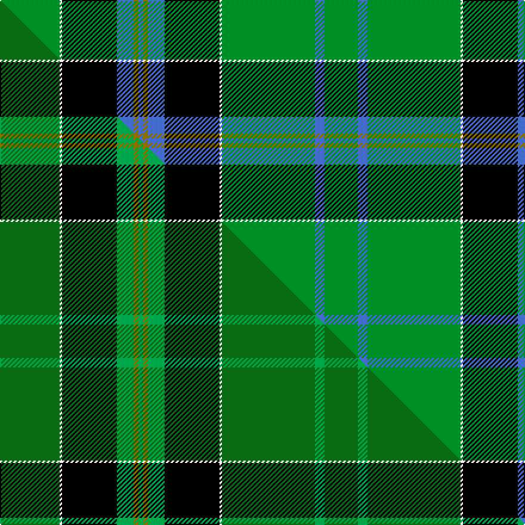

This page is one **sett** — a single exact thread-count. It belongs to the [tartan](/setts/g25w1k23b7y2b2y2b7k23w1g39b4g14/)
(the same proportion at any scale), whose colour order is pattern [GBGWKBGBGBKWG](/stripes/gbgwkbgbgbkwg/).

Part of the [Duffy](/tartans/duffy/) tartan — the named design grouping this sett with its other cloths.

Sourced from weddslist.  It is a [13 stripe tartan](/stripes/stripes13/).

Original link [http://www.weddslist.com/cgi-bin/tartans/pg.pl?source=sts](http://www.weddslist.com/cgi-bin/tartans/pg.pl?source=sts)

Dataset <small>— provenance for this record, inherited from the source manifest</small>

<dl class="dataset-prov">
<dt>source</dt><dd><a href="/sources/weddslist/">Weddslist</a></dd>
<dt>data captured from</dt><dd><a href="https://github.com/thetartan/tartan-database/blob/master/data/weddslist/data.csv">https://github.com/thetartan/tartan-database/blob/master/data/weddslist/data.csv</a></dd>
<dt>data date</dt><dd>2016-11-17 <small>(dataset default)</small></dd>
<dt>licence</dt><dd><a href="https://creativecommons.org/licenses/by-nc-nd/4.0/">CC BY-NC-ND 4.0</a></dd>
</dl>

Capture chain <small>— the hands this data passed through, oldest first; each capture carries its own licence</small>

<ol class="capture-chain">
<li><a href="https://www.weddslist.com/tartans/">Weddslist</a> <small>the living privately compiled reference</small></li>
<li><a href="https://github.com/thetartan/tartan-database">thetartan/tartan-database</a> <small>2016-2017</small> · <a href="https://creativecommons.org/licenses/by-nc-nd/4.0/">CC BY-NC-ND 4.0</a> <small>Levko Kravets's frozen compilation — the capture we vendored, and where its CC licence text came from</small></li>
<li>this dictionary <small>captured 2026-06-10 · commit 5bf86c7566</small> <small>each re-capture is a git commit to data/sources</small></li>
</ol>

## Thread count
G/50 W2 K46 B14 Y4 B4 Y4 B14 K46 W2 G78 B8 G/28

One full sett is **522 threads**.

## Palette
<table><thead><tr><th>Colour</th><th>Shade</th><th>OKLCh</th></tr></thead><tbody><tr><td>B</td><td><code style="background-color:#466CC8;">#466CC8</code> <small style="color:#888">#466CC8</small></td><td><small style="color:#888">oklch(55.1% 0.149 265.0)</small></td></tr><tr><td>G</td><td><code style="background-color:#008B2A;">#008B2A</code> <small style="color:#888">#008B2A</small></td><td><small style="color:#888">oklch(55.4% 0.170 145.9)</small></td></tr><tr><td>K</td><td><code style="background-color:#000000;">#000000</code> <small style="color:#888">#000000</small></td><td><small style="color:#888">oklch(0.0% 0.000 0.0)</small></td></tr><tr><td>W</td><td><code style="background-color:#F7F7F7;">#F7F7F7</code> <small style="color:#888">#F7F7F7</small></td><td><small style="color:#888">oklch(97.6% 0.000 89.9)</small></td></tr><tr><td>Y</td><td><code style="background-color:#8B6E00;">#8B6E00</code> <small style="color:#888">#8B6E00</small></td><td><small style="color:#888">oklch(55.1% 0.113 90.4)</small></td></tr></tbody></table>

# Sample pattern

## Compared to the master

This cloth is one sett of its design; the master sett (the exemplar the design is anchored on) is below for comparison.

Its **ΔTartan distance** from the master is **1.20** — the same measure the nearest-tartans table ranks by (0 is identical; a re-scale of the same cloth is near 0, a recolour or a different proportion further).

<figure class="master-compare" style="margin:0">

this sett
master sett ★

<figcaption style="color:#888;font-size:smaller">One weave of this sett against the <a href="/setts/dg25w1k23g7y2g2y2g7k23w1dg39g4dg14/">master sett ★</a>, split on the diagonal: a shared proportion runs seamlessly across it with only the shades shifting; a different proportion breaks on it.</figcaption>
</figure>

## Nearest tartan variants

The nearest existing variants by ΔTartan distance, with this cloth at the top so the swatches line up against it.

ΔTartan

Threads

Variant

Sett

—

522

<a href="/variants/s13/g25w1k23b7y2b2y2b7k23w1g39b4g14~x2/">Duffy</a>

<a href="/ttd/edit/#slug=dg25w1k23g7y2g2y2g7k23w1dg39g4dg14~x2~dg1806142-g2507147&amp;base=g25w1k23b7y2b2y2b7k23w1g39b4g14~x2" title="compare in the TTD">1.20</a>

522

<a href="/variants/s13/dg25w1k23g7y2g2y2g7k23w1dg39g4dg14~x2~dg1806142-g2507147/">Duffy Family Tartan</a>

<a href="/ttd/edit/#slug=g4k2g28r4g4k18g4lp4g4lp7k1w3~x2&amp;base=g25w1k23b7y2b2y2b7k23w1g39b4g14~x2" title="compare in the TTD">2.16</a>

318

<a href="/variants/s12/g4k2g28r4g4k18g4lp4g4lp7k1w3~x2/">Moss</a>

<a href="/ttd/edit/#slug=w4g30k1g1k1g3k12db10r3~x2&amp;base=g25w1k23b7y2b2y2b7k23w1g39b4g14~x2" title="compare in the TTD">2.39</a>

246

<a href="/variants/s9/w4g30k1g1k1g3k12db10r3~x2/">MacDonald of The Isles</a>

<a href="/ttd/edit/#slug=w4g30k1g1k1g3k12db10r3&amp;base=g25w1k23b7y2b2y2b7k23w1g39b4g14~x2" title="compare in the TTD">2.39</a>

123

<a href="/variants/s9/w4g30k1g1k1g3k12db10r3/">MacDonnald of ye Ylis</a>

<a href="/ttd/edit/#slug=lr1lb3k2g5dp4g1k14lb1k4g25lb2lr1~x2&amp;base=g25w1k23b7y2b2y2b7k23w1g39b4g14~x2" title="compare in the TTD">2.40</a>

248

<a href="/variants/s12/lr1lb3k2g5dp4g1k14lb1k4g25lb2lr1~x2/">Walker, Gauvin (Personal)</a>

<a href="/ttd/edit/#slug=db15k18g3k2g2k2g44y4g44k2g2k2g3k18db15r4~x2&amp;base=g25w1k23b7y2b2y2b7k23w1g39b4g14~x2" title="compare in the TTD">2.47</a>

682

<a href="/variants/s16/db15k18g3k2g2k2g44y4g44k2g2k2g3k18db15r4~x2/">Sarafilovic</a>

<a href="/ttd/edit/#slug=k20y3db10g3db5g25k1g1w3g1k1g25db5g3db10y1db2~x4&amp;base=g25w1k23b7y2b2y2b7k23w1g39b4g14~x2" title="compare in the TTD">2.49</a>

864

<a href="/variants/s17/k20y3db10g3db5g25k1g1w3g1k1g25db5g3db10y1db2~x4/">Blairgowrie</a>

<a href="/ttd/edit/#slug=k4g35lo1k18g3db18dr3g3dr3~x2&amp;base=g25w1k23b7y2b2y2b7k23w1g39b4g14~x2" title="compare in the TTD">2.57</a>

338

<a href="/variants/s9/k4g35lo1k18g3db18dr3g3dr3~x2/">Mackay, John W. (Personal)</a>

<a href="/ttd/edit/#slug=k20r3db10g3db5g25k1g1w3g1k1g25db5g3db10r1db2~x2&amp;base=g25w1k23b7y2b2y2b7k23w1g39b4g14~x2" title="compare in the TTD">2.60</a>

432

<a href="/variants/s17/k20r3db10g3db5g25k1g1w3g1k1g25db5g3db10r1db2~x2/">Blairlogie, or Blair Athol</a>

<a href="/ttd/edit/#slug=k28dr3y2dr3k13g28w1g3w1g16~x2&amp;base=g25w1k23b7y2b2y2b7k23w1g39b4g14~x2" title="compare in the TTD">2.68</a>

304

<a href="/variants/s10/k28dr3y2dr3k13g28w1g3w1g16~x2/">Bomb Disposal</a>

## Neighbour map

Every grey dot is one of 13621 variants placed by the first two principal components of the ΔTartan feature space (42% of its variance). Red is this tartan; blue dots are its nearest — click one to open its page.

<svg viewBox="0 0 640 380" role="img" style="max-width:100%;height:auto;border:1px solid #e0e0e0;border-radius:4px;display:block" xmlns="http://www.w3.org/2000/svg"><image href="/nn/cloud.v1.png" width="640" height="380"/><a href="/variants/s13/dg25w1k23g7y2g2y2g7k23w1dg39g4dg14~x2~dg1806142-g2507147/"><circle cx="253.4" cy="91.6" r="4" fill="#3465a4"><title>Duffy Family Tartan</title></circle></a><a href="/variants/s12/g4k2g28r4g4k18g4lp4g4lp7k1w3~x2/"><circle cx="228.9" cy="93.2" r="4" fill="#3465a4"><title>Moss</title></circle></a><a href="/variants/s9/w4g30k1g1k1g3k12db10r3~x2/"><circle cx="240.2" cy="95.9" r="4" fill="#3465a4"><title>MacDonald of The Isles</title></circle></a><a href="/variants/s9/w4g30k1g1k1g3k12db10r3/"><circle cx="240.2" cy="95.9" r="4" fill="#3465a4"><title>MacDonnald of ye Ylis</title></circle></a><a href="/variants/s12/lr1lb3k2g5dp4g1k14lb1k4g25lb2lr1~x2/"><circle cx="223.3" cy="86.6" r="4" fill="#3465a4"><title>Walker, Gauvin (Personal)</title></circle></a><a href="/variants/s16/db15k18g3k2g2k2g44y4g44k2g2k2g3k18db15r4~x2/"><circle cx="244.1" cy="88.4" r="4" fill="#3465a4"><title>Sarafilovic</title></circle></a><a href="/variants/s17/k20y3db10g3db5g25k1g1w3g1k1g25db5g3db10y1db2~x4/"><circle cx="216.2" cy="88.5" r="4" fill="#3465a4"><title>Blairgowrie</title></circle></a><a href="/variants/s9/k4g35lo1k18g3db18dr3g3dr3~x2/"><circle cx="227.8" cy="102.7" r="4" fill="#3465a4"><title>Mackay, John W. (Personal)</title></circle></a><a href="/variants/s17/k20r3db10g3db5g25k1g1w3g1k1g25db5g3db10r1db2~x2/"><circle cx="211.5" cy="84.9" r="4" fill="#3465a4"><title>Blairlogie, or Blair Athol</title></circle></a><a href="/variants/s10/k28dr3y2dr3k13g28w1g3w1g16~x2/"><circle cx="237.0" cy="106.9" r="4" fill="#3465a4"><title>Bomb Disposal</title></circle></a><circle cx="245.4" cy="90.1" r="5" fill="#c00000"/><text x="320" y="376" text-anchor="middle" font-size="11" fill="#999">ground</text><text x="11" y="190" text-anchor="middle" font-size="11" fill="#999" transform="rotate(-90 11 190)">complexity</text></svg>

ID: /variants/s13/g25w1k23b7y2b2y2b7k23w1g39b4g14~x2/
