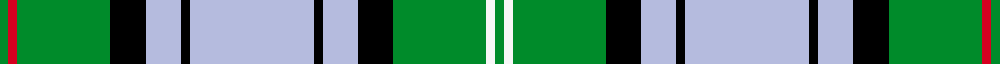

This page is one **sett** — a single exact thread-count. It belongs to the [tartan](/setts/g2r2g21k8lb8k2lb28k2lb8k8g21w2g2/)
(the same proportion at any scale), whose colour order is pattern [GRGKWKWKWKGWG](/stripes/grgkwkwkwkgwg/).

Sourced from register-of-tartans.  It is a [13 stripe tartan](/stripes/stripes13/).

Original link https://www.tartanregister.gov.uk/tartanDetails.aspx?ref=2495

2 attestations — the source records this cloth was collapsed from (oldest owns this page)

<ul>
<li>01/02/2003 — Mack Original (Personal) (register-of-tartans, <a href="https://www.tartanregister.gov.uk/tartanDetails.aspx?ref=2495">record</a>)  <em>A family tartan for the family of Mack. Apply to the designer, Paul Philip Mack, for permission to use. Permission is likely to be granted to those of the name of Mack providing the project is not commercial.</em></li>
<li>pre 2004 — Mack (Name) (tartans-authority, <a href="http://www.tartansauthority.com/tartan-ferret/display/6209/">record</a>)  <em>A family tartan controled by the designer Paul Philip Mack. Use is likely to be granted to any with the name as long as the use of the design is not part of a commercial project. (Notes from old STWR website).</em></li>
</ul>

## Register references

External register numbers recorded for this tartan.

- Scottish Register of Tartans: [2495](https://www.tartanregister.gov.uk/tartanDetails.aspx?ref=2495)
- Scottish Tartans Authority (ITI): 6209
- Scottish Tartans World Register: 2938

## Thread count
G/4 R4 G42 K16 LB16 K4 LB56 K4 LB16 K16 G42 W4 G/4

One full sett is **448 threads**.

## Palette
<table><thead><tr><th>Colour</th><th>Shade</th><th>OKLCh</th></tr></thead><tbody><tr><td>LB</td><td><code style="background-color:#B5BBDE;">#B5BBDE</code> <small style="color:#888">#B5BBDE</small></td><td><small style="color:#888">oklch(79.9% 0.050 277.6)</small></td></tr><tr><td>G</td><td><code style="background-color:#008B2A;">#008B2A</code> <small style="color:#888">#008B2A</small></td><td><small style="color:#888">oklch(55.4% 0.170 145.9)</small></td></tr><tr><td>K</td><td><code style="background-color:#000000;">#000000</code> <small style="color:#888">#000000</small></td><td><small style="color:#888">oklch(0.0% 0.000 0.0)</small></td></tr><tr><td>R</td><td><code style="background-color:#D60020;">#D60020</code> <small style="color:#888">#D60020</small></td><td><small style="color:#888">oklch(55.2% 0.224 25.5)</small></td></tr><tr><td>W</td><td><code style="background-color:#F7F7F7;">#F7F7F7</code> <small style="color:#888">#F7F7F7</small></td><td><small style="color:#888">oklch(97.6% 0.000 89.9)</small></td></tr></tbody></table>

# Sample pattern

## Nearest tartan variants

The nearest existing variants by ΔTartan distance, with this cloth at the top so the swatches line up against it.

ΔTartan

Threads

Variant

Sett

—

448

<a href="/variants/s13/g2r2g21k8lb8k2lb28k2lb8k8g21w2g2~x2/">Mack Original (Personal)</a>

<a href="/ttd/edit/#slug=dg27w2dg3ly4dg3w2dg5k13lg2w26lg3~x2&amp;base=g2r2g21k8lb8k2lb28k2lb8k8g21w2g2~x2" title="compare in the TTD">1.75</a>

300

<a href="/variants/s11/dg27w2dg3ly4dg3w2dg5k13lg2w26lg3~x2/">MacKellar Dress, Green (Dance)</a>

<a href="/ttd/edit/#slug=dr4w4dr2w29k10dg3k10dg4g4dg3g3dg3~x2~dg1806142-g2408144&amp;base=g2r2g21k8lb8k2lb28k2lb8k8g21w2g2~x2" title="compare in the TTD">2.14</a>

302

<a href="/variants/s12/dr4w4dr2w29k10dg3k10dg4g4dg3g3dg3~x2~dg1806142-g2408144/">Ross Arisaid</a>

<a href="/ttd/edit/#slug=r4g16db24k4w4g24k3g3k3g3w24g4&amp;base=g2r2g21k8lb8k2lb28k2lb8k8g21w2g2~x2" title="compare in the TTD">2.17</a>

224

<a href="/variants/s12/r4g16db24k4w4g24k3g3k3g3w24g4/">MacInnes Dress (Dalgliesh)</a>

<a href="/ttd/edit/#slug=lb3k1g12k1g1k2g1k6w12k1lo1~x4&amp;base=g2r2g21k8lb8k2lb28k2lb8k8g21w2g2~x2" title="compare in the TTD">2.26</a>

312

<a href="/variants/s11/lb3k1g12k1g1k2g1k6w12k1lo1~x4/">McCandlish Arisaid, Green (Name)</a>

<a href="/ttd/edit/#slug=lb39g3lb3g20k3g20k3g3k20r3~x2&amp;base=g2r2g21k8lb8k2lb28k2lb8k8g21w2g2~x2" title="compare in the TTD">2.27</a>

384

<a href="/variants/s10/lb39g3lb3g20k3g20k3g3k20r3~x2/">Dunedin Chapter (Corporate)</a>

<a href="/ttd/edit/#slug=lb3k1g12k1g1k2g1k6lr12k1lo1~x4~lb3203246-lr3200000&amp;base=g2r2g21k8lb8k2lb28k2lb8k8g21w2g2~x2" title="compare in the TTD">2.28</a>

312

<a href="/variants/s11/lbi3k1g12k1g1k2g1k6lb12k1lo1~x4~lbi3203246-lb3200000/">MacCandlish Arisaid Green</a>

<a href="/ttd/edit/#slug=lb24k2r2lb2db12g28r4g5lb3g3~x2&amp;base=g2r2g21k8lb8k2lb28k2lb8k8g21w2g2~x2" title="compare in the TTD">2.32</a>

286

<a href="/variants/s10/lb24k2r2lb2db12g28r4g5lb3g3~x2/">Downie (Name)</a>

<a href="/ttd/edit/#slug=g4lg2db14lg2db2lg2db2lg14k1w2~x2&amp;base=g2r2g21k8lb8k2lb28k2lb8k8g21w2g2~x2" title="compare in the TTD">2.43</a>

168

<a href="/variants/s10/g4lg2db14lg2db2lg2db2lg14k1w2~x2/">Blalack</a>

<a href="/ttd/edit/#slug=w7r1w14k6y2k6g14r2g10y1~x2~w3600000-r2209032&amp;base=g2r2g21k8lb8k2lb28k2lb8k8g21w2g2~x2" title="compare in the TTD">2.47</a>

236

<a href="/variants/s10/w7r1w14k6y2k6g14r2g10y1~x2~w3600000-r2209032/">Spanish shirt</a>

<a href="/ttd/edit/#slug=db1r1db8k3g8r1g1r1g8k3w10r1w1~x4&amp;base=g2r2g21k8lb8k2lb28k2lb8k8g21w2g2~x2" title="compare in the TTD">2.50</a>

368

<a href="/variants/s13/db1r1db8k3g8r1g1r1g8k3w10r1w1~x4/">Blair, dress</a>

## Neighbour map

Every grey dot is one of 13620 variants placed by the first two principal components of the ΔTartan feature space (42% of its variance). Red is this tartan; blue dots are its nearest — click one to open its page.

<svg viewBox="0 0 640 380" role="img" style="max-width:100%;height:auto;border:1px solid #e0e0e0;border-radius:4px;display:block" xmlns="http://www.w3.org/2000/svg"><image href="/nn/cloud.v1.png" width="640" height="380"/><a href="/variants/s11/dg27w2dg3ly4dg3w2dg5k13lg2w26lg3~x2/"><circle cx="154.4" cy="122.3" r="4" fill="#3465a4"><title>MacKellar Dress, Green (Dance)</title></circle></a><a href="/variants/s12/dr4w4dr2w29k10dg3k10dg4g4dg3g3dg3~x2~dg1806142-g2408144/"><circle cx="134.1" cy="114.1" r="4" fill="#3465a4"><title>Ross Arisaid</title></circle></a><a href="/variants/s12/r4g16db24k4w4g24k3g3k3g3w24g4/"><circle cx="126.3" cy="154.7" r="4" fill="#3465a4"><title>MacInnes Dress (Dalgliesh)</title></circle></a><a href="/variants/s11/lb3k1g12k1g1k2g1k6w12k1lo1~x4/"><circle cx="109.7" cy="127.5" r="4" fill="#3465a4"><title>McCandlish Arisaid, Green (Name)</title></circle></a><a href="/variants/s10/lb39g3lb3g20k3g20k3g3k20r3~x2/"><circle cx="169.4" cy="150.5" r="4" fill="#3465a4"><title>Dunedin Chapter (Corporate)</title></circle></a><a href="/variants/s11/lbi3k1g12k1g1k2g1k6lb12k1lo1~x4~lbi3203246-lb3200000/"><circle cx="117.0" cy="129.7" r="4" fill="#3465a4"><title>MacCandlish Arisaid Green</title></circle></a><a href="/variants/s10/lb24k2r2lb2db12g28r4g5lb3g3~x2/"><circle cx="194.8" cy="139.0" r="4" fill="#3465a4"><title>Downie (Name)</title></circle></a><a href="/variants/s10/g4lg2db14lg2db2lg2db2lg14k1w2~x2/"><circle cx="198.4" cy="140.1" r="4" fill="#3465a4"><title>Blalack</title></circle></a><a href="/variants/s10/w7r1w14k6y2k6g14r2g10y1~x2~w3600000-r2209032/"><circle cx="119.5" cy="155.1" r="4" fill="#3465a4"><title>Spanish shirt</title></circle></a><a href="/variants/s13/db1r1db8k3g8r1g1r1g8k3w10r1w1~x4/"><circle cx="92.6" cy="142.0" r="4" fill="#3465a4"><title>Blair, dress</title></circle></a><circle cx="157.4" cy="129.5" r="5" fill="#c00000"/><text x="320" y="376" text-anchor="middle" font-size="11" fill="#999">ground</text><text x="11" y="190" text-anchor="middle" font-size="11" fill="#999" transform="rotate(-90 11 190)">complexity</text></svg>

ID: /variants/s13/g2r2g21k8lb8k2lb28k2lb8k8g21w2g2~x2/
