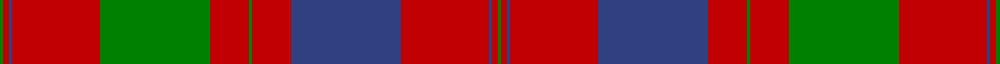

This is one **variant** — a specific cloth: this exact thread count and colourway, with its own
provenance below. It is one weaving of the [sett](/tartans/f/fr/fraser-wedding-dress/) (the scale-free proportion — the
same cloth at any scale or shade), whose colour order is pattern [GRBRBRGRGRBRG](/stripes/grbrbrgrgrbrg/).

Part of the [Fraser, Wedding dress](/tartans/f/fr/fraser-wedding-dress/) tartan — the named design grouping this sett with its other cloths.

Sourced from weddslist.  It is a [13 stripe tartan](/stripes/stripes13/).

Original link [http://www.weddslist.com/cgi-bin/tartans/pg.pl?source=sts](http://www.weddslist.com/cgi-bin/tartans/pg.pl?source=sts)

Dataset <small>— provenance for this record, inherited from the source manifest</small>

<dl class="dataset-prov">
<dt>source</dt><dd><a href="/sources/weddslist/">Weddslist</a></dd>
<dt>data captured from</dt><dd><a href="https://github.com/thetartan/tartan-database/blob/master/data/weddslist/data.csv">https://github.com/thetartan/tartan-database/blob/master/data/weddslist/data.csv</a></dd>
<dt>data date</dt><dd>2016-11-17 <small>(dataset default)</small></dd>
<dt>licence</dt><dd><a href="https://creativecommons.org/licenses/by-nc-nd/4.0/">CC BY-NC-ND 4.0</a></dd>
</dl>

Capture chain <small>— the hands this data passed through, oldest first; each capture carries its own licence</small>

<ol class="capture-chain">
<li><a href="https://www.weddslist.com/tartans/">Weddslist</a> <small>the living privately compiled reference</small></li>
<li><a href="https://github.com/thetartan/tartan-database">thetartan/tartan-database</a> <small>2016-2017</small> · <a href="https://creativecommons.org/licenses/by-nc-nd/4.0/">CC BY-NC-ND 4.0</a> <small>Levko Kravets's frozen compilation — the capture we vendored, and where its CC licence text came from</small></li>
<li>this dictionary <small>captured 2026-06-10 · commit 5bf86c7566</small> <small>each re-capture is a git commit to data/sources</small></li>
</ol>

## Thread count
G/4 R6 DB4 R96 G120 R42 G4 R42 DB120 R96 DB4 R6 G/4

One full sett is **1088 threads**.

## Palette
<table><thead><tr><th>Colour</th><th>Shade</th><th>OKLCh</th></tr></thead><tbody><tr><td>DB</td><td><code style="background-color:#082077;">#082077</code> <small style="color:#888">#082077</small></td><td><small style="color:#888">oklch(30.0% 0.149 265.1)</small></td></tr><tr><td>G</td><td><code style="background-color:#008B2A;">#008B2A</code> <small style="color:#888">#008B2A</small></td><td><small style="color:#888">oklch(55.4% 0.170 145.9)</small></td></tr><tr><td>R</td><td><code style="background-color:#D60020;">#D60020</code> <small style="color:#888">#D60020</small></td><td><small style="color:#888">oklch(55.2% 0.224 25.5)</small></td></tr></tbody></table>

# Sample pattern

[Sample sheet (PDF)](swatch.pdf) — the woven sample, thread count and palette on one printable A4, rendered on demand (the same sheet the TTD print page downloads).

## Nearest tartan variants

The nearest existing variants by ΔTartan distance, with this cloth at the top so the swatches line up against it.

ΔTartan

Threads

Variant

Sett

—

1088

<a href="/variants/s13/g2r3db2r48db60r21g2r21g60r48db2r3g2~x2/">Fraser, Wedding dress</a>

<a href="/ttd/edit/#slug=dg2r3db2r48dg60r21dg2r21db60r48db2r3dg2&amp;base=g2r3db2r48db60r21g2r21g60r48db2r3g2~x2" title="compare in the TTD">0.12</a>

544

<a href="/variants/s13/dg2r3db2r48dg60r21dg2r21db60r48db2r3dg2/">Fraser, Isabella (Artefact)</a>

<a href="/ttd/edit/#slug=r1g1r32db32r8g1r1g1r8g32r32g1r1~x2&amp;base=g2r3db2r48db60r21g2r21g60r48db2r3g2~x2" title="compare in the TTD">1.25</a>

600

<a href="/variants/s13/r1g1r32db32r8g1r1g1r8g32r32g1r1~x2/">Grant of Rothiemurchus Artifact Tartan</a>

<a href="/ttd/edit/#slug=db80r56dg3r56dg88r64db3r4dg3r4db3r64&amp;base=g2r3db2r48db60r21g2r21g60r48db2r3g2~x2" title="compare in the TTD">1.32</a>

712

<a href="/variants/s12/db80r56dg3r56dg88r64db3r4dg3r4db3r64/">Unidentified Cant #14</a>

<a href="/ttd/edit/#slug=r28g2r5g2r28db3r3g24r3db24r3db3~x2&amp;base=g2r3db2r48db60r21g2r21g60r48db2r3g2~x2" title="compare in the TTD">1.63</a>

450

<a href="/variants/s12/r28g2r5g2r28db3r3g24r3db24r3db3~x2/">Robertson #5</a>

<a href="/ttd/edit/#slug=r1g1r32dp32r8g1r1g1r8g32r32g1r1~x2&amp;base=g2r3db2r48db60r21g2r21g60r48db2r3g2~x2" title="compare in the TTD">2.10</a>

600

<a href="/variants/s13/r1g1r32dp32r8g1r1g1r8g32r32g1r1~x2/">Unnamed 18th century plaid from Rothiemurchus</a>

<a href="/ttd/edit/#slug=r45db4r4g48r4db4r4db15r4db4r40g4r4g30&amp;base=g2r3db2r48db60r21g2r21g60r48db2r3g2~x2" title="compare in the TTD">2.17</a>

353

<a href="/variants/s14/r45db4r4g48r4db4r4db15r4db4r40g4r4g30/">Bruce Old</a>

<a href="/ttd/edit/#slug=r60db2r2g63r2db2r2db20r2db2r54g2r2g40&amp;base=g2r3db2r48db60r21g2r21g60r48db2r3g2~x2" title="compare in the TTD">2.20</a>

410

<a href="/variants/s14/r60db2r2g63r2db2r2db20r2db2r54g2r2g40/">Bruce - 1819 (Old)</a>

<a href="/ttd/edit/#slug=r5dp2r2g42r5dp36r70dp4r7g2&amp;base=g2r3db2r48db60r21g2r21g60r48db2r3g2~x2" title="compare in the TTD">2.21</a>

343

<a href="/variants/s10/r5dp2r2g42r5dp36r70dp4r7g2/">MacPherson of Cluny</a>

<a href="/ttd/edit/#slug=db4r1db1r4db12r4db1r1g4r1db1r26db26r4g4r26g21r13db6r5g1~x2&amp;base=g2r3db2r48db60r21g2r21g60r48db2r3g2~x2" title="compare in the TTD">2.31</a>

654

<a href="/variants/s21/db4r1db1r4db12r4db1r1g4r1db1r26db26r4g4r26g21r13db6r5g1~x2/">Murray of Tullibardine (plaid)</a>

<a href="/ttd/edit/#slug=r6db1r2db2r28lb2r2db9r2g2r2g24r3db2r6db2~x2&amp;base=g2r3db2r48db60r21g2r21g60r48db2r3g2~x2" title="compare in the TTD">2.43</a>

364

<a href="/variants/s16/r6db1r2db2r28lb2r2db9r2g2r2g24r3db2r6db2~x2/">Drummond Clan Tartan</a>

## Neighbour map

Every grey dot is one of 13662 variants placed by the first two principal components of the ΔTartan feature space (42% of its variance). Red is this tartan; blue dots are its nearest — click one to open its page. The map is a flat projection of a many-dimensional space — [how to read it](/posts/neighbourhood-maps/).

<svg viewBox="0 0 640 380" role="img" style="max-width:100%;height:auto;border:1px solid #e0e0e0;border-radius:4px;display:block" xmlns="http://www.w3.org/2000/svg"><image href="/nn/cloud.v1.png" width="640" height="380"/><a href="/variants/s13/dg2r3db2r48dg60r21dg2r21db60r48db2r3dg2/"><circle cx="350.7" cy="130.4" r="4" fill="#3465a4"><title>Fraser, Isabella (Artefact)</title></circle></a><a href="/variants/s13/r1g1r32db32r8g1r1g1r8g32r32g1r1~x2/"><circle cx="360.5" cy="119.6" r="4" fill="#3465a4"><title>Grant of Rothiemurchus Artifact Tartan</title></circle></a><a href="/variants/s12/db80r56dg3r56dg88r64db3r4dg3r4db3r64/"><circle cx="373.6" cy="143.6" r="4" fill="#3465a4"><title>Unidentified Cant #14</title></circle></a><a href="/variants/s12/r28g2r5g2r28db3r3g24r3db24r3db3~x2/"><circle cx="328.8" cy="165.0" r="4" fill="#3465a4"><title>Robertson #5</title></circle></a><a href="/variants/s13/r1g1r32dp32r8g1r1g1r8g32r32g1r1~x2/"><circle cx="378.6" cy="122.5" r="4" fill="#3465a4"><title>Unnamed 18th century plaid from Rothiemurchus</title></circle></a><a href="/variants/s14/r45db4r4g48r4db4r4db15r4db4r40g4r4g30/"><circle cx="311.9" cy="166.7" r="4" fill="#3465a4"><title>Bruce Old</title></circle></a><a href="/variants/s14/r60db2r2g63r2db2r2db20r2db2r54g2r2g40/"><circle cx="356.9" cy="120.5" r="4" fill="#3465a4"><title>Bruce - 1819 (Old)</title></circle></a><a href="/variants/s10/r5dp2r2g42r5dp36r70dp4r7g2/"><circle cx="370.5" cy="126.7" r="4" fill="#3465a4"><title>MacPherson of Cluny</title></circle></a><a href="/variants/s21/db4r1db1r4db12r4db1r1g4r1db1r26db26r4g4r26g21r13db6r5g1~x2/"><circle cx="321.2" cy="114.6" r="4" fill="#3465a4"><title>Murray of Tullibardine (plaid)</title></circle></a><a href="/variants/s16/r6db1r2db2r28lb2r2db9r2g2r2g24r3db2r6db2~x2/"><circle cx="336.6" cy="98.5" r="4" fill="#3465a4"><title>Drummond Clan Tartan</title></circle></a><circle cx="342.1" cy="130.1" r="5" fill="#c00000"/><text x="320" y="376" text-anchor="middle" font-size="11" fill="#999">ground</text><text x="11" y="190" text-anchor="middle" font-size="11" fill="#999" transform="rotate(-90 11 190)">complexity</text></svg>

ID: /variants/s13/g2r3db2r48db60r21g2r21g60r48db2r3g2~x2/
