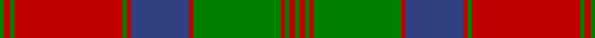

This page is one **sett** — a single exact thread-count. It belongs to the [tartan](/setts/g2r3g2r52g2r2db28r2g42r2g2r3g2/)
(the same proportion at any scale), whose colour order is pattern [GRGRGRBRGRGRG](/stripes/grgrgrbrgrgrg/).

Sourced from weddslist.  It is a [13 stripe tartan](/stripes/stripes13/).

Original link http://www.weddslist.com/cgi-bin/tartans/pg.pl?source=sts

## Thread count
G/4 R6 G4 R104 G4 R4 B56 R4 G84 R4 G4 R6 G/4

One full sett is **568 threads**.

## Palette

Palette: <strong>custom</strong>
<table><thead><tr><th>Colour</th><th>Threads</th><th>Shade</th><th>Base</th><th>OKLCh</th></tr></thead><tbody><tr><td>G/</td><td style="text-align:right;font-variant-numeric:tabular-nums">4</td><td><code style="background-color:#008000;">#008000</code> <small style="color:#888">#008000</small></td><td>G <code style="background-color:#006100;">#006100</code></td><td><small style="color:#888">oklch(52.0% 0.177 142.5)</small></td></tr><tr><td>R</td><td style="text-align:right;font-variant-numeric:tabular-nums">6</td><td><code style="background-color:#C00000;">#C00000</code> <small style="color:#888">#C00000</small></td><td>R <code style="background-color:#CC0000;">#CC0000</code></td><td><small style="color:#888">oklch(50.7% 0.208 29.2)</small></td></tr><tr><td>G</td><td style="text-align:right;font-variant-numeric:tabular-nums">4</td><td><code style="background-color:#008000;">#008000</code> <small style="color:#888">#008000</small></td><td>G <code style="background-color:#006100;">#006100</code></td><td><small style="color:#888">oklch(52.0% 0.177 142.5)</small></td></tr><tr><td>R</td><td style="text-align:right;font-variant-numeric:tabular-nums">104</td><td><code style="background-color:#C00000;">#C00000</code> <small style="color:#888">#C00000</small></td><td>R <code style="background-color:#CC0000;">#CC0000</code></td><td><small style="color:#888">oklch(50.7% 0.208 29.2)</small></td></tr><tr><td>G</td><td style="text-align:right;font-variant-numeric:tabular-nums">4</td><td><code style="background-color:#008000;">#008000</code> <small style="color:#888">#008000</small></td><td>G <code style="background-color:#006100;">#006100</code></td><td><small style="color:#888">oklch(52.0% 0.177 142.5)</small></td></tr><tr><td>R</td><td style="text-align:right;font-variant-numeric:tabular-nums">4</td><td><code style="background-color:#C00000;">#C00000</code> <small style="color:#888">#C00000</small></td><td>R <code style="background-color:#CC0000;">#CC0000</code></td><td><small style="color:#888">oklch(50.7% 0.208 29.2)</small></td></tr><tr><td>B</td><td style="text-align:right;font-variant-numeric:tabular-nums">56</td><td><code style="background-color:#304080;">#304080</code> <small style="color:#888">#304080</small></td><td>B <code style="background-color:#2A418A;">#2A418A</code></td><td><small style="color:#888">oklch(39.4% 0.109 270.2)</small></td></tr><tr><td>R</td><td style="text-align:right;font-variant-numeric:tabular-nums">4</td><td><code style="background-color:#C00000;">#C00000</code> <small style="color:#888">#C00000</small></td><td>R <code style="background-color:#CC0000;">#CC0000</code></td><td><small style="color:#888">oklch(50.7% 0.208 29.2)</small></td></tr><tr><td>G</td><td style="text-align:right;font-variant-numeric:tabular-nums">84</td><td><code style="background-color:#008000;">#008000</code> <small style="color:#888">#008000</small></td><td>G <code style="background-color:#006100;">#006100</code></td><td><small style="color:#888">oklch(52.0% 0.177 142.5)</small></td></tr><tr><td>R</td><td style="text-align:right;font-variant-numeric:tabular-nums">4</td><td><code style="background-color:#C00000;">#C00000</code> <small style="color:#888">#C00000</small></td><td>R <code style="background-color:#CC0000;">#CC0000</code></td><td><small style="color:#888">oklch(50.7% 0.208 29.2)</small></td></tr><tr><td>G</td><td style="text-align:right;font-variant-numeric:tabular-nums">4</td><td><code style="background-color:#008000;">#008000</code> <small style="color:#888">#008000</small></td><td>G <code style="background-color:#006100;">#006100</code></td><td><small style="color:#888">oklch(52.0% 0.177 142.5)</small></td></tr><tr><td>R</td><td style="text-align:right;font-variant-numeric:tabular-nums">6</td><td><code style="background-color:#C00000;">#C00000</code> <small style="color:#888">#C00000</small></td><td>R <code style="background-color:#CC0000;">#CC0000</code></td><td><small style="color:#888">oklch(50.7% 0.208 29.2)</small></td></tr><tr><td>G/</td><td style="text-align:right;font-variant-numeric:tabular-nums">4</td><td><code style="background-color:#008000;">#008000</code> <small style="color:#888">#008000</small></td><td>G <code style="background-color:#006100;">#006100</code></td><td><small style="color:#888">oklch(52.0% 0.177 142.5)</small></td></tr></tbody></table>

## Nearest tartans

The nearest existing variants by ΔTartan distance, with this tartan at the top so the swatches line up against it.

ΔTartan

Tartan

Sett

—

<a href="/ttd/edit/#slug=g2r3g2r52g2r2db28r2g42r2g2r3g2~x2">MacQuarrie 3</a> <a class="nn-out" href="/variants/s13/g2r3g2r52g2r2db28r2g42r2g2r3g2~x2/" title="open its dictionary page">↗</a>

0.71

<a href="/ttd/edit/#slug=dg2r3dg2r52dg2r2db28r2dg42r2dg2r3dg2~x2&amp;base=g2r3g2r52g2r2db28r2g42r2g2r3g2~x2">MacQuarrie #3</a> <a class="nn-out" href="/variants/s13/dg2r3dg2r52dg2r2db28r2dg42r2dg2r3dg2~x2/" title="open its dictionary page">↗</a>

0.85

<a href="/ttd/edit/#slug=r9db4r89db4r4db80r9db9r4db4r4g80r4db4&amp;base=g2r3g2r52g2r2db28r2g42r2g2r3g2~x2">Fraser of Altyre</a> <a class="nn-out" href="/variants/s14/r9db4r89db4r4db80r9db9r4db4r4g80r4db4/" title="open its dictionary page">↗</a>

0.99

<a href="/ttd/edit/#slug=g6r2g2r24t1db1r2db12r2db1t1r2g24r2~x2&amp;base=g2r3g2r52g2r2db28r2g42r2g2r3g2~x2">Unidentified, coat</a> <a class="nn-out" href="/variants/s14/g6r2g2r24t1db1r2db12r2db1t1r2g24r2~x2/" title="open its dictionary page">↗</a>

1.08

<a href="/ttd/edit/#slug=r3db2t1r2g24r4g2r2db8r2g2r24db2t1r2g2~x2&amp;base=g2r3g2r52g2r2db28r2g42r2g2r3g2~x2">Stewart of Appin - 1906</a> <a class="nn-out" href="/variants/s16/r3db2t1r2g24r4g2r2db8r2g2r24db2t1r2g2~x2/" title="open its dictionary page">↗</a>

1.08

<a href="/ttd/edit/#slug=db24r7g7r39db4r2db2r5g42r7db6r7~x2&amp;base=g2r3g2r52g2r2db28r2g42r2g2r3g2~x2">Drummond</a> <a class="nn-out" href="/variants/s12/db24r7g7r39db4r2db2r5g42r7db6r7~x2/" title="open its dictionary page">↗</a>

1.09

<a href="/ttd/edit/#slug=r4ri10g7ri70g7ri4p21ri4g85ri4g7ri10r4&amp;base=g2r3g2r52g2r2db28r2g42r2g2r3g2~x2">Crieff</a> <a class="nn-out" href="/variants/s13/r4ri10g7ri70g7ri4p21ri4g85ri4g7ri10r4/" title="open its dictionary page">↗</a>

1.09

<a href="/ttd/edit/#slug=ri4r10g7r70g7r4dp21r4g85r4g7r10ri4&amp;base=g2r3g2r52g2r2db28r2g42r2g2r3g2~x2">Crieff District Tartan</a> <a class="nn-out" href="/variants/s13/ri4r10g7r70g7r4dp21r4g85r4g7r10ri4/" title="open its dictionary page">↗</a>

1.09

<a href="/ttd/edit/#slug=dg1r2dg1r26dg1r1db14r1dg21r1dg1r2dg1&amp;base=g2r3g2r52g2r2db28r2g42r2g2r3g2~x2">MacQuarrie 1815</a> <a class="nn-out" href="/variants/s13/dg1r2dg1r26dg1r1db14r1dg21r1dg1r2dg1/" title="open its dictionary page">↗</a>

1.12

<a href="/ttd/edit/#slug=dg6r2dg2r24t1db1r2db12r2db1t1r2dg24r2~x2&amp;base=g2r3g2r52g2r2db28r2g42r2g2r3g2~x2">Unidentified Coat</a> <a class="nn-out" href="/variants/s14/dg6r2dg2r24t1db1r2db12r2db1t1r2dg24r2~x2/" title="open its dictionary page">↗</a>

1.15

<a href="/ttd/edit/#slug=g18r3g2r2db6r2g2r24g1r2g6~x2&amp;base=g2r3g2r52g2r2db28r2g42r2g2r3g2~x2">MacDonell of Glengarry</a> <a class="nn-out" href="/variants/s11/g18r3g2r2db6r2g2r24g1r2g6~x2/" title="open its dictionary page">↗</a>

## Neighbour map

Every grey dot is one of 14360 variants placed by the first two principal components of the ΔTartan feature space (44% of its variance). Red is this tartan; blue dots are its nearest — click one to open its page.

<svg viewBox="0 0 640 380" role="img" style="max-width:100%;height:auto;border:1px solid #e0e0e0;border-radius:4px;display:block" xmlns="http://www.w3.org/2000/svg"><image href="/nn/cloud.v1.png" width="640" height="380"/><a href="/variants/s13/dg2r3dg2r52dg2r2db28r2dg42r2dg2r3dg2~x2/"><circle cx="341.2" cy="115.2" r="4" fill="#3465a4"><title>MacQuarrie #3</title></circle></a><a href="/variants/s14/r9db4r89db4r4db80r9db9r4db4r4g80r4db4/"><circle cx="309.8" cy="125.1" r="4" fill="#3465a4"><title>Fraser of Altyre</title></circle></a><a href="/variants/s14/g6r2g2r24t1db1r2db12r2db1t1r2g24r2~x2/"><circle cx="297.5" cy="111.8" r="4" fill="#3465a4"><title>Unidentified, coat</title></circle></a><a href="/variants/s16/r3db2t1r2g24r4g2r2db8r2g2r24db2t1r2g2~x2/"><circle cx="325.8" cy="102.1" r="4" fill="#3465a4"><title>Stewart of Appin - 1906</title></circle></a><a href="/variants/s12/db24r7g7r39db4r2db2r5g42r7db6r7~x2/"><circle cx="306.7" cy="153.2" r="4" fill="#3465a4"><title>Drummond</title></circle></a><a href="/variants/s13/r4ri10g7ri70g7ri4p21ri4g85ri4g7ri10r4/"><circle cx="327.0" cy="114.6" r="4" fill="#3465a4"><title>Crieff</title></circle></a><a href="/variants/s13/ri4r10g7r70g7r4dp21r4g85r4g7r10ri4/"><circle cx="335.1" cy="118.1" r="4" fill="#3465a4"><title>Crieff District Tartan</title></circle></a><a href="/variants/s13/dg1r2dg1r26dg1r1db14r1dg21r1dg1r2dg1/"><circle cx="331.0" cy="114.3" r="4" fill="#3465a4"><title>MacQuarrie 1815</title></circle></a><a href="/variants/s14/dg6r2dg2r24t1db1r2db12r2db1t1r2dg24r2~x2/"><circle cx="297.4" cy="109.1" r="4" fill="#3465a4"><title>Unidentified Coat</title></circle></a><a href="/variants/s11/g18r3g2r2db6r2g2r24g1r2g6~x2/"><circle cx="362.4" cy="147.6" r="4" fill="#3465a4"><title>MacDonell of Glengarry</title></circle></a><circle cx="341.7" cy="118.2" r="5" fill="#c00000"/></svg>

ID: /variants/s13/g2r3g2r52g2r2db28r2g42r2g2r3g2~x2/
