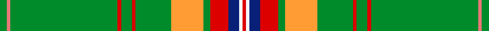

This is one **variant** — a specific cloth: this exact thread count and colourway, with its own
provenance below. It is one weaving of the [sett](/tartans/h/ha/hans-jaswinder/) (the scale-free proportion — the
same cloth at any scale or shade), whose colour order is pattern [GRGRGRGYGRBWR](/stripes/grgrgrgygrbwr/).

Part of the [Hans, Jaswinder](/tartans/h/ha/hans-jaswinder/) tartan — the named design grouping this sett with its other cloths.

Sourced from register-of-tartans.  It is a [13 stripe tartan](/stripes/stripes13/).

Original link [https://www.tartanregister.gov.uk/tartanDetails.aspx?ref=11541](https://www.tartanregister.gov.uk/tartanDetails.aspx?ref=11541)

Dataset <small>— provenance for this record, inherited from the source manifest</small>

<dl class="dataset-prov">
<dt>source</dt><dd><a href="/sources/register-of-tartans/">Scottish Register of Tartans</a></dd>
<dt>data captured from</dt><dd><a href="https://github.com/thetartan/tartan-database/blob/master/data/register-of-tartans/data.csv">https://github.com/thetartan/tartan-database/blob/master/data/register-of-tartans/data.csv</a></dd>
<dt>data date</dt><dd>26/04/2015 <small>(this record)</small></dd>
<dt>licence</dt><dd><a href="https://www.tartanregister.gov.uk/copyright">Crown copyright</a></dd>
</dl>

Capture chain <small>— the hands this data passed through, oldest first; each capture carries its own licence</small>

<ol class="capture-chain">
<li><a href="https://www.tartanregister.gov.uk/">Scottish Register of Tartans</a> · <a href="https://www.tartanregister.gov.uk/copyright">Crown copyright</a> <small>the living register — still published by National Records of Scotland</small></li>
<li><a href="https://github.com/thetartan/tartan-database">thetartan/tartan-database</a> <small>2016-2017</small> · <a href="https://creativecommons.org/licenses/by-nc-nd/4.0/">CC BY-NC-ND 4.0</a> <small>Levko Kravets's frozen compilation — the capture we vendored, and where its CC licence text came from</small></li>
<li>this dictionary <small>captured 2026-06-10 · commit 5bf86c7566</small> <small>each re-capture is a git commit to data/sources</small></li>
</ol>

## Register references

External register numbers recorded for this tartan.

- Scottish Register of Tartans: [11541](https://www.tartanregister.gov.uk/tartanDetails.aspx?ref=11541)

## Thread count
G/4 Ri2 G60 R2 G6 R2 G20 LO18 G4 R10 DB6 W2 R/2

One full sett is **270 threads**.

## Palette
<table><thead><tr><th>Colour</th><th>Shade</th><th>OKLCh</th></tr></thead><tbody><tr><td>DB</td><td><code style="background-color:#082077;">#082077</code> <small style="color:#888">#082077</small></td><td><small style="color:#888">oklch(30.0% 0.149 265.1)</small></td></tr><tr><td>G</td><td><code style="background-color:#008B2A;">#008B2A</code> <small style="color:#888">#008B2A</small></td><td><small style="color:#888">oklch(55.4% 0.170 145.9)</small></td></tr><tr><td>R</td><td><code style="background-color:#E87878;">#E87878</code> <small style="color:#888">#E87878</small></td><td><small style="color:#888">oklch(70.0% 0.139 21.2)</small></td></tr><tr><td>LO</td><td><code style="background-color:#FF9C34;">#FF9C34</code> <small style="color:#888">#FF9C34</small></td><td><small style="color:#888">oklch(77.9% 0.161 61.8)</small></td></tr><tr><td>R</td><td><code style="background-color:#DC0000;">#DC0000</code> <small style="color:#888">#DC0000</small></td><td><small style="color:#888">oklch(56.2% 0.230 29.2)</small></td></tr><tr><td>W</td><td><code style="background-color:#F7F7F7;">#F7F7F7</code> <small style="color:#888">#F7F7F7</small></td><td><small style="color:#888">oklch(97.6% 0.000 89.9)</small></td></tr></tbody></table>

# Sample pattern

[Sample sheet (PDF)](swatch.pdf) — the woven sample, thread count and palette on one printable A4, rendered on demand (the same sheet the TTD print page downloads).

## Nearest tartan variants

The nearest existing variants by ΔTartan distance, with this cloth at the top so the swatches line up against it.

ΔTartan

Threads

Variant

Sett

—

270

<a href="/variants/s13/g2ri1g30r1g3r1g10lo9g2r5db3w1r1~x2~ri6914021-r5623030/">Hans, Jaswinder (Personal)</a>

<a href="/ttd/edit/#slug=g30db6o1w2o6w2o1db6g30lb1dr3~x2&amp;base=g2ri1g30r1g3r1g10lo9g2r5db3w1r1~x2~ri6914021-r5623030" title="compare in the TTD">2.37</a>

286

<a href="/variants/s11/g30db6o1w2o6w2o1db6g30lb1dr3~x2/">Kuehle Hunting (Personal)</a>

<a href="/ttd/edit/#slug=g30db6o1w2o6w2o1db6g30lb1dp3~x2&amp;base=g2ri1g30r1g3r1g10lo9g2r5db3w1r1~x2~ri6914021-r5623030" title="compare in the TTD">2.50</a>

286

<a href="/variants/s11/g30db6o1w2o6w2o1db6g30lb1dp3~x2/">Kuehle Family Hunting (Personal)</a>

<a href="/ttd/edit/#slug=g3db1g2dbi1g3r3g2r2g18db2~x2~dbi2508255-r5221030&amp;base=g2ri1g30r1g3r1g10lo9g2r5db3w1r1~x2~ri6914021-r5623030" title="compare in the TTD">2.65</a>

138

<a href="/variants/s10/g3db1g2dbi1g3r3g2r2g18db2~x2~dbi2508255-r5221030/">Owen (Welsh Name)</a>

<a href="/ttd/edit/#slug=db4g2dp12g4r1g28db3w3r3g48r1g4dp12g2db4y2~x2&amp;base=g2ri1g30r1g3r1g10lo9g2r5db3w1r1~x2~ri6914021-r5623030" title="compare in the TTD">3.22</a>

520

<a href="/variants/s16/db4g2dp12g4r1g28db3w3r3g48r1g4dp12g2db4y2~x2/">Wallenberg, Nicolas (Personal)</a>

<a href="/ttd/edit/#slug=g40dt10o2dt2w2dt3r8g6dt2g4w2~x2&amp;base=g2ri1g30r1g3r1g10lo9g2r5db3w1r1~x2~ri6914021-r5623030" title="compare in the TTD">3.25</a>

240

<a href="/variants/s11/g40dt10o2dt2w2dt3r8g6dt2g4w2~x2/">Cavalier, Green</a>

<a href="/ttd/edit/#slug=g3o2g40dg2g4dg8w1o4g2dy4y4w2~x2&amp;base=g2ri1g30r1g3r1g10lo9g2r5db3w1r1~x2~ri6914021-r5623030" title="compare in the TTD">3.32</a>

294

<a href="/variants/s12/g3o2g40dg2g4dg8w1o4g2dy4y4w2~x2/">Springbok</a>

<a href="/ttd/edit/#slug=g33db2g33r2db12r12g4r2g4w3~x2&amp;base=g2ri1g30r1g3r1g10lo9g2r5db3w1r1~x2~ri6914021-r5623030" title="compare in the TTD">3.41</a>

356

<a href="/variants/s10/g33db2g33r2db12r12g4r2g4w3~x2/">Island Weavers (Corporate)</a>

<a href="/ttd/edit/#slug=b4g44dg5w2dg2g2dg2r2g3b3~x2~g6119141-dg3210147&amp;base=g2ri1g30r1g3r1g10lo9g2r5db3w1r1~x2~ri6914021-r5623030" title="compare in the TTD">3.64</a>

262

<a href="/variants/s10/b4g44dg5w2dg2g2dg2r2g3b3~x2~g6119141-dg3210147/">Oxford University dress</a>

<a href="/ttd/edit/#slug=db6g3lb6g7y2g36y2g7lb6g3db6g3dy6g3r6g7y2g36y2g7r6g3dy6g3~x2&amp;base=g2ri1g30r1g3r1g10lo9g2r5db3w1r1~x2~ri6914021-r5623030" title="compare in the TTD">3.72</a>

678

<a href="/variants/s24/db6g3lb6g7y2g36y2g7lb6g3db6g3dy6g3r6g7y2g36y2g7r6g3dy6g3~x2/">Sea Bees Regimental Tartan</a>

<a href="/ttd/edit/#slug=g56n6ly6y2w2y2w16n10w2g6r3~x2&amp;base=g2ri1g30r1g3r1g10lo9g2r5db3w1r1~x2~ri6914021-r5623030" title="compare in the TTD">3.77</a>

326

<a href="/variants/s11/g56n6ly6y2w2y2w16n10w2g6r3~x2/">McAleavy (2014)</a>

## Neighbour map

Every grey dot is one of 13662 variants placed by the first two principal components of the ΔTartan feature space (42% of its variance). Red is this tartan; blue dots are its nearest — click one to open its page. The map is a flat projection of a many-dimensional space — [how to read it](/posts/neighbourhood-maps/).

<svg viewBox="0 0 640 380" role="img" style="max-width:100%;height:auto;border:1px solid #e0e0e0;border-radius:4px;display:block" xmlns="http://www.w3.org/2000/svg"><image href="/nn/cloud.v1.png" width="640" height="380"/><a href="/variants/s11/g30db6o1w2o6w2o1db6g30lb1dr3~x2/"><circle cx="400.5" cy="104.1" r="4" fill="#3465a4"><title>Kuehle Hunting (Personal)</title></circle></a><a href="/variants/s11/g30db6o1w2o6w2o1db6g30lb1dp3~x2/"><circle cx="398.8" cy="103.5" r="4" fill="#3465a4"><title>Kuehle Family Hunting (Personal)</title></circle></a><a href="/variants/s10/g3db1g2dbi1g3r3g2r2g18db2~x2~dbi2508255-r5221030/"><circle cx="491.5" cy="153.8" r="4" fill="#3465a4"><title>Owen (Welsh Name)</title></circle></a><a href="/variants/s16/db4g2dp12g4r1g28db3w3r3g48r1g4dp12g2db4y2~x2/"><circle cx="388.5" cy="57.3" r="4" fill="#3465a4"><title>Wallenberg, Nicolas (Personal)</title></circle></a><a href="/variants/s11/g40dt10o2dt2w2dt3r8g6dt2g4w2~x2/"><circle cx="366.3" cy="123.1" r="4" fill="#3465a4"><title>Cavalier, Green</title></circle></a><a href="/variants/s12/g3o2g40dg2g4dg8w1o4g2dy4y4w2~x2/"><circle cx="425.6" cy="88.4" r="4" fill="#3465a4"><title>Springbok</title></circle></a><a href="/variants/s10/g33db2g33r2db12r12g4r2g4w3~x2/"><circle cx="407.7" cy="161.8" r="4" fill="#3465a4"><title>Island Weavers (Corporate)</title></circle></a><a href="/variants/s10/b4g44dg5w2dg2g2dg2r2g3b3~x2~g6119141-dg3210147/"><circle cx="457.5" cy="115.2" r="4" fill="#3465a4"><title>Oxford University dress</title></circle></a><a href="/variants/s24/db6g3lb6g7y2g36y2g7lb6g3db6g3dy6g3r6g7y2g36y2g7r6g3dy6g3~x2/"><circle cx="370.9" cy="101.2" r="4" fill="#3465a4"><title>Sea Bees Regimental Tartan</title></circle></a><a href="/variants/s11/g56n6ly6y2w2y2w16n10w2g6r3~x2/"><circle cx="318.1" cy="97.2" r="4" fill="#3465a4"><title>McAleavy (2014)</title></circle></a><circle cx="406.9" cy="87.7" r="5" fill="#c00000"/><text x="320" y="376" text-anchor="middle" font-size="11" fill="#999">ground</text><text x="11" y="190" text-anchor="middle" font-size="11" fill="#999" transform="rotate(-90 11 190)">complexity</text></svg>

ID: /variants/s13/g2ri1g30r1g3r1g10lo9g2r5db3w1r1~x2~ri6914021-r5623030/
