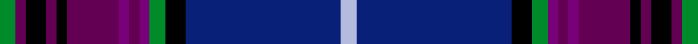

This page is one **sett** — a single exact thread-count. It belongs to the [tartan](/setts/g3dp2k4dp2k2dp10dpi2dp2dpi2g3k4db30lb3/)
(the same proportion at any scale), whose colour order is pattern [GBKBKBBBBGKBW](/stripes/gbkbkbbbbgkbw/).

Sourced from tartans-authority.  It is a [13 stripe tartan](/stripes/stripes13/).

Original link http://www.tartansauthority.com/tartan-ferret/display/4131/

## Register references

External register numbers recorded for this tartan.

- Scottish Tartans Authority (ITI): 4131

## Thread count
G/6 DP4 K8 DP4 K4 DP20 DPi4 DP4 DPi4 G6 K8 DB60 LB/6

One full sett is **264 threads**.

## Palette
<table><thead><tr><th>Colour</th><th>Shade</th><th>OKLCh</th></tr></thead><tbody><tr><td>B</td><td><code style="background-color:#B5BBDE;">#B5BBDE</code> <small style="color:#888">#B5BBDE</small></td><td><small style="color:#888">oklch(79.9% 0.050 277.6)</small></td></tr><tr><td>DB</td><td><code style="background-color:#082077;">#082077</code> <small style="color:#888">#082077</small></td><td><small style="color:#888">oklch(30.0% 0.149 265.1)</small></td></tr><tr><td>G</td><td><code style="background-color:#008B2A;">#008B2A</code> <small style="color:#888">#008B2A</small></td><td><small style="color:#888">oklch(55.4% 0.170 145.9)</small></td></tr><tr><td>K</td><td><code style="background-color:#000000;">#000000</code> <small style="color:#888">#000000</small></td><td><small style="color:#888">oklch(0.0% 0.000 0.0)</small></td></tr><tr><td>P</td><td><code style="background-color:#780078;">#780078</code> <small style="color:#888">#780078</small></td><td><small style="color:#888">oklch(40.2% 0.185 328.4)</small></td></tr><tr><td>Pa</td><td><code style="background-color:#640054;">#640054</code> <small style="color:#888">#640054</small></td><td><small style="color:#888">oklch(34.3% 0.151 337.0)</small></td></tr></tbody></table>

# Sample pattern

ID: /variants/s13/g3dp2k4dp2k2dp10dpi2dp2dpi2g3k4db30lb3~x2~dp1406341-dpi1607327/
