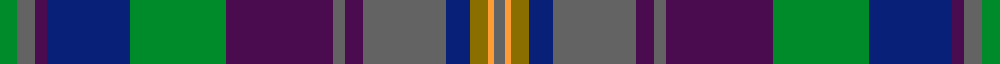
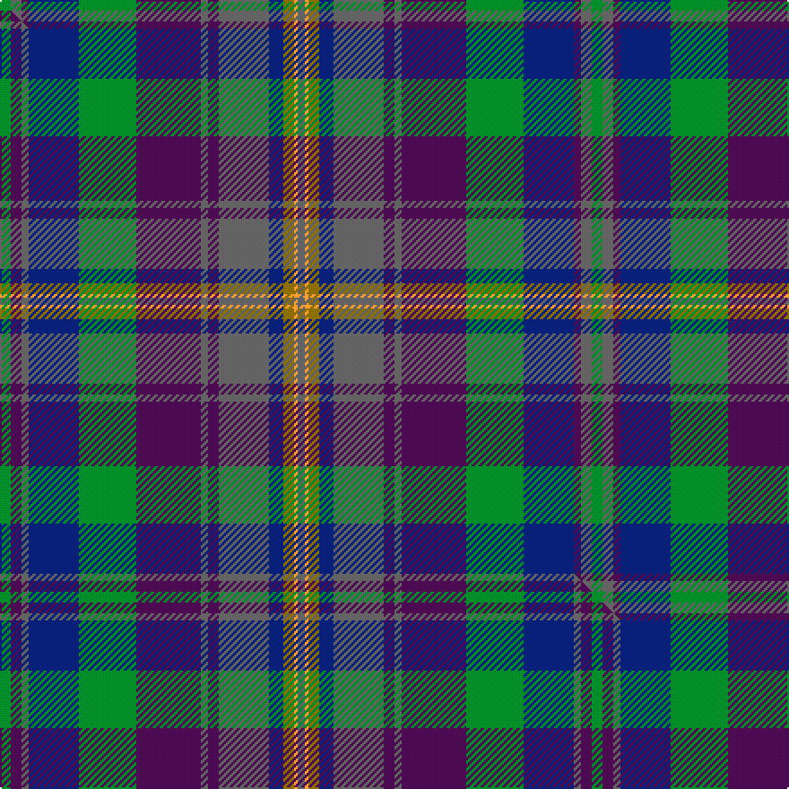

This page is one **sett** — a single exact thread-count. It belongs to the [tartan](/setts/g3n3dp2db14g16dp18n2dp3n14db4y3lo1n2/)
(the same proportion at any scale), whose colour order is pattern [BYGBBBBBGBBBG](/stripes/bygbbbbbgbbbg/).

Part of the [ENABLE Scotland](/tartans/enable-scotland/) tartan — the named design grouping this sett with its other cloths.

Sourced from tartans-authority.  It is a [13 stripe tartan](/stripes/stripes13/).

Original link http://www.tartansauthority.com/tartan-ferret/display/11177/

## Register references

External register numbers recorded for this tartan.

- Scottish Register of Tartans: [11177](https://www.tartanregister.gov.uk/tartanDetails?ref=11177)
- Scottish Tartans Authority (ITI): 11177

## Thread count
G/6 N6 DP4 DB28 G32 DP36 N4 DP6 N28 DB8 Y6 LO2 N/4

One full sett is **330 threads**.

## Palette
<table><thead><tr><th>Colour</th><th>Shade</th><th>OKLCh</th></tr></thead><tbody><tr><td>DB</td><td><code style="background-color:#082077;">#082077</code> <small style="color:#888">#082077</small></td><td><small style="color:#888">oklch(30.0% 0.149 265.1)</small></td></tr><tr><td>DP</td><td><code style="background-color:#4B0B4F;">#4B0B4F</code> <small style="color:#888">#4B0B4F</small></td><td><small style="color:#888">oklch(30.1% 0.125 325.4)</small></td></tr><tr><td>G</td><td><code style="background-color:#008B2A;">#008B2A</code> <small style="color:#888">#008B2A</small></td><td><small style="color:#888">oklch(55.4% 0.170 145.9)</small></td></tr><tr><td>N</td><td><code style="background-color:#636363;">#636363</code> <small style="color:#888">#636363</small></td><td><small style="color:#888">oklch(50.0% 0.000 89.9)</small></td></tr><tr><td>LO</td><td><code style="background-color:#FF9C34;">#FF9C34</code> <small style="color:#888">#FF9C34</small></td><td><small style="color:#888">oklch(77.9% 0.161 61.8)</small></td></tr><tr><td>Y</td><td><code style="background-color:#8B6E00;">#8B6E00</code> <small style="color:#888">#8B6E00</small></td><td><small style="color:#888">oklch(55.1% 0.113 90.4)</small></td></tr></tbody></table>

# Sample pattern

## Compared to the master

This cloth is one sett of its design; the master sett (the exemplar the design is anchored on) is below for comparison.

Its **ΔTartan distance** from the master is **0.10** — the same measure the nearest-tartans table ranks by (0 is identical; a re-scale of the same cloth is near 0, a recolour or a different proportion further).

<figure class="master-compare" style="margin:0">

this sett
master sett ★

<figcaption style="color:#888;font-size:smaller">One weave of this sett against the <a href="/setts/g3dp3n2db14g16dp18n2dp3n14db4y3lo1n2/">master sett ★</a>, split on the diagonal: a shared proportion runs seamlessly across it with only the shades shifting; a different proportion breaks on it.</figcaption>
</figure>

## Nearest tartan variants

The nearest existing variants by ΔTartan distance, with this cloth at the top so the swatches line up against it.

ΔTartan

Threads

Variant

Sett

—

330

<a href="/variants/s13/g3n3dp2db14g16dp18n2dp3n14db4y3lo1n2~x2/">ENABLE Scotland</a>

<a href="/ttd/edit/#slug=g3dp3n2db14g16dp18n2dp3n14db4y3lo1n2~x2&amp;base=g3n3dp2db14g16dp18n2dp3n14db4y3lo1n2~x2" title="compare in the TTD">2.05</a>

330

<a href="/variants/s13/g3dp3n2db14g16dp18n2dp3n14db4y3lo1n2~x2/">ENABLE Scotland</a>

## Neighbour map

Every grey dot is one of 13620 variants placed by the first two principal components of the ΔTartan feature space (42% of its variance). Red is this tartan; blue dots are its nearest — click one to open its page.

<svg viewBox="0 0 640 380" role="img" style="max-width:100%;height:auto;border:1px solid #e0e0e0;border-radius:4px;display:block" xmlns="http://www.w3.org/2000/svg"><image href="/nn/cloud.v1.png" width="640" height="380"/><a href="/variants/s13/g3dp3n2db14g16dp18n2dp3n14db4y3lo1n2~x2/"><circle cx="204.9" cy="166.5" r="4" fill="#3465a4"><title>ENABLE Scotland</title></circle></a><circle cx="202.0" cy="167.3" r="5" fill="#c00000"/><text x="320" y="376" text-anchor="middle" font-size="11" fill="#999">ground</text><text x="11" y="190" text-anchor="middle" font-size="11" fill="#999" transform="rotate(-90 11 190)">complexity</text></svg>

ID: /variants/s13/g3n3dp2db14g16dp18n2dp3n14db4y3lo1n2~x2/
