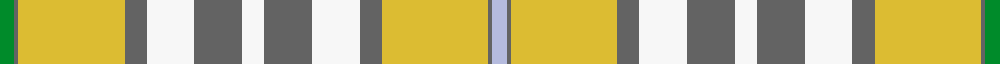

This is one **variant** — a specific cloth: this exact thread count and colourway, with its own
provenance below. It is one weaving of the [sett](/tartans/d/de/delta-dental-association/) (the scale-free proportion — the
same cloth at any scale or shade), whose colour order is pattern [GBYBWBWBWBYBW](/stripes/gbybwbwbwbybw/).

Part of the [Delta Dental Association](/tartans/d/de/delta-dental-association/) tartan — the named design grouping this sett with its other cloths.

Sourced from register-of-tartans.  It is a [13 stripe tartan](/stripes/stripes13/).

Original link [https://www.tartanregister.gov.uk/tartanDetails.aspx?ref=10527](https://www.tartanregister.gov.uk/tartanDetails.aspx?ref=10527)

2 attestations — the source records this cloth was collapsed from (oldest owns this page)

<ul>
<li>05/12/2011 — Delta Dental Association (register-of-tartans, <a href="https://www.tartanregister.gov.uk/tartanDetails.aspx?ref=10527">record</a>)  <em>Features accents of green and blue, the corporate colours of the Delta Dental Association.</em></li>
<li>5th Dec. 2011 — Delta Dental Association (Corporate) (tartans-authority, <a href="https://web.archive.org/web/*/http://www.tartansauthority.com/tartan-ferret/display/10527/*">record</a>)  <em>Features accents of green and blue, the corporate colours of the Delta Dental Association. Only by permission of Janet Helm or Delta Dental Association.</em></li>
</ul>

Dataset <small>— provenance for this record, inherited from the source manifest</small>

<dl class="dataset-prov">
<dt>source</dt><dd><a href="/sources/register-of-tartans/">Scottish Register of Tartans</a></dd>
<dt>data captured from</dt><dd><a href="https://github.com/thetartan/tartan-database/blob/master/data/register-of-tartans/data.csv">https://github.com/thetartan/tartan-database/blob/master/data/register-of-tartans/data.csv</a></dd>
<dt>data date</dt><dd>05/12/2011 <small>(this record)</small></dd>
<dt>licence</dt><dd><a href="https://www.tartanregister.gov.uk/copyright">Crown copyright</a></dd>
</dl>

Capture chain <small>— the hands this data passed through, oldest first; each capture carries its own licence</small>

<ol class="capture-chain">
<li><a href="https://www.tartanregister.gov.uk/">Scottish Register of Tartans</a> · <a href="https://www.tartanregister.gov.uk/copyright">Crown copyright</a> <small>the living register — still published by National Records of Scotland</small></li>
<li><a href="https://github.com/thetartan/tartan-database">thetartan/tartan-database</a> <small>2016-2017</small> · <a href="https://creativecommons.org/licenses/by-nc-nd/4.0/">CC BY-NC-ND 4.0</a> <small>Levko Kravets's frozen compilation — the capture we vendored, and where its CC licence text came from</small></li>
<li>this dictionary <small>captured 2026-06-10 · commit 5bf86c7566</small> <small>each re-capture is a git commit to data/sources</small></li>
</ol>

## Register references

External register numbers recorded for this tartan.

- Scottish Register of Tartans: [10527](https://www.tartanregister.gov.uk/tartanDetails?ref=10527)
- Scottish Tartans Authority (ITI): 10527

## Thread count
G/8 N2 LY58 N12 W26 N26 W12 N26 W26 N12 LY58 N2 LB/8

One full sett is **536 threads**.

## Palette
<table><thead><tr><th>Colour</th><th>Shade</th><th>OKLCh</th></tr></thead><tbody><tr><td>G</td><td><code style="background-color:#008B2A;">#008B2A</code> <small style="color:#888">#008B2A</small></td><td><small style="color:#888">oklch(55.4% 0.170 145.9)</small></td></tr><tr><td>LB</td><td><code style="background-color:#B5BBDE;">#B5BBDE</code> <small style="color:#888">#B5BBDE</small></td><td><small style="color:#888">oklch(79.9% 0.050 277.6)</small></td></tr><tr><td>LY</td><td><code style="background-color:#DCBC32;">#DCBC32</code> <small style="color:#888">#DCBC32</small></td><td><small style="color:#888">oklch(80.0% 0.150 95.2)</small></td></tr><tr><td>N</td><td><code style="background-color:#636363;">#636363</code> <small style="color:#888">#636363</small></td><td><small style="color:#888">oklch(50.0% 0.000 89.9)</small></td></tr><tr><td>W</td><td><code style="background-color:#F7F7F7;">#F7F7F7</code> <small style="color:#888">#F7F7F7</small></td><td><small style="color:#888">oklch(97.6% 0.000 89.9)</small></td></tr></tbody></table>

# Sample pattern

[Sample sheet (PDF)](swatch.pdf) — the woven sample, thread count and palette on one printable A4, rendered on demand (the same sheet the TTD print page downloads).

## Nearest tartan variants

The nearest existing variants by ΔTartan distance, with this cloth at the top so the swatches line up against it.

ΔTartan

Threads

Variant

Sett

—

536

<a href="/variants/s13/g4n1ly29n6w13n13w6n13w13n6ly29n1lb4~x2/">Delta Dental Association</a>

<a href="/ttd/edit/#slug=n6db2n1w17n1db2n16ly27g2~x2&amp;base=g4n1ly29n6w13n13w6n13w13n6ly29n1lb4~x2" title="compare in the TTD">2.91</a>

280

<a href="/variants/s9/n6db2n1w17n1db2n16ly27g2~x2/">Rutlin (Personal)</a>

<a href="/ttd/edit/#slug=y10lo5y54lo2w32ly54t4ly10&amp;base=g4n1ly29n6w13n13w6n13w13n6ly29n1lb4~x2" title="compare in the TTD">3.36</a>

322

<a href="/variants/s8/y10lo5y54lo2w32ly54t4ly10/">Cladish</a>

<a href="/ttd/edit/#slug=w12ly1dy1lo1ly22lo1dy6ly4dy3ly2lo12ly2~x4&amp;base=g4n1ly29n6w13n13w6n13w13n6ly29n1lb4~x2" title="compare in the TTD">3.52</a>

480

<a href="/variants/s12/w12ly1dy1lo1ly22lo1dy6ly4dy3ly2lo12ly2~x4/">Wcwm 969-2</a>

<a href="/ttd/edit/#slug=lb16dg5lo20lbi3dg3lbi3lo4g14lo2lbi2r1~x2~lb8007237-lbi82&amp;base=g4n1ly29n6w13n13w6n13w13n6ly29n1lb4~x2" title="compare in the TTD">3.69</a>

258

<a href="/variants/s11/lb16dg5lo20lbi3dg3lbi3lo4g14lo2lbi2r1~x2~lb8007237-lbi82/">Bouguet, Adrian Dress (Personal)</a>

<a href="/ttd/edit/#slug=ly35w4ly3y7ly3w4ly7do15n4w36n5~x2&amp;base=g4n1ly29n6w13n13w6n13w13n6ly29n1lb4~x2" title="compare in the TTD">3.71</a>

412

<a href="/variants/s11/ly35w4ly3y7ly3w4ly7do15n4w36n5~x2/">MacKellar Dress (Reproduction colours)</a>

<a href="/ttd/edit/#slug=dy8g1w6dy8w3dy4g1w8g1dy6ly20w29dy3w7ly7~x2&amp;base=g4n1ly29n6w13n13w6n13w13n6ly29n1lb4~x2" title="compare in the TTD">3.93</a>

418

<a href="/variants/s15/dy8g1w6dy8w3dy4g1w8g1dy6ly20w29dy3w7ly7~x2/">Isle of Skye (Fashion)</a>

<a href="/ttd/edit/#slug=lb30db1w4n10y18~x2&amp;base=g4n1ly29n6w13n13w6n13w13n6ly29n1lb4~x2" title="compare in the TTD">3.96</a>

156

<a href="/variants/s5/lb30db1w4n10y18~x2/">Alloway Primary School (Ayr)</a>

## Neighbour map

Every grey dot is one of 13662 variants placed by the first two principal components of the ΔTartan feature space (42% of its variance). Red is this tartan; blue dots are its nearest — click one to open its page. The map is a flat projection of a many-dimensional space — [how to read it](/posts/neighbourhood-maps/).

<svg viewBox="0 0 640 380" role="img" style="max-width:100%;height:auto;border:1px solid #e0e0e0;border-radius:4px;display:block" xmlns="http://www.w3.org/2000/svg"><image href="/nn/cloud.v1.png" width="640" height="380"/><a href="/variants/s9/n6db2n1w17n1db2n16ly27g2~x2/"><circle cx="244.8" cy="150.7" r="4" fill="#3465a4"><title>Rutlin (Personal)</title></circle></a><a href="/variants/s8/y10lo5y54lo2w32ly54t4ly10/"><circle cx="301.7" cy="180.4" r="4" fill="#3465a4"><title>Cladish</title></circle></a><a href="/variants/s12/w12ly1dy1lo1ly22lo1dy6ly4dy3ly2lo12ly2~x4/"><circle cx="303.9" cy="161.2" r="4" fill="#3465a4"><title>Wcwm 969-2</title></circle></a><a href="/variants/s11/lb16dg5lo20lbi3dg3lbi3lo4g14lo2lbi2r1~x2~lb8007237-lbi82/"><circle cx="189.4" cy="147.5" r="4" fill="#3465a4"><title>Bouguet, Adrian Dress (Personal)</title></circle></a><a href="/variants/s11/ly35w4ly3y7ly3w4ly7do15n4w36n5~x2/"><circle cx="225.3" cy="174.5" r="4" fill="#3465a4"><title>MacKellar Dress (Reproduction colours)</title></circle></a><a href="/variants/s15/dy8g1w6dy8w3dy4g1w8g1dy6ly20w29dy3w7ly7~x2/"><circle cx="266.0" cy="135.0" r="4" fill="#3465a4"><title>Isle of Skye (Fashion)</title></circle></a><a href="/variants/s5/lb30db1w4n10y18~x2/"><circle cx="281.2" cy="172.0" r="4" fill="#3465a4"><title>Alloway Primary School (Ayr)</title></circle></a><circle cx="269.2" cy="158.8" r="5" fill="#c00000"/><text x="320" y="376" text-anchor="middle" font-size="11" fill="#999">ground</text><text x="11" y="190" text-anchor="middle" font-size="11" fill="#999" transform="rotate(-90 11 190)">complexity</text></svg>

ID: /variants/s13/g4n1ly29n6w13n13w6n13w13n6ly29n1lb4~x2/
