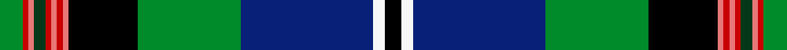

This is one **variant** — a specific cloth: this exact thread count and colourway, with its own
provenance below. It is one weaving of the [sett](/tartans/s/st/st-andrews-grand/) (the scale-free proportion — the
same cloth at any scale or shade), whose colour order is pattern [GRRGRRRRKGBWK](/stripes/grrgrrrrkgbwk/).

Part of the [St. Andrews Grand](/tartans/s/st/st-andrews-grand/) tartan — the named design grouping this sett with its other cloths.

Sourced from tartans-authority.  It is a [13 stripe tartan](/stripes/stripes13/).

Original link <code>http://www.tartansauthority.com/tartan-ferret/display/6743/</code> — retired · [Internet Archive copy](https://web.archive.org/web/*/http://www.tartansauthority.com/tartan-ferret/display/6743/*)

2 attestations — the source records this cloth was collapsed from (oldest owns this page)

<ul>
<li>pre 2005 — St. Andrews Grand (Fashion) (tartans-authority, <a href="https://web.archive.org/web/*/http://www.tartansauthority.com/tartan-ferret/display/6743/*">record</a>)  <em>Designed by Geoffrey (Tailor) Highland Crafts of Edinburgh - purpose not known. The colours are said to represent Scotland, St. Andrews golf and its surroundings!</em></li>
<li>undated — St. Andrews Grand (register-of-tartans, <a href="https://www.tartanregister.gov.uk/tartanDetails.aspx?ref=4995">record</a>)  <em>Designed by Geoffrey (Tailor) Highland Crafts of Edinburgh - purpose not known. The colours are said to represent Scotland, St. Andrews golf and its surroundings!</em></li>
</ul>

Dataset <small>— provenance for this record, inherited from the source manifest</small>

<dl class="dataset-prov">
<dt>source</dt><dd><a href="/sources/tartans-authority/">Scottish Tartans Authority</a></dd>
<dt>data captured from</dt><dd><a href="https://github.com/thetartan/tartan-database/blob/master/data/tartans-authority/data.csv">https://github.com/thetartan/tartan-database/blob/master/data/tartans-authority/data.csv</a></dd>
<dt>data date</dt><dd>pre 2005 <small>(this record)</small></dd>
<dt>licence</dt><dd><a href="https://creativecommons.org/licenses/by-nc-nd/4.0/">CC BY-NC-ND 4.0</a></dd>
</dl>

Capture chain <small>— the hands this data passed through, oldest first; each capture carries its own licence</small>

<ol class="capture-chain">
<li><a href="https://www.tartansauthority.com/">Scottish Tartans Authority</a> <small>the heritage body’s archive — its tartan-ferret record browser is retired; dead record links are shown unlinked, with an Internet Archive copy (ITI numbers are not SRT references)</small></li>
<li><a href="https://github.com/thetartan/tartan-database">thetartan/tartan-database</a> <small>2016-2017</small> · <a href="https://creativecommons.org/licenses/by-nc-nd/4.0/">CC BY-NC-ND 4.0</a> <small>Levko Kravets's frozen compilation — the capture we vendored, and where its CC licence text came from</small></li>
<li>this dictionary <small>captured 2026-06-10 · commit 5bf86c7566</small> <small>each re-capture is a git commit to data/sources</small></li>
</ol>

## Register references

External register numbers recorded for this tartan.

- Scottish Register of Tartans: [4995](https://www.tartanregister.gov.uk/tartanDetails.aspx?ref=4995)
- Scottish Tartans Authority (ITI): 6743
- Scottish Tartans World Register: 3063

## Thread count
G/8 R2 Ri2 DG4 R2 Ri2 R2 Ri2 K24 G36 DB46 W4 K/6

One full sett is **266 threads**.

## Palette
<table><thead><tr><th>Colour</th><th>Shade</th><th>OKLCh</th></tr></thead><tbody><tr><td>DB</td><td><code style="background-color:#082077;">#082077</code> <small style="color:#888">#082077</small></td><td><small style="color:#888">oklch(30.0% 0.149 265.1)</small></td></tr><tr><td>DG</td><td><code style="background-color:#053819;">#053819</code> <small style="color:#888">#053819</small></td><td><small style="color:#888">oklch(30.0% 0.075 151.3)</small></td></tr><tr><td>G</td><td><code style="background-color:#008B2A;">#008B2A</code> <small style="color:#888">#008B2A</small></td><td><small style="color:#888">oklch(55.4% 0.170 145.9)</small></td></tr><tr><td>K</td><td><code style="background-color:#000000;">#000000</code> <small style="color:#888">#000000</small></td><td><small style="color:#888">oklch(0.0% 0.000 0.0)</small></td></tr><tr><td>R</td><td><code style="background-color:#E87878;">#E87878</code> <small style="color:#888">#E87878</small></td><td><small style="color:#888">oklch(70.0% 0.139 21.2)</small></td></tr><tr><td>R</td><td><code style="background-color:#C80000;">#C80000</code> <small style="color:#888">#C80000</small></td><td><small style="color:#888">oklch(52.3% 0.215 29.2)</small></td></tr><tr><td>W</td><td><code style="background-color:#F7F7F7;">#F7F7F7</code> <small style="color:#888">#F7F7F7</small></td><td><small style="color:#888">oklch(97.6% 0.000 89.9)</small></td></tr></tbody></table>

# Sample pattern

## Nearest tartan variants

The nearest existing variants by ΔTartan distance, with this cloth at the top so the swatches line up against it.

ΔTartan

Threads

Variant

Sett

—

266

<a href="/variants/s13/g4r1ri1dg2r1ri1r1ri1k12g18db23w2k3~x2~r2109032-ri2806019/">St. Andrews Grand (Fashion)</a>

<a href="/ttd/edit/#slug=b2db18y4k5y1k1w1k2g8k1r3w1~x4&amp;base=g4r1ri1dg2r1ri1r1ri1k12g18db23w2k3~x2~r2109032-ri2806019" title="compare in the TTD">1.90</a>

364

<a href="/variants/s12/b2db18y4k5y1k1w1k2g8k1r3w1~x4/">Bethune</a>

<a href="/ttd/edit/#slug=w3db3r1db3r1db15r1db2g15y1g2k20y1k2y2~x2&amp;base=g4r1ri1dg2r1ri1r1ri1k12g18db23w2k3~x2~r2109032-ri2806019" title="compare in the TTD">2.15</a>

278

<a href="/variants/s15/w3db3r1db3r1db15r1db2g15y1g2k20y1k2y2~x2/">Joseph Linn Family (Monohon 2012) (Personal)</a>

<a href="/ttd/edit/#slug=w3db3r1db3r1db15r1db2g15ly1g2k20ly1k2ly2~x2&amp;base=g4r1ri1dg2r1ri1r1ri1k12g18db23w2k3~x2~r2109032-ri2806019" title="compare in the TTD">2.21</a>

278

<a href="/variants/s15/w3db3r1db3r1db15r1db2g15ly1g2k20ly1k2ly2~x2/">Linn (Personal)</a>

<a href="/ttd/edit/#slug=w3db3k1db3k1db15k1db2g15y1g2k20y1k2y2~x2&amp;base=g4r1ri1dg2r1ri1r1ri1k12g18db23w2k3~x2~r2109032-ri2806019" title="compare in the TTD">2.27</a>

278

<a href="/variants/s15/w3db3k1db3k1db15k1db2g15y1g2k20y1k2y2~x2/">Joseph Linn Family (Monohon) Name Tartan</a>

<a href="/ttd/edit/#slug=db7k1r3k1db24k1w3k3dg3k3dg3g19k2w4~x2&amp;base=g4r1ri1dg2r1ri1r1ri1k12g18db23w2k3~x2~r2109032-ri2806019" title="compare in the TTD">2.43</a>

286

<a href="/variants/s14/db7k1r3k1db24k1w3k3dg3k3dg3g19k2w4~x2/">Strathclyde, University of</a>

<a href="/ttd/edit/#slug=db7k1r3k1db24k1w3k3g3k3g3dg19k2w4~x2~g1903114-dg1806142&amp;base=g4r1ri1dg2r1ri1r1ri1k12g18db23w2k3~x2~r2109032-ri2806019" title="compare in the TTD">2.44</a>

286

<a href="/variants/s14/db7k1r3k1db24k1w3k3g3k3g3dg19k2w4~x2~g1903114-dg1806142/">Strathclyde, University of Corporate Tartan</a>

<a href="/ttd/edit/#slug=w3db5lt2db9dp10k2dp5k5dg9g31w2~x2&amp;base=g4r1ri1dg2r1ri1r1ri1k12g18db23w2k3~x2~r2109032-ri2806019" title="compare in the TTD">2.65</a>

322

<a href="/variants/s11/w3db5lt2db9dp10k2dp5k5dg9g31w2~x2/">Carnegie of Skibo Corporate Tartan</a>

<a href="/ttd/edit/#slug=db12k1g1k1g1k1db9dr2k18dr2g9k1lo1k1lb1k1g12~x2&amp;base=g4r1ri1dg2r1ri1r1ri1k12g18db23w2k3~x2~r2109032-ri2806019" title="compare in the TTD">2.66</a>

248

<a href="/variants/s17/db12k1g1k1g1k1db9dr2k18dr2g9k1lo1k1lb1k1g12~x2/">Nicolson Green Hunting</a>

<a href="/ttd/edit/#slug=g4y2g24dr2k12db3k2db2k2db12w1db1w3~x2&amp;base=g4r1ri1dg2r1ri1r1ri1k12g18db23w2k3~x2~r2109032-ri2806019" title="compare in the TTD">2.69</a>

266

<a href="/variants/s13/g4y2g24dr2k12db3k2db2k2db12w1db1w3~x2/">Baron of Greencastle (Personal)</a>

<a href="/ttd/edit/#slug=db38w2db2k10g2dy2g22k3r3k3r3~x2&amp;base=g4r1ri1dg2r1ri1r1ri1k12g18db23w2k3~x2~r2109032-ri2806019" title="compare in the TTD">2.71</a>

278

<a href="/variants/s11/db38w2db2k10g2dy2g22k3r3k3r3~x2/">Hunnisett/Edinchip (Personal)</a>

## Neighbour map

Every grey dot is one of 13657 variants placed by the first two principal components of the ΔTartan feature space (42% of its variance). Red is this tartan; blue dots are its nearest — click one to open its page. The map is a flat projection of a many-dimensional space — [how to read it](/posts/neighbourhood-maps/).

<svg viewBox="0 0 640 380" role="img" style="max-width:100%;height:auto;border:1px solid #e0e0e0;border-radius:4px;display:block" xmlns="http://www.w3.org/2000/svg"><image href="/nn/cloud.v1.png" width="640" height="380"/><a href="/variants/s12/b2db18y4k5y1k1w1k2g8k1r3w1~x4/"><circle cx="114.0" cy="79.4" r="4" fill="#3465a4"><title>Bethune</title></circle></a><a href="/variants/s15/w3db3r1db3r1db15r1db2g15y1g2k20y1k2y2~x2/"><circle cx="115.1" cy="77.4" r="4" fill="#3465a4"><title>Joseph Linn Family (Monohon 2012) (Personal)</title></circle></a><a href="/variants/s15/w3db3r1db3r1db15r1db2g15ly1g2k20ly1k2ly2~x2/"><circle cx="112.3" cy="77.4" r="4" fill="#3465a4"><title>Linn (Personal)</title></circle></a><a href="/variants/s15/w3db3k1db3k1db15k1db2g15y1g2k20y1k2y2~x2/"><circle cx="115.7" cy="78.5" r="4" fill="#3465a4"><title>Joseph Linn Family (Monohon) Name Tartan</title></circle></a><a href="/variants/s14/db7k1r3k1db24k1w3k3dg3k3dg3g19k2w4~x2/"><circle cx="143.2" cy="73.3" r="4" fill="#3465a4"><title>Strathclyde, University of</title></circle></a><a href="/variants/s14/db7k1r3k1db24k1w3k3g3k3g3dg19k2w4~x2~g1903114-dg1806142/"><circle cx="149.5" cy="74.3" r="4" fill="#3465a4"><title>Strathclyde, University of Corporate Tartan</title></circle></a><a href="/variants/s11/w3db5lt2db9dp10k2dp5k5dg9g31w2~x2/"><circle cx="104.6" cy="105.0" r="4" fill="#3465a4"><title>Carnegie of Skibo Corporate Tartan</title></circle></a><a href="/variants/s17/db12k1g1k1g1k1db9dr2k18dr2g9k1lo1k1lb1k1g12~x2/"><circle cx="124.0" cy="83.0" r="4" fill="#3465a4"><title>Nicolson Green Hunting</title></circle></a><a href="/variants/s13/g4y2g24dr2k12db3k2db2k2db12w1db1w3~x2/"><circle cx="154.2" cy="83.2" r="4" fill="#3465a4"><title>Baron of Greencastle (Personal)</title></circle></a><a href="/variants/s11/db38w2db2k10g2dy2g22k3r3k3r3~x2/"><circle cx="121.2" cy="63.4" r="4" fill="#3465a4"><title>Hunnisett/Edinchip (Personal)</title></circle></a><circle cx="112.2" cy="61.5" r="5" fill="#c00000"/><text x="320" y="376" text-anchor="middle" font-size="11" fill="#999">ground</text><text x="11" y="190" text-anchor="middle" font-size="11" fill="#999" transform="rotate(-90 11 190)">complexity</text></svg>

ID: /variants/s13/g4r1ri1dg2r1ri1r1ri1k12g18db23w2k3~x2~r2109032-ri2806019/
