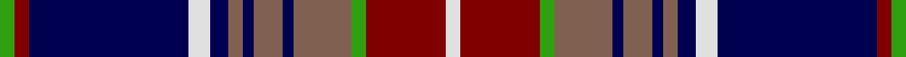

This page is one **sett** — a single exact thread-count. It belongs to the [tartan](/setts/g4r4db44w6db5o4db3o8db3o16g4r22w4/)
(the same proportion at any scale), whose colour order is pattern [GRBWBRBRBRGRW](/stripes/grbwbrbrbrgrw/).

Part of the [Largs](/tartans/largs/) tartan — the named design grouping this sett with its other cloths.

Sourced from weddslist.  It is a [13 stripe tartan](/stripes/stripes13/).

Original link http://www.weddslist.com/cgi-bin/tartans/pg.pl?source=sts

## Thread count
G/4 DR4 DB44 LN6 DB5 LT4 DB3 LT8 DB3 LT16 G4 DR22 LN/4

One full sett is **246 threads**.

## Palette

Palette: <strong>Tartan Dictionary</strong> <small style="color:#888">(1 of 5 colours)</small>
<table><thead><tr><th>Colour</th><th>Threads</th><th>Shade</th><th>Base</th><th>OKLCh</th></tr></thead><tbody><tr><td>G/</td><td style="text-align:right;font-variant-numeric:tabular-nums">4</td><td><code style="background-color:#30A010;">#30A010</code> <small style="color:#888">#30A010</small></td><td>G <code style="background-color:#006100;">#006100</code></td><td><small style="color:#888">oklch(61.9% 0.195 140.5)</small></td></tr><tr><td>DR</td><td style="text-align:right;font-variant-numeric:tabular-nums">4</td><td><code style="background-color:#800000;">#800000</code> <small style="color:#888">#800000</small></td><td>R <code style="background-color:#CC0000;">#CC0000</code></td><td><small style="color:#888">oklch(37.7% 0.155 29.2)</small></td></tr><tr><td>DB</td><td style="text-align:right;font-variant-numeric:tabular-nums">44</td><td><code style="background-color:#000050;">#000050</code> <small style="color:#888">#000050</small></td><td>B <code style="background-color:#2A418A;">#2A418A</code></td><td><small style="color:#888">oklch(19.5% 0.135 264.1)</small></td></tr><tr><td>LN</td><td style="text-align:right;font-variant-numeric:tabular-nums">6</td><td><code style="background-color:#E0E0E0;">#E0E0E0</code> <small style="color:#888">#E0E0E0</small></td><td>W <code style="background-color:#F7F7F7;">#F7F7F7</code></td><td><small style="color:#888">oklch(90.7% 0.000 89.9)</small></td></tr><tr><td>DB</td><td style="text-align:right;font-variant-numeric:tabular-nums">5</td><td><code style="background-color:#000050;">#000050</code> <small style="color:#888">#000050</small></td><td>B <code style="background-color:#2A418A;">#2A418A</code></td><td><small style="color:#888">oklch(19.5% 0.135 264.1)</small></td></tr><tr><td>LT</td><td style="text-align:right;font-variant-numeric:tabular-nums">4</td><td><code style="background-color:#806050;">#806050</code> <small style="color:#888">#806050</small></td><td>R <code style="background-color:#CC0000;">#CC0000</code></td><td><small style="color:#888">oklch(51.7% 0.049 47.8)</small></td></tr><tr><td>DB</td><td style="text-align:right;font-variant-numeric:tabular-nums">3</td><td><code style="background-color:#000050;">#000050</code> <small style="color:#888">#000050</small></td><td>B <code style="background-color:#2A418A;">#2A418A</code></td><td><small style="color:#888">oklch(19.5% 0.135 264.1)</small></td></tr><tr><td>LT</td><td style="text-align:right;font-variant-numeric:tabular-nums">8</td><td><code style="background-color:#806050;">#806050</code> <small style="color:#888">#806050</small></td><td>R <code style="background-color:#CC0000;">#CC0000</code></td><td><small style="color:#888">oklch(51.7% 0.049 47.8)</small></td></tr><tr><td>DB</td><td style="text-align:right;font-variant-numeric:tabular-nums">3</td><td><code style="background-color:#000050;">#000050</code> <small style="color:#888">#000050</small></td><td>B <code style="background-color:#2A418A;">#2A418A</code></td><td><small style="color:#888">oklch(19.5% 0.135 264.1)</small></td></tr><tr><td>LT</td><td style="text-align:right;font-variant-numeric:tabular-nums">16</td><td><code style="background-color:#806050;">#806050</code> <small style="color:#888">#806050</small></td><td>R <code style="background-color:#CC0000;">#CC0000</code></td><td><small style="color:#888">oklch(51.7% 0.049 47.8)</small></td></tr><tr><td>G</td><td style="text-align:right;font-variant-numeric:tabular-nums">4</td><td><code style="background-color:#30A010;">#30A010</code> <small style="color:#888">#30A010</small></td><td>G <code style="background-color:#006100;">#006100</code></td><td><small style="color:#888">oklch(61.9% 0.195 140.5)</small></td></tr><tr><td>DR</td><td style="text-align:right;font-variant-numeric:tabular-nums">22</td><td><code style="background-color:#800000;">#800000</code> <small style="color:#888">#800000</small></td><td>R <code style="background-color:#CC0000;">#CC0000</code></td><td><small style="color:#888">oklch(37.7% 0.155 29.2)</small></td></tr><tr><td>LN/</td><td style="text-align:right;font-variant-numeric:tabular-nums">4</td><td><code style="background-color:#E0E0E0;">#E0E0E0</code> <small style="color:#888">#E0E0E0</small></td><td>W <code style="background-color:#F7F7F7;">#F7F7F7</code></td><td><small style="color:#888">oklch(90.7% 0.000 89.9)</small></td></tr></tbody></table>

## Compared to the master

This cloth is one sett of its design; the master sett (the exemplar the design is anchored on) is below for comparison.

<figure style="margin:0"><figcaption style="color:#888;font-size:smaller">this sett</figcaption></figure>
<figure style="margin:0"><figcaption style="color:#888;font-size:smaller"><a href="/setts/db4r4db44w6db5o4db3o8db3o16db4r24w4/">master sett →</a></figcaption></figure>

## Nearest tartans

The nearest existing variants by ΔTartan distance, with this tartan at the top so the swatches line up against it.

ΔTartan

Tartan

Sett

—

<a href="/ttd/edit/#slug=g4r4db44w6db5o4db3o8db3o16g4r22w4">Largs</a> <a class="nn-out" href="/variants/s13/g4r4db44w6db5o4db3o8db3o16g4r22w4/" title="open its dictionary page">↗</a>

0.60

<a href="/ttd/edit/#slug=o14k2db3k1ly2k1db3k14db3k1w1~x2&amp;base=g4r4db44w6db5o4db3o8db3o16g4r22w4">McGuffey (School)</a> <a class="nn-out" href="/variants/s11/o14k2db3k1ly2k1db3k14db3k1w1~x2/" title="open its dictionary page">↗</a>

0.80

<a href="/ttd/edit/#slug=r1db1r8w1k2db16k2w1g8db1g1~x2&amp;base=g4r4db44w6db5o4db3o8db3o16g4r22w4">MacMichael</a> <a class="nn-out" href="/variants/s11/r1db1r8w1k2db16k2w1g8db1g1~x2/" title="open its dictionary page">↗</a>

0.81

<a href="/ttd/edit/#slug=r2db6lr2db2k9y30k9db5lr4db2r2~x2&amp;base=g4r4db44w6db5o4db3o8db3o16g4r22w4">Rangers Dress (Sports)</a> <a class="nn-out" href="/variants/s11/r2db6lr2db2k9y30k9db5lr4db2r2~x2/" title="open its dictionary page">↗</a>

0.82

<a href="/ttd/edit/#slug=w4k2b9k3bi3k3bi3k25dg10k2bi6w2~x2&amp;base=g4r4db44w6db5o4db3o8db3o16g4r22w4">Auld Lang Syne Blue Fashion Tartan</a> <a class="nn-out" href="/variants/s12/w4k2b9k3bi3k3bi3k25dg10k2bi6w2~x2/" title="open its dictionary page">↗</a>

0.86

<a href="/ttd/edit/#slug=w4k2n9k3dp3k3dp3k23g10k2dp6w2~x2&amp;base=g4r4db44w6db5o4db3o8db3o16g4r22w4">Auld Lang Syne, Blue (Fashion)</a> <a class="nn-out" href="/variants/s12/w4k2n9k3dp3k3dp3k23g10k2dp6w2~x2/" title="open its dictionary page">↗</a>

0.87

<a href="/ttd/edit/#slug=w4k2b9k3m3k3m3k23g10k2m6w2~x2&amp;base=g4r4db44w6db5o4db3o8db3o16g4r22w4">Auld Lang Syne Blue</a> <a class="nn-out" href="/variants/s12/w4k2b9k3m3k3m3k23g10k2m6w2~x2/" title="open its dictionary page">↗</a>

0.95

<a href="/ttd/edit/#slug=r1db1r8lb1k2db16k2lb1g8db1g1~x4&amp;base=g4r4db44w6db5o4db3o8db3o16g4r22w4">MacMichael</a> <a class="nn-out" href="/variants/s11/r1db1r8lb1k2db16k2lb1g8db1g1~x4/" title="open its dictionary page">↗</a>

1.02

<a href="/ttd/edit/#slug=db14k2g3k2g3k2db12r4db10r3db10r4lb28r4~x2&amp;base=g4r4db44w6db5o4db3o8db3o16g4r22w4">Wcwm 1138</a> <a class="nn-out" href="/variants/s14/db14k2g3k2g3k2db12r4db10r3db10r4lb28r4~x2/" title="open its dictionary page">↗</a>

1.09

<a href="/ttd/edit/#slug=k4r1k12w1r4w1dg4w1m4dg12k1w2~x2&amp;base=g4r4db44w6db5o4db3o8db3o16g4r22w4">Glenfalloch</a> <a class="nn-out" href="/variants/s12/k4r1k12w1r4w1dg4w1m4dg12k1w2~x2/" title="open its dictionary page">↗</a>

1.11

<a href="/ttd/edit/#slug=r3t7k1r2k1t12k4w3k2r1k1r1db3r2db4r2~x2&amp;base=g4r4db44w6db5o4db3o8db3o16g4r22w4">Royal Canadian Air Force #2</a> <a class="nn-out" href="/variants/s16/r3t7k1r2k1t12k4w3k2r1k1r1db3r2db4r2~x2/" title="open its dictionary page">↗</a>

## Neighbour map

Every grey dot is one of 14360 variants placed by the first two principal components of the ΔTartan feature space (44% of its variance). Red is this tartan; blue dots are its nearest — click one to open its page.

<svg viewBox="0 0 640 380" role="img" style="max-width:100%;height:auto;border:1px solid #e0e0e0;border-radius:4px;display:block" xmlns="http://www.w3.org/2000/svg"><image href="/nn/cloud.v1.png" width="640" height="380"/><a href="/variants/s11/o14k2db3k1ly2k1db3k14db3k1w1~x2/"><circle cx="209.6" cy="129.9" r="4" fill="#3465a4"><title>McGuffey (School)</title></circle></a><a href="/variants/s11/r1db1r8w1k2db16k2w1g8db1g1~x2/"><circle cx="210.8" cy="118.1" r="4" fill="#3465a4"><title>MacMichael</title></circle></a><a href="/variants/s11/r2db6lr2db2k9y30k9db5lr4db2r2~x2/"><circle cx="196.9" cy="125.4" r="4" fill="#3465a4"><title>Rangers Dress (Sports)</title></circle></a><a href="/variants/s12/w4k2b9k3bi3k3bi3k25dg10k2bi6w2~x2/"><circle cx="206.7" cy="136.5" r="4" fill="#3465a4"><title>Auld Lang Syne Blue Fashion Tartan</title></circle></a><a href="/variants/s12/w4k2n9k3dp3k3dp3k23g10k2dp6w2~x2/"><circle cx="205.2" cy="147.9" r="4" fill="#3465a4"><title>Auld Lang Syne, Blue (Fashion)</title></circle></a><a href="/variants/s12/w4k2b9k3m3k3m3k23g10k2m6w2~x2/"><circle cx="187.0" cy="138.6" r="4" fill="#3465a4"><title>Auld Lang Syne Blue</title></circle></a><a href="/variants/s11/r1db1r8lb1k2db16k2lb1g8db1g1~x4/"><circle cx="232.6" cy="133.6" r="4" fill="#3465a4"><title>MacMichael</title></circle></a><a href="/variants/s14/db14k2g3k2g3k2db12r4db10r3db10r4lb28r4~x2/"><circle cx="191.6" cy="123.5" r="4" fill="#3465a4"><title>Wcwm 1138</title></circle></a><a href="/variants/s12/k4r1k12w1r4w1dg4w1m4dg12k1w2~x2/"><circle cx="147.7" cy="139.5" r="4" fill="#3465a4"><title>Glenfalloch</title></circle></a><a href="/variants/s16/r3t7k1r2k1t12k4w3k2r1k1r1db3r2db4r2~x2/"><circle cx="149.7" cy="133.2" r="4" fill="#3465a4"><title>Royal Canadian Air Force #2</title></circle></a><circle cx="200.8" cy="118.4" r="5" fill="#c00000"/></svg>

ID: /variants/s13/g4r4db44w6db5o4db3o8db3o16g4r22w4/
