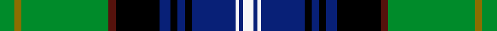

This page is one **sett** — a single exact thread-count. It belongs to the [tartan](/setts/g4y2g24dr2k12db3k2db2k2db12w1db1w3/)
(the same proportion at any scale), whose colour order is pattern [GGGBKBKBKBWBW](/stripes/gggbkbkbkbwbw/).

Sourced from register-of-tartans.  It is a [13 stripe tartan](/stripes/stripes13/).

Original link https://www.tartanregister.gov.uk/tartanDetails.aspx?ref=220

2 attestations — the source records this cloth was collapsed from (oldest owns this page)

<ul>
<li>01/08/2002 — Baron of Greencastle (Personal) (register-of-tartans, <a href="https://www.tartanregister.gov.uk/tartanDetails.aspx?ref=220">record</a>)  <em>The three Baron of Greencastle tartans were designed by Stephen de Albergaria of Paris and celebrate his Sutherland forebears. His father was John Elliot Sutherland, his great-grandfather was John Duffus Sutherland and his great-great-grandfather was John Sinclair Sutherland. Through his mother, Stephen has taken as a surname the 12th century name of Albergaria from Portugal. He has arms matriculated in Scotland and Spain. His full name is Stephen Teixeira de Albergaria, Baron of Greencastle.</em></li>
<li>pre 2005 — Baron of Greencastle (Personal) (tartans-authority, <a href="http://www.tartansauthority.com/tartan-ferret/display/6196/">record</a>)  <em>The three Baron of Greencastle tartans (6196, 6667, 6668) were designed by Stepehen de Albergaria of Paris and celebrate his Sutherland forebears. His father was John Elliot Sutherland, his g-grandfather John Duffus Sutherland and his g-g-grandfather John Sinclair Sutherland. His mother carried the ancient XIIth century noble family name from Portugal of Albergaria which Stephen has adopted as a family surname. He also has arms matriculated in Scotland and Spain. His full name is Stephen Teixeira de Albergaria Baron of Greencastle. Tartan obtained via Niall Hamilton.</em></li>
</ul>

## Register references

External register numbers recorded for this tartan.

- Scottish Register of Tartans: [220](https://www.tartanregister.gov.uk/tartanDetails.aspx?ref=220)
- Scottish Tartans Authority (ITI): 6196
- Scottish Tartans World Register: 2912

## Thread count
G/8 Y4 G48 DR4 K24 DB6 K4 DB4 K4 DB24 W2 DB2 W/6

One full sett is **266 threads**.

## Palette
<table><thead><tr><th>Colour</th><th>Shade</th><th>OKLCh</th></tr></thead><tbody><tr><td>DB</td><td><code style="background-color:#082077;">#082077</code> <small style="color:#888">#082077</small></td><td><small style="color:#888">oklch(30.0% 0.149 265.1)</small></td></tr><tr><td>DR</td><td><code style="background-color:#55120C;">#55120C</code> <small style="color:#888">#55120C</small></td><td><small style="color:#888">oklch(30.0% 0.099 29.3)</small></td></tr><tr><td>G</td><td><code style="background-color:#008B2A;">#008B2A</code> <small style="color:#888">#008B2A</small></td><td><small style="color:#888">oklch(55.4% 0.170 145.9)</small></td></tr><tr><td>K</td><td><code style="background-color:#000000;">#000000</code> <small style="color:#888">#000000</small></td><td><small style="color:#888">oklch(0.0% 0.000 0.0)</small></td></tr><tr><td>LO</td><td><code style="background-color:#FF9C34;">#FF9C34</code> <small style="color:#888">#FF9C34</small></td><td><small style="color:#888">oklch(77.9% 0.161 61.8)</small></td></tr><tr><td>R</td><td><code style="background-color:#D60020;">#D60020</code> <small style="color:#888">#D60020</small></td><td><small style="color:#888">oklch(55.2% 0.224 25.5)</small></td></tr><tr><td>W</td><td><code style="background-color:#F7F7F7;">#F7F7F7</code> <small style="color:#888">#F7F7F7</small></td><td><small style="color:#888">oklch(97.6% 0.000 89.9)</small></td></tr><tr><td>Y</td><td><code style="background-color:#8B6E00;">#8B6E00</code> <small style="color:#888">#8B6E00</small></td><td><small style="color:#888">oklch(55.1% 0.113 90.4)</small></td></tr></tbody></table>

# Sample pattern

## Nearest tartan variants

The nearest existing variants by ΔTartan distance, with this cloth at the top so the swatches line up against it.

ΔTartan

Threads

Variant

Sett

—

266

<a href="/variants/s13/g4y2g24dr2k12db3k2db2k2db12w1db1w3~x2/">Baron of Greencastle (Personal)</a>

<a href="/ttd/edit/#slug=g18dr1g2dr2g16dr1k16n1k2dr2b20dr1w2~x4&amp;base=g4y2g24dr2k12db3k2db2k2db12w1db1w3~x2" title="compare in the TTD">1.14</a>

592

<a href="/variants/s13/g18dr1g2dr2g16dr1k16n1k2dr2b20dr1w2~x4/">Canadian Estate</a>

<a href="/ttd/edit/#slug=g6w2g24k12db3k2db2k2db12r1db1r3~x2&amp;base=g4y2g24dr2k12db3k2db2k2db12w1db1w3~x2" title="compare in the TTD">1.28</a>

262

<a href="/variants/s12/g6w2g24k12db3k2db2k2db12r1db1r3~x2/">Sutherland (Clan)</a>

<a href="/ttd/edit/#slug=g6w2g24k12db3k2db2k2db12r1db1r3&amp;base=g4y2g24dr2k12db3k2db2k2db12w1db1w3~x2" title="compare in the TTD">1.28</a>

131

<a href="/variants/s12/g6w2g24k12db3k2db2k2db12r1db1r3/">Sutherland</a>

<a href="/ttd/edit/#slug=g6w2g24k12db3k2db2k2db12r1db1r3~x2~w4000000-db1406275&amp;base=g4y2g24dr2k12db3k2db2k2db12w1db1w3~x2" title="compare in the TTD">1.28</a>

262

<a href="/variants/s12/g6w2g24k12db3k2db2k2db12r1db1r3~x2~w4000000-db1406275/">Sutherland</a>

<a href="/ttd/edit/#slug=db4w2db24k3db3k3db8k24g48k3g3r2~x2&amp;base=g4y2g24dr2k12db3k2db2k2db12w1db1w3~x2" title="compare in the TTD">1.82</a>

496

<a href="/variants/s12/db4w2db24k3db3k3db8k24g48k3g3r2~x2/">Urquhart (White Line)</a>

<a href="/ttd/edit/#slug=db4w2db24k3db3k3db8k24g48k3g3r2&amp;base=g4y2g24dr2k12db3k2db2k2db12w1db1w3~x2" title="compare in the TTD">1.82</a>

248

<a href="/variants/s12/db4w2db24k3db3k3db8k24g48k3g3r2/">Urquhart, White Line</a>

<a href="/ttd/edit/#slug=db2w1db12k1db2k1db4k12g24k1g2r1~x2&amp;base=g4y2g24dr2k12db3k2db2k2db12w1db1w3~x2" title="compare in the TTD">1.82</a>

246

<a href="/variants/s12/db2w1db12k1db2k1db4k12g24k1g2r1~x2/">Urquhart</a>

<a href="/ttd/edit/#slug=y4k1g10r2g10r4g10r2g10k16db28k1b4~x2&amp;base=g4y2g24dr2k12db3k2db2k2db12w1db1w3~x2" title="compare in the TTD">1.94</a>

392

<a href="/variants/s13/y4k1g10r2g10r4g10r2g10k16db28k1b4~x2/">California</a>

<a href="/ttd/edit/#slug=db7k1r3k1db24k1w3k3dg3k3dg3g19k2w4~x2&amp;base=g4y2g24dr2k12db3k2db2k2db12w1db1w3~x2" title="compare in the TTD">2.01</a>

286

<a href="/variants/s14/db7k1r3k1db24k1w3k3dg3k3dg3g19k2w4~x2/">Strathclyde, University of</a>

<a href="/ttd/edit/#slug=g30dp4r6w6db6dp3k14w14db50g50w2&amp;base=g4y2g24dr2k12db3k2db2k2db12w1db1w3~x2" title="compare in the TTD">2.06</a>

338

<a href="/variants/s11/g30dp4r6w6db6dp3k14w14db50g50w2/">Brehat (Personal)</a>

## Neighbour map

Every grey dot is one of 13620 variants placed by the first two principal components of the ΔTartan feature space (42% of its variance). Red is this tartan; blue dots are its nearest — click one to open its page.

<svg viewBox="0 0 640 380" role="img" style="max-width:100%;height:auto;border:1px solid #e0e0e0;border-radius:4px;display:block" xmlns="http://www.w3.org/2000/svg"><image href="/nn/cloud.v1.png" width="640" height="380"/><a href="/variants/s13/g18dr1g2dr2g16dr1k16n1k2dr2b20dr1w2~x4/"><circle cx="164.1" cy="94.4" r="4" fill="#3465a4"><title>Canadian Estate</title></circle></a><a href="/variants/s12/g6w2g24k12db3k2db2k2db12r1db1r3~x2/"><circle cx="188.0" cy="102.6" r="4" fill="#3465a4"><title>Sutherland (Clan)</title></circle></a><a href="/variants/s12/g6w2g24k12db3k2db2k2db12r1db1r3/"><circle cx="188.0" cy="102.6" r="4" fill="#3465a4"><title>Sutherland</title></circle></a><a href="/variants/s12/g6w2g24k12db3k2db2k2db12r1db1r3~x2~w4000000-db1406275/"><circle cx="171.3" cy="77.8" r="4" fill="#3465a4"><title>Sutherland</title></circle></a><a href="/variants/s12/db4w2db24k3db3k3db8k24g48k3g3r2~x2/"><circle cx="193.9" cy="93.6" r="4" fill="#3465a4"><title>Urquhart (White Line)</title></circle></a><a href="/variants/s12/db4w2db24k3db3k3db8k24g48k3g3r2/"><circle cx="193.9" cy="93.6" r="4" fill="#3465a4"><title>Urquhart, White Line</title></circle></a><a href="/variants/s12/db2w1db12k1db2k1db4k12g24k1g2r1~x2/"><circle cx="200.5" cy="93.1" r="4" fill="#3465a4"><title>Urquhart</title></circle></a><a href="/variants/s13/y4k1g10r2g10r4g10r2g10k16db28k1b4~x2/"><circle cx="148.7" cy="96.9" r="4" fill="#3465a4"><title>California</title></circle></a><a href="/variants/s14/db7k1r3k1db24k1w3k3dg3k3dg3g19k2w4~x2/"><circle cx="143.5" cy="73.2" r="4" fill="#3465a4"><title>Strathclyde, University of</title></circle></a><a href="/variants/s11/g30dp4r6w6db6dp3k14w14db50g50w2/"><circle cx="170.6" cy="100.8" r="4" fill="#3465a4"><title>Brehat (Personal)</title></circle></a><circle cx="154.5" cy="83.2" r="5" fill="#c00000"/><text x="320" y="376" text-anchor="middle" font-size="11" fill="#999">ground</text><text x="11" y="190" text-anchor="middle" font-size="11" fill="#999" transform="rotate(-90 11 190)">complexity</text></svg>

ID: /variants/s13/g4y2g24dr2k12db3k2db2k2db12w1db1w3~x2/
