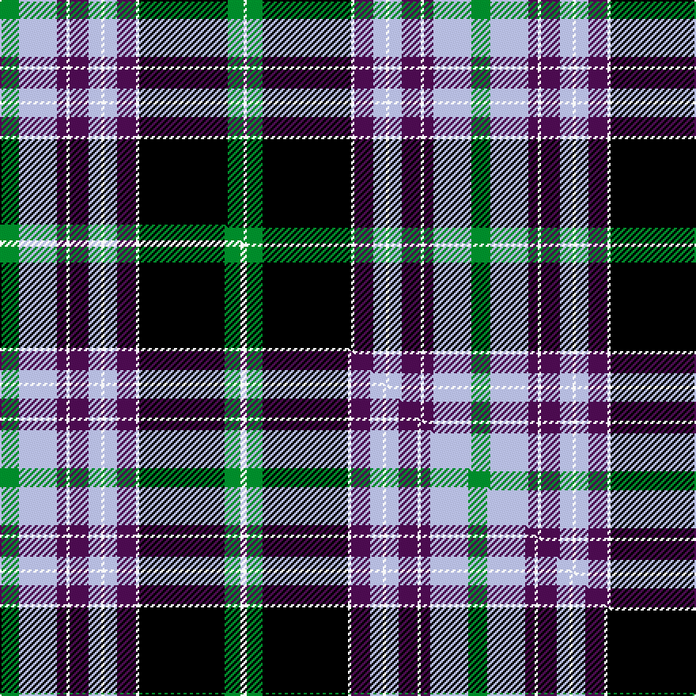

This page is one **sett** — a single exact thread-count. It belongs to the [tartan](/setts/g6lb12dp3w1dp6lb4w1lb4dp6w1k28g5w1/)
(the same proportion at any scale), whose colour order is pattern [GWBWBWWWBWKGW](/stripes/gwbwbwwwbwkgw/).

Part of the [Willox](/tartans/willox/) tartan — the named design grouping this sett with its other cloths.

Sourced from tartans-authority.  It is a [13 stripe tartan](/stripes/stripes13/).

Original link http://www.tartansauthority.com/tartan-ferret/display/4233/

## Register references

External register numbers recorded for this tartan.

- Scottish Tartans Authority (ITI): 4233

## Thread count
G/12 LB24 DP6 W2 DP12 LB8 W2 LB8 DP12 W2 K56 G10 W/2

One full sett is **298 threads**.

## Palette
<table><thead><tr><th>Colour</th><th>Shade</th><th>OKLCh</th></tr></thead><tbody><tr><td>G</td><td><code style="background-color:#008B2A;">#008B2A</code> <small style="color:#888">#008B2A</small></td><td><small style="color:#888">oklch(55.4% 0.170 145.9)</small></td></tr><tr><td>K</td><td><code style="background-color:#000000;">#000000</code> <small style="color:#888">#000000</small></td><td><small style="color:#888">oklch(0.0% 0.000 0.0)</small></td></tr><tr><td>LB</td><td><code style="background-color:#B5BBDE;">#B5BBDE</code> <small style="color:#888">#B5BBDE</small></td><td><small style="color:#888">oklch(79.9% 0.050 277.6)</small></td></tr><tr><td>DP</td><td><code style="background-color:#4B0B4F;">#4B0B4F</code> <small style="color:#888">#4B0B4F</small></td><td><small style="color:#888">oklch(30.1% 0.125 325.4)</small></td></tr><tr><td>W</td><td><code style="background-color:#F7F7F7;">#F7F7F7</code> <small style="color:#888">#F7F7F7</small></td><td><small style="color:#888">oklch(97.6% 0.000 89.9)</small></td></tr></tbody></table>

# Sample pattern

## Compared to the master

This cloth is one sett of its design; the master sett (the exemplar the design is anchored on) is below for comparison.

Its **ΔTartan distance** from the master is **0.06** — the same measure the nearest-tartans table ranks by (0 is identical; a re-scale of the same cloth is near 0, a recolour or a different proportion further).

<figure class="master-compare" style="margin:0">

this sett
master sett ★

<figcaption style="color:#888;font-size:smaller">One weave of this sett against the <a href="/setts/g6lb12dp3w1dp6lb4w1lb4dp6w1k27g5w2/">master sett ★</a>, split on the diagonal: a shared proportion runs seamlessly across it with only the shades shifting; a different proportion breaks on it.</figcaption>
</figure>

## Nearest tartan variants

The nearest existing variants by ΔTartan distance, with this cloth at the top so the swatches line up against it.

ΔTartan

Threads

Variant

Sett

—

298

<a href="/variants/s13/g6lb12dp3w1dp6lb4w1lb4dp6w1k28g5w1~x2/">Willox (Name)</a>

<a href="/ttd/edit/#slug=g6lb12dp3w1dp6lb4w1lb4dp6w1k27g5w2~x2&amp;base=g6lb12dp3w1dp6lb4w1lb4dp6w1k28g5w1~x2" title="compare in the TTD">0.06</a>

296

<a href="/variants/s13/g6lb12dp3w1dp6lb4w1lb4dp6w1k27g5w2~x2/">Willox</a>

<a href="/ttd/edit/#slug=db20r2db3r6db32r2k32w2g30r6g4r2g4w1~x2&amp;base=g6lb12dp3w1dp6lb4w1lb4dp6w1k28g5w1~x2" title="compare in the TTD">1.91</a>

542

<a href="/variants/s14/db20r2db3r6db32r2k32w2g30r6g4r2g4w1~x2/">MacDonald of Clanranald #4</a>

<a href="/ttd/edit/#slug=lb4r2lb3g1lb1g2lb18r1k12dg21lb1k3dg1k2dg4r2~x2&amp;base=g6lb12dp3w1dp6lb4w1lb4dp6w1k28g5w1~x2" title="compare in the TTD">1.99</a>

300

<a href="/variants/s16/lb4r2lb3g1lb1g2lb18r1k12dg21lb1k3dg1k2dg4r2~x2/">Munster</a>

<a href="/ttd/edit/#slug=r26k2r6k2r6k20w2db44w2k6g64k3&amp;base=g6lb12dp3w1dp6lb4w1lb4dp6w1k28g5w1~x2" title="compare in the TTD">2.10</a>

337

<a href="/variants/s12/r26k2r6k2r6k20w2db44w2k6g64k3/">Jardine, dress</a>

<a href="/ttd/edit/#slug=r5k20n1k2n1k2n2k2n5o2n2o2n2o3n2o10w3~x2~n1900000-o2500000&amp;base=g6lb12dp3w1dp6lb4w1lb4dp6w1k28g5w1~x2" title="compare in the TTD">2.25</a>

248

<a href="/variants/s17/r5k20n1k2n1k2n2k2n5o2n2o2n2o3n2o10w3~x2~n1900000-o2500000/">Nike Golf Dark (Corporate)</a>

<a href="/ttd/edit/#slug=db8lb3db40r3k44lb3r3g40r2k4r7~x2&amp;base=g6lb12dp3w1dp6lb4w1lb4dp6w1k28g5w1~x2" title="compare in the TTD">2.40</a>

598

<a href="/variants/s11/db8lb3db40r3k44lb3r3g40r2k4r7~x2/">Lochaber Cameron</a>

<a href="/ttd/edit/#slug=dr4db12k18db4y22lb1y2lb2y3lb2~x4&amp;base=g6lb12dp3w1dp6lb4w1lb4dp6w1k28g5w1~x2" title="compare in the TTD">2.40</a>

536

<a href="/variants/s10/dr4db12k18db4y22lb1y2lb2y3lb2~x4/">Windsor</a>

<a href="/ttd/edit/#slug=w4db20k1g2k1g2k4g1w2g1k4g16dp8g1~x2&amp;base=g6lb12dp3w1dp6lb4w1lb4dp6w1k28g5w1~x2" title="compare in the TTD">2.42</a>

258

<a href="/variants/s14/w4db20k1g2k1g2k4g1w2g1k4g16dp8g1~x2/">St Andrew</a>

<a href="/ttd/edit/#slug=db17dr6y2dr6k2w2k2w10k1w2k1y3~x2&amp;base=g6lb12dp3w1dp6lb4w1lb4dp6w1k28g5w1~x2" title="compare in the TTD">2.47</a>

176

<a href="/variants/s12/db17dr6y2dr6k2w2k2w10k1w2k1y3~x2/">Chieftain, The</a>

<a href="/ttd/edit/#slug=dr4k1db8k1ly3k2db4ly6db4w3k2db20k4dr21k1ly3~x2&amp;base=g6lb12dp3w1dp6lb4w1lb4dp6w1k28g5w1~x2" title="compare in the TTD">2.48</a>

334

<a href="/variants/s16/dr4k1db8k1ly3k2db4ly6db4w3k2db20k4dr21k1ly3~x2/">Westmeath County Crest (Fashion)</a>

## Neighbour map

Every grey dot is one of 13620 variants placed by the first two principal components of the ΔTartan feature space (42% of its variance). Red is this tartan; blue dots are its nearest — click one to open its page.

<svg viewBox="0 0 640 380" role="img" style="max-width:100%;height:auto;border:1px solid #e0e0e0;border-radius:4px;display:block" xmlns="http://www.w3.org/2000/svg"><image href="/nn/cloud.v1.png" width="640" height="380"/><a href="/variants/s13/g6lb12dp3w1dp6lb4w1lb4dp6w1k27g5w2~x2/"><circle cx="131.2" cy="88.3" r="4" fill="#3465a4"><title>Willox</title></circle></a><a href="/variants/s14/db20r2db3r6db32r2k32w2g30r6g4r2g4w1~x2/"><circle cx="168.6" cy="82.4" r="4" fill="#3465a4"><title>MacDonald of Clanranald #4</title></circle></a><a href="/variants/s16/lb4r2lb3g1lb1g2lb18r1k12dg21lb1k3dg1k2dg4r2~x2/"><circle cx="140.7" cy="82.8" r="4" fill="#3465a4"><title>Munster</title></circle></a><a href="/variants/s12/r26k2r6k2r6k20w2db44w2k6g64k3/"><circle cx="160.5" cy="78.9" r="4" fill="#3465a4"><title>Jardine, dress</title></circle></a><a href="/variants/s17/r5k20n1k2n1k2n2k2n5o2n2o2n2o3n2o10w3~x2~n1900000-o2500000/"><circle cx="151.8" cy="83.7" r="4" fill="#3465a4"><title>Nike Golf Dark (Corporate)</title></circle></a><a href="/variants/s11/db8lb3db40r3k44lb3r3g40r2k4r7~x2/"><circle cx="136.4" cy="103.7" r="4" fill="#3465a4"><title>Lochaber Cameron</title></circle></a><a href="/variants/s10/dr4db12k18db4y22lb1y2lb2y3lb2~x4/"><circle cx="171.5" cy="118.8" r="4" fill="#3465a4"><title>Windsor</title></circle></a><a href="/variants/s14/w4db20k1g2k1g2k4g1w2g1k4g16dp8g1~x2/"><circle cx="135.2" cy="98.6" r="4" fill="#3465a4"><title>St Andrew</title></circle></a><a href="/variants/s12/db17dr6y2dr6k2w2k2w10k1w2k1y3~x2/"><circle cx="104.1" cy="116.3" r="4" fill="#3465a4"><title>Chieftain, The</title></circle></a><a href="/variants/s16/dr4k1db8k1ly3k2db4ly6db4w3k2db20k4dr21k1ly3~x2/"><circle cx="177.7" cy="95.4" r="4" fill="#3465a4"><title>Westmeath County Crest (Fashion)</title></circle></a><circle cx="141.6" cy="83.6" r="5" fill="#c00000"/><text x="320" y="376" text-anchor="middle" font-size="11" fill="#999">ground</text><text x="11" y="190" text-anchor="middle" font-size="11" fill="#999" transform="rotate(-90 11 190)">complexity</text></svg>

ID: /variants/s13/g6lb12dp3w1dp6lb4w1lb4dp6w1k28g5w1~x2/
