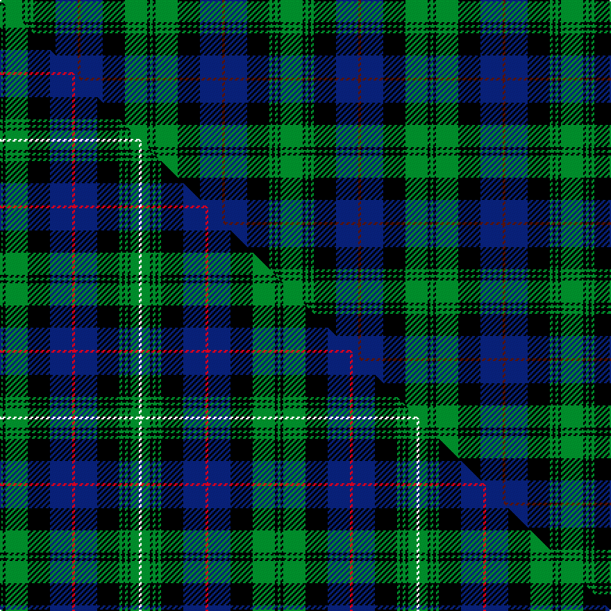

This page is one **sett** — a single exact thread-count. It belongs to the [tartan](/setts/g8k1g1k1g1k8db8dr1db8k8g8k1g1/)
(the same proportion at any scale), whose colour order is pattern [GKGKBBBKGKGKG](/stripes/gkgkbbbkgkgkg/).

Part of the [Urquhart](/tartans/urquhart/) tartan — the named design grouping this sett with its other cloths.

Sourced from register-of-tartans.  It is a [13 stripe tartan](/stripes/stripes13/).

Original link [https://www.tartanregister.gov.uk/tartanDetails.aspx?ref=4433](https://www.tartanregister.gov.uk/tartanDetails.aspx?ref=4433)

Dataset <small>— provenance for this record, inherited from the source manifest</small>

<dl class="dataset-prov">
<dt>source</dt><dd><a href="/sources/register-of-tartans/">Scottish Register of Tartans</a></dd>
<dt>data captured from</dt><dd><a href="https://github.com/thetartan/tartan-database/blob/master/data/register-of-tartans/data.csv">https://github.com/thetartan/tartan-database/blob/master/data/register-of-tartans/data.csv</a></dd>
<dt>data date</dt><dd>1831 <small>(this record)</small></dd>
<dt>licence</dt><dd><a href="https://www.tartanregister.gov.uk/copyright">Crown copyright</a></dd>
</dl>

Capture chain <small>— the hands this data passed through, oldest first; each capture carries its own licence</small>

<ol class="capture-chain">
<li><a href="https://www.tartanregister.gov.uk/">Scottish Register of Tartans</a> · <a href="https://www.tartanregister.gov.uk/copyright">Crown copyright</a> <small>the living register — still published by National Records of Scotland</small></li>
<li><a href="https://github.com/thetartan/tartan-database">thetartan/tartan-database</a> <small>2016-2017</small> · <a href="https://creativecommons.org/licenses/by-nc-nd/4.0/">CC BY-NC-ND 4.0</a> <small>Levko Kravets's frozen compilation — the capture we vendored, and where its CC licence text came from</small></li>
<li>this dictionary <small>captured 2026-06-10 · commit 5bf86c7566</small> <small>each re-capture is a git commit to data/sources</small></li>
</ol>

## Register references

External register numbers recorded for this tartan.

- Scottish Register of Tartans: [4433](https://www.tartanregister.gov.uk/tartanDetails.aspx?ref=4433)
- Scottish Tartans Authority (ITI): 774
- Scottish Tartans World Register: 774

## Thread count
G/16 K2 G2 K2 G2 K16 DB16 DR2 DB16 K16 G16 K2 G/2

One full sett is **202 threads**.

## Palette
<table><thead><tr><th>Colour</th><th>Shade</th><th>OKLCh</th></tr></thead><tbody><tr><td>DB</td><td><code style="background-color:#082077;">#082077</code> <small style="color:#888">#082077</small></td><td><small style="color:#888">oklch(30.0% 0.149 265.1)</small></td></tr><tr><td>DR</td><td><code style="background-color:#55120C;">#55120C</code> <small style="color:#888">#55120C</small></td><td><small style="color:#888">oklch(30.0% 0.099 29.3)</small></td></tr><tr><td>G</td><td><code style="background-color:#008B2A;">#008B2A</code> <small style="color:#888">#008B2A</small></td><td><small style="color:#888">oklch(55.4% 0.170 145.9)</small></td></tr><tr><td>K</td><td><code style="background-color:#000000;">#000000</code> <small style="color:#888">#000000</small></td><td><small style="color:#888">oklch(0.0% 0.000 0.0)</small></td></tr></tbody></table>

# Sample pattern

## Compared to the master

This cloth is one sett of its design; the master sett (the exemplar the design is anchored on) is below for comparison.

Its **ΔTartan distance** from the master is **0.51** — the same measure the nearest-tartans table ranks by (0 is identical; a re-scale of the same cloth is near 0, a recolour or a different proportion further).

<figure class="master-compare" style="margin:0">

this sett
master sett ★

<figcaption style="color:#888;font-size:smaller">One weave of this sett against the <a href="/setts/g1k1g8k8db8r1db8k8g1k1g1k1g3w1/">master sett ★</a>, split on the diagonal: a shared proportion runs seamlessly across it with only the shades shifting; a different proportion breaks on it.</figcaption>
</figure>

## Nearest tartan variants

The nearest existing variants by ΔTartan distance, with this cloth at the top so the swatches line up against it.

ΔTartan

Threads

Variant

Sett

—

202

<a href="/variants/s13/g8k1g1k1g1k8db8dr1db8k8g8k1g1~x2/">Urquhart (Logan)</a>

<a href="/ttd/edit/#slug=g8k1g1k1g1k8db8r1db8k8g8k1g1~x2&amp;base=g8k1g1k1g1k8db8dr1db8k8g8k1g1~x2" title="compare in the TTD">0.01</a>

202

<a href="/variants/s13/g8k1g1k1g1k8db8r1db8k8g8k1g1~x2/">Urquhart L</a>

<a href="/ttd/edit/#slug=g4k1g1k1g1k8db8r1db8k8g8k1g1~x8&amp;base=g8k1g1k1g1k8db8dr1db8k8g8k1g1~x2" title="compare in the TTD">0.17</a>

776

<a href="/variants/s13/g4k1g1k1g1k8db8r1db8k8g8k1g1~x8/">Urquhart</a>

<a href="/ttd/edit/#slug=g25k8g8k8g8k46db46r8db46k46g46k8g8&amp;base=g8k1g1k1g1k8db8dr1db8k8g8k1g1~x2" title="compare in the TTD">0.46</a>

589

<a href="/variants/s13/g25k8g8k8g8k46db46r8db46k46g46k8g8/">Poulter SG 100 (Fashion)</a>

<a href="/ttd/edit/#slug=g1k1g8k8db8r1db8k8g1k1g1k1g3w1~x2&amp;base=g8k1g1k1g1k8db8dr1db8k8g8k1g1~x2" title="compare in the TTD">0.51</a>

200

<a href="/variants/s14/g1k1g8k8db8r1db8k8g1k1g1k1g3w1~x2/">Urquhart (Brydone)</a>

<a href="/ttd/edit/#slug=g56k6g7k6g7k35db45ly6db45k35g45k6g6&amp;base=g8k1g1k1g1k8db8dr1db8k8g8k1g1~x2" title="compare in the TTD">0.59</a>

548

<a href="/variants/s13/g56k6g7k6g7k35db45ly6db45k35g45k6g6/">Dewar's Highlander</a>

<a href="/ttd/edit/#slug=g10k2g2k2g2k7db8dp2db8k7g8k2g2~x2&amp;base=g8k1g1k1g1k8db8dr1db8k8g8k1g1~x2" title="compare in the TTD">0.85</a>

224

<a href="/variants/s13/g10k2g2k2g2k7db8dp2db8k7g8k2g2~x2/">Lochinvar Marine Harvest</a>

<a href="/ttd/edit/#slug=db23k3db3k3db3k22g22w3g22k22db18k3db3~x2&amp;base=g8k1g1k1g1k8db8dr1db8k8g8k1g1~x2" title="compare in the TTD">1.00</a>

548

<a href="/variants/s13/db23k3db3k3db3k22g22w3g22k22db18k3db3~x2/">Lamont #3</a>

<a href="/ttd/edit/#slug=db9k9g9k1w1k2w1k1g9k9db9k1g2~x4&amp;base=g8k1g1k1g1k8db8dr1db8k8g8k1g1~x2" title="compare in the TTD">1.00</a>

460

<a href="/variants/s13/db9k9g9k1w1k2w1k1g9k9db9k1g2~x4/">Stephenson Hunting</a>

<a href="/ttd/edit/#slug=db23k3db3k3db3k17g22y4g22k17db22k3db3~x2&amp;base=g8k1g1k1g1k8db8dr1db8k8g8k1g1~x2" title="compare in the TTD">1.00</a>

528

<a href="/variants/s13/db23k3db3k3db3k17g22y4g22k17db22k3db3~x2/">Gordon (Clan)</a>

<a href="/ttd/edit/#slug=db2r1g8k2g2k2g2k8db2k2db2k2db8k1g2~x2&amp;base=g8k1g1k1g1k8db8dr1db8k8g8k1g1~x2" title="compare in the TTD">1.07</a>

176

<a href="/variants/s15/db2r1g8k2g2k2g2k8db2k2db2k2db8k1g2~x2/">Lorne, Louise of</a>

## Neighbour map

Every grey dot is one of 13621 variants placed by the first two principal components of the ΔTartan feature space (42% of its variance). Red is this tartan; blue dots are its nearest — click one to open its page.

<svg viewBox="0 0 640 380" role="img" style="max-width:100%;height:auto;border:1px solid #e0e0e0;border-radius:4px;display:block" xmlns="http://www.w3.org/2000/svg"><image href="/nn/cloud.v1.png" width="640" height="380"/><a href="/variants/s13/g8k1g1k1g1k8db8r1db8k8g8k1g1~x2/"><circle cx="135.3" cy="177.7" r="4" fill="#3465a4"><title>Urquhart L</title></circle></a><a href="/variants/s13/g4k1g1k1g1k8db8r1db8k8g8k1g1~x8/"><circle cx="147.2" cy="175.0" r="4" fill="#3465a4"><title>Urquhart</title></circle></a><a href="/variants/s13/g25k8g8k8g8k46db46r8db46k46g46k8g8/"><circle cx="128.0" cy="195.0" r="4" fill="#3465a4"><title>Poulter SG 100 (Fashion)</title></circle></a><a href="/variants/s14/g1k1g8k8db8r1db8k8g1k1g1k1g3w1~x2/"><circle cx="124.1" cy="152.1" r="4" fill="#3465a4"><title>Urquhart (Brydone)</title></circle></a><a href="/variants/s13/g56k6g7k6g7k35db45ly6db45k35g45k6g6/"><circle cx="153.9" cy="172.4" r="4" fill="#3465a4"><title>Dewar's Highlander</title></circle></a><a href="/variants/s13/g10k2g2k2g2k7db8dp2db8k7g8k2g2~x2/"><circle cx="118.7" cy="212.4" r="4" fill="#3465a4"><title>Lochinvar Marine Harvest</title></circle></a><a href="/variants/s13/db23k3db3k3db3k22g22w3g22k22db18k3db3~x2/"><circle cx="135.5" cy="181.8" r="4" fill="#3465a4"><title>Lamont #3</title></circle></a><a href="/variants/s13/db9k9g9k1w1k2w1k1g9k9db9k1g2~x4/"><circle cx="133.4" cy="173.3" r="4" fill="#3465a4"><title>Stephenson Hunting</title></circle></a><a href="/variants/s13/db23k3db3k3db3k17g22y4g22k17db22k3db3~x2/"><circle cx="145.2" cy="184.3" r="4" fill="#3465a4"><title>Gordon (Clan)</title></circle></a><a href="/variants/s15/db2r1g8k2g2k2g2k8db2k2db2k2db8k1g2~x2/"><circle cx="139.2" cy="172.3" r="4" fill="#3465a4"><title>Lorne, Louise of</title></circle></a><circle cx="136.9" cy="178.5" r="5" fill="#c00000"/><text x="320" y="376" text-anchor="middle" font-size="11" fill="#999">ground</text><text x="11" y="190" text-anchor="middle" font-size="11" fill="#999" transform="rotate(-90 11 190)">complexity</text></svg>

ID: /variants/s13/g8k1g1k1g1k8db8dr1db8k8g8k1g1~x2/
