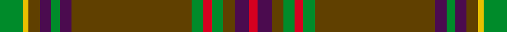

This page is one **sett** — a single exact thread-count. It belongs to the [tartan](/setts/g8ly2dy4dp4g3dp4dy42g4r3g4dy4dp5r3/)
(the same proportion at any scale), whose colour order is pattern [GYGBGBGGRGGBR](/stripes/gygbgbggrggbr/).

Sourced from tartans-authority.  It is a [13 stripe tartan](/stripes/stripes13/).

Original link http://www.tartansauthority.com/tartan-ferret/display/2558/

2 attestations — the source records this cloth was collapsed from (oldest owns this page)

<ul>
<li>pre 2002 — Sarna (District) (tartans-authority, <a href="http://www.tartansauthority.com/tartan-ferret/display/2558/">record</a>)  <em>Asymmetric. Sample given to Scottish Tartans Society by Swedish/Scot Gudrun Joyce of Comrie, Perthshire. Count has different warp and weft and includes odd numbers. STS entry categorises this as a 'State' tartan but follows it by an entry for the Sarna (town) district tartan.</em></li>
<li>Historic — Sarna (State) (register-of-tartans, <a href="https://www.tartanregister.gov.uk/tartanDetails.aspx?ref=3654">record</a>)  <em>Sample given to Scottish Tartans Society by Swedish/Scot Gudrun Joyce of Comrie, Perthshire. Count has different warp and weft and includes odd numbers. Scottish Tartans Society entry categorises this as a 'State' tartan but follows it by an entry for the Sarna (town) district tartan.</em></li>
</ul>

## Register references

External register numbers recorded for this tartan.

- Scottish Register of Tartans: [3654](https://www.tartanregister.gov.uk/tartanDetails.aspx?ref=3654)
- Scottish Tartans Authority (ITI): 2558
- Scottish Tartans World Register: 2558

## Thread count
G/8 LY2 DY4 DP4 G3 DP4 DY42 G4 R3 G4 DY4 DP5 R/3

One full sett is **169 threads**.

## Palette
<table><thead><tr><th>Colour</th><th>Shade</th><th>OKLCh</th></tr></thead><tbody><tr><td>G</td><td><code style="background-color:#008B2A;">#008B2A</code> <small style="color:#888">#008B2A</small></td><td><small style="color:#888">oklch(55.4% 0.170 145.9)</small></td></tr><tr><td>DP</td><td><code style="background-color:#4B0B4F;">#4B0B4F</code> <small style="color:#888">#4B0B4F</small></td><td><small style="color:#888">oklch(30.1% 0.125 325.4)</small></td></tr><tr><td>R</td><td><code style="background-color:#D60020;">#D60020</code> <small style="color:#888">#D60020</small></td><td><small style="color:#888">oklch(55.2% 0.224 25.5)</small></td></tr><tr><td>DY</td><td><code style="background-color:#604000;">#604000</code> <small style="color:#888">#604000</small></td><td><small style="color:#888">oklch(39.8% 0.083 76.8)</small></td></tr><tr><td>LY</td><td><code style="background-color:#E8C000;">#E8C000</code> <small style="color:#888">#E8C000</small></td><td><small style="color:#888">oklch(81.9% 0.168 93.7)</small></td></tr></tbody></table>

# Sample pattern

## Nearest tartan variants

The nearest existing variants by ΔTartan distance, with this cloth at the top so the swatches line up against it.

ΔTartan

Threads

Variant

Sett

—

169

<a href="/variants/s13/g8ly2dy4dp4g3dp4dy42g4r3g4dy4dp5r3~ly3307090-dy1603076/">Sarna (District)</a>

<a href="/ttd/edit/#slug=g8y2o4dp4g3dp4o42g4r3g4o4dp5r3&amp;base=g8ly2dy4dp4g3dp4dy42g4r3g4dy4dp5r3~ly3307090-dy1603076" title="compare in the TTD">0.00</a>

169

<a href="/variants/s13/g8y2o4dp4g3dp4o42g4r3g4o4dp5r3/">Sarna</a>

## Neighbour map

Every grey dot is one of 13620 variants placed by the first two principal components of the ΔTartan feature space (42% of its variance). Red is this tartan; blue dots are its nearest — click one to open its page.

<svg viewBox="0 0 640 380" role="img" style="max-width:100%;height:auto;border:1px solid #e0e0e0;border-radius:4px;display:block" xmlns="http://www.w3.org/2000/svg"><image href="/nn/cloud.v1.png" width="640" height="380"/><a href="/variants/s13/g8y2o4dp4g3dp4o42g4r3g4o4dp5r3/"><circle cx="393.0" cy="124.8" r="4" fill="#3465a4"><title>Sarna</title></circle></a><circle cx="383.1" cy="123.7" r="5" fill="#c00000"/><text x="320" y="376" text-anchor="middle" font-size="11" fill="#999">ground</text><text x="11" y="190" text-anchor="middle" font-size="11" fill="#999" transform="rotate(-90 11 190)">complexity</text></svg>

ID: /variants/s13/g8ly2dy4dp4g3dp4dy42g4r3g4dy4dp5r3~ly3307090-dy1603076/
