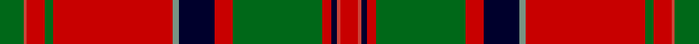

This page is one **sett** — a single exact thread-count. It belongs to the [tartan](/setts/g8ri1r6g3r40y2k12r6g30r3k2ri1r6/)
(the same proportion at any scale), whose colour order is pattern [GRRGRGKRGRKRR](/stripes/grrgrgkrgrkrr/).

Part of the [MacDonald of Glencoe](/tartans/macdonald-of-glencoe/) tartan — the named design grouping this sett with its other cloths.

Sourced from register-of-tartans.  It is a [13 stripe tartan](/stripes/stripes13/).

Original link https://www.tartanregister.gov.uk/tartanDetails.aspx?ref=2361

## Also known as

This cloth is also recorded under:

- MacDonald of Glenaladale #2
- MacDonald of Glencoe #2
- MacDonald of Glencoe #3
- MacDonald of Glencoe Artifact
- MacDonald, of Glencoe

2 attestations — the source records this cloth was collapsed from (oldest owns this page)

<ul>
<li>01/01/1800 — MacDonald of Glencoe #3 (register-of-tartans, <a href="https://www.tartanregister.gov.uk/tartanDetails.aspx?ref=2361">record</a>)</li>
<li>c1950 — MacDonald of Glencoe - 1950 (Clan) (tartans-authority, <a href="http://www.tartansauthority.com/tartan-ferret/display/1012/">record</a>)</li>
</ul>

## Register references

External register numbers recorded for this tartan.

- Scottish Register of Tartans: [2361](https://www.tartanregister.gov.uk/tartanDetails.aspx?ref=2361)
- Scottish Tartans Authority (ITI): 1012
- Scottish Tartans World Register: 1012

## Thread count
G/16 R2 Ra12 G6 Ra80 LG4 DB24 Ra12 G60 Ra6 DB4 R2 Ra/12

One full sett is **452 threads**.

## Palette

Palette: <strong>Tartan Register</strong> <small style="color:#888">(3 of 5 colours)</small>
<table><thead><tr><th>Colour</th><th>Threads</th><th>Shade</th><th>Base</th><th>OKLCh</th></tr></thead><tbody><tr><td>G/</td><td style="text-align:right;font-variant-numeric:tabular-nums">16</td><td><code style="background-color:#006818;">#006818</code> <small style="color:#888">#006818</small></td><td>G <code style="background-color:#006100;">#006100</code></td><td><small style="color:#888">oklch(45.0% 0.142 145.0)</small></td></tr><tr><td>R</td><td style="text-align:right;font-variant-numeric:tabular-nums">2</td><td><code style="background-color:#CC4438;">#CC4438</code> <small style="color:#888">#CC4438</small></td><td>R <code style="background-color:#CC0000;">#CC0000</code></td><td><small style="color:#888">oklch(57.7% 0.174 28.7)</small></td></tr><tr><td>Ra</td><td style="text-align:right;font-variant-numeric:tabular-nums">12</td><td><code style="background-color:#C80000;">#C80000</code> <small style="color:#888">#C80000</small></td><td>R <code style="background-color:#CC0000;">#CC0000</code></td><td><small style="color:#888">oklch(52.3% 0.215 29.2)</small></td></tr><tr><td>G</td><td style="text-align:right;font-variant-numeric:tabular-nums">6</td><td><code style="background-color:#006818;">#006818</code> <small style="color:#888">#006818</small></td><td>G <code style="background-color:#006100;">#006100</code></td><td><small style="color:#888">oklch(45.0% 0.142 145.0)</small></td></tr><tr><td>Ra</td><td style="text-align:right;font-variant-numeric:tabular-nums">80</td><td><code style="background-color:#C80000;">#C80000</code> <small style="color:#888">#C80000</small></td><td>R <code style="background-color:#CC0000;">#CC0000</code></td><td><small style="color:#888">oklch(52.3% 0.215 29.2)</small></td></tr><tr><td>LG</td><td style="text-align:right;font-variant-numeric:tabular-nums">4</td><td><code style="background-color:#789484;">#789484</code> <small style="color:#888">#789484</small></td><td>G <code style="background-color:#006100;">#006100</code></td><td><small style="color:#888">oklch(64.0% 0.040 160.0)</small></td></tr><tr><td>DB</td><td style="text-align:right;font-variant-numeric:tabular-nums">24</td><td><code style="background-color:#00002C;">#00002C</code> <small style="color:#888">#00002C</small></td><td>K <code style="background-color:#000000;">#000000</code></td><td><small style="color:#888">oklch(13.2% 0.092 264.1)</small></td></tr><tr><td>Ra</td><td style="text-align:right;font-variant-numeric:tabular-nums">12</td><td><code style="background-color:#C80000;">#C80000</code> <small style="color:#888">#C80000</small></td><td>R <code style="background-color:#CC0000;">#CC0000</code></td><td><small style="color:#888">oklch(52.3% 0.215 29.2)</small></td></tr><tr><td>G</td><td style="text-align:right;font-variant-numeric:tabular-nums">60</td><td><code style="background-color:#006818;">#006818</code> <small style="color:#888">#006818</small></td><td>G <code style="background-color:#006100;">#006100</code></td><td><small style="color:#888">oklch(45.0% 0.142 145.0)</small></td></tr><tr><td>Ra</td><td style="text-align:right;font-variant-numeric:tabular-nums">6</td><td><code style="background-color:#C80000;">#C80000</code> <small style="color:#888">#C80000</small></td><td>R <code style="background-color:#CC0000;">#CC0000</code></td><td><small style="color:#888">oklch(52.3% 0.215 29.2)</small></td></tr><tr><td>DB</td><td style="text-align:right;font-variant-numeric:tabular-nums">4</td><td><code style="background-color:#00002C;">#00002C</code> <small style="color:#888">#00002C</small></td><td>K <code style="background-color:#000000;">#000000</code></td><td><small style="color:#888">oklch(13.2% 0.092 264.1)</small></td></tr><tr><td>R</td><td style="text-align:right;font-variant-numeric:tabular-nums">2</td><td><code style="background-color:#CC4438;">#CC4438</code> <small style="color:#888">#CC4438</small></td><td>R <code style="background-color:#CC0000;">#CC0000</code></td><td><small style="color:#888">oklch(57.7% 0.174 28.7)</small></td></tr><tr><td>Ra/</td><td style="text-align:right;font-variant-numeric:tabular-nums">12</td><td><code style="background-color:#C80000;">#C80000</code> <small style="color:#888">#C80000</small></td><td>R <code style="background-color:#CC0000;">#CC0000</code></td><td><small style="color:#888">oklch(52.3% 0.215 29.2)</small></td></tr></tbody></table>

## Compared to the master

This cloth is one sett of its design; the master sett (the exemplar the design is anchored on) is below for comparison.

<figure style="margin:0"><figcaption style="color:#888;font-size:smaller">this sett</figcaption></figure>
<figure style="margin:0"><figcaption style="color:#888;font-size:smaller"><a href="/setts/m6r1db2m2g40m6db13t1m48g2m4r1g4/">master sett →</a></figcaption></figure>

## Nearest tartans

The nearest existing variants by ΔTartan distance, with this tartan at the top so the swatches line up against it.

ΔTartan

Tartan

Sett

—

<a href="/ttd/edit/#slug=g8ri1r6g3r40y2k12r6g30r3k2ri1r6~x2">MacDonald of Glencoe #3</a> <a class="nn-out" href="/variants/s13/g8ri1r6g3r40y2k12r6g30r3k2ri1r6~x2/" title="open its dictionary page">↗</a>

0.87

<a href="/ttd/edit/#slug=r6dg4ly2dg36r2dg2r2dg12r48dg4r2k1r2lb6&amp;base=g8ri1r6g3r40y2k12r6g30r3k2ri1r6~x2">Hay</a> <a class="nn-out" href="/variants/s14/r6dg4ly2dg36r2dg2r2dg12r48dg4r2k1r2lb6/" title="open its dictionary page">↗</a>

0.88

<a href="/ttd/edit/#slug=db30r14db2r14g20w1g2w1g20r44db4r10t1r4~x2&amp;base=g8ri1r6g3r40y2k12r6g30r3k2ri1r6~x2">Perth, (Duke of.. )</a> <a class="nn-out" href="/variants/s14/db30r14db2r14g20w1g2w1g20r44db4r10t1r4~x2/" title="open its dictionary page">↗</a>

0.99

<a href="/ttd/edit/#slug=r36ly2db1r3g41r3db1ly2r3db12r3ly2db1r36g3ri3g4~x2&amp;base=g8ri1r6g3r40y2k12r6g30r3k2ri1r6~x2">Munro (Clan)</a> <a class="nn-out" href="/variants/s17/r36ly2db1r3g41r3db1ly2r3db12r3ly2db1r36g3ri3g4~x2/" title="open its dictionary page">↗</a>

1.04

<a href="/ttd/edit/#slug=r24w1db2r4g32r4db2w1r4db6r4w1db2r32g2m3g6~x2&amp;base=g8ri1r6g3r40y2k12r6g30r3k2ri1r6~x2">Dalziel (Logan) Family Tartan</a> <a class="nn-out" href="/variants/s17/r24w1db2r4g32r4db2w1r4db6r4w1db2r32g2m3g6~x2/" title="open its dictionary page">↗</a>

1.04

<a href="/ttd/edit/#slug=r5ly1db2r2g30r5db10t1r42g2r4ly1g4~x2&amp;base=g8ri1r6g3r40y2k12r6g30r3k2ri1r6~x2">MacDonald, of Glencoe</a> <a class="nn-out" href="/variants/s13/r5ly1db2r2g30r5db10t1r42g2r4ly1g4~x2/" title="open its dictionary page">↗</a>

1.05

<a href="/ttd/edit/#slug=r6w1r24db6g2k1g2k1g12r1~x2&amp;base=g8ri1r6g3r40y2k12r6g30r3k2ri1r6~x2">Chisholm</a> <a class="nn-out" href="/variants/s10/r6w1r24db6g2k1g2k1g12r1~x2/" title="open its dictionary page">↗</a>

1.05

<a href="/ttd/edit/#slug=r24w1db2r4g32r4db2w1r4db6r4w1db2r32g2ri3g6~x2&amp;base=g8ri1r6g3r40y2k12r6g30r3k2ri1r6~x2">Dalziel</a> <a class="nn-out" href="/variants/s17/r24w1db2r4g32r4db2w1r4db6r4w1db2r32g2ri3g6~x2/" title="open its dictionary page">↗</a>

1.06

<a href="/ttd/edit/#slug=r24w1db2r8g52r8db2w1r8db12r8w1db2r52g4ri6g6~x2&amp;base=g8ri1r6g3r40y2k12r6g30r3k2ri1r6~x2">Dalzell</a> <a class="nn-out" href="/variants/s17/r24w1db2r8g52r8db2w1r8db12r8w1db2r52g4ri6g6~x2/" title="open its dictionary page">↗</a>

1.07

<a href="/ttd/edit/#slug=g6w1g12r4db4r2k4r32g1r2~x2&amp;base=g8ri1r6g3r40y2k12r6g30r3k2ri1r6~x2">Seton</a> <a class="nn-out" href="/variants/s10/g6w1g12r4db4r2k4r32g1r2~x2/" title="open its dictionary page">↗</a>

1.08

<a href="/ttd/edit/#slug=r42k1dg12lr2r3k1r3lr2dg2n12k4r3lr4dg3~x2&amp;base=g8ri1r6g3r40y2k12r6g30r3k2ri1r6~x2">MacFarlane</a> <a class="nn-out" href="/variants/s14/r42k1dg12lr2r3k1r3lr2dg2n12k4r3lr4dg3~x2/" title="open its dictionary page">↗</a>

## Neighbour map

Every grey dot is one of 14360 variants placed by the first two principal components of the ΔTartan feature space (44% of its variance). Red is this tartan; blue dots are its nearest — click one to open its page.

<svg viewBox="0 0 640 380" role="img" style="max-width:100%;height:auto;border:1px solid #e0e0e0;border-radius:4px;display:block" xmlns="http://www.w3.org/2000/svg"><image href="/nn/cloud.v1.png" width="640" height="380"/><a href="/variants/s14/r6dg4ly2dg36r2dg2r2dg12r48dg4r2k1r2lb6/"><circle cx="354.6" cy="57.4" r="4" fill="#3465a4"><title>Hay</title></circle></a><a href="/variants/s14/db30r14db2r14g20w1g2w1g20r44db4r10t1r4~x2/"><circle cx="328.0" cy="88.7" r="4" fill="#3465a4"><title>Perth, (Duke of.. )</title></circle></a><a href="/variants/s17/r36ly2db1r3g41r3db1ly2r3db12r3ly2db1r36g3ri3g4~x2/"><circle cx="360.8" cy="57.5" r="4" fill="#3465a4"><title>Munro (Clan)</title></circle></a><a href="/variants/s17/r24w1db2r4g32r4db2w1r4db6r4w1db2r32g2m3g6~x2/"><circle cx="357.7" cy="72.8" r="4" fill="#3465a4"><title>Dalziel (Logan) Family Tartan</title></circle></a><a href="/variants/s13/r5ly1db2r2g30r5db10t1r42g2r4ly1g4~x2/"><circle cx="371.0" cy="78.6" r="4" fill="#3465a4"><title>MacDonald, of Glencoe</title></circle></a><a href="/variants/s10/r6w1r24db6g2k1g2k1g12r1~x2/"><circle cx="334.4" cy="104.6" r="4" fill="#3465a4"><title>Chisholm</title></circle></a><a href="/variants/s17/r24w1db2r4g32r4db2w1r4db6r4w1db2r32g2ri3g6~x2/"><circle cx="356.3" cy="73.3" r="4" fill="#3465a4"><title>Dalziel</title></circle></a><a href="/variants/s17/r24w1db2r8g52r8db2w1r8db12r8w1db2r52g4ri6g6~x2/"><circle cx="375.3" cy="58.3" r="4" fill="#3465a4"><title>Dalzell</title></circle></a><a href="/variants/s10/g6w1g12r4db4r2k4r32g1r2~x2/"><circle cx="367.3" cy="88.8" r="4" fill="#3465a4"><title>Seton</title></circle></a><a href="/variants/s14/r42k1dg12lr2r3k1r3lr2dg2n12k4r3lr4dg3~x2/"><circle cx="357.7" cy="63.1" r="4" fill="#3465a4"><title>MacFarlane</title></circle></a><circle cx="329.2" cy="77.8" r="5" fill="#c00000"/></svg>

ID: /variants/s13/g8ri1r6g3r40y2k12r6g30r3k2ri1r6~x2/
