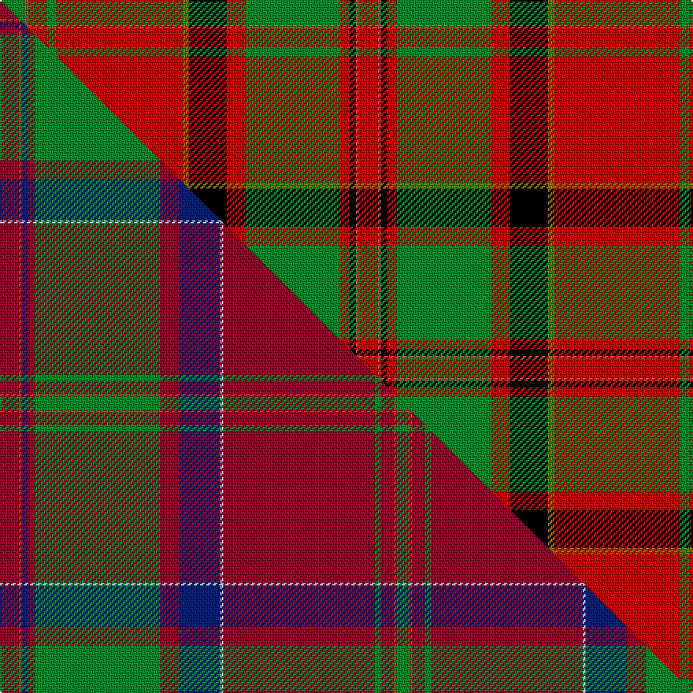

This is one **variant** — a specific cloth: this exact thread count and colourway, with its own
provenance below. It is one weaving of the [sett](/setts/g8ri1r6g3r40y2k12r6g30r3k2ri1r6/) (the scale-free proportion — the
same cloth at any scale or shade), whose colour order is pattern [GRRGRGKRGRKRR](/stripes/grrgrgkrgrkrr/).

Part of the [MacDonald of Glencoe](/tartans/macdonald-of-glencoe-3/) tartan — the named design grouping this sett with its other cloths.

Sourced from register-of-tartans.  It is a [13 stripe tartan](/stripes/stripes13/).

Original link [https://www.tartanregister.gov.uk/tartanDetails.aspx?ref=2361](https://www.tartanregister.gov.uk/tartanDetails.aspx?ref=2361)

2 attestations — the source records this cloth was collapsed from (oldest owns this page)

<ul>
<li>01/01/1800 — MacDonald of Glencoe #3 (register-of-tartans, <a href="https://www.tartanregister.gov.uk/tartanDetails.aspx?ref=2361">record</a>)  <em>John Cargill's threadcount taken from a fragment of a sample in Fort William Museum. Cargill also gives Pink in place of Old Gold. The piece is labelled "found in Glencoe" without any suggestion of its being a Macdonald. See Scottish Tartans World Register #2362.</em></li>
<li>c1950 — MacDonald of Glencoe - 1950 (Clan) (tartans-authority, <a href="https://www.tartanregister.gov.uk/tartanDetails.aspx?ref=1012">record</a>)  <em>A fragment of cloth in the West Highland Museum in Fort William referred to as a 'Cargill frag.' A swatch of this - which he wove - is in Peter MacDonald's collection. It's thought that the fragment referred to was found in Glencoe and automatically attributed to the the MacDonalds with no proof other than the Glencoe connection. There may be an error here Cf MacColl #899</em></li>
</ul>

Dataset <small>— provenance for this record, inherited from the source manifest</small>

<dl class="dataset-prov">
<dt>source</dt><dd><a href="/sources/register-of-tartans/">Scottish Register of Tartans</a></dd>
<dt>data captured from</dt><dd><a href="https://github.com/thetartan/tartan-database/blob/master/data/register-of-tartans/data.csv">https://github.com/thetartan/tartan-database/blob/master/data/register-of-tartans/data.csv</a></dd>
<dt>data date</dt><dd>1800 <small>(this record)</small></dd>
<dt>licence</dt><dd><a href="https://www.tartanregister.gov.uk/copyright">Crown copyright</a></dd>
</dl>

Capture chain <small>— the hands this data passed through, oldest first; each capture carries its own licence</small>

<ol class="capture-chain">
<li><a href="https://www.tartanregister.gov.uk/">Scottish Register of Tartans</a> · <a href="https://www.tartanregister.gov.uk/copyright">Crown copyright</a> <small>the living register — still published by National Records of Scotland</small></li>
<li><a href="https://github.com/thetartan/tartan-database">thetartan/tartan-database</a> <small>2016-2017</small> · <a href="https://creativecommons.org/licenses/by-nc-nd/4.0/">CC BY-NC-ND 4.0</a> <small>Levko Kravets's frozen compilation — the capture we vendored, and where its CC licence text came from</small></li>
<li>this dictionary <small>captured 2026-06-10 · commit 5bf86c7566</small> <small>each re-capture is a git commit to data/sources</small></li>
</ol>

## Register references

External register numbers recorded for this tartan.

- Scottish Register of Tartans: [2361](https://www.tartanregister.gov.uk/tartanDetails.aspx?ref=2361)
- Scottish Tartans Authority (ITI): 1012
- Scottish Tartans World Register: 1012

## Thread count
G/16 Ri2 R12 G6 R80 Y4 K24 R12 G60 R6 K4 Ri2 R/12

One full sett is **452 threads**.

## Palette
<table><thead><tr><th>Colour</th><th>Shade</th><th>OKLCh</th></tr></thead><tbody><tr><td>K</td><td><code style="background-color:#000000;">#000000</code> <small style="color:#888">#000000</small></td><td><small style="color:#888">oklch(0.0% 0.000 0.0)</small></td></tr><tr><td>G</td><td><code style="background-color:#008B2A;">#008B2A</code> <small style="color:#888">#008B2A</small></td><td><small style="color:#888">oklch(55.4% 0.170 145.9)</small></td></tr><tr><td>Y</td><td><code style="background-color:#8B6E00;">#8B6E00</code> <small style="color:#888">#8B6E00</small></td><td><small style="color:#888">oklch(55.1% 0.113 90.4)</small></td></tr><tr><td>R</td><td><code style="background-color:#CC4438;">#CC4438</code> <small style="color:#888">#CC4438</small></td><td><small style="color:#888">oklch(57.7% 0.174 28.7)</small></td></tr><tr><td>R</td><td><code style="background-color:#C80000;">#C80000</code> <small style="color:#888">#C80000</small></td><td><small style="color:#888">oklch(52.3% 0.215 29.2)</small></td></tr></tbody></table>

# Sample pattern

## Compared to the master

This cloth is one sett of its design; the master sett (the exemplar the design is anchored on) is below for comparison.

Its **ΔTartan distance** from the master is **1.19** — the same measure the nearest-tartans table ranks by (0 is identical; a re-scale of the same cloth is near 0, a recolour or a different proportion further).

<figure class="master-compare" style="margin:0">

this sett
master sett ★

<figcaption style="color:#888;font-size:smaller">One weave of this sett against the <a href="/setts/r6ri1db2r2g40r6db13lb1r48g2r4ri1g4/">master sett ★</a>, split on the diagonal: a shared proportion runs seamlessly across it with only the shades shifting; a different proportion breaks on it.</figcaption>
</figure>

## Nearest tartan variants

The nearest existing variants by ΔTartan distance, with this cloth at the top so the swatches line up against it.

ΔTartan

Threads

Variant

Sett

—

452

<a href="/variants/s13/g8ri1r6g3r40y2k12r6g30r3k2ri1r6~x2~ri2307033-r2109032/">MacDonald of Glencoe #3</a>

<a href="/ttd/edit/#slug=dr5r2k3dr4g43dr6k7lb2dr47g2dr3r2g4~x2&amp;base=g8ri1r6g3r40y2k12r6g30r3k2ri1r6~x2~ri2307033-r2109032" title="compare in the TTD">0.86</a>

502

<a href="/variants/s13/dr5r2k3dr4g43dr6k7lb2dr47g2dr3r2g4~x2/">Glen Coe (District)</a>

<a href="/ttd/edit/#slug=r6b1db2r2g40r6db13lb1r48g2r4b1g4~x2&amp;base=g8ri1r6g3r40y2k12r6g30r3k2ri1r6~x2~ri2307033-r2109032" title="compare in the TTD">1.79</a>

500

<a href="/variants/s13/r6b1db2r2g40r6db13lb1r48g2r4b1g4~x2/">MacDonald of Glencoe</a>

<a href="/ttd/edit/#slug=r5y1db2r2g30r5db10lb1r42g2r4y1g4~x2&amp;base=g8ri1r6g3r40y2k12r6g30r3k2ri1r6~x2~ri2307033-r2109032" title="compare in the TTD">2.11</a>

418

<a href="/variants/s13/r5y1db2r2g30r5db10lb1r42g2r4y1g4~x2/">MacDonald of Glencoe #2</a>

<a href="/ttd/edit/#slug=dg2r36dg11k5w1dg1y1k1w1k1dg16r5w1~x2&amp;base=g8ri1r6g3r40y2k12r6g30r3k2ri1r6~x2~ri2307033-r2109032" title="compare in the TTD">2.25</a>

322

<a href="/variants/s13/dg2r36dg11k5w1dg1y1k1w1k1dg16r5w1~x2/">Campagna Center (Corporate)</a>

<a href="/ttd/edit/#slug=r9g6y4g54r4g4r4g18r72g6r4k2r4w9&amp;base=g8ri1r6g3r40y2k12r6g30r3k2ri1r6~x2~ri2307033-r2109032" title="compare in the TTD">2.41</a>

382

<a href="/variants/s14/r9g6y4g54r4g4r4g18r72g6r4k2r4w9/">Hay Clan Tartan</a>

<a href="/ttd/edit/#slug=r3dg2ly1dg18r1dg1r1dg6r24dg2r1k1r1w3~x2&amp;base=g8ri1r6g3r40y2k12r6g30r3k2ri1r6~x2~ri2307033-r2109032" title="compare in the TTD">2.55</a>

248

<a href="/variants/s14/r3dg2ly1dg18r1dg1r1dg6r24dg2r1k1r1w3~x2/">Hay - 1842 (Clan)</a>

<a href="/ttd/edit/#slug=g6w1g12r4db4r2k4r32g1r2~x2&amp;base=g8ri1r6g3r40y2k12r6g30r3k2ri1r6~x2~ri2307033-r2109032" title="compare in the TTD">2.60</a>

256

<a href="/variants/s10/g6w1g12r4db4r2k4r32g1r2~x2/">Seton Family Tartan</a>

<a href="/ttd/edit/#slug=r6g4y2g36r2g2r2g12r48g4r2k1r2w6~x2&amp;base=g8ri1r6g3r40y2k12r6g30r3k2ri1r6~x2~ri2307033-r2109032" title="compare in the TTD">2.65</a>

492

<a href="/variants/s14/r6g4y2g36r2g2r2g12r48g4r2k1r2w6~x2/">Hay</a>

<a href="/ttd/edit/#slug=r6g4y2g36r2g2r2g12r48g4r2k1r2w6&amp;base=g8ri1r6g3r40y2k12r6g30r3k2ri1r6~x2~ri2307033-r2109032" title="compare in the TTD">2.65</a>

246

<a href="/variants/s14/r6g4y2g36r2g2r2g12r48g4r2k1r2w6/">Hay</a>

<a href="/ttd/edit/#slug=r5k2r2g42r5k36r70k2y2r7g2&amp;base=g8ri1r6g3r40y2k12r6g30r3k2ri1r6~x2~ri2307033-r2109032" title="compare in the TTD">2.66</a>

343

<a href="/variants/s11/r5k2r2g42r5k36r70k2y2r7g2/">MacPherson of Cluny</a>

## Neighbour map

Every grey dot is one of 13621 variants placed by the first two principal components of the ΔTartan feature space (42% of its variance). Red is this tartan; blue dots are its nearest — click one to open its page.

<svg viewBox="0 0 640 380" role="img" style="max-width:100%;height:auto;border:1px solid #e0e0e0;border-radius:4px;display:block" xmlns="http://www.w3.org/2000/svg"><image href="/nn/cloud.v1.png" width="640" height="380"/><a href="/variants/s13/dr5r2k3dr4g43dr6k7lb2dr47g2dr3r2g4~x2/"><circle cx="288.6" cy="82.2" r="4" fill="#3465a4"><title>Glen Coe (District)</title></circle></a><a href="/variants/s13/r6b1db2r2g40r6db13lb1r48g2r4b1g4~x2/"><circle cx="344.7" cy="69.6" r="4" fill="#3465a4"><title>MacDonald of Glencoe</title></circle></a><a href="/variants/s13/r5y1db2r2g30r5db10lb1r42g2r4y1g4~x2/"><circle cx="353.2" cy="75.6" r="4" fill="#3465a4"><title>MacDonald of Glencoe #2</title></circle></a><a href="/variants/s13/dg2r36dg11k5w1dg1y1k1w1k1dg16r5w1~x2/"><circle cx="289.9" cy="53.2" r="4" fill="#3465a4"><title>Campagna Center (Corporate)</title></circle></a><a href="/variants/s14/r9g6y4g54r4g4r4g18r72g6r4k2r4w9/"><circle cx="313.4" cy="67.1" r="4" fill="#3465a4"><title>Hay Clan Tartan</title></circle></a><a href="/variants/s14/r3dg2ly1dg18r1dg1r1dg6r24dg2r1k1r1w3~x2/"><circle cx="282.9" cy="69.5" r="4" fill="#3465a4"><title>Hay - 1842 (Clan)</title></circle></a><a href="/variants/s10/g6w1g12r4db4r2k4r32g1r2~x2/"><circle cx="328.6" cy="77.6" r="4" fill="#3465a4"><title>Seton Family Tartan</title></circle></a><a href="/variants/s14/r6g4y2g36r2g2r2g12r48g4r2k1r2w6~x2/"><circle cx="325.0" cy="53.8" r="4" fill="#3465a4"><title>Hay</title></circle></a><a href="/variants/s14/r6g4y2g36r2g2r2g12r48g4r2k1r2w6/"><circle cx="325.0" cy="53.8" r="4" fill="#3465a4"><title>Hay</title></circle></a><a href="/variants/s11/r5k2r2g42r5k36r70k2y2r7g2/"><circle cx="279.9" cy="74.7" r="4" fill="#3465a4"><title>MacPherson of Cluny</title></circle></a><circle cx="282.5" cy="65.9" r="5" fill="#c00000"/><text x="320" y="376" text-anchor="middle" font-size="11" fill="#999">ground</text><text x="11" y="190" text-anchor="middle" font-size="11" fill="#999" transform="rotate(-90 11 190)">complexity</text></svg>

ID: /variants/s13/g8ri1r6g3r40y2k12r6g30r3k2ri1r6~x2~ri2307033-r2109032/
