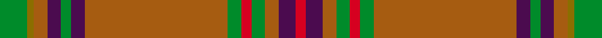

This is one **variant** — a specific cloth: this exact thread count and colourway, with its own
provenance below. It is one weaving of the [sett](/tartans/s/sa/sarna-2/) (the scale-free proportion — the
same cloth at any scale or shade), whose colour order is pattern [GGRBGBRGRGRBR](/stripes/ggrbgbrgrgrbr/).

Part of the [Sarna](/tartans/s/sa/sarna-2/) tartan — the named design grouping this sett with its other cloths.

Sourced from weddslist.  It is a [13 stripe tartan](/stripes/stripes13/).

Original link [http://www.weddslist.com/cgi-bin/tartans/pg.pl?source=sts](http://www.weddslist.com/cgi-bin/tartans/pg.pl?source=sts)

Dataset <small>— provenance for this record, inherited from the source manifest</small>

<dl class="dataset-prov">
<dt>source</dt><dd><a href="/sources/weddslist/">Weddslist</a></dd>
<dt>data captured from</dt><dd><a href="https://github.com/thetartan/tartan-database/blob/master/data/weddslist/data.csv">https://github.com/thetartan/tartan-database/blob/master/data/weddslist/data.csv</a></dd>
<dt>data date</dt><dd>2016-11-17 <small>(dataset default)</small></dd>
<dt>licence</dt><dd><a href="https://creativecommons.org/licenses/by-nc-nd/4.0/">CC BY-NC-ND 4.0</a></dd>
</dl>

Capture chain <small>— the hands this data passed through, oldest first; each capture carries its own licence</small>

<ol class="capture-chain">
<li><a href="https://www.weddslist.com/tartans/">Weddslist</a> <small>the living privately compiled reference</small></li>
<li><a href="https://github.com/thetartan/tartan-database">thetartan/tartan-database</a> <small>2016-2017</small> · <a href="https://creativecommons.org/licenses/by-nc-nd/4.0/">CC BY-NC-ND 4.0</a> <small>Levko Kravets's frozen compilation — the capture we vendored, and where its CC licence text came from</small></li>
<li>this dictionary <small>captured 2026-06-10 · commit 5bf86c7566</small> <small>each re-capture is a git commit to data/sources</small></li>
</ol>

## Thread count
G/8 Y2 O4 DP4 G3 DP4 O42 G4 R3 G4 O4 DP5 R/3

One full sett is **169 threads**.

## Palette
<table><thead><tr><th>Colour</th><th>Shade</th><th>OKLCh</th></tr></thead><tbody><tr><td>G</td><td><code style="background-color:#008B2A;">#008B2A</code> <small style="color:#888">#008B2A</small></td><td><small style="color:#888">oklch(55.4% 0.170 145.9)</small></td></tr><tr><td>O</td><td><code style="background-color:#A65C11;">#A65C11</code> <small style="color:#888">#A65C11</small></td><td><small style="color:#888">oklch(55.0% 0.125 58.3)</small></td></tr><tr><td>DP</td><td><code style="background-color:#4B0B4F;">#4B0B4F</code> <small style="color:#888">#4B0B4F</small></td><td><small style="color:#888">oklch(30.1% 0.125 325.4)</small></td></tr><tr><td>R</td><td><code style="background-color:#D60020;">#D60020</code> <small style="color:#888">#D60020</small></td><td><small style="color:#888">oklch(55.2% 0.224 25.5)</small></td></tr><tr><td>Y</td><td><code style="background-color:#8B6E00;">#8B6E00</code> <small style="color:#888">#8B6E00</small></td><td><small style="color:#888">oklch(55.1% 0.113 90.4)</small></td></tr></tbody></table>

# Sample pattern

## Nearest tartan variants

The nearest existing variants by ΔTartan distance, with this cloth at the top so the swatches line up against it.

ΔTartan

Threads

Variant

Sett

—

169

<a href="/variants/s13/g8y2o4dp4g3dp4o42g4r3g4o4dp5r3/">Sarna</a>

<a href="/ttd/edit/#slug=g8ly2dy4dp4g3dp4dy42g4r3g4dy4dp5r3~ly3307090-dy1603076&amp;base=g8y2o4dp4g3dp4o42g4r3g4o4dp5r3" title="compare in the TTD">0.15</a>

169

<a href="/variants/s13/g8ly2dy4dp4g3dp4dy42g4r3g4dy4dp5r3~ly3307090-dy1603076/">Sarna (District)</a>

<a href="/ttd/edit/#slug=o46b3o7g2r2g2w2g11b6db2b3r2~x2&amp;base=g8y2o4dp4g3dp4o42g4r3g4o4dp5r3" title="compare in the TTD">2.53</a>

256

<a href="/variants/s12/o46b3o7g2r2g2w2g11b6db2b3r2~x2/">Diana, hunting Plaid</a>

<a href="/ttd/edit/#slug=o40dt10y2dt2w2dt3r8o6dt2o4w2~x2&amp;base=g8y2o4dp4g3dp4o42g4r3g4o4dp5r3" title="compare in the TTD">2.95</a>

240

<a href="/variants/s11/o40dt10y2dt2w2dt3r8o6dt2o4w2~x2/">Cavalier, Red</a>

<a href="/ttd/edit/#slug=o7db1o2db2o35lb2o2db10o2g2o2g37o3db2o6~x2~o2207025-db1404259-lb3302249-g2105139&amp;base=g8y2o4dp4g3dp4o42g4r3g4o4dp5r3" title="compare in the TTD">3.08</a>

434

<a href="/variants/s15/o7db1o2db2o35lb2o2db10o2g2o2g37o3db2o6~x2~o2207025-db1404259-lb3302249-g2105139/">Drummond of Megginch - 2023 BertieLexa</a>

<a href="/ttd/edit/#slug=o40dt10y2dt2w2dt3g8o6dt2o4w2~x2&amp;base=g8y2o4dp4g3dp4o42g4r3g4o4dp5r3" title="compare in the TTD">3.15</a>

240

<a href="/variants/s11/o40dt10y2dt2w2dt3g8o6dt2o4w2~x2/">Cavalier, Brown</a>

<a href="/ttd/edit/#slug=dr50o6do7g2do2w2do2o16dr8do2dr9g3~x2&amp;base=g8y2o4dp4g3dp4o42g4r3g4o4dp5r3" title="compare in the TTD">3.16</a>

330

<a href="/variants/s12/dr50o6do7g2do2w2do2o16dr8do2dr9g3~x2/">Tyrone</a>

<a href="/ttd/edit/#slug=dr4y34do20y4do8y6r2y5do2y3dr4&amp;base=g8y2o4dp4g3dp4o42g4r3g4o4dp5r3" title="compare in the TTD">3.22</a>

176

<a href="/variants/s11/dr4y34do20y4do8y6r2y5do2y3dr4/">Morgan of Wales</a>

<a href="/ttd/edit/#slug=o6w1o24db6g2db1g2db1g12r1~x2&amp;base=g8y2o4dp4g3dp4o42g4r3g4o4dp5r3" title="compare in the TTD">3.22</a>

210

<a href="/variants/s10/o6w1o24db6g2db1g2db1g12r1~x2/">Chisholm hunting</a>

<a href="/ttd/edit/#slug=r4y34do20y4do8y6ri2y5do2y3r4~r1706009-ri2109032&amp;base=g8y2o4dp4g3dp4o42g4r3g4o4dp5r3" title="compare in the TTD">3.27</a>

176

<a href="/variants/s11/r4y34do20y4do8y6ri2y5do2y3r4~r1706009-ri2109032/">Morgan Welsh Name Tartan</a>

<a href="/ttd/edit/#slug=o7db1o2db2o35lg2o2db10o2g2o2g37o3db2o6~x2~o2207033-db1204259-lg3002249-g2005139&amp;base=g8y2o4dp4g3dp4o42g4r3g4o4dp5r3" title="compare in the TTD">3.33</a>

434

<a href="/variants/s15/o7dt1o2dt2o35lt2o2dt10o2g2o2g37o3dt2o6~x2~o2207033-dt1204259-lt3002249-g2005139/">Drummond of Megginch - 1849 Kilt (faded)</a>

## Neighbour map

Every grey dot is one of 13656 variants placed by the first two principal components of the ΔTartan feature space (42% of its variance). Red is this tartan; blue dots are its nearest — click one to open its page. The map is a flat projection of a many-dimensional space — [how to read it](/posts/neighbourhood-maps/).

<svg viewBox="0 0 640 380" role="img" style="max-width:100%;height:auto;border:1px solid #e0e0e0;border-radius:4px;display:block" xmlns="http://www.w3.org/2000/svg"><image href="/nn/cloud.v1.png" width="640" height="380"/><a href="/variants/s13/g8ly2dy4dp4g3dp4dy42g4r3g4dy4dp5r3~ly3307090-dy1603076/"><circle cx="383.2" cy="123.7" r="4" fill="#3465a4"><title>Sarna (District)</title></circle></a><a href="/variants/s12/o46b3o7g2r2g2w2g11b6db2b3r2~x2/"><circle cx="403.7" cy="100.9" r="4" fill="#3465a4"><title>Diana, hunting Plaid</title></circle></a><a href="/variants/s11/o40dt10y2dt2w2dt3r8o6dt2o4w2~x2/"><circle cx="397.7" cy="117.5" r="4" fill="#3465a4"><title>Cavalier, Red</title></circle></a><a href="/variants/s15/o7db1o2db2o35lb2o2db10o2g2o2g37o3db2o6~x2~o2207025-db1404259-lb3302249-g2105139/"><circle cx="406.7" cy="106.6" r="4" fill="#3465a4"><title>Drummond of Megginch - 2023 BertieLexa</title></circle></a><a href="/variants/s11/o40dt10y2dt2w2dt3g8o6dt2o4w2~x2/"><circle cx="395.6" cy="122.0" r="4" fill="#3465a4"><title>Cavalier, Brown</title></circle></a><a href="/variants/s12/dr50o6do7g2do2w2do2o16dr8do2dr9g3~x2/"><circle cx="445.9" cy="122.8" r="4" fill="#3465a4"><title>Tyrone</title></circle></a><a href="/variants/s11/dr4y34do20y4do8y6r2y5do2y3dr4/"><circle cx="428.3" cy="177.3" r="4" fill="#3465a4"><title>Morgan of Wales</title></circle></a><a href="/variants/s10/o6w1o24db6g2db1g2db1g12r1~x2/"><circle cx="353.0" cy="132.4" r="4" fill="#3465a4"><title>Chisholm hunting</title></circle></a><a href="/variants/s11/r4y34do20y4do8y6ri2y5do2y3r4~r1706009-ri2109032/"><circle cx="430.8" cy="176.3" r="4" fill="#3465a4"><title>Morgan Welsh Name Tartan</title></circle></a><a href="/variants/s15/o7dt1o2dt2o35lt2o2dt10o2g2o2g37o3dt2o6~x2~o2207033-dt1204259-lt3002249-g2005139/"><circle cx="392.0" cy="101.5" r="4" fill="#3465a4"><title>Drummond of Megginch - 1849 Kilt (faded)</title></circle></a><circle cx="393.3" cy="124.7" r="5" fill="#c00000"/><text x="320" y="376" text-anchor="middle" font-size="11" fill="#999">ground</text><text x="11" y="190" text-anchor="middle" font-size="11" fill="#999" transform="rotate(-90 11 190)">complexity</text></svg>

ID: /variants/s13/g8y2o4dp4g3dp4o42g4r3g4o4dp5r3/
