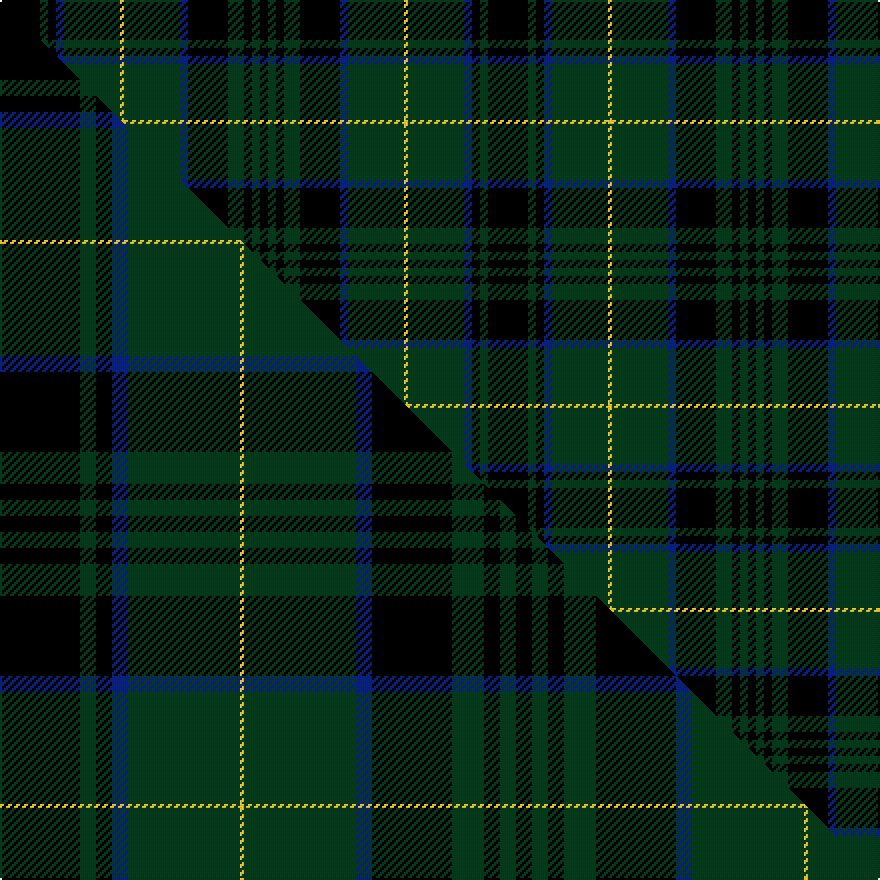

This page is one **sett** — a single exact thread-count. It belongs to the [tartan](/setts/k10dg2k2db2dg14ly1dg14db2k10dg4k2dg2k2/)
(the same proportion at any scale), whose colour order is pattern [KGKBGYGBKGKGK](/stripes/kgkbgygbkgkgk/).

Part of the [Sawicki, Peter](/tartans/sawicki-peter/) tartan — the named design grouping this sett with its other cloths.

Sourced from tartans-authority.  It is a [13 stripe tartan](/stripes/stripes13/).

Original link [https://www.tartanregister.gov.uk/tartanDetails.aspx?ref=10223](https://www.tartanregister.gov.uk/tartanDetails.aspx?ref=10223)

Dataset <small>— provenance for this record, inherited from the source manifest</small>

<dl class="dataset-prov">
<dt>source</dt><dd><a href="/sources/tartans-authority/">Scottish Tartans Authority</a></dd>
<dt>data captured from</dt><dd><a href="https://github.com/thetartan/tartan-database/blob/master/data/tartans-authority/data.csv">https://github.com/thetartan/tartan-database/blob/master/data/tartans-authority/data.csv</a></dd>
<dt>data date</dt><dd>1st Jan. 2010 <small>(this record)</small></dd>
<dt>licence</dt><dd><a href="https://creativecommons.org/licenses/by-nc-nd/4.0/">CC BY-NC-ND 4.0</a></dd>
</dl>

Capture chain <small>— the hands this data passed through, oldest first; each capture carries its own licence</small>

<ol class="capture-chain">
<li><a href="https://www.tartansauthority.com/">Scottish Tartans Authority</a> <small>the heritage body's archive — its tartan-ferret record browser is retired (links repaired to the SRT, above)</small></li>
<li><a href="https://github.com/thetartan/tartan-database">thetartan/tartan-database</a> <small>2016-2017</small> · <a href="https://creativecommons.org/licenses/by-nc-nd/4.0/">CC BY-NC-ND 4.0</a> <small>Levko Kravets's frozen compilation — the capture we vendored, and where its CC licence text came from</small></li>
<li>this dictionary <small>captured 2026-06-10 · commit 5bf86c7566</small> <small>each re-capture is a git commit to data/sources</small></li>
</ol>

## Register references

External register numbers recorded for this tartan.

- Scottish Register of Tartans: [10223](https://www.tartanregister.gov.uk/tartanDetails?ref=10223)
- Scottish Tartans Authority (ITI): 10223

## Thread count
K/20 DG4 K4 DB4 DG28 LY2 DG28 DB4 K20 DG8 K4 DG4 K/4

One full sett is **244 threads**.

## Palette
<table><thead><tr><th>Colour</th><th>Shade</th><th>OKLCh</th></tr></thead><tbody><tr><td>DB</td><td><code style="background-color:#082077;">#082077</code> <small style="color:#888">#082077</small></td><td><small style="color:#888">oklch(30.0% 0.149 265.1)</small></td></tr><tr><td>LY</td><td><code style="background-color:#DCBC32;">#DCBC32</code> <small style="color:#888">#DCBC32</small></td><td><small style="color:#888">oklch(80.0% 0.150 95.2)</small></td></tr><tr><td>DG</td><td><code style="background-color:#053819;">#053819</code> <small style="color:#888">#053819</small></td><td><small style="color:#888">oklch(30.0% 0.075 151.3)</small></td></tr><tr><td>K</td><td><code style="background-color:#000000;">#000000</code> <small style="color:#888">#000000</small></td><td><small style="color:#888">oklch(0.0% 0.000 0.0)</small></td></tr></tbody></table>

# Sample pattern

## Compared to the master

This cloth is one sett of its design; the master sett (the exemplar the design is anchored on) is below for comparison.

Its **ΔTartan distance** from the master is **0.49** — the same measure the nearest-tartans table ranks by (0 is identical; a re-scale of the same cloth is near 0, a recolour or a different proportion further).

<figure class="master-compare" style="margin:0">

this sett
master sett ★

<figcaption style="color:#888;font-size:smaller">One weave of this sett against the <a href="/setts/k20dg4k4db4dg28ly1dg28db4k20dg8k4dg4k4/">master sett ★</a>, split on the diagonal: a shared proportion runs seamlessly across it with only the shades shifting; a different proportion breaks on it.</figcaption>
</figure>

## Nearest tartan variants

The nearest existing variants by ΔTartan distance, with this cloth at the top so the swatches line up against it.

ΔTartan

Threads

Variant

Sett

—

244

<a href="/variants/s13/k10dg2k2db2dg14ly1dg14db2k10dg4k2dg2k2~x2/">Sawicki, Peter (Personal)</a>

<a href="/ttd/edit/#slug=k20dg4k4db4dg28ly1dg28db4k20dg8k4dg4k4~x2&amp;base=k10dg2k2db2dg14ly1dg14db2k10dg4k2dg2k2~x2" title="compare in the TTD">0.49</a>

484

<a href="/variants/s13/k20dg4k4db4dg28ly1dg28db4k20dg8k4dg4k4~x2/">Sawicki, Peter (Personal)</a>

<a href="/ttd/edit/#slug=dg5k2dg2k2dg2k12r2k12dg6k2dg2~x2&amp;base=k10dg2k2db2dg14ly1dg14db2k10dg4k2dg2k2~x2" title="compare in the TTD">2.21</a>

182

<a href="/variants/s11/dg5k2dg2k2dg2k12r2k12dg6k2dg2~x2/">MacLoughlin of Ardmarnoch (Personal)</a>

<a href="/ttd/edit/#slug=dg18k6dg1k1db1k6db1k2db1k6db1k1dg1k6dg21y1~x2&amp;base=k10dg2k2db2dg14ly1dg14db2k10dg4k2dg2k2~x2" title="compare in the TTD">2.86</a>

258

<a href="/variants/s16/dg18k6dg1k1db1k6db1k2db1k6db1k1dg1k6dg21y1~x2/">Grand Lodge of Scotland Corporate Weavers Tartan</a>

<a href="/ttd/edit/#slug=k1dr1dg7k8w1k8dr1dg2dr1dg4dr1~x4&amp;base=k10dg2k2db2dg14ly1dg14db2k10dg4k2dg2k2~x2" title="compare in the TTD">3.17</a>

272

<a href="/variants/s11/k1dr1dg7k8w1k8dr1dg2dr1dg4dr1~x4/">Episcopal Clergy</a>

<a href="/ttd/edit/#slug=dg28dr12dg4k20ly2k3ly2k3dg7~x2&amp;base=k10dg2k2db2dg14ly1dg14db2k10dg4k2dg2k2~x2" title="compare in the TTD">3.17</a>

254

<a href="/variants/s9/dg28dr12dg4k20ly2k3ly2k3dg7~x2/">Cork, County (District)</a>

<a href="/ttd/edit/#slug=ki25k7ki2k2ki2k2db10g6k2g3ki2~x2~ki0700000&amp;base=k10dg2k2db2dg14ly1dg14db2k10dg4k2dg2k2~x2" title="compare in the TTD">3.23</a>

198

<a href="/variants/s11/ki25k7ki2k2ki2k2db10g6k2g3ki2~x2~ki0700000/">Daks (Chino Check) (Fashion)</a>

<a href="/ttd/edit/#slug=dg8k8dg56n8dg8k20dg8n8dg8n16w3dr6&amp;base=k10dg2k2db2dg14ly1dg14db2k10dg4k2dg2k2~x2" title="compare in the TTD">3.23</a>

300

<a href="/variants/s12/dg8k8dg56n8dg8k20dg8n8dg8n16w3dr6/">Kelly of Sleat Hunting (Name)</a>

<a href="/ttd/edit/#slug=do20db2do5db5k18g5do5g2do15~x2&amp;base=k10dg2k2db2dg14ly1dg14db2k10dg4k2dg2k2~x2" title="compare in the TTD">3.23</a>

238

<a href="/variants/s9/do20db2do5db5k18g5do5g2do15~x2/">Laois</a>

<a href="/ttd/edit/#slug=db1k8db2dg16dr6dg16db2k8w1~x2&amp;base=k10dg2k2db2dg14ly1dg14db2k10dg4k2dg2k2~x2" title="compare in the TTD">3.31</a>

236

<a href="/variants/s9/db1k8db2dg16dr6dg16db2k8w1~x2/">Basel Tattoo (Official)</a>

<a href="/ttd/edit/#slug=n12lb3do36k12do8k8do16k2do16k4n10~do1400000&amp;base=k10dg2k2db2dg14ly1dg14db2k10dg4k2dg2k2~x2" title="compare in the TTD">3.41</a>

232

<a href="/variants/s11/n12lb3do36k12do8k8do16k2do16k4n10~do1400000/">Bute Heather, Midnight</a>

## Neighbour map

Every grey dot is one of 13621 variants placed by the first two principal components of the ΔTartan feature space (42% of its variance). Red is this tartan; blue dots are its nearest — click one to open its page.

<svg viewBox="0 0 640 380" role="img" style="max-width:100%;height:auto;border:1px solid #e0e0e0;border-radius:4px;display:block" xmlns="http://www.w3.org/2000/svg"><image href="/nn/cloud.v1.png" width="640" height="380"/><a href="/variants/s13/k20dg4k4db4dg28ly1dg28db4k20dg8k4dg4k4~x2/"><circle cx="344.5" cy="134.0" r="4" fill="#3465a4"><title>Sawicki, Peter (Personal)</title></circle></a><a href="/variants/s11/dg5k2dg2k2dg2k12r2k12dg6k2dg2~x2/"><circle cx="339.5" cy="208.9" r="4" fill="#3465a4"><title>MacLoughlin of Ardmarnoch (Personal)</title></circle></a><a href="/variants/s16/dg18k6dg1k1db1k6db1k2db1k6db1k1dg1k6dg21y1~x2/"><circle cx="365.5" cy="117.5" r="4" fill="#3465a4"><title>Grand Lodge of Scotland Corporate Weavers Tartan</title></circle></a><a href="/variants/s11/k1dr1dg7k8w1k8dr1dg2dr1dg4dr1~x4/"><circle cx="246.2" cy="181.8" r="4" fill="#3465a4"><title>Episcopal Clergy</title></circle></a><a href="/variants/s9/dg28dr12dg4k20ly2k3ly2k3dg7~x2/"><circle cx="267.0" cy="167.1" r="4" fill="#3465a4"><title>Cork, County (District)</title></circle></a><a href="/variants/s11/ki25k7ki2k2ki2k2db10g6k2g3ki2~x2~ki0700000/"><circle cx="266.9" cy="150.3" r="4" fill="#3465a4"><title>Daks (Chino Check) (Fashion)</title></circle></a><a href="/variants/s12/dg8k8dg56n8dg8k20dg8n8dg8n16w3dr6/"><circle cx="300.4" cy="131.1" r="4" fill="#3465a4"><title>Kelly of Sleat Hunting (Name)</title></circle></a><a href="/variants/s9/do20db2do5db5k18g5do5g2do15~x2/"><circle cx="314.0" cy="197.6" r="4" fill="#3465a4"><title>Laois</title></circle></a><a href="/variants/s9/db1k8db2dg16dr6dg16db2k8w1~x2/"><circle cx="290.1" cy="167.9" r="4" fill="#3465a4"><title>Basel Tattoo (Official)</title></circle></a><a href="/variants/s11/n12lb3do36k12do8k8do16k2do16k4n10~do1400000/"><circle cx="334.3" cy="168.8" r="4" fill="#3465a4"><title>Bute Heather, Midnight</title></circle></a><circle cx="310.9" cy="158.0" r="5" fill="#c00000"/><text x="320" y="376" text-anchor="middle" font-size="11" fill="#999">ground</text><text x="11" y="190" text-anchor="middle" font-size="11" fill="#999" transform="rotate(-90 11 190)">complexity</text></svg>

ID: /variants/s13/k10dg2k2db2dg14ly1dg14db2k10dg4k2dg2k2~x2/
