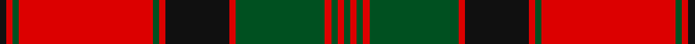

This page is one **sett** — a single exact thread-count. It belongs to the [tartan](/setts/k1r1dg1r21dg1r1k10r1dg14r1dg1r1dg1/)
(the same proportion at any scale), whose colour order is pattern [GRGRGRKRGRGRK](/stripes/grgrgrkrgrgrk/).

Part of the [MacQuarrie](/tartans/macquarrie/) tartan — the named design grouping this sett with its other cloths.

Sourced from register-of-tartans.  It is a [13 stripe tartan](/stripes/stripes13/).

Original link https://www.tartanregister.gov.uk/tartanDetails.aspx?ref=2731

## Also known as

This cloth is also recorded under:

- MacQuarrie #4
- MacQuarrie #7
- MacQuarrie Ancient
- MacQuarrie, Ancient

## Register references

External register numbers recorded for this tartan.

- Scottish Register of Tartans: [2731](https://www.tartanregister.gov.uk/tartanDetails.aspx?ref=2731)
- Scottish Tartans World Register: 872

## Thread count
K/2 R2 G2 R42 G2 R2 K20 R2 G28 R2 G2 R2 G/2

One full sett is **216 threads**.

## Palette

Palette: <strong>Tartan Register</strong>
<table><thead><tr><th>Colour</th><th>Threads</th><th>Shade</th><th>Base</th><th>OKLCh</th></tr></thead><tbody><tr><td>K/</td><td style="text-align:right;font-variant-numeric:tabular-nums">2</td><td><code style="background-color:#101010;">#101010</code> <small style="color:#888">#101010</small></td><td>K <code style="background-color:#000000;">#000000</code></td><td><small style="color:#888">oklch(17.3% 0.000 89.9)</small></td></tr><tr><td>R</td><td style="text-align:right;font-variant-numeric:tabular-nums">2</td><td><code style="background-color:#DC0000;">#DC0000</code> <small style="color:#888">#DC0000</small></td><td>R <code style="background-color:#CC0000;">#CC0000</code></td><td><small style="color:#888">oklch(56.2% 0.230 29.2)</small></td></tr><tr><td>G</td><td style="text-align:right;font-variant-numeric:tabular-nums">2</td><td><code style="background-color:#005020;">#005020</code> <small style="color:#888">#005020</small></td><td>G <code style="background-color:#006100;">#006100</code></td><td><small style="color:#888">oklch(37.7% 0.105 149.6)</small></td></tr><tr><td>R</td><td style="text-align:right;font-variant-numeric:tabular-nums">42</td><td><code style="background-color:#DC0000;">#DC0000</code> <small style="color:#888">#DC0000</small></td><td>R <code style="background-color:#CC0000;">#CC0000</code></td><td><small style="color:#888">oklch(56.2% 0.230 29.2)</small></td></tr><tr><td>G</td><td style="text-align:right;font-variant-numeric:tabular-nums">2</td><td><code style="background-color:#005020;">#005020</code> <small style="color:#888">#005020</small></td><td>G <code style="background-color:#006100;">#006100</code></td><td><small style="color:#888">oklch(37.7% 0.105 149.6)</small></td></tr><tr><td>R</td><td style="text-align:right;font-variant-numeric:tabular-nums">2</td><td><code style="background-color:#DC0000;">#DC0000</code> <small style="color:#888">#DC0000</small></td><td>R <code style="background-color:#CC0000;">#CC0000</code></td><td><small style="color:#888">oklch(56.2% 0.230 29.2)</small></td></tr><tr><td>K</td><td style="text-align:right;font-variant-numeric:tabular-nums">20</td><td><code style="background-color:#101010;">#101010</code> <small style="color:#888">#101010</small></td><td>K <code style="background-color:#000000;">#000000</code></td><td><small style="color:#888">oklch(17.3% 0.000 89.9)</small></td></tr><tr><td>R</td><td style="text-align:right;font-variant-numeric:tabular-nums">2</td><td><code style="background-color:#DC0000;">#DC0000</code> <small style="color:#888">#DC0000</small></td><td>R <code style="background-color:#CC0000;">#CC0000</code></td><td><small style="color:#888">oklch(56.2% 0.230 29.2)</small></td></tr><tr><td>G</td><td style="text-align:right;font-variant-numeric:tabular-nums">28</td><td><code style="background-color:#005020;">#005020</code> <small style="color:#888">#005020</small></td><td>G <code style="background-color:#006100;">#006100</code></td><td><small style="color:#888">oklch(37.7% 0.105 149.6)</small></td></tr><tr><td>R</td><td style="text-align:right;font-variant-numeric:tabular-nums">2</td><td><code style="background-color:#DC0000;">#DC0000</code> <small style="color:#888">#DC0000</small></td><td>R <code style="background-color:#CC0000;">#CC0000</code></td><td><small style="color:#888">oklch(56.2% 0.230 29.2)</small></td></tr><tr><td>G</td><td style="text-align:right;font-variant-numeric:tabular-nums">2</td><td><code style="background-color:#005020;">#005020</code> <small style="color:#888">#005020</small></td><td>G <code style="background-color:#006100;">#006100</code></td><td><small style="color:#888">oklch(37.7% 0.105 149.6)</small></td></tr><tr><td>R</td><td style="text-align:right;font-variant-numeric:tabular-nums">2</td><td><code style="background-color:#DC0000;">#DC0000</code> <small style="color:#888">#DC0000</small></td><td>R <code style="background-color:#CC0000;">#CC0000</code></td><td><small style="color:#888">oklch(56.2% 0.230 29.2)</small></td></tr><tr><td>G/</td><td style="text-align:right;font-variant-numeric:tabular-nums">2</td><td><code style="background-color:#005020;">#005020</code> <small style="color:#888">#005020</small></td><td>G <code style="background-color:#006100;">#006100</code></td><td><small style="color:#888">oklch(37.7% 0.105 149.6)</small></td></tr></tbody></table>

## Nearest tartans

The nearest existing variants by ΔTartan distance, with this tartan at the top so the swatches line up against it.

ΔTartan

Tartan

Sett

—

<a href="/ttd/edit/#slug=k1r1dg1r21dg1r1k10r1dg14r1dg1r1dg1~x2">MacQuarrie #4</a> <a class="nn-out" href="/variants/s13/k1r1dg1r21dg1r1k10r1dg14r1dg1r1dg1~x2/" title="open its dictionary page">↗</a>

0.72

<a href="/ttd/edit/#slug=dg1r2dg1r26dg1r1db14r1dg21r1dg1r2dg1&amp;base=k1r1dg1r21dg1r1k10r1dg14r1dg1r1dg1~x2">MacQuarrie 1815</a> <a class="nn-out" href="/variants/s13/dg1r2dg1r26dg1r1db14r1dg21r1dg1r2dg1/" title="open its dictionary page">↗</a>

0.91

<a href="/ttd/edit/#slug=dg2r3dg2r52dg2r2db28r2dg42r2dg2r3dg2~x2&amp;base=k1r1dg1r21dg1r1k10r1dg14r1dg1r1dg1~x2">MacQuarrie #3</a> <a class="nn-out" href="/variants/s13/dg2r3dg2r52dg2r2db28r2dg42r2dg2r3dg2~x2/" title="open its dictionary page">↗</a>

0.93

<a href="/variants/s16/dg22k1dg2k1dg3k8r20k1r3~x4/">Stewart/Stuart of Atholl</a>

0.95

<a href="/ttd/edit/#slug=k1r1g1r21g1r1k10r1g14r1g1r1g1~x2&amp;base=k1r1dg1r21dg1r1k10r1dg14r1dg1r1dg1~x2">MacQuarrie 6</a> <a class="nn-out" href="/variants/s13/k1r1g1r21g1r1k10r1g14r1g1r1g1~x2/" title="open its dictionary page">↗</a>

1.09

<a href="/ttd/edit/#slug=r3db2lb1r2dg24r4dg2r2db8r2dg2r24db2lb1r2dg2~x2&amp;base=k1r1dg1r21dg1r1k10r1dg14r1dg1r1dg1~x2">Stewart of Appin</a> <a class="nn-out" href="/variants/s16/r3db2lb1r2dg24r4dg2r2db8r2dg2r24db2lb1r2dg2~x2/" title="open its dictionary page">↗</a>

1.12

<a href="/ttd/edit/#slug=r3db2r2g38r2g2r2db10r2lb2r37db2r2db2r3~x2&amp;base=k1r1dg1r21dg1r1k10r1dg14r1dg1r1dg1~x2">Grant and Drummond</a> <a class="nn-out" href="/variants/s15/r3db2r2g38r2g2r2db10r2lb2r37db2r2db2r3~x2/" title="open its dictionary page">↗</a>

1.13

<a href="/ttd/edit/#slug=g38r3g3r3db9r3t2r40db3r3db2r6~x2&amp;base=k1r1dg1r21dg1r1k10r1dg14r1dg1r1dg1~x2">MacLintock</a> <a class="nn-out" href="/variants/s12/g38r3g3r3db9r3t2r40db3r3db2r6~x2/" title="open its dictionary page">↗</a>

1.13

<a href="/ttd/edit/#slug=dg18r3dg2r2db6r2dg2r24dg1r2dg6~x2&amp;base=k1r1dg1r21dg1r1k10r1dg14r1dg1r1dg1~x2">MacDonell of Glengarry #4</a> <a class="nn-out" href="/variants/s11/dg18r3dg2r2db6r2dg2r24dg1r2dg6~x2/" title="open its dictionary page">↗</a>

1.14

<a href="/ttd/edit/#slug=g36r3g3r3db9r3t2r40db3r3db2r6~x2&amp;base=k1r1dg1r21dg1r1k10r1dg14r1dg1r1dg1~x2">MacLintock - 1880 (Clan)</a> <a class="nn-out" href="/variants/s12/g36r3g3r3db9r3t2r40db3r3db2r6~x2/" title="open its dictionary page">↗</a>

1.24

<a href="/ttd/edit/#slug=dg4r1dg1r28dg8k1dg1k1dg18r1dg1r4~x2&amp;base=k1r1dg1r21dg1r1k10r1dg14r1dg1r1dg1~x2">Drummond #3</a> <a class="nn-out" href="/variants/s12/dg4r1dg1r28dg8k1dg1k1dg18r1dg1r4~x2/" title="open its dictionary page">↗</a>

## Neighbour map

Every grey dot is one of 14360 variants placed by the first two principal components of the ΔTartan feature space (44% of its variance). Red is this tartan; blue dots are its nearest — click one to open its page.

<svg viewBox="0 0 640 380" role="img" style="max-width:100%;height:auto;border:1px solid #e0e0e0;border-radius:4px;display:block" xmlns="http://www.w3.org/2000/svg"><image href="/nn/cloud.v1.png" width="640" height="380"/><a href="/variants/s13/dg1r2dg1r26dg1r1db14r1dg21r1dg1r2dg1/"><circle cx="331.0" cy="114.3" r="4" fill="#3465a4"><title>MacQuarrie 1815</title></circle></a><a href="/variants/s13/dg2r3dg2r52dg2r2db28r2dg42r2dg2r3dg2~x2/"><circle cx="341.2" cy="115.2" r="4" fill="#3465a4"><title>MacQuarrie #3</title></circle></a><a href="/variants/s16/dg22k1dg2k1dg3k8r20k1r3~x4/"><circle cx="310.2" cy="129.5" r="4" fill="#3465a4"><title>Stewart/Stuart of Atholl</title></circle></a><a href="/variants/s13/k1r1g1r21g1r1k10r1g14r1g1r1g1~x2/"><circle cx="307.5" cy="110.3" r="4" fill="#3465a4"><title>MacQuarrie 6</title></circle></a><a href="/variants/s16/r3db2lb1r2dg24r4dg2r2db8r2dg2r24db2lb1r2dg2~x2/"><circle cx="308.5" cy="94.8" r="4" fill="#3465a4"><title>Stewart of Appin</title></circle></a><a href="/variants/s15/r3db2r2g38r2g2r2db10r2lb2r37db2r2db2r3~x2/"><circle cx="320.4" cy="97.3" r="4" fill="#3465a4"><title>Grant and Drummond</title></circle></a><a href="/variants/s12/g38r3g3r3db9r3t2r40db3r3db2r6~x2/"><circle cx="336.8" cy="117.0" r="4" fill="#3465a4"><title>MacLintock</title></circle></a><a href="/variants/s11/dg18r3dg2r2db6r2dg2r24dg1r2dg6~x2/"><circle cx="359.9" cy="143.0" r="4" fill="#3465a4"><title>MacDonell of Glengarry #4</title></circle></a><a href="/variants/s12/g36r3g3r3db9r3t2r40db3r3db2r6~x2/"><circle cx="339.9" cy="117.2" r="4" fill="#3465a4"><title>MacLintock - 1880 (Clan)</title></circle></a><a href="/variants/s12/dg4r1dg1r28dg8k1dg1k1dg18r1dg1r4~x2/"><circle cx="395.0" cy="120.6" r="4" fill="#3465a4"><title>Drummond #3</title></circle></a><circle cx="330.9" cy="117.2" r="5" fill="#c00000"/></svg>

ID: /variants/s13/k1r1dg1r21dg1r1k10r1dg14r1dg1r1dg1~x2/
