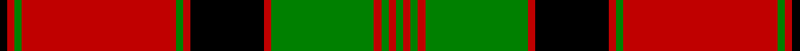

This is one **variant** — a specific cloth: this exact thread count and colourway, with its own
provenance below. It is one weaving of the [sett](/setts/k1r1g1r21g1r1k10r1g14r1g1r1g1/) (the scale-free proportion — the
same cloth at any scale or shade), whose colour order is pattern [GRGRGRKRGRGRK](/stripes/grgrgrkrgrgrk/).

Part of the [MacQuarrie 6](/tartans/m/ma/macquarrie-6/) tartan — the named design grouping this sett with its other cloths.

Sourced from register-of-tartans.  It is a [13 stripe tartan](/stripes/stripes13/).

Original link [https://www.tartanregister.gov.uk/tartanDetails.aspx?ref=2731](https://www.tartanregister.gov.uk/tartanDetails.aspx?ref=2731)

2 attestations — the source records this cloth was collapsed from (oldest owns this page)

<ul>
<li>undated — MacQuarrie #4 (register-of-tartans, <a href="https://www.tartanregister.gov.uk/tartanDetails.aspx?ref=2731">record</a>)  <em>This sample comes from the MacGregor-Hastie collection which forms the basis of the cloth archive of the Scottish Tartans Society. Some of the samples, including this one, were unmarked. One can assume that the sample dates between 1930 and 1950.</em></li>
<li>undated — MacQuarrie 6 (weddslist, <a href="http://www.weddslist.com/cgi-bin/tartans/pg.pl?source=sts">record</a>) </li>
</ul>

Dataset <small>— provenance for this record, inherited from the source manifest</small>

<dl class="dataset-prov">
<dt>source</dt><dd><a href="/sources/register-of-tartans/">Scottish Register of Tartans</a></dd>
<dt>data captured from</dt><dd><a href="https://github.com/thetartan/tartan-database/blob/master/data/register-of-tartans/data.csv">https://github.com/thetartan/tartan-database/blob/master/data/register-of-tartans/data.csv</a></dd>
<dt>data date</dt><dd>2017-01-06 <small>(dataset default)</small></dd>
<dt>licence</dt><dd><a href="https://www.tartanregister.gov.uk/copyright">Crown copyright</a></dd>
</dl>

Capture chain <small>— the hands this data passed through, oldest first; each capture carries its own licence</small>

<ol class="capture-chain">
<li><a href="https://www.tartanregister.gov.uk/">Scottish Register of Tartans</a> · <a href="https://www.tartanregister.gov.uk/copyright">Crown copyright</a> <small>the living register — still published by National Records of Scotland</small></li>
<li><a href="https://github.com/thetartan/tartan-database">thetartan/tartan-database</a> <small>2016-2017</small> · <a href="https://creativecommons.org/licenses/by-nc-nd/4.0/">CC BY-NC-ND 4.0</a> <small>Levko Kravets's frozen compilation — the capture we vendored, and where its CC licence text came from</small></li>
<li>this dictionary <small>captured 2026-06-10 · commit 5bf86c7566</small> <small>each re-capture is a git commit to data/sources</small></li>
</ol>

## Register references

External register numbers recorded for this tartan.

- Scottish Register of Tartans: [2731](https://www.tartanregister.gov.uk/tartanDetails.aspx?ref=2731)
- Scottish Tartans World Register: 872

## Thread count
K/2 R2 G2 R42 G2 R2 K20 R2 G28 R2 G2 R2 G/2

One full sett is **216 threads**.

## Palette
<table><thead><tr><th>Colour</th><th>Shade</th><th>OKLCh</th></tr></thead><tbody><tr><td>G</td><td><code style="background-color:#008B2A;">#008B2A</code> <small style="color:#888">#008B2A</small></td><td><small style="color:#888">oklch(55.4% 0.170 145.9)</small></td></tr><tr><td>K</td><td><code style="background-color:#000000;">#000000</code> <small style="color:#888">#000000</small></td><td><small style="color:#888">oklch(0.0% 0.000 0.0)</small></td></tr><tr><td>R</td><td><code style="background-color:#D60020;">#D60020</code> <small style="color:#888">#D60020</small></td><td><small style="color:#888">oklch(55.2% 0.224 25.5)</small></td></tr></tbody></table>

# Sample pattern

## Nearest tartan variants

The nearest existing variants by ΔTartan distance, with this cloth at the top so the swatches line up against it.

ΔTartan

Threads

Variant

Sett

—

216

<a href="/variants/s13/k1r1g1r21g1r1k10r1g14r1g1r1g1~x2/">MacQuarrie #4</a>

<a href="/ttd/edit/#slug=r1w1g1r16g7r1w1g1w1r1g7w2r1g1~x2&amp;base=k1r1g1r21g1r1k10r1g14r1g1r1g1~x2" title="compare in the TTD">2.43</a>

164

<a href="/variants/s14/r1w1g1r16g7r1w1g1w1r1g7w2r1g1~x2/">Mordente Family Tartan</a>

<a href="/ttd/edit/#slug=g1r2g1r26g1r1db14r1g21r1g1r2g1&amp;base=k1r1g1r21g1r1k10r1g14r1g1r1g1~x2" title="compare in the TTD">2.50</a>

144

<a href="/variants/s13/g1r2g1r26g1r1db14r1g21r1g1r2g1/">MacQuarrie 1815</a>

<a href="/ttd/edit/#slug=g2r3g2r52g2r2db28r2g42r2g2r3g2~x2&amp;base=k1r1g1r21g1r1k10r1g14r1g1r1g1~x2" title="compare in the TTD">2.50</a>

568

<a href="/variants/s13/g2r3g2r52g2r2db28r2g42r2g2r3g2~x2/">MacQuarrie #3</a>

<a href="/ttd/edit/#slug=g2r3g2r52g2r2db28r2g42r2g2r3g2&amp;base=k1r1g1r21g1r1k10r1g14r1g1r1g1~x2" title="compare in the TTD">2.50</a>

284

<a href="/variants/s13/g2r3g2r52g2r2db28r2g42r2g2r3g2/">MacQuarrie 1815</a>

<a href="/ttd/edit/#slug=g20k1g2k1g3k14r28k1r2k4~x2&amp;base=k1r1g1r21g1r1k10r1g14r1g1r1g1~x2" title="compare in the TTD">2.62</a>

256

<a href="/variants/s10/g20k1g2k1g3k14r28k1r2k4~x2/">Kerr</a>

<a href="/ttd/edit/#slug=g22k1g2k1g3k8r20k1r3~x4&amp;base=k1r1g1r21g1r1k10r1g14r1g1r1g1~x2" title="compare in the TTD">2.72</a>

388

<a href="/variants/s9/g22k1g2k1g3k8r20k1r3~x4/">Stewart of Atholl (Clan)</a>

<a href="/ttd/edit/#slug=r5k2r2g42r5k36r70k2y2r7g2&amp;base=k1r1g1r21g1r1k10r1g14r1g1r1g1~x2" title="compare in the TTD">2.77</a>

343

<a href="/variants/s11/r5k2r2g42r5k36r70k2y2r7g2/">MacPherson of Cluny</a>

<a href="/ttd/edit/#slug=g22k1g2k1g3k8r20k1r6~x2&amp;base=k1r1g1r21g1r1k10r1g14r1g1r1g1~x2" title="compare in the TTD">2.85</a>

200

<a href="/variants/s9/g22k1g2k1g3k8r20k1r6~x2/">Stewart of Athol Clan Tartan</a>

<a href="/ttd/edit/#slug=dg44r2k5dg4r2k1dg2r10dg2k1r2dg4k5r2w1r44~x2&amp;base=k1r1g1r21g1r1k10r1g14r1g1r1g1~x2" title="compare in the TTD">2.89</a>

348

<a href="/variants/s16/dg44r2k5dg4r2k1dg2r10dg2k1r2dg4k5r2w1r44~x2/">Gudbrandsdalen, Mannsdrakt</a>

<a href="/ttd/edit/#slug=r47dg14k5y2k3dg7~x2&amp;base=k1r1g1r21g1r1k10r1g14r1g1r1g1~x2" title="compare in the TTD">2.97</a>

204

<a href="/variants/s6/r47dg14k5y2k3dg7~x2/">Harbor Club (Corporate)</a>

## Neighbour map

Every grey dot is one of 13621 variants placed by the first two principal components of the ΔTartan feature space (42% of its variance). Red is this tartan; blue dots are its nearest — click one to open its page.

<svg viewBox="0 0 640 380" role="img" style="max-width:100%;height:auto;border:1px solid #e0e0e0;border-radius:4px;display:block" xmlns="http://www.w3.org/2000/svg"><image href="/nn/cloud.v1.png" width="640" height="380"/><a href="/variants/s14/r1w1g1r16g7r1w1g1w1r1g7w2r1g1~x2/"><circle cx="318.4" cy="137.8" r="4" fill="#3465a4"><title>Mordente Family Tartan</title></circle></a><a href="/variants/s13/g1r2g1r26g1r1db14r1g21r1g1r2g1/"><circle cx="324.6" cy="118.9" r="4" fill="#3465a4"><title>MacQuarrie 1815</title></circle></a><a href="/variants/s13/g2r3g2r52g2r2db28r2g42r2g2r3g2~x2/"><circle cx="322.2" cy="117.9" r="4" fill="#3465a4"><title>MacQuarrie #3</title></circle></a><a href="/variants/s13/g2r3g2r52g2r2db28r2g42r2g2r3g2/"><circle cx="322.2" cy="117.9" r="4" fill="#3465a4"><title>MacQuarrie 1815</title></circle></a><a href="/variants/s10/g20k1g2k1g3k14r28k1r2k4~x2/"><circle cx="231.9" cy="114.2" r="4" fill="#3465a4"><title>Kerr</title></circle></a><a href="/variants/s9/g22k1g2k1g3k8r20k1r3~x4/"><circle cx="255.7" cy="133.4" r="4" fill="#3465a4"><title>Stewart of Atholl (Clan)</title></circle></a><a href="/variants/s11/r5k2r2g42r5k36r70k2y2r7g2/"><circle cx="279.9" cy="74.7" r="4" fill="#3465a4"><title>MacPherson of Cluny</title></circle></a><a href="/variants/s9/g22k1g2k1g3k8r20k1r6~x2/"><circle cx="248.6" cy="137.9" r="4" fill="#3465a4"><title>Stewart of Athol Clan Tartan</title></circle></a><a href="/variants/s16/dg44r2k5dg4r2k1dg2r10dg2k1r2dg4k5r2w1r44~x2/"><circle cx="316.6" cy="47.0" r="4" fill="#3465a4"><title>Gudbrandsdalen, Mannsdrakt</title></circle></a><a href="/variants/s6/r47dg14k5y2k3dg7~x2/"><circle cx="266.2" cy="107.2" r="4" fill="#3465a4"><title>Harbor Club (Corporate)</title></circle></a><circle cx="270.4" cy="99.2" r="5" fill="#c00000"/><text x="320" y="376" text-anchor="middle" font-size="11" fill="#999">ground</text><text x="11" y="190" text-anchor="middle" font-size="11" fill="#999" transform="rotate(-90 11 190)">complexity</text></svg>

ID: /variants/s13/k1r1g1r21g1r1k10r1g14r1g1r1g1~x2/
