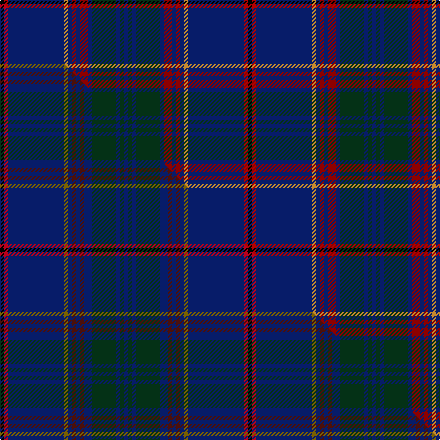

This is one **variant** — a specific cloth: this exact thread count and colourway, with its own
provenance below. It is one weaving of the [sett](/tartans/m/me/merchant-company-the/) (the scale-free proportion — the
same cloth at any scale or shade), whose colour order is pattern [BGBGBRBRBYBRK](/stripes/bgbgbrbrbybrk/).

Part of the [Merchant Company, The](/tartans/m/me/merchant-company-the/) tartan — the named design grouping this sett with its other cloths.

Sourced from tartans-authority.  It is a [13 stripe tartan](/stripes/stripes13/).

Original link <code>http://www.tartansauthority.com/tartan-ferret/display/11128/</code> — retired · [Internet Archive copy](https://web.archive.org/web/*/http://www.tartansauthority.com/tartan-ferret/display/11128/*)

Dataset <small>— provenance for this record, inherited from the source manifest</small>

<dl class="dataset-prov">
<dt>source</dt><dd><a href="/sources/tartans-authority/">Scottish Tartans Authority</a></dd>
<dt>data captured from</dt><dd><a href="https://github.com/thetartan/tartan-database/blob/master/data/tartans-authority/data.csv">https://github.com/thetartan/tartan-database/blob/master/data/tartans-authority/data.csv</a></dd>
<dt>data date</dt><dd>2014 <small>(this record)</small></dd>
<dt>licence</dt><dd><a href="https://creativecommons.org/licenses/by-nc-nd/4.0/">CC BY-NC-ND 4.0</a></dd>
</dl>

Capture chain <small>— the hands this data passed through, oldest first; each capture carries its own licence</small>

<ol class="capture-chain">
<li><a href="https://www.tartansauthority.com/">Scottish Tartans Authority</a> <small>the heritage body’s archive — its tartan-ferret record browser is retired; dead record links are shown unlinked, with an Internet Archive copy (ITI numbers are not SRT references)</small></li>
<li><a href="https://github.com/thetartan/tartan-database">thetartan/tartan-database</a> <small>2016-2017</small> · <a href="https://creativecommons.org/licenses/by-nc-nd/4.0/">CC BY-NC-ND 4.0</a> <small>Levko Kravets's frozen compilation — the capture we vendored, and where its CC licence text came from</small></li>
<li>this dictionary <small>captured 2026-06-10 · commit 5bf86c7566</small> <small>each re-capture is a git commit to data/sources</small></li>
</ol>

## Register references

External register numbers recorded for this tartan.

- Scottish Register of Tartans: [11128](https://www.tartanregister.gov.uk/tartanDetails?ref=11128)
- Scottish Tartans Authority (ITI): 11128

## Thread count
K/4 Ri4 DB56 LO4 DB4 R4 DB4 R8 DB4 DG24 DB4 DG4 DB/4

One full sett is **248 threads**.

## Palette
<table><thead><tr><th>Colour</th><th>Shade</th><th>OKLCh</th></tr></thead><tbody><tr><td>DB</td><td><code style="background-color:#082077;">#082077</code> <small style="color:#888">#082077</small></td><td><small style="color:#888">oklch(30.0% 0.149 265.1)</small></td></tr><tr><td>DG</td><td><code style="background-color:#053819;">#053819</code> <small style="color:#888">#053819</small></td><td><small style="color:#888">oklch(30.0% 0.075 151.3)</small></td></tr><tr><td>R</td><td><code style="background-color:#A00000;">#A00000</code> <small style="color:#888">#A00000</small></td><td><small style="color:#888">oklch(44.3% 0.182 29.2)</small></td></tr><tr><td>LO</td><td><code style="background-color:#FF9C34;">#FF9C34</code> <small style="color:#888">#FF9C34</small></td><td><small style="color:#888">oklch(77.9% 0.161 61.8)</small></td></tr><tr><td>K</td><td><code style="background-color:#000000;">#000000</code> <small style="color:#888">#000000</small></td><td><small style="color:#888">oklch(0.0% 0.000 0.0)</small></td></tr><tr><td>R</td><td><code style="background-color:#C80000;">#C80000</code> <small style="color:#888">#C80000</small></td><td><small style="color:#888">oklch(52.3% 0.215 29.2)</small></td></tr></tbody></table>

# Sample pattern

## Compared to the master

This cloth is one sett of its design; the master sett (the exemplar the design is anchored on) is below for comparison.

Its **ΔTartan distance** from the master is **0.44** — the same measure the nearest-tartans table ranks by (0 is identical; a re-scale of the same cloth is near 0, a recolour or a different proportion further).

<figure class="master-compare" style="margin:0">

this sett
master sett ★

<figcaption style="color:#888;font-size:smaller">One weave of this sett against the <a href="/setts/k1r1db14y1db1dr1db1dr1db2dg6db1dg1db1/">master sett ★</a>, split on the diagonal: a shared proportion runs seamlessly across it with only the shades shifting; a different proportion breaks on it.</figcaption>
</figure>

## Nearest tartan variants

The nearest existing variants by ΔTartan distance, with this cloth at the top so the swatches line up against it.

ΔTartan

Threads

Variant

Sett

—

248

<a href="/variants/s13/k1ri1db14lo1db1r1db1r2db1dg6db1dg1db1~x4~ri2109032-r1807033/">Merchant Company, The</a>

<a href="/ttd/edit/#slug=k1r1db14y1db1dr1db1dr1db2dg6db1dg1db1~x4&amp;base=k1ri1db14lo1db1r1db1r2db1dg6db1dg1db1~x4~ri2109032-r1807033" title="compare in the TTD">0.44</a>

248

<a href="/variants/s13/k1r1db14y1db1dr1db1dr1db2dg6db1dg1db1~x4/">Merchant Company, The</a>

<a href="/ttd/edit/#slug=db92k14db18t5db5t5db5g32dp16k5dp7y8~db1406275-dp1607327&amp;base=k1ri1db14lo1db1r1db1r2db1dg6db1dg1db1~x4~ri2109032-r1807033" title="compare in the TTD">2.20</a>

324

<a href="/variants/s12/db92k14db18t5db5t5db5g32dp16k5dp7y8~db1406275-dp1607327/">Bavidge (Personal)</a>

<a href="/ttd/edit/#slug=db92k14db18t5db5t5db5g32dp16k5dp7y8&amp;base=k1ri1db14lo1db1r1db1r2db1dg6db1dg1db1~x4~ri2109032-r1807033" title="compare in the TTD">2.36</a>

324

<a href="/variants/s12/db92k14db18t5db5t5db5g32dp16k5dp7y8/">Bavidge (Personal)</a>

<a href="/ttd/edit/#slug=db92k14db18n5db5n5db5dg32b16k5b7y8~db0805267-n1604274&amp;base=k1ri1db14lo1db1r1db1r2db1dg6db1dg1db1~x4~ri2109032-r1807033" title="compare in the TTD">2.40</a>

324

<a href="/variants/s12/db92k14db18dbi5db5dbi5db5dg32b16k5b7y8~db0805267-dbi1604274/">Bavidge</a>

<a href="/ttd/edit/#slug=g5db2k2db29dr2db2dr15ly2db4w2~x2&amp;base=k1ri1db14lo1db1r1db1r2db1dg6db1dg1db1~x4~ri2109032-r1807033" title="compare in the TTD">2.66</a>

246

<a href="/variants/s10/g5db2k2db29dr2db2dr15ly2db4w2~x2/">Bro-Naoned (Corporate)</a>

<a href="/ttd/edit/#slug=dt6y3k2y5db30g2k4g2db6dt4~x2~dt1204274-db1406275&amp;base=k1ri1db14lo1db1r1db1r2db1dg6db1dg1db1~x4~ri2109032-r1807033" title="compare in the TTD">2.68</a>

236

<a href="/variants/s10/db6y3k2y5dbi30g2k4g2dbi6db4~x2~db1204274-dbi1406275/">St. Andrews University (Corporate)</a>

<a href="/ttd/edit/#slug=db42dp4db16dg10k2r6k2dg10k3w4~x2&amp;base=k1ri1db14lo1db1r1db1r2db1dg6db1dg1db1~x4~ri2109032-r1807033" title="compare in the TTD">2.86</a>

304

<a href="/variants/s10/db42dp4db16dg10k2r6k2dg10k3w4~x2/">Mount Dora</a>

<a href="/ttd/edit/#slug=db56dg11r2dg7k2dg7r2dg7dt3lo4~x2~db1406275-dt1204274&amp;base=k1ri1db14lo1db1r1db1r2db1dg6db1dg1db1~x4~ri2109032-r1807033" title="compare in the TTD">2.94</a>

284

<a href="/variants/s10/dbi56dg11r2dg7k2dg7r2dg7db3lo4~x2~dbi1406275-db1204274/">CAL FIRE Local 2881</a>

<a href="/ttd/edit/#slug=dbi19k4dbi4db1dbi1db1dbi1dg5b3k1b4~x6~dbi1003265-dg1304144&amp;base=k1ri1db14lo1db1r1db1r2db1dg6db1dg1db1~x4~ri2109032-r1807033" title="compare in the TTD">3.01</a>

390

<a href="/variants/s11/dbi19k4dbi4db1dbi1db1dbi1dg5b3k1b4~x6~dbi1003265-dg1304144/">Spirit of Scotland</a>

<a href="/ttd/edit/#slug=db42n2db2n4y4ly2y6k9y2k2r2~x2~y2204115-ly3206085&amp;base=k1ri1db14lo1db1r1db1r2db1dg6db1dg1db1~x4~ri2109032-r1807033" title="compare in the TTD">3.08</a>

220

<a href="/variants/s11/db42n2db2n4y4ly2y6k9y2k2r2~x2~y2204115-ly3206085/">Dama Weekend</a>

## Neighbour map

Every grey dot is one of 13657 variants placed by the first two principal components of the ΔTartan feature space (42% of its variance). Red is this tartan; blue dots are its nearest — click one to open its page. The map is a flat projection of a many-dimensional space — [how to read it](/posts/neighbourhood-maps/).

<svg viewBox="0 0 640 380" role="img" style="max-width:100%;height:auto;border:1px solid #e0e0e0;border-radius:4px;display:block" xmlns="http://www.w3.org/2000/svg"><image href="/nn/cloud.v1.png" width="640" height="380"/><a href="/variants/s13/k1r1db14y1db1dr1db1dr1db2dg6db1dg1db1~x4/"><circle cx="390.8" cy="116.9" r="4" fill="#3465a4"><title>Merchant Company, The</title></circle></a><a href="/variants/s12/db92k14db18t5db5t5db5g32dp16k5dp7y8~db1406275-dp1607327/"><circle cx="294.8" cy="98.6" r="4" fill="#3465a4"><title>Bavidge (Personal)</title></circle></a><a href="/variants/s12/db92k14db18t5db5t5db5g32dp16k5dp7y8/"><circle cx="291.7" cy="99.9" r="4" fill="#3465a4"><title>Bavidge (Personal)</title></circle></a><a href="/variants/s12/db92k14db18dbi5db5dbi5db5dg32b16k5b7y8~db0805267-dbi1604274/"><circle cx="314.6" cy="106.9" r="4" fill="#3465a4"><title>Bavidge</title></circle></a><a href="/variants/s10/g5db2k2db29dr2db2dr15ly2db4w2~x2/"><circle cx="289.5" cy="111.7" r="4" fill="#3465a4"><title>Bro-Naoned (Corporate)</title></circle></a><a href="/variants/s10/db6y3k2y5dbi30g2k4g2dbi6db4~x2~db1204274-dbi1406275/"><circle cx="323.2" cy="137.3" r="4" fill="#3465a4"><title>St. Andrews University (Corporate)</title></circle></a><a href="/variants/s10/db42dp4db16dg10k2r6k2dg10k3w4~x2/"><circle cx="294.9" cy="103.1" r="4" fill="#3465a4"><title>Mount Dora</title></circle></a><a href="/variants/s10/dbi56dg11r2dg7k2dg7r2dg7db3lo4~x2~dbi1406275-db1204274/"><circle cx="367.2" cy="92.3" r="4" fill="#3465a4"><title>CAL FIRE Local 2881</title></circle></a><a href="/variants/s11/dbi19k4dbi4db1dbi1db1dbi1dg5b3k1b4~x6~dbi1003265-dg1304144/"><circle cx="347.5" cy="132.8" r="4" fill="#3465a4"><title>Spirit of Scotland</title></circle></a><a href="/variants/s11/db42n2db2n4y4ly2y6k9y2k2r2~x2~y2204115-ly3206085/"><circle cx="289.5" cy="73.3" r="4" fill="#3465a4"><title>Dama Weekend</title></circle></a><circle cx="327.3" cy="101.5" r="5" fill="#c00000"/><text x="320" y="376" text-anchor="middle" font-size="11" fill="#999">ground</text><text x="11" y="190" text-anchor="middle" font-size="11" fill="#999" transform="rotate(-90 11 190)">complexity</text></svg>

ID: /variants/s13/k1ri1db14lo1db1r1db1r2db1dg6db1dg1db1~x4~ri2109032-r1807033/
