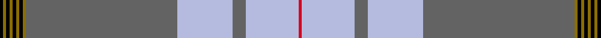

This is one **variant** — a specific cloth: this exact thread count and colourway, with its own
provenance below. It is one weaving of the [sett](/setts/k1y1k1y1k1y1k1y1n46lb17n4lb16r1/) (the scale-free proportion — the
same cloth at any scale or shade), whose colour order is pattern [KGKGKGKGBWBWR](/stripes/kgkgkgkgbwbwr/).

Part of the [Saunders](/tartans/saunders/) tartan — the named design grouping this sett with its other cloths.

Sourced from register-of-tartans.  It is a [13 stripe tartan](/stripes/stripes13/).

Original link [https://www.tartanregister.gov.uk/tartanDetails.aspx?ref=10109](https://www.tartanregister.gov.uk/tartanDetails.aspx?ref=10109)

Dataset <small>— provenance for this record, inherited from the source manifest</small>

<dl class="dataset-prov">
<dt>source</dt><dd><a href="/sources/register-of-tartans/">Scottish Register of Tartans</a></dd>
<dt>data captured from</dt><dd><a href="https://github.com/thetartan/tartan-database/blob/master/data/register-of-tartans/data.csv">https://github.com/thetartan/tartan-database/blob/master/data/register-of-tartans/data.csv</a></dd>
<dt>data date</dt><dd>11/11/2009 <small>(this record)</small></dd>
<dt>licence</dt><dd><a href="https://www.tartanregister.gov.uk/copyright">Crown copyright</a></dd>
</dl>

Capture chain <small>— the hands this data passed through, oldest first; each capture carries its own licence</small>

<ol class="capture-chain">
<li><a href="https://www.tartanregister.gov.uk/">Scottish Register of Tartans</a> · <a href="https://www.tartanregister.gov.uk/copyright">Crown copyright</a> <small>the living register — still published by National Records of Scotland</small></li>
<li><a href="https://github.com/thetartan/tartan-database">thetartan/tartan-database</a> <small>2016-2017</small> · <a href="https://creativecommons.org/licenses/by-nc-nd/4.0/">CC BY-NC-ND 4.0</a> <small>Levko Kravets's frozen compilation — the capture we vendored, and where its CC licence text came from</small></li>
<li>this dictionary <small>captured 2026-06-10 · commit 5bf86c7566</small> <small>each re-capture is a git commit to data/sources</small></li>
</ol>

## Register references

External register numbers recorded for this tartan.

- Scottish Register of Tartans: [10109](https://www.tartanregister.gov.uk/tartanDetails.aspx?ref=10109)

## Thread count
K/2 Y2 K2 Y2 K2 Y2 K2 Y2 N92 LB34 N8 LB32 R/2

One full sett is **364 threads**.

## Palette
<table><thead><tr><th>Colour</th><th>Shade</th><th>OKLCh</th></tr></thead><tbody><tr><td>R</td><td><code style="background-color:#D60020;">#D60020</code> <small style="color:#888">#D60020</small></td><td><small style="color:#888">oklch(55.2% 0.224 25.5)</small></td></tr><tr><td>K</td><td><code style="background-color:#000000;">#000000</code> <small style="color:#888">#000000</small></td><td><small style="color:#888">oklch(0.0% 0.000 0.0)</small></td></tr><tr><td>Y</td><td><code style="background-color:#8B6E00;">#8B6E00</code> <small style="color:#888">#8B6E00</small></td><td><small style="color:#888">oklch(55.1% 0.113 90.4)</small></td></tr><tr><td>LB</td><td><code style="background-color:#B5BBDE;">#B5BBDE</code> <small style="color:#888">#B5BBDE</small></td><td><small style="color:#888">oklch(79.9% 0.050 277.6)</small></td></tr><tr><td>N</td><td><code style="background-color:#636363;">#636363</code> <small style="color:#888">#636363</small></td><td><small style="color:#888">oklch(50.0% 0.000 89.9)</small></td></tr></tbody></table>

# Sample pattern

## Nearest tartan variants

The nearest existing variants by ΔTartan distance, with this cloth at the top so the swatches line up against it.

ΔTartan

Threads

Variant

Sett

—

364

<a href="/variants/s13/k1y1k1y1k1y1k1y1n46lb17n4lb16r1~x2/">Saunders (Personal)</a>

<a href="/ttd/edit/#slug=k1y1k1y1k1y1n46lb17n4lb16r1~x2&amp;base=k1y1k1y1k1y1k1y1n46lb17n4lb16r1~x2" title="compare in the TTD">0.60</a>

356

<a href="/variants/s11/k1y1k1y1k1y1n46lb17n4lb16r1~x2/">Saunders (Personal)</a>

<a href="/ttd/edit/#slug=r2lb2r1lb24o1n3k3lb3o12lb4r1~x2~o2500000-n1900000&amp;base=k1y1k1y1k1y1k1y1n46lb17n4lb16r1~x2" title="compare in the TTD">3.45</a>

218

<a href="/variants/s11/r2lb2r1lb24o1n3k3lb3o12lb4r1~x2~o2500000-n1900000/">Dabney Grey (Personal)</a>

<a href="/ttd/edit/#slug=r25k1y2k1y2k1r10t18w2t12~x2&amp;base=k1y1k1y1k1y1k1y1n46lb17n4lb16r1~x2" title="compare in the TTD">3.45</a>

222

<a href="/variants/s10/r25k1y2k1y2k1r10t18w2t12~x2/">Richardson (Personal?)</a>

<a href="/ttd/edit/#slug=t12n4r4n4k2n56r18w1db4w3db4w1~x2~t2405244-r2109032-db1406275&amp;base=k1y1k1y1k1y1k1y1n46lb17n4lb16r1~x2" title="compare in the TTD">3.57</a>

426

<a href="/variants/s12/t12n4r4n4k2n56r18w1db4w3db4w1~x2~t2405244-r2109032-db1406275/">Confederate Memorial</a>

<a href="/ttd/edit/#slug=w2o15b10o4b2k2b2o4b50o4b2k2b2o4b10o15lb2~x2&amp;base=k1y1k1y1k1y1k1y1n46lb17n4lb16r1~x2" title="compare in the TTD">3.62</a>

520

<a href="/variants/s17/w2o15b10o4b2k2b2o4b50o4b2k2b2o4b10o15lb2~x2/">Australian, The</a>

<a href="/ttd/edit/#slug=t50r3t4k8n4k2y3k2r12w2r4t4~x2&amp;base=k1y1k1y1k1y1k1y1n46lb17n4lb16r1~x2" title="compare in the TTD">3.69</a>

284

<a href="/variants/s12/t50r3t4k8n4k2y3k2r12w2r4t4~x2/">City of Barrie</a>

<a href="/ttd/edit/#slug=n3db1n1r1n1r1db10lb1n9lb35y2lb2y1n2~x2&amp;base=k1y1k1y1k1y1k1y1n46lb17n4lb16r1~x2" title="compare in the TTD">3.73</a>

270

<a href="/variants/s14/n3db1n1r1n1r1db10lb1n9lb35y2lb2y1n2~x2/">De Clercq, Christian Family (Belgium)</a>

<a href="/ttd/edit/#slug=lb4dr2lb7n30lb8n7r5k1w2~x2&amp;base=k1y1k1y1k1y1k1y1n46lb17n4lb16r1~x2" title="compare in the TTD">3.85</a>

252

<a href="/variants/s9/lb4dr2lb7n30lb8n7r5k1w2~x2/">Hebridean Fire</a>

<a href="/ttd/edit/#slug=w5n38o3db11o1db11o3n4w5lr1~x2~n1900000-o2500000&amp;base=k1y1k1y1k1y1k1y1n46lb17n4lb16r1~x2" title="compare in the TTD">3.91</a>

316

<a href="/variants/s10/w5n38o3db11o1db11o3n4w5lr1~x2~n1900000-o2500000/">Ballarat</a>

<a href="/ttd/edit/#slug=r6ri1db2r2g40r6db13lb1r48g2r4ri1g4~x2~r1807008-ri2406019&amp;base=k1y1k1y1k1y1k1y1n46lb17n4lb16r1~x2" title="compare in the TTD">3.92</a>

500

<a href="/variants/s13/r6ri1db2r2g40r6db13lb1r48g2r4ri1g4~x2~r1807008-ri2406019/">MacDonald of Glencoe Artifact Tartan</a>

## Neighbour map

Every grey dot is one of 13621 variants placed by the first two principal components of the ΔTartan feature space (42% of its variance). Red is this tartan; blue dots are its nearest — click one to open its page.

<svg viewBox="0 0 640 380" role="img" style="max-width:100%;height:auto;border:1px solid #e0e0e0;border-radius:4px;display:block" xmlns="http://www.w3.org/2000/svg"><image href="/nn/cloud.v1.png" width="640" height="380"/><a href="/variants/s11/k1y1k1y1k1y1n46lb17n4lb16r1~x2/"><circle cx="371.8" cy="66.9" r="4" fill="#3465a4"><title>Saunders (Personal)</title></circle></a><a href="/variants/s11/r2lb2r1lb24o1n3k3lb3o12lb4r1~x2~o2500000-n1900000/"><circle cx="334.3" cy="105.4" r="4" fill="#3465a4"><title>Dabney Grey (Personal)</title></circle></a><a href="/variants/s10/r25k1y2k1y2k1r10t18w2t12~x2/"><circle cx="279.1" cy="110.9" r="4" fill="#3465a4"><title>Richardson (Personal?)</title></circle></a><a href="/variants/s12/t12n4r4n4k2n56r18w1db4w3db4w1~x2~t2405244-r2109032-db1406275/"><circle cx="365.9" cy="57.8" r="4" fill="#3465a4"><title>Confederate Memorial</title></circle></a><a href="/variants/s17/w2o15b10o4b2k2b2o4b50o4b2k2b2o4b10o15lb2~x2/"><circle cx="376.5" cy="84.6" r="4" fill="#3465a4"><title>Australian, The</title></circle></a><a href="/variants/s12/t50r3t4k8n4k2y3k2r12w2r4t4~x2/"><circle cx="292.7" cy="61.6" r="4" fill="#3465a4"><title>City of Barrie</title></circle></a><a href="/variants/s14/n3db1n1r1n1r1db10lb1n9lb35y2lb2y1n2~x2/"><circle cx="341.9" cy="73.5" r="4" fill="#3465a4"><title>De Clercq, Christian Family (Belgium)</title></circle></a><a href="/variants/s9/lb4dr2lb7n30lb8n7r5k1w2~x2/"><circle cx="315.4" cy="100.0" r="4" fill="#3465a4"><title>Hebridean Fire</title></circle></a><a href="/variants/s10/w5n38o3db11o1db11o3n4w5lr1~x2~n1900000-o2500000/"><circle cx="316.6" cy="105.8" r="4" fill="#3465a4"><title>Ballarat</title></circle></a><a href="/variants/s13/r6ri1db2r2g40r6db13lb1r48g2r4ri1g4~x2~r1807008-ri2406019/"><circle cx="352.0" cy="71.7" r="4" fill="#3465a4"><title>MacDonald of Glencoe Artifact Tartan</title></circle></a><circle cx="356.0" cy="52.8" r="5" fill="#c00000"/><text x="320" y="376" text-anchor="middle" font-size="11" fill="#999">ground</text><text x="11" y="190" text-anchor="middle" font-size="11" fill="#999" transform="rotate(-90 11 190)">complexity</text></svg>

ID: /variants/s13/k1y1k1y1k1y1k1y1n46lb17n4lb16r1~x2/
