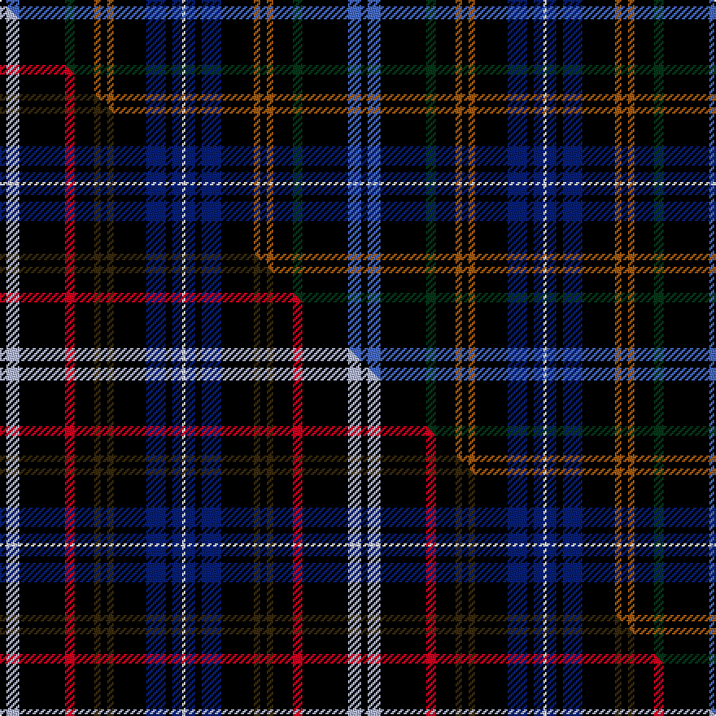

This is one **variant** — a specific cloth: this exact thread count and colourway, with its own
provenance below. It is one weaving of the [sett](/setts/k2b4k14dg3k6o2k2o2k10db6k2db3w1/) (the scale-free proportion — the
same cloth at any scale or shade), whose colour order is pattern [KBKGKRKRKBKBW](/stripes/kbkgkrkrkbkbw/).

Part of the [Kennedy](/tartans/k/ke/kennedy-7/) tartan — the named design grouping this sett with its other cloths.

Sourced from weddslist.  It is a [13 stripe tartan](/stripes/stripes13/).

Original link [http://www.weddslist.com/cgi-bin/tartans/pg.pl?source=sts](http://www.weddslist.com/cgi-bin/tartans/pg.pl?source=sts)

Dataset <small>— provenance for this record, inherited from the source manifest</small>

<dl class="dataset-prov">
<dt>source</dt><dd><a href="/sources/weddslist/">Weddslist</a></dd>
<dt>data captured from</dt><dd><a href="https://github.com/thetartan/tartan-database/blob/master/data/weddslist/data.csv">https://github.com/thetartan/tartan-database/blob/master/data/weddslist/data.csv</a></dd>
<dt>data date</dt><dd>2016-11-17 <small>(dataset default)</small></dd>
<dt>licence</dt><dd><a href="https://creativecommons.org/licenses/by-nc-nd/4.0/">CC BY-NC-ND 4.0</a></dd>
</dl>

Capture chain <small>— the hands this data passed through, oldest first; each capture carries its own licence</small>

<ol class="capture-chain">
<li><a href="https://www.weddslist.com/tartans/">Weddslist</a> <small>the living privately compiled reference</small></li>
<li><a href="https://github.com/thetartan/tartan-database">thetartan/tartan-database</a> <small>2016-2017</small> · <a href="https://creativecommons.org/licenses/by-nc-nd/4.0/">CC BY-NC-ND 4.0</a> <small>Levko Kravets's frozen compilation — the capture we vendored, and where its CC licence text came from</small></li>
<li>this dictionary <small>captured 2026-06-10 · commit 5bf86c7566</small> <small>each re-capture is a git commit to data/sources</small></li>
</ol>

## Thread count
K/4 B8 K28 DG6 K12 O4 K4 O4 K20 DB12 K4 DB6 W/2

One full sett is **222 threads**.

## Palette
<table><thead><tr><th>Colour</th><th>Shade</th><th>OKLCh</th></tr></thead><tbody><tr><td>B</td><td><code style="background-color:#466CC8;">#466CC8</code> <small style="color:#888">#466CC8</small></td><td><small style="color:#888">oklch(55.1% 0.149 265.0)</small></td></tr><tr><td>DB</td><td><code style="background-color:#082077;">#082077</code> <small style="color:#888">#082077</small></td><td><small style="color:#888">oklch(30.0% 0.149 265.1)</small></td></tr><tr><td>K</td><td><code style="background-color:#000000;">#000000</code> <small style="color:#888">#000000</small></td><td><small style="color:#888">oklch(0.0% 0.000 0.0)</small></td></tr><tr><td>W</td><td><code style="background-color:#F7F7F7;">#F7F7F7</code> <small style="color:#888">#F7F7F7</small></td><td><small style="color:#888">oklch(97.6% 0.000 89.9)</small></td></tr><tr><td>O</td><td><code style="background-color:#A65C11;">#A65C11</code> <small style="color:#888">#A65C11</small></td><td><small style="color:#888">oklch(55.0% 0.125 58.3)</small></td></tr><tr><td>DG</td><td><code style="background-color:#053819;">#053819</code> <small style="color:#888">#053819</small></td><td><small style="color:#888">oklch(30.0% 0.075 151.3)</small></td></tr></tbody></table>

# Sample pattern

## Compared to the master

This cloth is one sett of its design; the master sett (the exemplar the design is anchored on) is below for comparison.

Its **ΔTartan distance** from the master is **0.90** — the same measure the nearest-tartans table ranks by (0 is identical; a re-scale of the same cloth is near 0, a recolour or a different proportion further).

<figure class="master-compare" style="margin:0">

this sett
master sett ★

<figcaption style="color:#888;font-size:smaller">One weave of this sett against the <a href="/setts/k2lb4k14r3k6dy2k2dy2k10db6k2db3w1/">master sett ★</a>, split on the diagonal: a shared proportion runs seamlessly across it with only the shades shifting; a different proportion breaks on it.</figcaption>
</figure>

## Nearest tartan variants

The nearest existing variants by ΔTartan distance, with this cloth at the top so the swatches line up against it.

ΔTartan

Threads

Variant

Sett

—

222

<a href="/variants/s13/k2b4k14dg3k6o2k2o2k10db6k2db3w1~x2/">Kennedy</a>

<a href="/ttd/edit/#slug=k2lb4k14r3k6dy2k2dy2k10db6k2db3w1~x2&amp;base=k2b4k14dg3k6o2k2o2k10db6k2db3w1~x2" title="compare in the TTD">0.90</a>

222

<a href="/variants/s13/k2lb4k14r3k6dy2k2dy2k10db6k2db3w1~x2/">Kennedy (Irish)</a>

<a href="/ttd/edit/#slug=k30r3db10y3k40lb5n5db8r3y5k25db8lb8k5&amp;base=k2b4k14dg3k6o2k2o2k10db6k2db3w1~x2" title="compare in the TTD">1.52</a>

281

<a href="/variants/s14/k30r3db10y3k40lb5n5db8r3y5k25db8lb8k5/">Parker Black (2009)</a>

<a href="/ttd/edit/#slug=g12k40db4lb4db4k28db7k8db7k8db10r4&amp;base=k2b4k14dg3k6o2k2o2k10db6k2db3w1~x2" title="compare in the TTD">2.36</a>

256

<a href="/variants/s12/g12k40db4lb4db4k28db7k8db7k8db10r4/">Pride of Wales (Fashion)</a>

<a href="/ttd/edit/#slug=k16n4lb3k2db1w1r1k2lb3n4k12~x4&amp;base=k2b4k14dg3k6o2k2o2k10db6k2db3w1~x2" title="compare in the TTD">2.66</a>

280

<a href="/variants/s11/k16n4lb3k2db1w1r1k2lb3n4k12~x4/">Iron Horse</a>

<a href="/ttd/edit/#slug=k10dp3db4dp3k7b3g8k17y2~x2&amp;base=k2b4k14dg3k6o2k2o2k10db6k2db3w1~x2" title="compare in the TTD">2.79</a>

204

<a href="/variants/s9/k10dp3db4dp3k7b3g8k17y2~x2/">Ayrshire Tourist Board</a>

<a href="/ttd/edit/#slug=k6r2k10o6k3lb8k3n9k13r5k1g2~x2~o2500000-n1900000&amp;base=k2b4k14dg3k6o2k2o2k10db6k2db3w1~x2" title="compare in the TTD">2.80</a>

256

<a href="/variants/s12/k6r2k10o6k3lb8k3n9k13r5k1g2~x2~o2500000-n1900000/">Dilanan (Musselburgh) (Personal)</a>

<a href="/ttd/edit/#slug=k15db7n3k13n3db7k23n3db7dy2dp4dy2~x2&amp;base=k2b4k14dg3k6o2k2o2k10db6k2db3w1~x2" title="compare in the TTD">3.17</a>

322

<a href="/variants/s12/k15db7n3k13n3db7k23n3db7dy2dp4dy2~x2/">Apache</a>

<a href="/ttd/edit/#slug=g2dr4g2k16g2k16g4k2g2k2g4k4db8k1lb2~x2&amp;base=k2b4k14dg3k6o2k2o2k10db6k2db3w1~x2" title="compare in the TTD">3.21</a>

276

<a href="/variants/s15/g2dr4g2k16g2k16g4k2g2k2g4k4db8k1lb2~x2/">MacKean Hunting</a>

<a href="/ttd/edit/#slug=r2k26db10w1k2g9k1dg9k26db1k26dg9k1g9k2w1db10k25r2w2~x2&amp;base=k2b4k14dg3k6o2k2o2k10db6k2db3w1~x2" title="compare in the TTD">3.33</a>

688

<a href="/variants/s20/r2k26db10w1k2g9k1dg9k26db1k26dg9k1g9k2w1db10k25r2w2~x2/">Binder (2013)</a>

<a href="/ttd/edit/#slug=k1db8k7n8y1n4k11t1k1db1k1db1k11db4t1~x4&amp;base=k2b4k14dg3k6o2k2o2k10db6k2db3w1~x2" title="compare in the TTD">3.34</a>

480

<a href="/variants/s15/k1db8k7n8y1n4k11t1k1db1k1db1k11db4t1~x4/">Shadow Halls</a>

## Neighbour map

Every grey dot is one of 13656 variants placed by the first two principal components of the ΔTartan feature space (42% of its variance). Red is this tartan; blue dots are its nearest — click one to open its page. The map is a flat projection of a many-dimensional space — [how to read it](/posts/neighbourhood-maps/).

<svg viewBox="0 0 640 380" role="img" style="max-width:100%;height:auto;border:1px solid #e0e0e0;border-radius:4px;display:block" xmlns="http://www.w3.org/2000/svg"><image href="/nn/cloud.v1.png" width="640" height="380"/><a href="/variants/s13/k2lb4k14r3k6dy2k2dy2k10db6k2db3w1~x2/"><circle cx="241.6" cy="112.1" r="4" fill="#3465a4"><title>Kennedy (Irish)</title></circle></a><a href="/variants/s14/k30r3db10y3k40lb5n5db8r3y5k25db8lb8k5/"><circle cx="245.7" cy="96.4" r="4" fill="#3465a4"><title>Parker Black (2009)</title></circle></a><a href="/variants/s12/g12k40db4lb4db4k28db7k8db7k8db10r4/"><circle cx="269.5" cy="139.9" r="4" fill="#3465a4"><title>Pride of Wales (Fashion)</title></circle></a><a href="/variants/s11/k16n4lb3k2db1w1r1k2lb3n4k12~x4/"><circle cx="266.6" cy="92.0" r="4" fill="#3465a4"><title>Iron Horse</title></circle></a><a href="/variants/s9/k10dp3db4dp3k7b3g8k17y2~x2/"><circle cx="212.7" cy="162.4" r="4" fill="#3465a4"><title>Ayrshire Tourist Board</title></circle></a><a href="/variants/s12/k6r2k10o6k3lb8k3n9k13r5k1g2~x2~o2500000-n1900000/"><circle cx="146.0" cy="135.9" r="4" fill="#3465a4"><title>Dilanan (Musselburgh) (Personal)</title></circle></a><a href="/variants/s12/k15db7n3k13n3db7k23n3db7dy2dp4dy2~x2/"><circle cx="272.7" cy="155.7" r="4" fill="#3465a4"><title>Apache</title></circle></a><a href="/variants/s15/g2dr4g2k16g2k16g4k2g2k2g4k4db8k1lb2~x2/"><circle cx="241.7" cy="109.6" r="4" fill="#3465a4"><title>MacKean Hunting</title></circle></a><a href="/variants/s20/r2k26db10w1k2g9k1dg9k26db1k26dg9k1g9k2w1db10k25r2w2~x2/"><circle cx="269.3" cy="63.0" r="4" fill="#3465a4"><title>Binder (2013)</title></circle></a><a href="/variants/s15/k1db8k7n8y1n4k11t1k1db1k1db1k11db4t1~x4/"><circle cx="223.8" cy="137.1" r="4" fill="#3465a4"><title>Shadow Halls</title></circle></a><circle cx="252.3" cy="116.8" r="5" fill="#c00000"/><text x="320" y="376" text-anchor="middle" font-size="11" fill="#999">ground</text><text x="11" y="190" text-anchor="middle" font-size="11" fill="#999" transform="rotate(-90 11 190)">complexity</text></svg>

ID: /variants/s13/k2b4k14dg3k6o2k2o2k10db6k2db3w1~x2/
