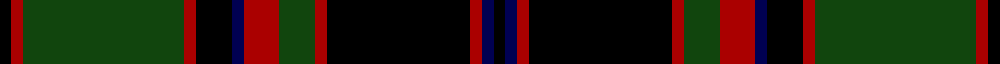

This page is one **sett** — a single exact thread-count. It belongs to the [tartan](/setts/k2db2r2k24r2dg6r6db2k6r2dg27r2k2/)
(the same proportion at any scale), whose colour order is pattern [KBRKRGRBKRGRK](/stripes/kbrkrgrbkrgrk/).

Part of the [Buchan](/tartans/buchan/) tartan — the named design grouping this sett with its other cloths.

Sourced from weddslist.  It is a [13 stripe tartan](/stripes/stripes13/).

Original link http://www.weddslist.com/cgi-bin/tartans/pg.pl?source=tinsel

## Also known as

This cloth is also recorded under:

- Buchan Cumming MacIntyre
- Buchan, Cumming MacIntyre

## Thread count
K/4 DR4 DG54 DR4 K12 DB4 DR12 DG12 DR4 K48 DR4 DB4 K/4

One full sett is **332 threads**.

## Palette

Palette: <strong>Ingles Buchan</strong> <small style="color:#888">(1 of 4 colours)</small>
<table><thead><tr><th>Colour</th><th>Threads</th><th>Shade</th><th>Base</th><th>OKLCh</th></tr></thead><tbody><tr><td>K/</td><td style="text-align:right;font-variant-numeric:tabular-nums">4</td><td><code style="background-color:#000000;">#000000</code> <small style="color:#888">#000000</small></td><td>K <code style="background-color:#000000;">#000000</code></td><td><small style="color:#888">oklch(0.0% 0.000 0.0)</small></td></tr><tr><td>DR</td><td style="text-align:right;font-variant-numeric:tabular-nums">4</td><td><code style="background-color:#AA0000;">#AA0000</code> <small style="color:#888">#AA0000</small></td><td>R <code style="background-color:#CC0000;">#CC0000</code></td><td><small style="color:#888">oklch(46.3% 0.190 29.2)</small></td></tr><tr><td>DG</td><td style="text-align:right;font-variant-numeric:tabular-nums">54</td><td><code style="background-color:#11450D;">#11450D</code> <small style="color:#888">#11450D</small></td><td>G <code style="background-color:#006100;">#006100</code></td><td><small style="color:#888">oklch(34.4% 0.101 142.1)</small></td></tr><tr><td>DR</td><td style="text-align:right;font-variant-numeric:tabular-nums">4</td><td><code style="background-color:#AA0000;">#AA0000</code> <small style="color:#888">#AA0000</small></td><td>R <code style="background-color:#CC0000;">#CC0000</code></td><td><small style="color:#888">oklch(46.3% 0.190 29.2)</small></td></tr><tr><td>K</td><td style="text-align:right;font-variant-numeric:tabular-nums">12</td><td><code style="background-color:#000000;">#000000</code> <small style="color:#888">#000000</small></td><td>K <code style="background-color:#000000;">#000000</code></td><td><small style="color:#888">oklch(0.0% 0.000 0.0)</small></td></tr><tr><td>DB</td><td style="text-align:right;font-variant-numeric:tabular-nums">4</td><td><code style="background-color:#000052;">#000052</code> <small style="color:#888">#000052</small></td><td>B <code style="background-color:#2A418A;">#2A418A</code></td><td><small style="color:#888">oklch(19.8% 0.137 264.1)</small></td></tr><tr><td>DR</td><td style="text-align:right;font-variant-numeric:tabular-nums">12</td><td><code style="background-color:#AA0000;">#AA0000</code> <small style="color:#888">#AA0000</small></td><td>R <code style="background-color:#CC0000;">#CC0000</code></td><td><small style="color:#888">oklch(46.3% 0.190 29.2)</small></td></tr><tr><td>DG</td><td style="text-align:right;font-variant-numeric:tabular-nums">12</td><td><code style="background-color:#11450D;">#11450D</code> <small style="color:#888">#11450D</small></td><td>G <code style="background-color:#006100;">#006100</code></td><td><small style="color:#888">oklch(34.4% 0.101 142.1)</small></td></tr><tr><td>DR</td><td style="text-align:right;font-variant-numeric:tabular-nums">4</td><td><code style="background-color:#AA0000;">#AA0000</code> <small style="color:#888">#AA0000</small></td><td>R <code style="background-color:#CC0000;">#CC0000</code></td><td><small style="color:#888">oklch(46.3% 0.190 29.2)</small></td></tr><tr><td>K</td><td style="text-align:right;font-variant-numeric:tabular-nums">48</td><td><code style="background-color:#000000;">#000000</code> <small style="color:#888">#000000</small></td><td>K <code style="background-color:#000000;">#000000</code></td><td><small style="color:#888">oklch(0.0% 0.000 0.0)</small></td></tr><tr><td>DR</td><td style="text-align:right;font-variant-numeric:tabular-nums">4</td><td><code style="background-color:#AA0000;">#AA0000</code> <small style="color:#888">#AA0000</small></td><td>R <code style="background-color:#CC0000;">#CC0000</code></td><td><small style="color:#888">oklch(46.3% 0.190 29.2)</small></td></tr><tr><td>DB</td><td style="text-align:right;font-variant-numeric:tabular-nums">4</td><td><code style="background-color:#000052;">#000052</code> <small style="color:#888">#000052</small></td><td>B <code style="background-color:#2A418A;">#2A418A</code></td><td><small style="color:#888">oklch(19.8% 0.137 264.1)</small></td></tr><tr><td>K/</td><td style="text-align:right;font-variant-numeric:tabular-nums">4</td><td><code style="background-color:#000000;">#000000</code> <small style="color:#888">#000000</small></td><td>K <code style="background-color:#000000;">#000000</code></td><td><small style="color:#888">oklch(0.0% 0.000 0.0)</small></td></tr></tbody></table>

## Compared to the master

This cloth is one sett of its design; the master sett (the exemplar the design is anchored on) is below for comparison.

<figure style="margin:0"><figcaption style="color:#888;font-size:smaller">this sett</figcaption></figure>
<figure style="margin:0"><figcaption style="color:#888;font-size:smaller"><a href="/setts/r6g6r2k24r2db2k2r2k24r2g6r6db2k6r2g27r2k2r2g27r2k6db2/">master sett →</a></figcaption></figure>

## Nearest tartans

The nearest existing variants by ΔTartan distance, with this tartan at the top so the swatches line up against it.

ΔTartan

Tartan

Sett

—

<a href="/ttd/edit/#slug=k2db2r2k24r2dg6r6db2k6r2dg27r2k2~x2">Buchan (d)</a> <a class="nn-out" href="/variants/s13/k2db2r2k24r2dg6r6db2k6r2dg27r2k2~x2/" title="open its dictionary page">↗</a>

0.00

<a href="/ttd/edit/#slug=k2db2r2k24r2dg6r6db2k6r2dg27r2k2&amp;base=k2db2r2k24r2dg6r6db2k6r2dg27r2k2~x2">Buchan</a> <a class="nn-out" href="/variants/s13/k2db2r2k24r2dg6r6db2k6r2dg27r2k2/" title="open its dictionary page">↗</a>

0.86

<a href="/variants/s16/dg28r12dg4k20lo2k3lo2k3dg7~x2/">Cork, County</a>

1.06

<a href="/ttd/edit/#slug=k10r1k3do7n1do1n1do1n1do1n7~x4&amp;base=k2db2r2k24r2dg6r6db2k6r2dg27r2k2~x2">Lunar</a> <a class="nn-out" href="/variants/s11/k10r1k3do7n1do1n1do1n1do1n7~x4/" title="open its dictionary page">↗</a>

1.35

<a href="/variants/s11/k10k1k3ki7n1ki1n1ki1n1ki1n7~x4/">Lunar (Fashion)</a>

1.36

<a href="/ttd/edit/#slug=k1db1r1k8r1dg6r6db1k6r1dg8r1k1~x2&amp;base=k2db2r2k24r2dg6r6db2k6r2dg27r2k2~x2">Cumming (d)</a> <a class="nn-out" href="/variants/s13/k1db1r1k8r1dg6r6db1k6r1dg8r1k1~x2/" title="open its dictionary page">↗</a>

1.36

<a href="/ttd/edit/#slug=k1db1r1k8r1dg6r6db1k6r1dg8r1k1&amp;base=k2db2r2k24r2dg6r6db2k6r2dg27r2k2~x2">Cumming</a> <a class="nn-out" href="/variants/s13/k1db1r1k8r1dg6r6db1k6r1dg8r1k1/" title="open its dictionary page">↗</a>

1.40

<a href="/ttd/edit/#slug=dg3dp2dg2dp2dg2dp20k20dg22k1o3~x4&amp;base=k2db2r2k24r2dg6r6db2k6r2dg27r2k2~x2">Urbino (Fashion)</a> <a class="nn-out" href="/variants/s10/dg3dp2dg2dp2dg2dp20k20dg22k1o3~x4/" title="open its dictionary page">↗</a>

1.43

<a href="/ttd/edit/#slug=w4k2dy8k2o2k2o2k23dy10k2dy7k2~x2&amp;base=k2db2r2k24r2dg6r6db2k6r2dg27r2k2~x2">Auld Lang Syne Brown Tartan</a> <a class="nn-out" href="/variants/s12/w4k2dy8k2o2k2o2k23dy10k2dy7k2~x2/" title="open its dictionary page">↗</a>

1.46

<a href="/ttd/edit/#slug=m20dg2m2dg2m2dg8k24dg2k3~x2&amp;base=k2db2r2k24r2dg6r6db2k6r2dg27r2k2~x2">Carlow</a> <a class="nn-out" href="/variants/s9/m20dg2m2dg2m2dg8k24dg2k3~x2/" title="open its dictionary page">↗</a>

1.49

<a href="/variants/s18/dg3dp2dg2dp2dg2dp20k20dg22k1o3~x4/">Urbino</a>

## Neighbour map

Every grey dot is one of 14360 variants placed by the first two principal components of the ΔTartan feature space (44% of its variance). Red is this tartan; blue dots are its nearest — click one to open its page.

<svg viewBox="0 0 640 380" role="img" style="max-width:100%;height:auto;border:1px solid #e0e0e0;border-radius:4px;display:block" xmlns="http://www.w3.org/2000/svg"><image href="/nn/cloud.v1.png" width="640" height="380"/><a href="/variants/s13/k2db2r2k24r2dg6r6db2k6r2dg27r2k2/"><circle cx="248.2" cy="149.5" r="4" fill="#3465a4"><title>Buchan</title></circle></a><a href="/variants/s16/dg28r12dg4k20lo2k3lo2k3dg7~x2/"><circle cx="224.5" cy="154.1" r="4" fill="#3465a4"><title>Cork, County</title></circle></a><a href="/variants/s11/k10r1k3do7n1do1n1do1n1do1n7~x4/"><circle cx="214.9" cy="179.7" r="4" fill="#3465a4"><title>Lunar</title></circle></a><a href="/variants/s11/k10k1k3ki7n1ki1n1ki1n1ki1n7~x4/"><circle cx="214.8" cy="188.6" r="4" fill="#3465a4"><title>Lunar (Fashion)</title></circle></a><a href="/variants/s13/k1db1r1k8r1dg6r6db1k6r1dg8r1k1~x2/"><circle cx="187.0" cy="186.3" r="4" fill="#3465a4"><title>Cumming (d)</title></circle></a><a href="/variants/s13/k1db1r1k8r1dg6r6db1k6r1dg8r1k1/"><circle cx="187.0" cy="186.3" r="4" fill="#3465a4"><title>Cumming</title></circle></a><a href="/variants/s10/dg3dp2dg2dp2dg2dp20k20dg22k1o3~x4/"><circle cx="239.3" cy="144.3" r="4" fill="#3465a4"><title>Urbino (Fashion)</title></circle></a><a href="/variants/s12/w4k2dy8k2o2k2o2k23dy10k2dy7k2~x2/"><circle cx="296.7" cy="173.9" r="4" fill="#3465a4"><title>Auld Lang Syne Brown Tartan</title></circle></a><a href="/variants/s9/m20dg2m2dg2m2dg8k24dg2k3~x2/"><circle cx="267.4" cy="184.6" r="4" fill="#3465a4"><title>Carlow</title></circle></a><a href="/variants/s18/dg3dp2dg2dp2dg2dp20k20dg22k1o3~x4/"><circle cx="228.5" cy="122.9" r="4" fill="#3465a4"><title>Urbino</title></circle></a><circle cx="248.2" cy="149.5" r="5" fill="#c00000"/></svg>

ID: /variants/s13/k2db2r2k24r2dg6r6db2k6r2dg27r2k2~x2/
