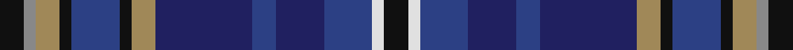

This page is one **sett** — a single exact thread-count. It belongs to the [tartan](/setts/k2o1lo2k1dbi4k1lo2db8dbi2db4dbi4w1k2/)
(the same proportion at any scale), whose colour order is pattern [KRYKBKYBBBBWK](/stripes/krykbkybbbbwk/).

Sourced from register-of-tartans.  It is a [13 stripe tartan](/stripes/stripes13/).

Original link https://www.tartanregister.gov.uk/tartanDetails.aspx?ref=11593

## Register references

External register numbers recorded for this tartan.

- Scottish Register of Tartans: [11593](https://www.tartanregister.gov.uk/tartanDetails.aspx?ref=11593)

## Thread count
K/8 N4 LT8 K4 B16 K4 LT8 DB32 B8 DB16 B16 LN4 K/8

One full sett is **256 threads**.

## Palette

Palette: <strong>Tartan Register</strong>
<table><thead><tr><th>Colour</th><th>Threads</th><th>Shade</th><th>Base</th><th>OKLCh</th></tr></thead><tbody><tr><td>K/</td><td style="text-align:right;font-variant-numeric:tabular-nums">8</td><td><code style="background-color:#101010;">#101010</code> <small style="color:#888">#101010</small></td><td>K <code style="background-color:#000000;">#000000</code></td><td><small style="color:#888">oklch(17.3% 0.000 89.9)</small></td></tr><tr><td>N</td><td style="text-align:right;font-variant-numeric:tabular-nums">4</td><td><code style="background-color:#888888;">#888888</code> <small style="color:#888">#888888</small></td><td>R <code style="background-color:#CC0000;">#CC0000</code></td><td><small style="color:#888">oklch(62.7% 0.000 89.9)</small></td></tr><tr><td>LT</td><td style="text-align:right;font-variant-numeric:tabular-nums">8</td><td><code style="background-color:#A08858;">#A08858</code> <small style="color:#888">#A08858</small></td><td>Y <code style="background-color:#F2BF00;">#F2BF00</code></td><td><small style="color:#888">oklch(63.7% 0.071 84.0)</small></td></tr><tr><td>K</td><td style="text-align:right;font-variant-numeric:tabular-nums">4</td><td><code style="background-color:#101010;">#101010</code> <small style="color:#888">#101010</small></td><td>K <code style="background-color:#000000;">#000000</code></td><td><small style="color:#888">oklch(17.3% 0.000 89.9)</small></td></tr><tr><td>B</td><td style="text-align:right;font-variant-numeric:tabular-nums">16</td><td><code style="background-color:#2C4084;">#2C4084</code> <small style="color:#888">#2C4084</small></td><td>B <code style="background-color:#2A418A;">#2A418A</code></td><td><small style="color:#888">oklch(39.4% 0.117 268.3)</small></td></tr><tr><td>K</td><td style="text-align:right;font-variant-numeric:tabular-nums">4</td><td><code style="background-color:#101010;">#101010</code> <small style="color:#888">#101010</small></td><td>K <code style="background-color:#000000;">#000000</code></td><td><small style="color:#888">oklch(17.3% 0.000 89.9)</small></td></tr><tr><td>LT</td><td style="text-align:right;font-variant-numeric:tabular-nums">8</td><td><code style="background-color:#A08858;">#A08858</code> <small style="color:#888">#A08858</small></td><td>Y <code style="background-color:#F2BF00;">#F2BF00</code></td><td><small style="color:#888">oklch(63.7% 0.071 84.0)</small></td></tr><tr><td>DB</td><td style="text-align:right;font-variant-numeric:tabular-nums">32</td><td><code style="background-color:#202060;">#202060</code> <small style="color:#888">#202060</small></td><td>B <code style="background-color:#2A418A;">#2A418A</code></td><td><small style="color:#888">oklch(28.9% 0.111 276.9)</small></td></tr><tr><td>B</td><td style="text-align:right;font-variant-numeric:tabular-nums">8</td><td><code style="background-color:#2C4084;">#2C4084</code> <small style="color:#888">#2C4084</small></td><td>B <code style="background-color:#2A418A;">#2A418A</code></td><td><small style="color:#888">oklch(39.4% 0.117 268.3)</small></td></tr><tr><td>DB</td><td style="text-align:right;font-variant-numeric:tabular-nums">16</td><td><code style="background-color:#202060;">#202060</code> <small style="color:#888">#202060</small></td><td>B <code style="background-color:#2A418A;">#2A418A</code></td><td><small style="color:#888">oklch(28.9% 0.111 276.9)</small></td></tr><tr><td>B</td><td style="text-align:right;font-variant-numeric:tabular-nums">16</td><td><code style="background-color:#2C4084;">#2C4084</code> <small style="color:#888">#2C4084</small></td><td>B <code style="background-color:#2A418A;">#2A418A</code></td><td><small style="color:#888">oklch(39.4% 0.117 268.3)</small></td></tr><tr><td>LN</td><td style="text-align:right;font-variant-numeric:tabular-nums">4</td><td><code style="background-color:#E0E0E0;">#E0E0E0</code> <small style="color:#888">#E0E0E0</small></td><td>W <code style="background-color:#F7F7F7;">#F7F7F7</code></td><td><small style="color:#888">oklch(90.7% 0.000 89.9)</small></td></tr><tr><td>K/</td><td style="text-align:right;font-variant-numeric:tabular-nums">8</td><td><code style="background-color:#101010;">#101010</code> <small style="color:#888">#101010</small></td><td>K <code style="background-color:#000000;">#000000</code></td><td><small style="color:#888">oklch(17.3% 0.000 89.9)</small></td></tr></tbody></table>

## Nearest tartans

The nearest existing variants by ΔTartan distance, with this tartan at the top so the swatches line up against it.

ΔTartan

Tartan

Sett

—

<a href="/ttd/edit/#slug=k2o1lo2k1dbi4k1lo2db8dbi2db4dbi4w1k2~x4">Solberg-Bell Hunting</a> <a class="nn-out" href="/variants/s13/k2o1lo2k1dbi4k1lo2db8dbi2db4dbi4w1k2~x4/" title="open its dictionary page">↗</a>

0.66

<a href="/ttd/edit/#slug=b6k3db19k6db4k3n12g4n12w2b5~x2&amp;base=k2o1lo2k1dbi4k1lo2db8dbi2db4dbi4w1k2~x4">Scotland Forever Fashion Weavers Tartan</a> <a class="nn-out" href="/variants/s11/b6k3db19k6db4k3n12g4n12w2b5~x2/" title="open its dictionary page">↗</a>

1.17

<a href="/ttd/edit/#slug=db6k3dt19k6dt4k3dp12g4dp12w2db5~x2&amp;base=k2o1lo2k1dbi4k1lo2db8dbi2db4dbi4w1k2~x4">Scotland Forever</a> <a class="nn-out" href="/variants/s11/db6k3dt19k6dt4k3dp12g4dp12w2db5~x2/" title="open its dictionary page">↗</a>

1.17

<a href="/variants/s16/k2w1dp7k1g6k1db7t1k1~x4/">South Lanarkshire</a>

1.21

<a href="/ttd/edit/#slug=dt6g3dt3w2dt5k2dt3k2dp16m3k2~x2&amp;base=k2o1lo2k1dbi4k1lo2db8dbi2db4dbi4w1k2~x4">Pearl O' the Tay (Corporate)</a> <a class="nn-out" href="/variants/s11/dt6g3dt3w2dt5k2dt3k2dp16m3k2~x2/" title="open its dictionary page">↗</a>

1.22

<a href="/ttd/edit/#slug=k20g18k2w2k5ly2k2g18k20db18b4db4b4db18~x2&amp;base=k2o1lo2k1dbi4k1lo2db8dbi2db4dbi4w1k2~x4">Shandon (Personal)</a> <a class="nn-out" href="/variants/s14/k20g18k2w2k5ly2k2g18k20db18b4db4b4db18~x2/" title="open its dictionary page">↗</a>

1.23

<a href="/ttd/edit/#slug=dg12dp3lr3dp3lr3dp12db3dp3db2dp2db14lo1w3~x2&amp;base=k2o1lo2k1dbi4k1lo2db8dbi2db4dbi4w1k2~x4">Scottish Tourist Guides Assoc. (Corp</a> <a class="nn-out" href="/variants/s13/dg12dp3lr3dp3lr3dp12db3dp3db2dp2db14lo1w3~x2/" title="open its dictionary page">↗</a>

1.24

<a href="/ttd/edit/#slug=dp3k2dp5lb2db12r1db2k1g9dp3g5k12db2~x2&amp;base=k2o1lo2k1dbi4k1lo2db8dbi2db4dbi4w1k2~x4">MacKusick (Piper) #2 (Personal)</a> <a class="nn-out" href="/variants/s13/dp3k2dp5lb2db12r1db2k1g9dp3g5k12db2~x2/" title="open its dictionary page">↗</a>

1.28

<a href="/ttd/edit/#slug=db6dri2db2dri2db2do6g8do1w2do1g8dr2do4db8dri2db2~x2&amp;base=k2o1lo2k1dbi4k1lo2db8dbi2db4dbi4w1k2~x4">Forbes of Druminnor Artifact Tartan</a> <a class="nn-out" href="/variants/s16/db6dri2db2dri2db2do6g8do1w2do1g8dr2do4db8dri2db2~x2/" title="open its dictionary page">↗</a>

1.30

<a href="/ttd/edit/#slug=w1dbi6g1dbi1g1dbi1db4r5lo1~x4&amp;base=k2o1lo2k1dbi4k1lo2db8dbi2db4dbi4w1k2~x4">McLion (Corporate)</a> <a class="nn-out" href="/variants/s9/w1dbi6g1dbi1g1dbi1db4r5lo1~x4/" title="open its dictionary page">↗</a>

1.31

<a href="/ttd/edit/#slug=db20k16g3dp23m7g10m7dp23g3k16db23w2db2w2db3~x2&amp;base=k2o1lo2k1dbi4k1lo2db8dbi2db4dbi4w1k2~x4">Pride of Bannockburn Fashion Tartan</a> <a class="nn-out" href="/variants/s15/db20k16g3dp23m7g10m7dp23g3k16db23w2db2w2db3~x2/" title="open its dictionary page">↗</a>

## Neighbour map

Every grey dot is one of 14360 variants placed by the first two principal components of the ΔTartan feature space (44% of its variance). Red is this tartan; blue dots are its nearest — click one to open its page.

<svg viewBox="0 0 640 380" role="img" style="max-width:100%;height:auto;border:1px solid #e0e0e0;border-radius:4px;display:block" xmlns="http://www.w3.org/2000/svg"><image href="/nn/cloud.v1.png" width="640" height="380"/><a href="/variants/s11/b6k3db19k6db4k3n12g4n12w2b5~x2/"><circle cx="124.5" cy="180.5" r="4" fill="#3465a4"><title>Scotland Forever Fashion Weavers Tartan</title></circle></a><a href="/variants/s11/db6k3dt19k6dt4k3dp12g4dp12w2db5~x2/"><circle cx="142.6" cy="189.1" r="4" fill="#3465a4"><title>Scotland Forever</title></circle></a><a href="/variants/s16/k2w1dp7k1g6k1db7t1k1~x4/"><circle cx="86.0" cy="155.5" r="4" fill="#3465a4"><title>South Lanarkshire</title></circle></a><a href="/variants/s11/dt6g3dt3w2dt5k2dt3k2dp16m3k2~x2/"><circle cx="156.5" cy="163.6" r="4" fill="#3465a4"><title>Pearl O' the Tay (Corporate)</title></circle></a><a href="/variants/s14/k20g18k2w2k5ly2k2g18k20db18b4db4b4db18~x2/"><circle cx="135.9" cy="158.2" r="4" fill="#3465a4"><title>Shandon (Personal)</title></circle></a><a href="/variants/s13/dg12dp3lr3dp3lr3dp12db3dp3db2dp2db14lo1w3~x2/"><circle cx="160.6" cy="140.1" r="4" fill="#3465a4"><title>Scottish Tourist Guides Assoc. (Corp</title></circle></a><a href="/variants/s13/dp3k2dp5lb2db12r1db2k1g9dp3g5k12db2~x2/"><circle cx="116.5" cy="153.9" r="4" fill="#3465a4"><title>MacKusick (Piper) #2 (Personal)</title></circle></a><a href="/variants/s16/db6dri2db2dri2db2do6g8do1w2do1g8dr2do4db8dri2db2~x2/"><circle cx="136.0" cy="183.4" r="4" fill="#3465a4"><title>Forbes of Druminnor Artifact Tartan</title></circle></a><a href="/variants/s9/w1dbi6g1dbi1g1dbi1db4r5lo1~x4/"><circle cx="137.6" cy="186.6" r="4" fill="#3465a4"><title>McLion (Corporate)</title></circle></a><a href="/variants/s15/db20k16g3dp23m7g10m7dp23g3k16db23w2db2w2db3~x2/"><circle cx="115.0" cy="146.9" r="4" fill="#3465a4"><title>Pride of Bannockburn Fashion Tartan</title></circle></a><circle cx="131.5" cy="182.8" r="5" fill="#c00000"/></svg>

ID: /variants/s13/k2o1lo2k1dbi4k1lo2db8dbi2db4dbi4w1k2~x4/
