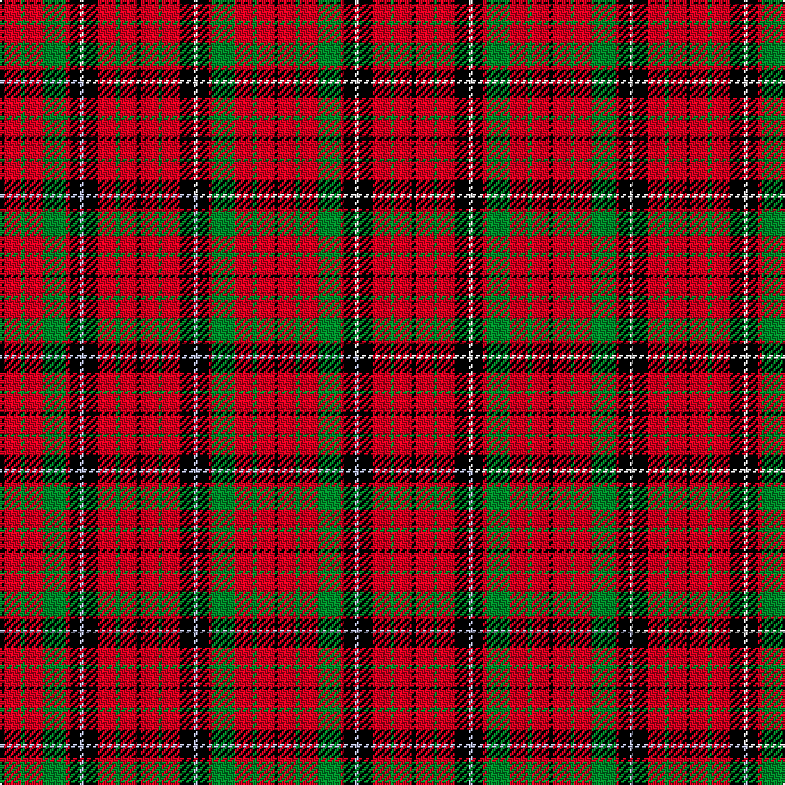

This is one **variant** — a specific cloth: this exact thread count and colourway, with its own
provenance below. It is one weaving of the [sett](/setts/k2r10g2r10g13r2k6w2k8r10g2r10k2/) (the scale-free proportion — the
same cloth at any scale or shade), whose colour order is pattern [KRGRGRKWKRGRK](/stripes/krgrgrkwkrgrk/).

Part of the [MacNicol D](/tartans/macnicol-d/) tartan — the named design grouping this sett with its other cloths.

Sourced from weddslist.  It is a [13 stripe tartan](/stripes/stripes13/).

Original link [http://www.weddslist.com/cgi-bin/tartans/pg.pl?source=rb](http://www.weddslist.com/cgi-bin/tartans/pg.pl?source=rb)

Dataset <small>— provenance for this record, inherited from the source manifest</small>

<dl class="dataset-prov">
<dt>source</dt><dd><a href="/sources/weddslist/">Weddslist</a></dd>
<dt>data captured from</dt><dd><a href="https://github.com/thetartan/tartan-database/blob/master/data/weddslist/data.csv">https://github.com/thetartan/tartan-database/blob/master/data/weddslist/data.csv</a></dd>
<dt>data date</dt><dd>2016-11-17 <small>(dataset default)</small></dd>
<dt>licence</dt><dd><a href="https://creativecommons.org/licenses/by-nc-nd/4.0/">CC BY-NC-ND 4.0</a></dd>
</dl>

Capture chain <small>— the hands this data passed through, oldest first; each capture carries its own licence</small>

<ol class="capture-chain">
<li><a href="https://www.weddslist.com/tartans/">Weddslist</a> <small>the living privately compiled reference</small></li>
<li><a href="https://github.com/thetartan/tartan-database">thetartan/tartan-database</a> <small>2016-2017</small> · <a href="https://creativecommons.org/licenses/by-nc-nd/4.0/">CC BY-NC-ND 4.0</a> <small>Levko Kravets's frozen compilation — the capture we vendored, and where its CC licence text came from</small></li>
<li>this dictionary <small>captured 2026-06-10 · commit 5bf86c7566</small> <small>each re-capture is a git commit to data/sources</small></li>
</ol>

## Thread count
K/2 R10 G2 R10 G13 R2 K6 W2 K8 R10 G2 R10 K/2

One full sett is **154 threads**.

## Palette
<table><thead><tr><th>Colour</th><th>Shade</th><th>OKLCh</th></tr></thead><tbody><tr><td>G</td><td><code style="background-color:#008B2A;">#008B2A</code> <small style="color:#888">#008B2A</small></td><td><small style="color:#888">oklch(55.4% 0.170 145.9)</small></td></tr><tr><td>K</td><td><code style="background-color:#000000;">#000000</code> <small style="color:#888">#000000</small></td><td><small style="color:#888">oklch(0.0% 0.000 0.0)</small></td></tr><tr><td>W</td><td><code style="background-color:#F7F7F7;">#F7F7F7</code> <small style="color:#888">#F7F7F7</small></td><td><small style="color:#888">oklch(97.6% 0.000 89.9)</small></td></tr><tr><td>R</td><td><code style="background-color:#D60020;">#D60020</code> <small style="color:#888">#D60020</small></td><td><small style="color:#888">oklch(55.2% 0.224 25.5)</small></td></tr></tbody></table>

# Sample pattern

## Compared to the master

This cloth is one sett of its design; the master sett (the exemplar the design is anchored on) is below for comparison.

Its **ΔTartan distance** from the master is **0.30** — the same measure the nearest-tartans table ranks by (0 is identical; a re-scale of the same cloth is near 0, a recolour or a different proportion further).

<figure class="master-compare" style="margin:0">

this sett
master sett ★

<figcaption style="color:#888;font-size:smaller">One weave of this sett against the <a href="/setts/k2r10g2r10g13r2k6lb2k8r10g2r10k2/">master sett ★</a>, split on the diagonal: a shared proportion runs seamlessly across it with only the shades shifting; a different proportion breaks on it.</figcaption>
</figure>

## Nearest tartan variants

The nearest existing variants by ΔTartan distance, with this cloth at the top so the swatches line up against it.

ΔTartan

Threads

Variant

Sett

—

154

<a href="/variants/s13/k2r10g2r10g13r2k6w2k8r10g2r10k2/">MacNicol D</a>

<a href="/ttd/edit/#slug=k2r10g2r10g13r2k6lb2k8r10g2r10k2~x2&amp;base=k2r10g2r10g13r2k6w2k8r10g2r10k2" title="compare in the TTD">0.30</a>

308

<a href="/variants/s13/k2r10g2r10g13r2k6lb2k8r10g2r10k2~x2/">MacNicol D</a>

<a href="/ttd/edit/#slug=k2r10g2r10g13r2k6lb2k8r10g2r10k2&amp;base=k2r10g2r10g13r2k6w2k8r10g2r10k2" title="compare in the TTD">0.30</a>

154

<a href="/variants/s13/k2r10g2r10g13r2k6lb2k8r10g2r10k2/">MacNicol D</a>

<a href="/ttd/edit/#slug=k2r8g2r8g14r2k6lb1k7r8g2r8k2~x2&amp;base=k2r10g2r10g13r2k6w2k8r10g2r10k2" title="compare in the TTD">0.87</a>

272

<a href="/variants/s13/k2r8g2r8g14r2k6lb1k7r8g2r8k2~x2/">Nicolson MacNicol Clan Tartan</a>

<a href="/ttd/edit/#slug=k2r8g2r8g13r1k7lb1k7r8g2r8k2~x4&amp;base=k2r10g2r10g13r2k6w2k8r10g2r10k2" title="compare in the TTD">0.88</a>

536

<a href="/variants/s13/k2r8g2r8g13r1k7lb1k7r8g2r8k2~x4/">Nicolson (Lochcarron)</a>

<a href="/ttd/edit/#slug=k10r12g3r12k2r12g3r12g20r2k8lb2&amp;base=k2r10g2r10g13r2k6w2k8r10g2r10k2" title="compare in the TTD">1.66</a>

184

<a href="/variants/s12/k10r12g3r12k2r12g3r12g20r2k8lb2/">Nicolson MacNicol</a>

<a href="/ttd/edit/#slug=r8g1r8g16r4k2lb1k4r8g1r8k1~x2&amp;base=k2r10g2r10g13r2k6w2k8r10g2r10k2" title="compare in the TTD">1.99</a>

230

<a href="/variants/s12/r8g1r8g16r4k2lb1k4r8g1r8k1~x2/">MacLeod and MacNicol</a>

<a href="/ttd/edit/#slug=r12g2r4g4k15lb4r4lb2r12~x2&amp;base=k2r10g2r10g13r2k6w2k8r10g2r10k2" title="compare in the TTD">2.18</a>

188

<a href="/variants/s9/r12g2r4g4k15lb4r4lb2r12~x2/">Alexander (Personal)</a>

<a href="/ttd/edit/#slug=r2db1r10k4r2g8r2g8r7k1r2db1~x2&amp;base=k2r10g2r10g13r2k6w2k8r10g2r10k2" title="compare in the TTD">2.43</a>

186

<a href="/variants/s12/r2db1r10k4r2g8r2g8r7k1r2db1~x2/">MacQuarrie Ancient</a>

<a href="/ttd/edit/#slug=r12db2r4db4k15g4r4g2r12~x2&amp;base=k2r10g2r10g13r2k6w2k8r10g2r10k2" title="compare in the TTD">2.45</a>

188

<a href="/variants/s9/r12db2r4db4k15g4r4g2r12~x2/">Alexander Family Tartan</a>

<a href="/ttd/edit/#slug=r5k5r3g16r3g3r3k10r3b5r12k5r3k3r5~x2&amp;base=k2r10g2r10g13r2k6w2k8r10g2r10k2" title="compare in the TTD">2.48</a>

316

<a href="/variants/s15/r5k5r3g16r3g3r3k10r3b5r12k5r3k3r5~x2/">Grant of Ballindalloch</a>

## Neighbour map

Every grey dot is one of 13621 variants placed by the first two principal components of the ΔTartan feature space (42% of its variance). Red is this tartan; blue dots are its nearest — click one to open its page.

<svg viewBox="0 0 640 380" role="img" style="max-width:100%;height:auto;border:1px solid #e0e0e0;border-radius:4px;display:block" xmlns="http://www.w3.org/2000/svg"><image href="/nn/cloud.v1.png" width="640" height="380"/><a href="/variants/s13/k2r10g2r10g13r2k6lb2k8r10g2r10k2~x2/"><circle cx="189.3" cy="178.9" r="4" fill="#3465a4"><title>MacNicol D</title></circle></a><a href="/variants/s13/k2r10g2r10g13r2k6lb2k8r10g2r10k2/"><circle cx="189.3" cy="178.9" r="4" fill="#3465a4"><title>MacNicol D</title></circle></a><a href="/variants/s13/k2r8g2r8g14r2k6lb1k7r8g2r8k2~x2/"><circle cx="192.1" cy="150.0" r="4" fill="#3465a4"><title>Nicolson MacNicol Clan Tartan</title></circle></a><a href="/variants/s13/k2r8g2r8g13r1k7lb1k7r8g2r8k2~x4/"><circle cx="185.0" cy="152.7" r="4" fill="#3465a4"><title>Nicolson (Lochcarron)</title></circle></a><a href="/variants/s12/k10r12g3r12k2r12g3r12g20r2k8lb2/"><circle cx="200.9" cy="169.6" r="4" fill="#3465a4"><title>Nicolson MacNicol</title></circle></a><a href="/variants/s12/r8g1r8g16r4k2lb1k4r8g1r8k1~x2/"><circle cx="285.1" cy="138.6" r="4" fill="#3465a4"><title>MacLeod and MacNicol</title></circle></a><a href="/variants/s9/r12g2r4g4k15lb4r4lb2r12~x2/"><circle cx="212.8" cy="184.0" r="4" fill="#3465a4"><title>Alexander (Personal)</title></circle></a><a href="/variants/s12/r2db1r10k4r2g8r2g8r7k1r2db1~x2/"><circle cx="233.6" cy="164.3" r="4" fill="#3465a4"><title>MacQuarrie Ancient</title></circle></a><a href="/variants/s9/r12db2r4db4k15g4r4g2r12~x2/"><circle cx="217.9" cy="185.3" r="4" fill="#3465a4"><title>Alexander Family Tartan</title></circle></a><a href="/variants/s15/r5k5r3g16r3g3r3k10r3b5r12k5r3k3r5~x2/"><circle cx="132.6" cy="184.0" r="4" fill="#3465a4"><title>Grant of Ballindalloch</title></circle></a><circle cx="187.2" cy="178.3" r="5" fill="#c00000"/><text x="320" y="376" text-anchor="middle" font-size="11" fill="#999">ground</text><text x="11" y="190" text-anchor="middle" font-size="11" fill="#999" transform="rotate(-90 11 190)">complexity</text></svg>

ID: /variants/s13/k2r10g2r10g13r2k6w2k8r10g2r10k2/
