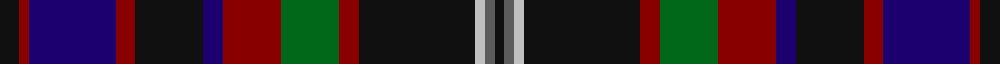

This page is one **sett** — a single exact thread-count. It belongs to the [tartan](/setts/k2r1db9r2k7db2r6g6r2k12lb1n1k1/)
(the same proportion at any scale), whose colour order is pattern [KBWKRGRBKRBRK](/stripes/kbwkrgrbkrbrk/).

Part of the [Oban](/tartans/oban/) tartan — the named design grouping this sett with its other cloths.

Sourced from tartans-authority.  It is a [13 stripe tartan](/stripes/stripes13/).

Original link http://www.tartansauthority.com/tartan-ferret/display/5530/

## Also known as

This cloth is also recorded under:

- Oban Grey
- Oban, Grey

## Register references

External register numbers recorded for this tartan.

- Scottish Tartans Authority (ITI): 5530

## Thread count
K/8 DR4 DB36 DR8 K28 DB8 DR24 G24 DR8 K48 Na4 N4 K/4

One full sett is **404 threads**.

## Palette

Palette: <strong>Tartan Register</strong> <small style="color:#888">(5 of 6 colours)</small>
<table><thead><tr><th>Colour</th><th>Threads</th><th>Shade</th><th>Base</th><th>OKLCh</th></tr></thead><tbody><tr><td>K/</td><td style="text-align:right;font-variant-numeric:tabular-nums">8</td><td><code style="background-color:#101010;">#101010</code> <small style="color:#888">#101010</small></td><td>K <code style="background-color:#000000;">#000000</code></td><td><small style="color:#888">oklch(17.3% 0.000 89.9)</small></td></tr><tr><td>DR</td><td style="text-align:right;font-variant-numeric:tabular-nums">4</td><td><code style="background-color:#880000;">#880000</code> <small style="color:#888">#880000</small></td><td>R <code style="background-color:#CC0000;">#CC0000</code></td><td><small style="color:#888">oklch(39.4% 0.162 29.2)</small></td></tr><tr><td>DB</td><td style="text-align:right;font-variant-numeric:tabular-nums">36</td><td><code style="background-color:#1C0070;">#1C0070</code> <small style="color:#888">#1C0070</small></td><td>B <code style="background-color:#2A418A;">#2A418A</code></td><td><small style="color:#888">oklch(26.3% 0.162 277.1)</small></td></tr><tr><td>DR</td><td style="text-align:right;font-variant-numeric:tabular-nums">8</td><td><code style="background-color:#880000;">#880000</code> <small style="color:#888">#880000</small></td><td>R <code style="background-color:#CC0000;">#CC0000</code></td><td><small style="color:#888">oklch(39.4% 0.162 29.2)</small></td></tr><tr><td>K</td><td style="text-align:right;font-variant-numeric:tabular-nums">28</td><td><code style="background-color:#101010;">#101010</code> <small style="color:#888">#101010</small></td><td>K <code style="background-color:#000000;">#000000</code></td><td><small style="color:#888">oklch(17.3% 0.000 89.9)</small></td></tr><tr><td>DB</td><td style="text-align:right;font-variant-numeric:tabular-nums">8</td><td><code style="background-color:#1C0070;">#1C0070</code> <small style="color:#888">#1C0070</small></td><td>B <code style="background-color:#2A418A;">#2A418A</code></td><td><small style="color:#888">oklch(26.3% 0.162 277.1)</small></td></tr><tr><td>DR</td><td style="text-align:right;font-variant-numeric:tabular-nums">24</td><td><code style="background-color:#880000;">#880000</code> <small style="color:#888">#880000</small></td><td>R <code style="background-color:#CC0000;">#CC0000</code></td><td><small style="color:#888">oklch(39.4% 0.162 29.2)</small></td></tr><tr><td>G</td><td style="text-align:right;font-variant-numeric:tabular-nums">24</td><td><code style="background-color:#006818;">#006818</code> <small style="color:#888">#006818</small></td><td>G <code style="background-color:#006100;">#006100</code></td><td><small style="color:#888">oklch(45.0% 0.142 145.0)</small></td></tr><tr><td>DR</td><td style="text-align:right;font-variant-numeric:tabular-nums">8</td><td><code style="background-color:#880000;">#880000</code> <small style="color:#888">#880000</small></td><td>R <code style="background-color:#CC0000;">#CC0000</code></td><td><small style="color:#888">oklch(39.4% 0.162 29.2)</small></td></tr><tr><td>K</td><td style="text-align:right;font-variant-numeric:tabular-nums">48</td><td><code style="background-color:#101010;">#101010</code> <small style="color:#888">#101010</small></td><td>K <code style="background-color:#000000;">#000000</code></td><td><small style="color:#888">oklch(17.3% 0.000 89.9)</small></td></tr><tr><td>Na</td><td style="text-align:right;font-variant-numeric:tabular-nums">4</td><td><code style="background-color:#C0C0C0;">#C0C0C0</code> <small style="color:#888">#C0C0C0</small></td><td>W <code style="background-color:#F7F7F7;">#F7F7F7</code></td><td><small style="color:#888">oklch(80.8% 0.000 89.9)</small></td></tr><tr><td>N</td><td style="text-align:right;font-variant-numeric:tabular-nums">4</td><td><code style="background-color:#5C5C5C;">#5C5C5C</code> <small style="color:#888">#5C5C5C</small></td><td>B <code style="background-color:#2A418A;">#2A418A</code></td><td><small style="color:#888">oklch(47.5% 0.000 89.9)</small></td></tr><tr><td>K/</td><td style="text-align:right;font-variant-numeric:tabular-nums">4</td><td><code style="background-color:#101010;">#101010</code> <small style="color:#888">#101010</small></td><td>K <code style="background-color:#000000;">#000000</code></td><td><small style="color:#888">oklch(17.3% 0.000 89.9)</small></td></tr></tbody></table>

## Compared to the master

This cloth is one sett of its design; the master sett (the exemplar the design is anchored on) is below for comparison.

<figure style="margin:0"><figcaption style="color:#888;font-size:smaller">this sett</figcaption></figure>
<figure style="margin:0"><figcaption style="color:#888;font-size:smaller"><a href="/setts/k4w3k4y9r1/">master sett →</a></figcaption></figure>

## Nearest tartans

The nearest existing variants by ΔTartan distance, with this tartan at the top so the swatches line up against it.

ΔTartan

Tartan

Sett

—

<a href="/ttd/edit/#slug=k2r1db9r2k7db2r6g6r2k12lb1n1k1~x4">Oban (District?)</a> <a class="nn-out" href="/variants/s13/k2r1db9r2k7db2r6g6r2k12lb1n1k1~x4/" title="open its dictionary page">↗</a>

0.97

<a href="/variants/s12/r2t6r1ki14r1ki14r1k6dg10lo1dg2lo2~x2/">Ogg of Tarragann Hunting</a>

1.10

<a href="/ttd/edit/#slug=k3g1o1dt6n2dt1n1dt1o10lb1~x4&amp;base=k2r1db9r2k7db2r6g6r2k12lb1n1k1~x4">Crieff Primary School</a> <a class="nn-out" href="/variants/s10/k3g1o1dt6n2dt1n1dt1o10lb1~x4/" title="open its dictionary page">↗</a>

1.10

<a href="/variants/s12/db37r3ki17r3g22k4g22r3ki17r3db37w3~x2/">Souza Nery (Personal)</a>

1.12

<a href="/variants/s18/o8k2o8ki4r3ki4k8ki2k8ki4dt21n8ki2k3ki2n8dt24ki3~x2/">Renton (Personal)</a>

1.13

<a href="/ttd/edit/#slug=k4dg2w2dp22k16r8k3r4k3ly4k3~x2&amp;base=k2r1db9r2k7db2r6g6r2k12lb1n1k1~x4">Hines Snr, Raymond Lee (Personal)</a> <a class="nn-out" href="/variants/s11/k4dg2w2dp22k16r8k3r4k3ly4k3~x2/" title="open its dictionary page">↗</a>

1.13

<a href="/ttd/edit/#slug=db45r4k20lb3o9dr4o3dr9k11~x2&amp;base=k2r1db9r2k7db2r6g6r2k12lb1n1k1~x4">United Arrows House Check</a> <a class="nn-out" href="/variants/s9/db45r4k20lb3o9dr4o3dr9k11~x2/" title="open its dictionary page">↗</a>

1.17

<a href="/ttd/edit/#slug=r1db6k1db1k8g1k8dp2g1k1g6lo1~x4&amp;base=k2r1db9r2k7db2r6g6r2k12lb1n1k1~x4">van der Watt Personal)</a> <a class="nn-out" href="/variants/s12/r1db6k1db1k8g1k8dp2g1k1g6lo1~x4/" title="open its dictionary page">↗</a>

1.20

<a href="/ttd/edit/#slug=r3g4y2g10k18g2dp18g3dp18g2k18g18w1r3~x2&amp;base=k2r1db9r2k7db2r6g6r2k12lb1n1k1~x4">Paget (Personal)</a> <a class="nn-out" href="/variants/s14/r3g4y2g10k18g2dp18g3dp18g2k18g18w1r3~x2/" title="open its dictionary page">↗</a>

1.22

<a href="/ttd/edit/#slug=dt18w1o8w1db16dp8w1dt18w1dt20dp8dt6g8db10g10db1~x4&amp;base=k2r1db9r2k7db2r6g6r2k12lb1n1k1~x4">Forbes - 1970 (WCWM #2)</a> <a class="nn-out" href="/variants/s16/dt18w1o8w1db16dp8w1dt18w1dt20dp8dt6g8db10g10db1~x4/" title="open its dictionary page">↗</a>

1.24

<a href="/ttd/edit/#slug=dbi6ri2db2ri3db3ri18dbi16ri2g18r2dbi3t3dbi2ri6~x2&amp;base=k2r1db9r2k7db2r6g6r2k12lb1n1k1~x4">Minster</a> <a class="nn-out" href="/variants/s14/dbi6ri2db2ri3db3ri18dbi16ri2g18r2dbi3t3dbi2ri6~x2/" title="open its dictionary page">↗</a>

## Neighbour map

Every grey dot is one of 14360 variants placed by the first two principal components of the ΔTartan feature space (44% of its variance). Red is this tartan; blue dots are its nearest — click one to open its page.

<svg viewBox="0 0 640 380" role="img" style="max-width:100%;height:auto;border:1px solid #e0e0e0;border-radius:4px;display:block" xmlns="http://www.w3.org/2000/svg"><image href="/nn/cloud.v1.png" width="640" height="380"/><a href="/variants/s12/r2t6r1ki14r1ki14r1k6dg10lo1dg2lo2~x2/"><circle cx="228.3" cy="145.5" r="4" fill="#3465a4"><title>Ogg of Tarragann Hunting</title></circle></a><a href="/variants/s10/k3g1o1dt6n2dt1n1dt1o10lb1~x4/"><circle cx="191.6" cy="148.4" r="4" fill="#3465a4"><title>Crieff Primary School</title></circle></a><a href="/variants/s12/db37r3ki17r3g22k4g22r3ki17r3db37w3~x2/"><circle cx="192.1" cy="152.9" r="4" fill="#3465a4"><title>Souza Nery (Personal)</title></circle></a><a href="/variants/s18/o8k2o8ki4r3ki4k8ki2k8ki4dt21n8ki2k3ki2n8dt24ki3~x2/"><circle cx="149.2" cy="140.8" r="4" fill="#3465a4"><title>Renton (Personal)</title></circle></a><a href="/variants/s11/k4dg2w2dp22k16r8k3r4k3ly4k3~x2/"><circle cx="193.9" cy="146.2" r="4" fill="#3465a4"><title>Hines Snr, Raymond Lee (Personal)</title></circle></a><a href="/variants/s9/db45r4k20lb3o9dr4o3dr9k11~x2/"><circle cx="224.4" cy="147.7" r="4" fill="#3465a4"><title>United Arrows House Check</title></circle></a><a href="/variants/s12/r1db6k1db1k8g1k8dp2g1k1g6lo1~x4/"><circle cx="226.2" cy="179.0" r="4" fill="#3465a4"><title>van der Watt Personal)</title></circle></a><a href="/variants/s14/r3g4y2g10k18g2dp18g3dp18g2k18g18w1r3~x2/"><circle cx="172.6" cy="138.0" r="4" fill="#3465a4"><title>Paget (Personal)</title></circle></a><a href="/variants/s16/dt18w1o8w1db16dp8w1dt18w1dt20dp8dt6g8db10g10db1~x4/"><circle cx="206.4" cy="137.5" r="4" fill="#3465a4"><title>Forbes - 1970 (WCWM #2)</title></circle></a><a href="/variants/s14/dbi6ri2db2ri3db3ri18dbi16ri2g18r2dbi3t3dbi2ri6~x2/"><circle cx="186.1" cy="156.1" r="4" fill="#3465a4"><title>Minster</title></circle></a><circle cx="197.9" cy="156.8" r="5" fill="#c00000"/></svg>

ID: /variants/s13/k2r1db9r2k7db2r6g6r2k12lb1n1k1~x4/
