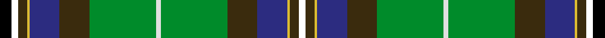

This page is one **sett** — a single exact thread-count. It belongs to the [tartan](/setts/k8dy4ly1db13dy13g29w2g29dy13db13ly1dy4k3/)
(the same proportion at any scale), whose colour order is pattern [KGYBGGWGGBYGKK](/stripes/kgybggwggbygkk/).

Sourced from house-of-tartan.  It is a [14 stripe tartan](/stripes/stripes14/).

Original link http://www.house-of-tartan.scotland.net/house/TartanViewjs.asp?colr=Def&tnam=5136

## Provenance

Earliest known date: 01/01/1996 Lochcarron. The colours are representative of those in the valley through which flows the River Teviot in the Scottish Borders. Sample in Scottish Tartans Authority's Johnston Collection. Blues lightened to show sett.

## Thread count
K/10 K6 DY8 LY2 DB26 DY26 G58 W4 G58 DY26 DB26 LY2 DY8 K/6

One full sett is **516 threads**.

## Palette
<table><thead><tr><th>Colour</th><th>Shade</th><th>OKLCh</th></tr></thead><tbody><tr><td>DB</td><td><code style="background-color:#202060;">#202060</code> <small style="color:#888">#202060</small></td><td><small style="color:#888">oklch(28.9% 0.111 276.9)</small></td></tr><tr><td>DBa</td><td><code style="background-color:#1C0070;">#1C0070</code> <small style="color:#888">#1C0070</small></td><td><small style="color:#888">oklch(26.3% 0.162 277.1)</small></td></tr><tr><td>DBb</td><td><code style="background-color:#2C2C80;">#2C2C80</code> <small style="color:#888">#2C2C80</small></td><td><small style="color:#888">oklch(35.0% 0.138 276.6)</small></td></tr><tr><td>DG</td><td><code style="background-color:#053819;">#053819</code> <small style="color:#888">#053819</small></td><td><small style="color:#888">oklch(30.0% 0.075 151.3)</small></td></tr><tr><td>G</td><td><code style="background-color:#008B2A;">#008B2A</code> <small style="color:#888">#008B2A</small></td><td><small style="color:#888">oklch(55.4% 0.170 145.9)</small></td></tr><tr><td>K</td><td><code style="background-color:#000000;">#000000</code> <small style="color:#888">#000000</small></td><td><small style="color:#888">oklch(0.0% 0.000 0.0)</small></td></tr><tr><td>LN</td><td><code style="background-color:#E0E0E0;">#E0E0E0</code> <small style="color:#888">#E0E0E0</small></td><td><small style="color:#888">oklch(90.7% 0.000 89.9)</small></td></tr><tr><td>T</td><td><code style="background-color:#3A2B0D;">#3A2B0D</code> <small style="color:#888">#3A2B0D</small></td><td><small style="color:#888">oklch(30.0% 0.049 82.0)</small></td></tr><tr><td>W</td><td><code style="background-color:#FCFCFC;">#FCFCFC</code> <small style="color:#888">#FCFCFC</small></td><td><small style="color:#888">oklch(99.1% 0.000 89.9)</small></td></tr><tr><td>Y</td><td><code style="background-color:#DCBC32;">#DCBC32</code> <small style="color:#888">#DCBC32</small></td><td><small style="color:#888">oklch(80.0% 0.150 95.2)</small></td></tr></tbody></table>

# Sample pattern

ID: /variants/s13/k8dy4ly1db13dy13g29w2g29dy13db13ly1dy4k3~x2~db1406275-w3600000/
