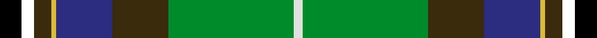

This is one **variant** — a specific cloth: this exact thread count and colourway, with its own
provenance below. It is one weaving of the [sett](/tartans/t/te/teviotdale/) (the scale-free proportion — the
same cloth at any scale or shade), whose colour order is pattern [KKGYBGGW](/stripes/kkgybggw/).

Part of the [Teviotdale](/tartans/t/te/teviotdale/) tartan — the named design grouping this sett with its other cloths.

Sourced from house-of-tartan.  It is a [13 stripe tartan](/stripes/stripes13/).

Original link [http://www.house-of-tartan.scotland.net/house/TartanViewjs.asp?colr=Def&tnam=5136](http://www.house-of-tartan.scotland.net/house/TartanViewjs.asp?colr=Def&tnam=5136)

## Provenance

Earliest known date: 01/01/1996 Lochcarron. The colours are representative of those in the valley through which flows the River Teviot in the Scottish Borders. Sample in Scottish Tartans Authority's Johnston Collection. Blues lightened to show sett.

Dataset <small>— provenance for this record, inherited from the source manifest</small>

<dl class="dataset-prov">
<dt>source</dt><dd><a href="/sources/house-of-tartan/">House of Tartan</a></dd>
<dt>data captured from</dt><dd><a href="https://github.com/thetartan/tartan-database/blob/master/data/house-of-tartan/data.csv">https://github.com/thetartan/tartan-database/blob/master/data/house-of-tartan/data.csv</a></dd>
<dt>data date</dt><dd>01/01/1996 <small>(this record)</small></dd>
<dt>licence</dt><dd><a href="https://creativecommons.org/licenses/by-nc-nd/4.0/">CC BY-NC-ND 4.0</a></dd>
</dl>

Capture chain <small>— the hands this data passed through, oldest first; each capture carries its own licence</small>

<ol class="capture-chain">
<li><a href="http://www.house-of-tartan.scotland.net/">House of Tartan</a> <small>the weaver/retailer's database — the site is now offline; the URL is kept as the ultimate source's identity</small></li>
<li><a href="https://github.com/thetartan/tartan-database">thetartan/tartan-database</a> <small>2016-2017</small> · <a href="https://creativecommons.org/licenses/by-nc-nd/4.0/">CC BY-NC-ND 4.0</a> <small>Levko Kravets's frozen compilation — the capture we vendored, and where its CC licence text came from</small></li>
<li>this dictionary <small>captured 2026-06-10 · commit 5bf86c7566</small> <small>each re-capture is a git commit to data/sources</small></li>
</ol>

## Thread count
K/16 DY8 LY2 DB26 DY26 G58 W4 G58 DY26 DB26 LY2 DY8 K/6

One full sett is **510 threads**.

The source recorded this cloth as K/10 K6 DY8 LY2 DB26 DY26 G58 W4 G58 DY26 DB26 LY2 DY8 K/6 — 516 threads; it folds to the canonical 510-thread sett above.

## Palette
<table><thead><tr><th>Colour</th><th>Shade</th><th>OKLCh</th></tr></thead><tbody><tr><td>DB</td><td><code style="background-color:#202060;">#202060</code> <small style="color:#888">#202060</small></td><td><small style="color:#888">oklch(28.9% 0.111 276.9)</small></td></tr><tr><td>DB</td><td><code style="background-color:#1C0070;">#1C0070</code> <small style="color:#888">#1C0070</small></td><td><small style="color:#888">oklch(26.3% 0.162 277.1)</small></td></tr><tr><td>DB</td><td><code style="background-color:#2C2C80;">#2C2C80</code> <small style="color:#888">#2C2C80</small></td><td><small style="color:#888">oklch(35.0% 0.138 276.6)</small></td></tr><tr><td>DG</td><td><code style="background-color:#053819;">#053819</code> <small style="color:#888">#053819</small></td><td><small style="color:#888">oklch(30.0% 0.075 151.3)</small></td></tr><tr><td>G</td><td><code style="background-color:#008B2A;">#008B2A</code> <small style="color:#888">#008B2A</small></td><td><small style="color:#888">oklch(55.4% 0.170 145.9)</small></td></tr><tr><td>K</td><td><code style="background-color:#000000;">#000000</code> <small style="color:#888">#000000</small></td><td><small style="color:#888">oklch(0.0% 0.000 0.0)</small></td></tr><tr><td>W</td><td><code style="background-color:#E0E0E0;">#E0E0E0</code> <small style="color:#888">#E0E0E0</small></td><td><small style="color:#888">oklch(90.7% 0.000 89.9)</small></td></tr><tr><td>DY</td><td><code style="background-color:#3A2B0D;">#3A2B0D</code> <small style="color:#888">#3A2B0D</small></td><td><small style="color:#888">oklch(30.0% 0.049 82.0)</small></td></tr><tr><td>W</td><td><code style="background-color:#FCFCFC;">#FCFCFC</code> <small style="color:#888">#FCFCFC</small></td><td><small style="color:#888">oklch(99.1% 0.000 89.9)</small></td></tr><tr><td>LY</td><td><code style="background-color:#DCBC32;">#DCBC32</code> <small style="color:#888">#DCBC32</small></td><td><small style="color:#888">oklch(80.0% 0.150 95.2)</small></td></tr></tbody></table>

# Sample pattern

[Sample sheet (PDF)](swatch.pdf) — the woven sample, thread count and palette on one printable A4, rendered on demand (the same sheet the TTD print page downloads).

## Nearest tartan variants

The nearest existing variants by ΔTartan distance, with this cloth at the top so the swatches line up against it.

ΔTartan

Threads

Variant

Sett

—

516

<a href="/variants/s13/k8dy4ly1db13dy13g29w2g29dy13db13ly1dy4k3~x2~db3514276-w90/">Teviotdale District Tartan</a>

<a href="/ttd/edit/#slug=k5t3dy4ly1db13dy13g29w2~x2&amp;base=k8dy4ly1db13dy13g29w2g29dy13db13ly1dy4k3~x2~db3514276-w90" title="compare in the TTD">0.61</a>

266

<a href="/variants/s8/k5t3dy4ly1db13dy13g29w2~x2/">Teviotdale</a>

<a href="/ttd/edit/#slug=db8k1w5k1r5dg13k2g4k2g11dg20dy7dg5~x2&amp;base=k8dy4ly1db13dy13g29w2g29dy13db13ly1dy4k3~x2~db3514276-w90" title="compare in the TTD">2.04</a>

310

<a href="/variants/s13/db8k1w5k1r5dg13k2g4k2g11dg20dy7dg5~x2/">Wild Geese</a>

<a href="/ttd/edit/#slug=db8k1w5k1r5dg13k2g4k2g11dg20ly7dg5~x2&amp;base=k8dy4ly1db13dy13g29w2g29dy13db13ly1dy4k3~x2~db3514276-w90" title="compare in the TTD">2.39</a>

310

<a href="/variants/s13/db8k1w5k1r5dg13k2g4k2g11dg20ly7dg5~x2/">Wild Geese (Corporate)</a>

<a href="/ttd/edit/#slug=w4k2t18y4t18dy26dg18k1o2~x2&amp;base=k8dy4ly1db13dy13g29w2g29dy13db13ly1dy4k3~x2~db3514276-w90" title="compare in the TTD">2.70</a>

360

<a href="/variants/s9/w4k2t18y4t18dy26dg18k1o2~x2/">Hughes Interconnection Int.</a>

<a href="/ttd/edit/#slug=y4k1g10r2g10r4g10r2g10k16t28k1lb4~x2~t6107234-lb7609282&amp;base=k8dy4ly1db13dy13g29w2g29dy13db13ly1dy4k3~x2~db3514276-w90" title="compare in the TTD">2.83</a>

392

<a href="/variants/s13/y4k1g10r2g10r4g10r2g10k16t28k1lb4~x2~t6107234-lb7609282/">California State</a>

<a href="/ttd/edit/#slug=g28r4k3n2k1dg2r3db20y2~x2&amp;base=k8dy4ly1db13dy13g29w2g29dy13db13ly1dy4k3~x2~db3514276-w90" title="compare in the TTD">2.88</a>

200

<a href="/variants/s9/g28r4k3n2k1dg2r3db20y2~x2/">Stirling University Corporate Tartan</a>

<a href="/ttd/edit/#slug=y4k1g10r2g10r4g10r2g10k16db28k1b4~x2&amp;base=k8dy4ly1db13dy13g29w2g29dy13db13ly1dy4k3~x2~db3514276-w90" title="compare in the TTD">2.99</a>

392

<a href="/variants/s13/y4k1g10r2g10r4g10r2g10k16db28k1b4~x2/">California</a>

<a href="/ttd/edit/#slug=db8lb1k6y1k2w2k2g12dy28w1dy4~x2&amp;base=k8dy4ly1db13dy13g29w2g29dy13db13ly1dy4k3~x2~db3514276-w90" title="compare in the TTD">3.00</a>

244

<a href="/variants/s11/db8lb1k6y1k2w2k2g12dy28w1dy4~x2/">MacLean of Kingairloch Clan Tartan</a>

<a href="/ttd/edit/#slug=lo4k1g10r2g10r4g10r2g10k16t28k1lb4~x2~t6107234-lb7609282&amp;base=k8dy4ly1db13dy13g29w2g29dy13db13ly1dy4k3~x2~db3514276-w90" title="compare in the TTD">3.01</a>

392

<a href="/variants/s13/lo4k1g10r2g10r4g10r2g10k16t28k1lb4~x2~t6107234-lb7609282/">California State American District Tartan</a>

<a href="/ttd/edit/#slug=o8k2dy10dp30dy30g55k4lo6&amp;base=k8dy4ly1db13dy13g29w2g29dy13db13ly1dy4k3~x2~db3514276-w90" title="compare in the TTD">3.04</a>

276

<a href="/variants/s8/o8k2dy10dp30dy30g55k4lo6/">Aberuchill</a>

## Neighbour map

Every grey dot is one of 13662 variants placed by the first two principal components of the ΔTartan feature space (42% of its variance). Red is this tartan; blue dots are its nearest — click one to open its page. The map is a flat projection of a many-dimensional space — [how to read it](/posts/neighbourhood-maps/).

<svg viewBox="0 0 640 380" role="img" style="max-width:100%;height:auto;border:1px solid #e0e0e0;border-radius:4px;display:block" xmlns="http://www.w3.org/2000/svg"><image href="/nn/cloud.v1.png" width="640" height="380"/><a href="/variants/s8/k5t3dy4ly1db13dy13g29w2~x2/"><circle cx="175.5" cy="105.5" r="4" fill="#3465a4"><title>Teviotdale</title></circle></a><a href="/variants/s13/db8k1w5k1r5dg13k2g4k2g11dg20dy7dg5~x2/"><circle cx="144.1" cy="108.2" r="4" fill="#3465a4"><title>Wild Geese</title></circle></a><a href="/variants/s13/db8k1w5k1r5dg13k2g4k2g11dg20ly7dg5~x2/"><circle cx="126.4" cy="102.4" r="4" fill="#3465a4"><title>Wild Geese (Corporate)</title></circle></a><a href="/variants/s9/w4k2t18y4t18dy26dg18k1o2~x2/"><circle cx="172.6" cy="104.5" r="4" fill="#3465a4"><title>Hughes Interconnection Int.</title></circle></a><a href="/variants/s13/y4k1g10r2g10r4g10r2g10k16t28k1lb4~x2~t6107234-lb7609282/"><circle cx="149.5" cy="99.2" r="4" fill="#3465a4"><title>California State</title></circle></a><a href="/variants/s9/g28r4k3n2k1dg2r3db20y2~x2/"><circle cx="194.3" cy="78.9" r="4" fill="#3465a4"><title>Stirling University Corporate Tartan</title></circle></a><a href="/variants/s13/y4k1g10r2g10r4g10r2g10k16db28k1b4~x2/"><circle cx="148.4" cy="97.0" r="4" fill="#3465a4"><title>California</title></circle></a><a href="/variants/s11/db8lb1k6y1k2w2k2g12dy28w1dy4~x2/"><circle cx="200.2" cy="67.0" r="4" fill="#3465a4"><title>MacLean of Kingairloch Clan Tartan</title></circle></a><a href="/variants/s13/lo4k1g10r2g10r4g10r2g10k16t28k1lb4~x2~t6107234-lb7609282/"><circle cx="145.8" cy="97.6" r="4" fill="#3465a4"><title>California State American District Tartan</title></circle></a><a href="/variants/s8/o8k2dy10dp30dy30g55k4lo6/"><circle cx="190.2" cy="123.2" r="4" fill="#3465a4"><title>Aberuchill</title></circle></a><circle cx="170.7" cy="80.5" r="5" fill="#c00000"/><text x="320" y="376" text-anchor="middle" font-size="11" fill="#999">ground</text><text x="11" y="190" text-anchor="middle" font-size="11" fill="#999" transform="rotate(-90 11 190)">complexity</text></svg>

ID: /variants/s13/k8dy4ly1db13dy13g29w2g29dy13db13ly1dy4k3~x2~db3514276-w90/
