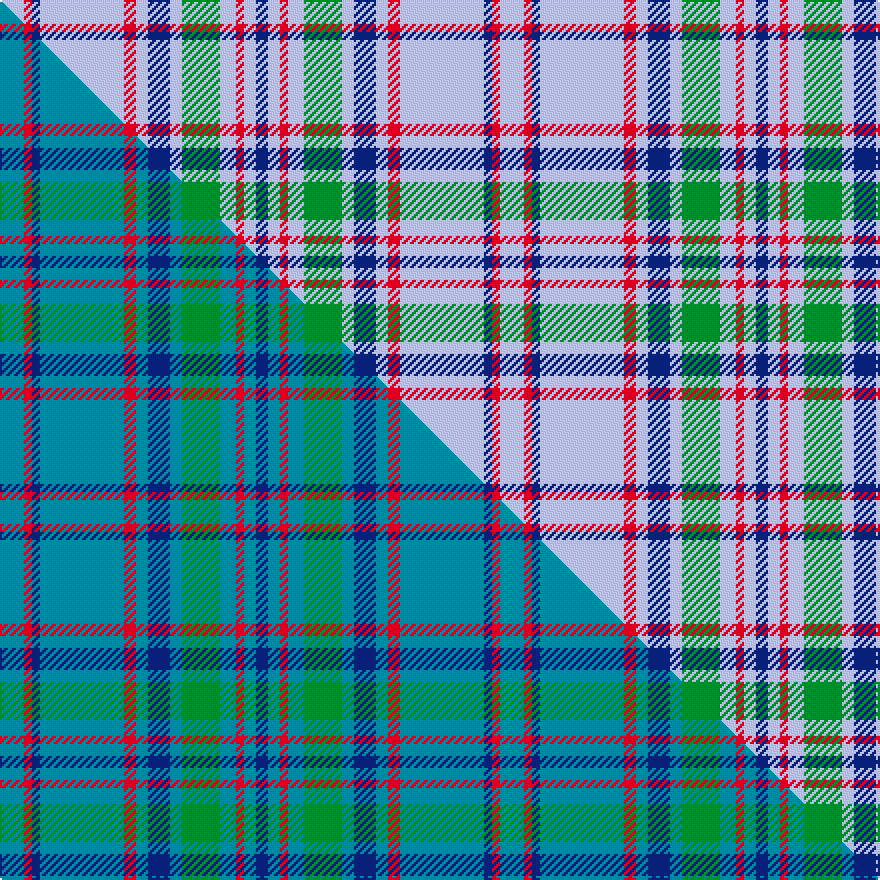

This page is one **sett** — a single exact thread-count. It belongs to the [tartan](/setts/lb12r4db4lb42r6lb6db11lb6g19lb8r4lb6db6/)
(the same proportion at any scale), whose colour order is pattern [BWRWGWBWRWBRW](/stripes/bwrwgwbwrwbrw/).

Part of the [Bermuda](/tartans/bermuda/) tartan — the named design grouping this sett with its other cloths.

Sourced from tartans-authority.  It is a [13 stripe tartan](/stripes/stripes13/).

Original link [https://www.tartanregister.gov.uk/tartanDetails.aspx?ref=2156](https://www.tartanregister.gov.uk/tartanDetails.aspx?ref=2156)

Dataset <small>— provenance for this record, inherited from the source manifest</small>

<dl class="dataset-prov">
<dt>source</dt><dd><a href="/sources/tartans-authority/">Scottish Tartans Authority</a></dd>
<dt>data captured from</dt><dd><a href="https://github.com/thetartan/tartan-database/blob/master/data/tartans-authority/data.csv">https://github.com/thetartan/tartan-database/blob/master/data/tartans-authority/data.csv</a></dd>
<dt>data date</dt><dd>1962 <small>(this record)</small></dd>
<dt>licence</dt><dd><a href="https://creativecommons.org/licenses/by-nc-nd/4.0/">CC BY-NC-ND 4.0</a></dd>
</dl>

Capture chain <small>— the hands this data passed through, oldest first; each capture carries its own licence</small>

<ol class="capture-chain">
<li><a href="https://www.tartansauthority.com/">Scottish Tartans Authority</a> <small>the heritage body's archive — its tartan-ferret record browser is retired (links repaired to the SRT, above)</small></li>
<li><a href="https://github.com/thetartan/tartan-database">thetartan/tartan-database</a> <small>2016-2017</small> · <a href="https://creativecommons.org/licenses/by-nc-nd/4.0/">CC BY-NC-ND 4.0</a> <small>Levko Kravets's frozen compilation — the capture we vendored, and where its CC licence text came from</small></li>
<li>this dictionary <small>captured 2026-06-10 · commit 5bf86c7566</small> <small>each re-capture is a git commit to data/sources</small></li>
</ol>

## Register references

External register numbers recorded for this tartan.

- Scottish Tartans Authority (ITI): 2156

## Thread count
LB/12 R4 DB4 LB42 R6 LB6 DB11 LB6 G19 LB8 R4 LB6 DB/6

One full sett is **250 threads**.

## Palette
<table><thead><tr><th>Colour</th><th>Shade</th><th>OKLCh</th></tr></thead><tbody><tr><td>LB</td><td><code style="background-color:#B5BBDE;">#B5BBDE</code> <small style="color:#888">#B5BBDE</small></td><td><small style="color:#888">oklch(79.9% 0.050 277.6)</small></td></tr><tr><td>DB</td><td><code style="background-color:#082077;">#082077</code> <small style="color:#888">#082077</small></td><td><small style="color:#888">oklch(30.0% 0.149 265.1)</small></td></tr><tr><td>R</td><td><code style="background-color:#D60020;">#D60020</code> <small style="color:#888">#D60020</small></td><td><small style="color:#888">oklch(55.2% 0.224 25.5)</small></td></tr><tr><td>G</td><td><code style="background-color:#008B2A;">#008B2A</code> <small style="color:#888">#008B2A</small></td><td><small style="color:#888">oklch(55.4% 0.170 145.9)</small></td></tr></tbody></table>

# Sample pattern

## Compared to the master

This cloth is one sett of its design; the master sett (the exemplar the design is anchored on) is below for comparison.

Its **ΔTartan distance** from the master is **0.19** — the same measure the nearest-tartans table ranks by (0 is identical; a re-scale of the same cloth is near 0, a recolour or a different proportion further).

<figure class="master-compare" style="margin:0">

this sett
master sett ★

<figcaption style="color:#888;font-size:smaller">One weave of this sett against the <a href="/setts/t12r4db4t42r6t6db11t6g19t8r4t6db6/">master sett ★</a>, split on the diagonal: a shared proportion runs seamlessly across it with only the shades shifting; a different proportion breaks on it.</figcaption>
</figure>

## Nearest tartan variants

The nearest existing variants by ΔTartan distance, with this cloth at the top so the swatches line up against it.

ΔTartan

Threads

Variant

Sett

—

250

<a href="/variants/s13/lb12r4db4lb42r6lb6db11lb6g19lb8r4lb6db6/">Bermuda Blue (1962) (District)</a>

<a href="/ttd/edit/#slug=lb9r5lb47n13k11lb5n5lb5n21lb11k5lb5r5&amp;base=lb12r4db4lb42r6lb6db11lb6g19lb8r4lb6db6" title="compare in the TTD">3.03</a>

280

<a href="/variants/s13/lb9r5lb47n13k11lb5n5lb5n21lb11k5lb5r5/">Balmoral (Old and Rare) Royal Tartan</a>

<a href="/ttd/edit/#slug=w4t14r1t1w1t1r1t14r14t1r1w1~x4~w4000000&amp;base=lb12r4db4lb42r6lb6db11lb6g19lb8r4lb6db6" title="compare in the TTD">3.09</a>

412

<a href="/variants/s12/w4t14r1t1w1t1r1t14r14t1r1w1~x4~w4000000/">Frame</a>

<a href="/ttd/edit/#slug=w4t14r1t1w1t1r1t14r14t1r1w1~x4&amp;base=lb12r4db4lb42r6lb6db11lb6g19lb8r4lb6db6" title="compare in the TTD">3.13</a>

412

<a href="/variants/s12/w4t14r1t1w1t1r1t14r14t1r1w1~x4/">Frame (Name)</a>

<a href="/ttd/edit/#slug=lb30r3lb3r3lb12dt30n3dt5~x2&amp;base=lb12r4db4lb42r6lb6db11lb6g19lb8r4lb6db6" title="compare in the TTD">3.14</a>

286

<a href="/variants/s8/lb30r3lb3r3lb12dt30n3dt5~x2/">Dama Classic</a>

<a href="/ttd/edit/#slug=lb9r5lb51n13k13lb5n4lb5n23lb11k5lb5r5&amp;base=lb12r4db4lb42r6lb6db11lb6g19lb8r4lb6db6" title="compare in the TTD">3.16</a>

294

<a href="/variants/s13/lb9r5lb51n13k13lb5n4lb5n23lb11k5lb5r5/">Balmoral Gillies (Royal)</a>

<a href="/ttd/edit/#slug=lb5g3lb24n7k6lb3n3lb3n11lb6k3lb3g3~x2&amp;base=lb12r4db4lb42r6lb6db11lb6g19lb8r4lb6db6" title="compare in the TTD">3.17</a>

304

<a href="/variants/s13/lb5g3lb24n7k6lb3n3lb3n11lb6k3lb3g3~x2/">Balmoral (Green) (Royal)</a>

<a href="/ttd/edit/#slug=lb14k3lb28g6db4lb2db2lb14r12g3r4lb4~x2&amp;base=lb12r4db4lb42r6lb6db11lb6g19lb8r4lb6db6" title="compare in the TTD">3.23</a>

348

<a href="/variants/s12/lb14k3lb28g6db4lb2db2lb14r12g3r4lb4~x2/">Grant of Achnarrow Error 1983</a>

<a href="/ttd/edit/#slug=lb5r3lb24n7k6lb3n3lb3n11lb6k3lb3r3~x2&amp;base=lb12r4db4lb42r6lb6db11lb6g19lb8r4lb6db6" title="compare in the TTD">3.25</a>

304

<a href="/variants/s13/lb5r3lb24n7k6lb3n3lb3n11lb6k3lb3r3~x2/">Balmoral (Royal)</a>

<a href="/ttd/edit/#slug=lb33r8db12g12lb8db2lb8~x2&amp;base=lb12r4db4lb42r6lb6db11lb6g19lb8r4lb6db6" title="compare in the TTD">3.35</a>

250

<a href="/variants/s7/lb33r8db12g12lb8db2lb8~x2/">Bermuda Plaid (1947) (District)</a>

<a href="/ttd/edit/#slug=lr4t2lr25n16k4lr2n2lr2n10lr4k2lr2t2~x2~lr3200000-t2304245&amp;base=lb12r4db4lb42r6lb6db11lb6g19lb8r4lb6db6" title="compare in the TTD">3.40</a>

296

<a href="/variants/s13/lb4t2lb25n16k4lb2n2lb2n10lb4k2lb2t2~x2~lb3200000-t2304245/">Balmoral (Jack Allen)</a>

## Neighbour map

Every grey dot is one of 13621 variants placed by the first two principal components of the ΔTartan feature space (42% of its variance). Red is this tartan; blue dots are its nearest — click one to open its page.

<svg viewBox="0 0 640 380" role="img" style="max-width:100%;height:auto;border:1px solid #e0e0e0;border-radius:4px;display:block" xmlns="http://www.w3.org/2000/svg"><image href="/nn/cloud.v1.png" width="640" height="380"/><a href="/variants/s13/lb9r5lb47n13k11lb5n5lb5n21lb11k5lb5r5/"><circle cx="252.4" cy="154.9" r="4" fill="#3465a4"><title>Balmoral (Old and Rare) Royal Tartan</title></circle></a><a href="/variants/s12/w4t14r1t1w1t1r1t14r14t1r1w1~x4~w4000000/"><circle cx="364.6" cy="163.1" r="4" fill="#3465a4"><title>Frame</title></circle></a><a href="/variants/s12/w4t14r1t1w1t1r1t14r14t1r1w1~x4/"><circle cx="367.1" cy="163.9" r="4" fill="#3465a4"><title>Frame (Name)</title></circle></a><a href="/variants/s8/lb30r3lb3r3lb12dt30n3dt5~x2/"><circle cx="285.0" cy="190.7" r="4" fill="#3465a4"><title>Dama Classic</title></circle></a><a href="/variants/s13/lb9r5lb51n13k13lb5n4lb5n23lb11k5lb5r5/"><circle cx="262.4" cy="139.3" r="4" fill="#3465a4"><title>Balmoral Gillies (Royal)</title></circle></a><a href="/variants/s13/lb5g3lb24n7k6lb3n3lb3n11lb6k3lb3g3~x2/"><circle cx="235.6" cy="169.5" r="4" fill="#3465a4"><title>Balmoral (Green) (Royal)</title></circle></a><a href="/variants/s12/lb14k3lb28g6db4lb2db2lb14r12g3r4lb4~x2/"><circle cx="314.0" cy="141.2" r="4" fill="#3465a4"><title>Grant of Achnarrow Error 1983</title></circle></a><a href="/variants/s13/lb5r3lb24n7k6lb3n3lb3n11lb6k3lb3r3~x2/"><circle cx="236.6" cy="166.6" r="4" fill="#3465a4"><title>Balmoral (Royal)</title></circle></a><a href="/variants/s7/lb33r8db12g12lb8db2lb8~x2/"><circle cx="316.8" cy="195.5" r="4" fill="#3465a4"><title>Bermuda Plaid (1947) (District)</title></circle></a><a href="/variants/s13/lb4t2lb25n16k4lb2n2lb2n10lb4k2lb2t2~x2~lb3200000-t2304245/"><circle cx="267.0" cy="142.4" r="4" fill="#3465a4"><title>Balmoral (Jack Allen)</title></circle></a><circle cx="307.8" cy="172.7" r="5" fill="#c00000"/><text x="320" y="376" text-anchor="middle" font-size="11" fill="#999">ground</text><text x="11" y="190" text-anchor="middle" font-size="11" fill="#999" transform="rotate(-90 11 190)">complexity</text></svg>

ID: /variants/s13/lb12r4db4lb42r6lb6db11lb6g19lb8r4lb6db6/
