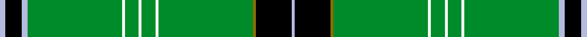

This page is one **sett** — a single exact thread-count. It belongs to the [tartan](/setts/lb2k6lb2g34w1g5w1g5w1g34y1k13lb1/)
(the same proportion at any scale), whose colour order is pattern [WKGGWGWGWGWKW](/stripes/wkggwgwgwgwkw/).

Sourced from tartans-authority.  It is a [13 stripe tartan](/stripes/stripes13/).

Original link http://www.tartansauthority.com/tartan-ferret/display/8116/

## Register references

External register numbers recorded for this tartan.

- Scottish Register of Tartans: [8116](https://www.tartanregister.gov.uk/tartanDetails?ref=8116)
- Scottish Tartans Authority (ITI): 8116

## Thread count
LB/4 K12 LB4 G68 W2 G10 W2 G10 W2 G68 Y2 K26 LB/2

One full sett is **418 threads**.

## Palette
<table><thead><tr><th>Colour</th><th>Shade</th><th>OKLCh</th></tr></thead><tbody><tr><td>LB</td><td><code style="background-color:#B5BBDE;">#B5BBDE</code> <small style="color:#888">#B5BBDE</small></td><td><small style="color:#888">oklch(79.9% 0.050 277.6)</small></td></tr><tr><td>G</td><td><code style="background-color:#008B2A;">#008B2A</code> <small style="color:#888">#008B2A</small></td><td><small style="color:#888">oklch(55.4% 0.170 145.9)</small></td></tr><tr><td>K</td><td><code style="background-color:#000000;">#000000</code> <small style="color:#888">#000000</small></td><td><small style="color:#888">oklch(0.0% 0.000 0.0)</small></td></tr><tr><td>W</td><td><code style="background-color:#F7F7F7;">#F7F7F7</code> <small style="color:#888">#F7F7F7</small></td><td><small style="color:#888">oklch(97.6% 0.000 89.9)</small></td></tr><tr><td>Y</td><td><code style="background-color:#8B6E00;">#8B6E00</code> <small style="color:#888">#8B6E00</small></td><td><small style="color:#888">oklch(55.1% 0.113 90.4)</small></td></tr></tbody></table>

# Sample pattern

## Nearest variants

The nearest existing variants by ΔTartan distance, with this cloth at the top so the swatches line up against it.

ΔTartan

Threads

Variant

Sett

—

418

<a href="/variants/s13/lb2k6lb2g34w1g5w1g5w1g34y1k13lb1~x2/">Stirling Castle (Corporate)</a>

<a href="/ttd/edit/#slug=k2db4g27lo2g1dp4g1lb2g27db4k2~x2&amp;base=lb2k6lb2g34w1g5w1g5w1g34y1k13lb1~x2" title="compare in the TTD">2.68</a>

296

<a href="/variants/s11/k2db4g27lo2g1dp4g1lb2g27db4k2~x2/">Chapman-Smith, M &amp; L (Personal)</a>

## Neighbour map

Every grey dot is one of 13620 variants placed by the first two principal components of the ΔTartan feature space (42% of its variance). Red is this tartan; blue dots are its nearest — click one to open its page.

<svg viewBox="0 0 640 380" role="img" style="max-width:100%;height:auto;border:1px solid #e0e0e0;border-radius:4px;display:block" xmlns="http://www.w3.org/2000/svg"><image href="/nn/cloud.v1.png" width="640" height="380"/><a href="/variants/s11/k2db4g27lo2g1dp4g1lb2g27db4k2~x2/"><circle cx="391.6" cy="78.2" r="4" fill="#3465a4"><title>Chapman-Smith, M &amp; L (Personal)</title></circle></a><circle cx="393.7" cy="70.4" r="5" fill="#c00000"/><text x="320" y="376" text-anchor="middle" font-size="11" fill="#999">ground</text><text x="11" y="190" text-anchor="middle" font-size="11" fill="#999" transform="rotate(-90 11 190)">complexity</text></svg>

ID: /variants/s13/lb2k6lb2g34w1g5w1g5w1g34y1k13lb1~x2/
