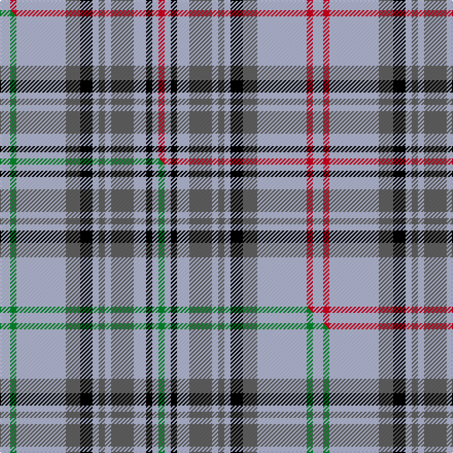

This is one **variant** — a specific cloth: this exact thread count and colourway, with its own
provenance below. It is one weaving of the [sett](/setts/lb5r3lb24n7k6lb3n3lb3n11lb6k3lb3r3/) (the scale-free proportion — the
same cloth at any scale or shade), whose colour order is pattern [RWKWBWBWKBWRW](/stripes/rwkwbwbwkbwrw/).

Part of the [Balmoral](/tartans/b/ba/balmoral-4/) tartan — the named design grouping this sett with its other cloths.

Sourced from register-of-tartans.  It is a [13 stripe tartan](/stripes/stripes13/).

Original link [https://www.tartanregister.gov.uk/tartanDetails.aspx?ref=182](https://www.tartanregister.gov.uk/tartanDetails.aspx?ref=182)

2 attestations — the source records this cloth was collapsed from (oldest owns this page)

<ul>
<li>01/01/1853 — Balmoral (Royal) (register-of-tartans, <a href="https://www.tartanregister.gov.uk/tartanDetails.aspx?ref=182">record</a>)  <em>This is the original Balmoral as designed by Queen Victoria's husband. Prince Albert in 1853. While predominantly grey with overchecks of red and black the background contains threads of black and white yarns twisted together to achieve the appearance of the rough hewn granite so familiar in Royal Deeside. It is worn by HM Queen herself as a skirt and several members of the Royal Family but only with the Queen's permission. The only other approved wearer of the Balmoral Tartan is the Queen's personal piper (the Estate workers and Ghillies wear the Balmoral Tweed). D W Stewart wrote in 'Old and Rare Scottish Tartans' (1893), 'Her Majesty the Queen has not only granted permission for its publication here, but has also graciously afforded information concerning its inception in the early years of the reign, when the sett was designed by the Prince Consort.' There is also a smaller sett that was woven for the children's clothes. Checked against original cloth sample woven by Kinloch Anderson, holders of the Royal Warrant. The Balmoral was originally woven only by Romanes & Paterson of Edinburgh.</em></li>
<li>1853 — Balmoral (Royal) (tartans-authority, <a href="https://www.tartanregister.gov.uk/tartanDetails.aspx?ref=1300">record</a>)  <em>This is the original Balmoral as designed by Queen Victoria's husband. Prince Albert in 1853. While predominantly grey with overchecks of red and black the background contains threads of black and white yarns twisted together to achieve the appearance of the rough hewn granite so familiar in Royal Deeside. It is worn by HM Queen herself as a skirt and several members of the Royal Family but only with the Queen's permission. The only other approved wearer of the Balmoral Tartan is the Queen's personal piper. (The Estate workers and Ghillies wear the Balmoral Tweed). D.W.Stewart wrote in his book, 'Old and Rare Scottish Tartans' (1893), ''Her Majesty the Queen has not only granted permission for its publication here, but has also graciously afforded information concerning its inception in the early years of the reign, when the sett was designed by the Prince Consort.'' There is also a smaller sett that was woven for the children's clothes. Checked against original cloth sample woven by Kinloch Anderson, holders of the Royal Warrant. The Balmoral was originally woven only by Romanes & Paterson of Edinburgh.</em></li>
</ul>

Dataset <small>— provenance for this record, inherited from the source manifest</small>

<dl class="dataset-prov">
<dt>source</dt><dd><a href="/sources/register-of-tartans/">Scottish Register of Tartans</a></dd>
<dt>data captured from</dt><dd><a href="https://github.com/thetartan/tartan-database/blob/master/data/register-of-tartans/data.csv">https://github.com/thetartan/tartan-database/blob/master/data/register-of-tartans/data.csv</a></dd>
<dt>data date</dt><dd>1853 <small>(this record)</small></dd>
<dt>licence</dt><dd><a href="https://www.tartanregister.gov.uk/copyright">Crown copyright</a></dd>
</dl>

Capture chain <small>— the hands this data passed through, oldest first; each capture carries its own licence</small>

<ol class="capture-chain">
<li><a href="https://www.tartanregister.gov.uk/">Scottish Register of Tartans</a> · <a href="https://www.tartanregister.gov.uk/copyright">Crown copyright</a> <small>the living register — still published by National Records of Scotland</small></li>
<li><a href="https://github.com/thetartan/tartan-database">thetartan/tartan-database</a> <small>2016-2017</small> · <a href="https://creativecommons.org/licenses/by-nc-nd/4.0/">CC BY-NC-ND 4.0</a> <small>Levko Kravets's frozen compilation — the capture we vendored, and where its CC licence text came from</small></li>
<li>this dictionary <small>captured 2026-06-10 · commit 5bf86c7566</small> <small>each re-capture is a git commit to data/sources</small></li>
</ol>

## Register references

External register numbers recorded for this tartan.

- Scottish Register of Tartans: [182](https://www.tartanregister.gov.uk/tartanDetails.aspx?ref=182)
- Scottish Tartans Authority (ITI): 1300
- Scottish Tartans World Register: 1300

## Thread count
LB/10 R6 LB48 N14 K12 LB6 N6 LB6 N22 LB12 K6 LB6 R/6

One full sett is **304 threads**.

## Palette
<table><thead><tr><th>Colour</th><th>Shade</th><th>OKLCh</th></tr></thead><tbody><tr><td>K</td><td><code style="background-color:#000000;">#000000</code> <small style="color:#888">#000000</small></td><td><small style="color:#888">oklch(0.0% 0.000 0.0)</small></td></tr><tr><td>N</td><td><code style="background-color:#636363;">#636363</code> <small style="color:#888">#636363</small></td><td><small style="color:#888">oklch(50.0% 0.000 89.9)</small></td></tr><tr><td>LB</td><td><code style="background-color:#B5BBDE;">#B5BBDE</code> <small style="color:#888">#B5BBDE</small></td><td><small style="color:#888">oklch(79.9% 0.050 277.6)</small></td></tr><tr><td>R</td><td><code style="background-color:#D60020;">#D60020</code> <small style="color:#888">#D60020</small></td><td><small style="color:#888">oklch(55.2% 0.224 25.5)</small></td></tr></tbody></table>

# Sample pattern

## Compared to the master

This cloth is one sett of its design; the master sett (the exemplar the design is anchored on) is below for comparison.

Its **ΔTartan distance** from the master is **0.60** — the same measure the nearest-tartans table ranks by (0 is identical; a re-scale of the same cloth is near 0, a recolour or a different proportion further).

<figure class="master-compare" style="margin:0">

this sett
master sett ★

<figcaption style="color:#888;font-size:smaller">One weave of this sett against the <a href="/setts/lb5g3lb24n7k6lb3n3lb3n11lb6k3lb3g3/">master sett ★</a>, split on the diagonal: a shared proportion runs seamlessly across it with only the shades shifting; a different proportion breaks on it.</figcaption>
</figure>

## Nearest tartan variants

The nearest existing variants by ΔTartan distance, with this cloth at the top so the swatches line up against it.

ΔTartan

Threads

Variant

Sett

—

304

<a href="/variants/s13/lb5r3lb24n7k6lb3n3lb3n11lb6k3lb3r3~x2/">Balmoral (Royal)</a>

<a href="/ttd/edit/#slug=lb9r5lb47n13k11lb5n5lb5n21lb11k5lb5r5&amp;base=lb5r3lb24n7k6lb3n3lb3n11lb6k3lb3r3~x2" title="compare in the TTD">0.13</a>

280

<a href="/variants/s13/lb9r5lb47n13k11lb5n5lb5n21lb11k5lb5r5/">Balmoral (Old and Rare) Royal Tartan</a>

<a href="/ttd/edit/#slug=lb9r5lb51n13k13lb5n4lb5n23lb11k5lb5r5&amp;base=lb5r3lb24n7k6lb3n3lb3n11lb6k3lb3r3~x2" title="compare in the TTD">0.37</a>

294

<a href="/variants/s13/lb9r5lb51n13k13lb5n4lb5n23lb11k5lb5r5/">Balmoral Gillies (Royal)</a>

<a href="/ttd/edit/#slug=lb5g3lb24n7k6lb3n3lb3n11lb6k3lb3g3~x2&amp;base=lb5r3lb24n7k6lb3n3lb3n11lb6k3lb3r3~x2" title="compare in the TTD">0.60</a>

304

<a href="/variants/s13/lb5g3lb24n7k6lb3n3lb3n11lb6k3lb3g3~x2/">Balmoral (Green) (Royal)</a>

<a href="/ttd/edit/#slug=n2r1n8lp2k2n1lp1n1lp4n2k1n1r1~x2&amp;base=lb5r3lb24n7k6lb3n3lb3n11lb6k3lb3r3~x2" title="compare in the TTD">1.88</a>

102

<a href="/variants/s13/n2r1n8lp2k2n1lp1n1lp4n2k1n1r1~x2/">Balmoral Royal Tartan</a>

<a href="/ttd/edit/#slug=lb12r6lb60n16k23n22lb6k6lb6n8r6n8~x2&amp;base=lb5r3lb24n7k6lb3n3lb3n11lb6k3lb3r3~x2" title="compare in the TTD">2.10</a>

676

<a href="/variants/s12/lb12r6lb60n16k23n22lb6k6lb6n8r6n8~x2/">Balmoral Variant (Corporate)</a>

<a href="/ttd/edit/#slug=lr3dg18k4lb12dg2lb3dg2lb3dg2lb12lr4lb3~x2~lr2800000-lb3103284&amp;base=lb5r3lb24n7k6lb3n3lb3n11lb6k3lb3r3~x2" title="compare in the TTD">2.24</a>

260

<a href="/variants/s12/lr3dg18k4lb12dg2lb3dg2lb3dg2lb12lr4lb3~x2~lr2800000-lb3103284/">Breifne</a>

<a href="/ttd/edit/#slug=w2r1w8n2k2w1n1w1n4w2k1w1r1~x4&amp;base=lb5r3lb24n7k6lb3n3lb3n11lb6k3lb3r3~x2" title="compare in the TTD">2.32</a>

204

<a href="/variants/s13/w2r1w8n2k2w1n1w1n4w2k1w1r1~x4/">Balmoral (Ghillies white variation)</a>

<a href="/ttd/edit/#slug=lr4t2lr25n16k4lr2n2lr2n10lr4k2lr2t2~x2~lr3200000-t2304245&amp;base=lb5r3lb24n7k6lb3n3lb3n11lb6k3lb3r3~x2" title="compare in the TTD">2.59</a>

296

<a href="/variants/s13/lb4t2lb25n16k4lb2n2lb2n10lb4k2lb2t2~x2~lb3200000-t2304245/">Balmoral (Jack Allen)</a>

<a href="/ttd/edit/#slug=k4w2lb15r6lb25w2k4w2lb15w4k2w4k2w4k2~x2&amp;base=lb5r3lb24n7k6lb3n3lb3n11lb6k3lb3r3~x2" title="compare in the TTD">2.84</a>

360

<a href="/variants/s15/k4w2lb15r6lb25w2k4w2lb15w4k2w4k2w4k2~x2/">Beck (Personal)</a>

<a href="/ttd/edit/#slug=lb1dp3k2w1dp8w1k2w9k1w3lb1~x6&amp;base=lb5r3lb24n7k6lb3n3lb3n11lb6k3lb3r3~x2" title="compare in the TTD">2.98</a>

372

<a href="/variants/s11/lb1dp3k2w1dp8w1k2w9k1w3lb1~x6/">MacRae, Dress Purple (Dance)</a>

## Neighbour map

Every grey dot is one of 13656 variants placed by the first two principal components of the ΔTartan feature space (42% of its variance). Red is this tartan; blue dots are its nearest — click one to open its page. The map is a flat projection of a many-dimensional space — [how to read it](/posts/neighbourhood-maps/).

<svg viewBox="0 0 640 380" role="img" style="max-width:100%;height:auto;border:1px solid #e0e0e0;border-radius:4px;display:block" xmlns="http://www.w3.org/2000/svg"><image href="/nn/cloud.v1.png" width="640" height="380"/><a href="/variants/s13/lb9r5lb47n13k11lb5n5lb5n21lb11k5lb5r5/"><circle cx="252.5" cy="154.1" r="4" fill="#3465a4"><title>Balmoral (Old and Rare) Royal Tartan</title></circle></a><a href="/variants/s13/lb9r5lb51n13k13lb5n4lb5n23lb11k5lb5r5/"><circle cx="262.5" cy="138.6" r="4" fill="#3465a4"><title>Balmoral Gillies (Royal)</title></circle></a><a href="/variants/s13/lb5g3lb24n7k6lb3n3lb3n11lb6k3lb3g3~x2/"><circle cx="235.6" cy="168.7" r="4" fill="#3465a4"><title>Balmoral (Green) (Royal)</title></circle></a><a href="/variants/s13/n2r1n8lp2k2n1lp1n1lp4n2k1n1r1~x2/"><circle cx="251.6" cy="165.7" r="4" fill="#3465a4"><title>Balmoral Royal Tartan</title></circle></a><a href="/variants/s12/lb12r6lb60n16k23n22lb6k6lb6n8r6n8~x2/"><circle cx="201.6" cy="153.7" r="4" fill="#3465a4"><title>Balmoral Variant (Corporate)</title></circle></a><a href="/variants/s12/lr3dg18k4lb12dg2lb3dg2lb3dg2lb12lr4lb3~x2~lr2800000-lb3103284/"><circle cx="209.6" cy="168.4" r="4" fill="#3465a4"><title>Breifne</title></circle></a><a href="/variants/s13/w2r1w8n2k2w1n1w1n4w2k1w1r1~x4/"><circle cx="218.9" cy="160.4" r="4" fill="#3465a4"><title>Balmoral (Ghillies white variation)</title></circle></a><a href="/variants/s13/lb4t2lb25n16k4lb2n2lb2n10lb4k2lb2t2~x2~lb3200000-t2304245/"><circle cx="267.1" cy="141.8" r="4" fill="#3465a4"><title>Balmoral (Jack Allen)</title></circle></a><a href="/variants/s15/k4w2lb15r6lb25w2k4w2lb15w4k2w4k2w4k2~x2/"><circle cx="249.9" cy="122.5" r="4" fill="#3465a4"><title>Beck (Personal)</title></circle></a><a href="/variants/s11/lb1dp3k2w1dp8w1k2w9k1w3lb1~x6/"><circle cx="169.4" cy="158.2" r="4" fill="#3465a4"><title>MacRae, Dress Purple (Dance)</title></circle></a><circle cx="236.6" cy="165.8" r="5" fill="#c00000"/><text x="320" y="376" text-anchor="middle" font-size="11" fill="#999">ground</text><text x="11" y="190" text-anchor="middle" font-size="11" fill="#999" transform="rotate(-90 11 190)">complexity</text></svg>

ID: /variants/s13/lb5r3lb24n7k6lb3n3lb3n11lb6k3lb3r3~x2/
