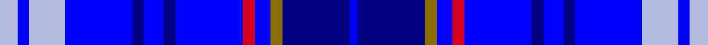

This is one **variant** — a specific cloth: this exact thread count and colourway, with its own
provenance below. It is one weaving of the [sett](/tartans/d/de/dempster/) (the scale-free proportion — the
same cloth at any scale or shade), whose colour order is pattern [BBGBRBBBBBWBW](/stripes/bbgbrbbbbbwbw/).

Part of the [Dempster](/tartans/d/de/dempster/) tartan — the named design grouping this sett with its other cloths.

Sourced from register-of-tartans.  It is a [13 stripe tartan](/stripes/stripes13/).

Original link [https://www.tartanregister.gov.uk/tartanDetails.aspx?ref=913](https://www.tartanregister.gov.uk/tartanDetails.aspx?ref=913)

Dataset <small>— provenance for this record, inherited from the source manifest</small>

<dl class="dataset-prov">
<dt>source</dt><dd><a href="/sources/register-of-tartans/">Scottish Register of Tartans</a></dd>
<dt>data captured from</dt><dd><a href="https://github.com/thetartan/tartan-database/blob/master/data/register-of-tartans/data.csv">https://github.com/thetartan/tartan-database/blob/master/data/register-of-tartans/data.csv</a></dd>
<dt>data date</dt><dd>1996 <small>(this record)</small></dd>
<dt>licence</dt><dd><a href="https://www.tartanregister.gov.uk/copyright">Crown copyright</a></dd>
</dl>

Capture chain <small>— the hands this data passed through, oldest first; each capture carries its own licence</small>

<ol class="capture-chain">
<li><a href="https://www.tartanregister.gov.uk/">Scottish Register of Tartans</a> · <a href="https://www.tartanregister.gov.uk/copyright">Crown copyright</a> <small>the living register — still published by National Records of Scotland</small></li>
<li><a href="https://github.com/thetartan/tartan-database">thetartan/tartan-database</a> <small>2016-2017</small> · <a href="https://creativecommons.org/licenses/by-nc-nd/4.0/">CC BY-NC-ND 4.0</a> <small>Levko Kravets's frozen compilation — the capture we vendored, and where its CC licence text came from</small></li>
<li>this dictionary <small>captured 2026-06-10 · commit 5bf86c7566</small> <small>each re-capture is a git commit to data/sources</small></li>
</ol>

## Register references

External register numbers recorded for this tartan.

- Scottish Register of Tartans: [913](https://www.tartanregister.gov.uk/tartanDetails.aspx?ref=913)
- Scottish Tartans Authority (ITI): 2219
- Scottish Tartans World Register: 2219

## Thread count
LB/9 B6 LB18 B34 DB6 B10 DB6 B34 R6 B8 Y6 DB34 B/4

One full sett is **349 threads**.

## Palette
<table><thead><tr><th>Colour</th><th>Shade</th><th>OKLCh</th></tr></thead><tbody><tr><td>LB</td><td><code style="background-color:#B5BBDE;">#B5BBDE</code> <small style="color:#888">#B5BBDE</small></td><td><small style="color:#888">oklch(79.9% 0.050 277.6)</small></td></tr><tr><td>B</td><td><code style="background-color:#0000FF;">#0000FF</code> <small style="color:#888">#0000FF</small></td><td><small style="color:#888">oklch(45.2% 0.313 264.1)</small></td></tr><tr><td>DB</td><td><code style="background-color:#000080;">#000080</code> <small style="color:#888">#000080</small></td><td><small style="color:#888">oklch(27.1% 0.188 264.1)</small></td></tr><tr><td>R</td><td><code style="background-color:#D60020;">#D60020</code> <small style="color:#888">#D60020</small></td><td><small style="color:#888">oklch(55.2% 0.224 25.5)</small></td></tr><tr><td>Y</td><td><code style="background-color:#8B6E00;">#8B6E00</code> <small style="color:#888">#8B6E00</small></td><td><small style="color:#888">oklch(55.1% 0.113 90.4)</small></td></tr></tbody></table>

# Sample pattern

[Sample sheet (PDF)](swatch.pdf) — the woven sample, thread count and palette on one printable A4, rendered on demand (the same sheet the TTD print page downloads).

## Nearest tartan variants

The nearest existing variants by ΔTartan distance, with this cloth at the top so the swatches line up against it.

ΔTartan

Threads

Variant

Sett

—

349

<a href="/variants/s13/lb9b6lb18b34db6b10db6b34r6b8y6db34b4~b4531264-db2719264/">Dempster (Personal)</a>

<a href="/ttd/edit/#slug=b12r4db4b42r6b6db11b6dg19b8r4b6db6&amp;base=lb9b6lb18b34db6b10db6b34r6b8y6db34b4~b4531264-db2719264" title="compare in the TTD">1.94</a>

250

<a href="/variants/s13/b12r4db4b42r6b6db11b6dg19b8r4b6db6/">Bermuda, Blue</a>

## Neighbour map

Every grey dot is one of 13662 variants placed by the first two principal components of the ΔTartan feature space (42% of its variance). Red is this tartan; blue dots are its nearest — click one to open its page. The map is a flat projection of a many-dimensional space — [how to read it](/posts/neighbourhood-maps/).

<svg viewBox="0 0 640 380" role="img" style="max-width:100%;height:auto;border:1px solid #e0e0e0;border-radius:4px;display:block" xmlns="http://www.w3.org/2000/svg"><image href="/nn/cloud.v1.png" width="640" height="380"/><a href="/variants/s13/b12r4db4b42r6b6db11b6dg19b8r4b6db6/"><circle cx="357.9" cy="187.5" r="4" fill="#3465a4"><title>Bermuda, Blue</title></circle></a><circle cx="248.4" cy="183.7" r="5" fill="#c00000"/><text x="320" y="376" text-anchor="middle" font-size="11" fill="#999">ground</text><text x="11" y="190" text-anchor="middle" font-size="11" fill="#999" transform="rotate(-90 11 190)">complexity</text></svg>

ID: /variants/s13/lb9b6lb18b34db6b10db6b34r6b8y6db34b4~b4531264-db2719264/
