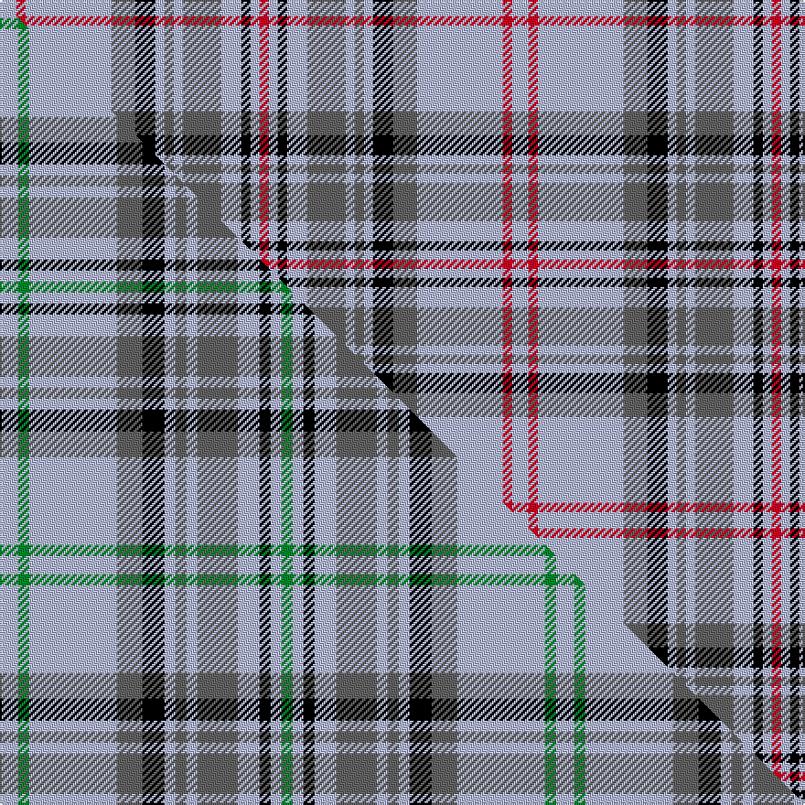

This is one **variant** — a specific cloth: this exact thread count and colourway, with its own
provenance below. It is one weaving of the [sett](/setts/lb9r5lb47n13k11lb5n5lb5n21lb11k5lb5r5/) (the scale-free proportion — the
same cloth at any scale or shade), whose colour order is pattern [RWKWBWBWKBWRW](/stripes/rwkwbwbwkbwrw/).

Part of the [Balmoral](/tartans/b/ba/balmoral-6/) tartan — the named design grouping this sett with its other cloths.

Sourced from house-of-tartan.  It is a [13 stripe tartan](/stripes/stripes13/).

Original link [http://www.house-of-tartan.scotland.net/house/TartanViewjs.asp?colr=Def&tnam=1300](http://www.house-of-tartan.scotland.net/house/TartanViewjs.asp?colr=Def&tnam=1300)

## Provenance

Earliest known date: 1893 The Balmoral tartan is not produced as an article of commerce. D.W.Stewart wrote in his book, 'Old and Rare Scottish Tartans' (1893), "Her Majesty the Queen has not only granted permission for its publication here, but has also graciously afforded information concerning its inception in the early years of the reign, when the sett was designed by the Prince Consort." The grey threads are flecked to give an impression of granite.

Dataset <small>— provenance for this record, inherited from the source manifest</small>

<dl class="dataset-prov">
<dt>source</dt><dd><a href="/sources/house-of-tartan/">House of Tartan</a></dd>
<dt>data captured from</dt><dd><a href="https://github.com/thetartan/tartan-database/blob/master/data/house-of-tartan/data.csv">https://github.com/thetartan/tartan-database/blob/master/data/house-of-tartan/data.csv</a></dd>
<dt>data date</dt><dd>1893 <small>(this record)</small></dd>
<dt>licence</dt><dd><a href="https://creativecommons.org/licenses/by-nc-nd/4.0/">CC BY-NC-ND 4.0</a></dd>
</dl>

Capture chain <small>— the hands this data passed through, oldest first; each capture carries its own licence</small>

<ol class="capture-chain">
<li><a href="http://www.house-of-tartan.scotland.net/">House of Tartan</a> <small>the weaver/retailer's database — the site is now offline; the URL is kept as the ultimate source's identity</small></li>
<li><a href="https://github.com/thetartan/tartan-database">thetartan/tartan-database</a> <small>2016-2017</small> · <a href="https://creativecommons.org/licenses/by-nc-nd/4.0/">CC BY-NC-ND 4.0</a> <small>Levko Kravets's frozen compilation — the capture we vendored, and where its CC licence text came from</small></li>
<li>this dictionary <small>captured 2026-06-10 · commit 5bf86c7566</small> <small>each re-capture is a git commit to data/sources</small></li>
</ol>

## Thread count
LB/9 R5 LB47 N13 K11 LB5 N5 LB5 N21 LB11 K5 LB5 R/5

One full sett is **280 threads**.

## Palette
<table><thead><tr><th>Colour</th><th>Shade</th><th>OKLCh</th></tr></thead><tbody><tr><td>K</td><td><code style="background-color:#000000;">#000000</code> <small style="color:#888">#000000</small></td><td><small style="color:#888">oklch(0.0% 0.000 0.0)</small></td></tr><tr><td>N</td><td><code style="background-color:#636363;">#636363</code> <small style="color:#888">#636363</small></td><td><small style="color:#888">oklch(50.0% 0.000 89.9)</small></td></tr><tr><td>LB</td><td><code style="background-color:#B5BBDE;">#B5BBDE</code> <small style="color:#888">#B5BBDE</small></td><td><small style="color:#888">oklch(79.9% 0.050 277.6)</small></td></tr><tr><td>R</td><td><code style="background-color:#D60020;">#D60020</code> <small style="color:#888">#D60020</small></td><td><small style="color:#888">oklch(55.2% 0.224 25.5)</small></td></tr></tbody></table>

# Sample pattern

## Compared to the master

This cloth is one sett of its design; the master sett (the exemplar the design is anchored on) is below for comparison.

Its **ΔTartan distance** from the master is **0.74** — the same measure the nearest-tartans table ranks by (0 is identical; a re-scale of the same cloth is near 0, a recolour or a different proportion further).

<figure class="master-compare" style="margin:0">

this sett
master sett ★

<figcaption style="color:#888;font-size:smaller">One weave of this sett against the <a href="/setts/lb5g3lb24n7k6lb3n3lb3n11lb6k3lb3g3/">master sett ★</a>, split on the diagonal: a shared proportion runs seamlessly across it with only the shades shifting; a different proportion breaks on it.</figcaption>
</figure>

## Nearest tartan variants

The nearest existing variants by ΔTartan distance, with this cloth at the top so the swatches line up against it.

ΔTartan

Threads

Variant

Sett

—

280

<a href="/variants/s13/lb9r5lb47n13k11lb5n5lb5n21lb11k5lb5r5/">Balmoral (Old and Rare) Royal Tartan</a>

<a href="/ttd/edit/#slug=lb5r3lb24n7k6lb3n3lb3n11lb6k3lb3r3~x2&amp;base=lb9r5lb47n13k11lb5n5lb5n21lb11k5lb5r5" title="compare in the TTD">0.13</a>

304

<a href="/variants/s13/lb5r3lb24n7k6lb3n3lb3n11lb6k3lb3r3~x2/">Balmoral (Royal)</a>

<a href="/ttd/edit/#slug=lb9r5lb51n13k13lb5n4lb5n23lb11k5lb5r5&amp;base=lb9r5lb47n13k11lb5n5lb5n21lb11k5lb5r5" title="compare in the TTD">0.31</a>

294

<a href="/variants/s13/lb9r5lb51n13k13lb5n4lb5n23lb11k5lb5r5/">Balmoral Gillies (Royal)</a>

<a href="/ttd/edit/#slug=lb5g3lb24n7k6lb3n3lb3n11lb6k3lb3g3~x2&amp;base=lb9r5lb47n13k11lb5n5lb5n21lb11k5lb5r5" title="compare in the TTD">0.74</a>

304

<a href="/variants/s13/lb5g3lb24n7k6lb3n3lb3n11lb6k3lb3g3~x2/">Balmoral (Green) (Royal)</a>

<a href="/ttd/edit/#slug=n2r1n8lp2k2n1lp1n1lp4n2k1n1r1~x2&amp;base=lb9r5lb47n13k11lb5n5lb5n21lb11k5lb5r5" title="compare in the TTD">2.08</a>

102

<a href="/variants/s13/n2r1n8lp2k2n1lp1n1lp4n2k1n1r1~x2/">Balmoral Royal Tartan</a>

<a href="/ttd/edit/#slug=lr4t2lr25n16k4lr2n2lr2n10lr4k2lr2t2~x2~lr3200000-t2304245&amp;base=lb9r5lb47n13k11lb5n5lb5n21lb11k5lb5r5" title="compare in the TTD">2.09</a>

296

<a href="/variants/s13/lb4t2lb25n16k4lb2n2lb2n10lb4k2lb2t2~x2~lb3200000-t2304245/">Balmoral (Jack Allen)</a>

<a href="/ttd/edit/#slug=lb12r6lb60n16k23n22lb6k6lb6n8r6n8~x2&amp;base=lb9r5lb47n13k11lb5n5lb5n21lb11k5lb5r5" title="compare in the TTD">2.13</a>

676

<a href="/variants/s12/lb12r6lb60n16k23n22lb6k6lb6n8r6n8~x2/">Balmoral Variant (Corporate)</a>

<a href="/ttd/edit/#slug=lr3dg18k4lb12dg2lb3dg2lb3dg2lb12lr4lb3~x2~lr2800000-lb3103284&amp;base=lb9r5lb47n13k11lb5n5lb5n21lb11k5lb5r5" title="compare in the TTD">2.38</a>

260

<a href="/variants/s12/lr3dg18k4lb12dg2lb3dg2lb3dg2lb12lr4lb3~x2~lr2800000-lb3103284/">Breifne</a>

<a href="/ttd/edit/#slug=k4w2lb15r6lb25w2k4w2lb15w4k2w4k2w4k2~x2&amp;base=lb9r5lb47n13k11lb5n5lb5n21lb11k5lb5r5" title="compare in the TTD">2.43</a>

360

<a href="/variants/s15/k4w2lb15r6lb25w2k4w2lb15w4k2w4k2w4k2~x2/">Beck (Personal)</a>

<a href="/ttd/edit/#slug=w2r1w8n2k2w1n1w1n4w2k1w1r1~x4&amp;base=lb9r5lb47n13k11lb5n5lb5n21lb11k5lb5r5" title="compare in the TTD">2.44</a>

204

<a href="/variants/s13/w2r1w8n2k2w1n1w1n4w2k1w1r1~x4/">Balmoral (Ghillies white variation)</a>

<a href="/ttd/edit/#slug=lb30r2lb2k5lb3dy2lb3dy22lb3k2lb3~x2&amp;base=lb9r5lb47n13k11lb5n5lb5n21lb11k5lb5r5" title="compare in the TTD">2.80</a>

242

<a href="/variants/s11/lb30r2lb2k5lb3dy2lb3dy22lb3k2lb3~x2/">Dunbarton Weft</a>

## Neighbour map

Every grey dot is one of 13621 variants placed by the first two principal components of the ΔTartan feature space (42% of its variance). Red is this tartan; blue dots are its nearest — click one to open its page.

<svg viewBox="0 0 640 380" role="img" style="max-width:100%;height:auto;border:1px solid #e0e0e0;border-radius:4px;display:block" xmlns="http://www.w3.org/2000/svg"><image href="/nn/cloud.v1.png" width="640" height="380"/><a href="/variants/s13/lb5r3lb24n7k6lb3n3lb3n11lb6k3lb3r3~x2/"><circle cx="236.6" cy="166.5" r="4" fill="#3465a4"><title>Balmoral (Royal)</title></circle></a><a href="/variants/s13/lb9r5lb51n13k13lb5n4lb5n23lb11k5lb5r5/"><circle cx="262.4" cy="139.1" r="4" fill="#3465a4"><title>Balmoral Gillies (Royal)</title></circle></a><a href="/variants/s13/lb5g3lb24n7k6lb3n3lb3n11lb6k3lb3g3~x2/"><circle cx="235.6" cy="169.4" r="4" fill="#3465a4"><title>Balmoral (Green) (Royal)</title></circle></a><a href="/variants/s13/n2r1n8lp2k2n1lp1n1lp4n2k1n1r1~x2/"><circle cx="251.6" cy="166.4" r="4" fill="#3465a4"><title>Balmoral Royal Tartan</title></circle></a><a href="/variants/s13/lb4t2lb25n16k4lb2n2lb2n10lb4k2lb2t2~x2~lb3200000-t2304245/"><circle cx="267.0" cy="142.3" r="4" fill="#3465a4"><title>Balmoral (Jack Allen)</title></circle></a><a href="/variants/s12/lb12r6lb60n16k23n22lb6k6lb6n8r6n8~x2/"><circle cx="201.6" cy="154.3" r="4" fill="#3465a4"><title>Balmoral Variant (Corporate)</title></circle></a><a href="/variants/s12/lr3dg18k4lb12dg2lb3dg2lb3dg2lb12lr4lb3~x2~lr2800000-lb3103284/"><circle cx="209.7" cy="169.0" r="4" fill="#3465a4"><title>Breifne</title></circle></a><a href="/variants/s15/k4w2lb15r6lb25w2k4w2lb15w4k2w4k2w4k2~x2/"><circle cx="249.7" cy="123.1" r="4" fill="#3465a4"><title>Beck (Personal)</title></circle></a><a href="/variants/s13/w2r1w8n2k2w1n1w1n4w2k1w1r1~x4/"><circle cx="218.7" cy="161.3" r="4" fill="#3465a4"><title>Balmoral (Ghillies white variation)</title></circle></a><a href="/variants/s11/lb30r2lb2k5lb3dy2lb3dy22lb3k2lb3~x2/"><circle cx="294.4" cy="123.3" r="4" fill="#3465a4"><title>Dunbarton Weft</title></circle></a><circle cx="252.4" cy="154.7" r="5" fill="#c00000"/><text x="320" y="376" text-anchor="middle" font-size="11" fill="#999">ground</text><text x="11" y="190" text-anchor="middle" font-size="11" fill="#999" transform="rotate(-90 11 190)">complexity</text></svg>

ID: /variants/s13/lb9r5lb47n13k11lb5n5lb5n21lb11k5lb5r5/
