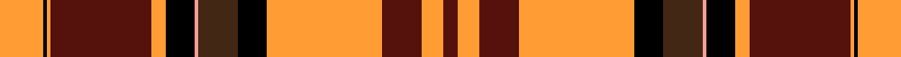

This is one **variant** — a specific cloth: this exact thread count and colourway, with its own
provenance below. It is one weaving of the [sett](/setts/lo12k1lo1dr28lo4k8lr1do11k8lo32dr11lo6dr4/) (the scale-free proportion — the
same cloth at any scale or shade), whose colour order is pattern [BYBYKBYKYBYKY](/stripes/bybykbykybyky/).

Part of the [Aboyne](/tartans/a/ab/aboyne-2/) tartan — the named design grouping this sett with its other cloths.

Sourced from register-of-tartans.  It is a [13 stripe tartan](/stripes/stripes13/).

Original link [https://www.tartanregister.gov.uk/tartanDetails.aspx?ref=5170](https://www.tartanregister.gov.uk/tartanDetails.aspx?ref=5170)

Dataset <small>— provenance for this record, inherited from the source manifest</small>

<dl class="dataset-prov">
<dt>source</dt><dd><a href="/sources/register-of-tartans/">Scottish Register of Tartans</a></dd>
<dt>data captured from</dt><dd><a href="https://github.com/thetartan/tartan-database/blob/master/data/register-of-tartans/data.csv">https://github.com/thetartan/tartan-database/blob/master/data/register-of-tartans/data.csv</a></dd>
<dt>data date</dt><dd>2017-01-06 <small>(dataset default)</small></dd>
<dt>licence</dt><dd><a href="https://www.tartanregister.gov.uk/copyright">Crown copyright</a></dd>
</dl>

Capture chain <small>— the hands this data passed through, oldest first; each capture carries its own licence</small>

<ol class="capture-chain">
<li><a href="https://www.tartanregister.gov.uk/">Scottish Register of Tartans</a> · <a href="https://www.tartanregister.gov.uk/copyright">Crown copyright</a> <small>the living register — still published by National Records of Scotland</small></li>
<li><a href="https://github.com/thetartan/tartan-database">thetartan/tartan-database</a> <small>2016-2017</small> · <a href="https://creativecommons.org/licenses/by-nc-nd/4.0/">CC BY-NC-ND 4.0</a> <small>Levko Kravets's frozen compilation — the capture we vendored, and where its CC licence text came from</small></li>
<li>this dictionary <small>captured 2026-06-10 · commit 5bf86c7566</small> <small>each re-capture is a git commit to data/sources</small></li>
</ol>

## Register references

External register numbers recorded for this tartan.

- Scottish Register of Tartans: [5170](https://www.tartanregister.gov.uk/tartanDetails.aspx?ref=5170)
- Scottish Tartans Authority (ITI): 3014

## Thread count
LO/24 K2 LO2 DR56 LO8 K16 LR2 DO22 K16 LO64 DR22 LO12 DR/8

One full sett is **476 threads**.

## Palette
<table><thead><tr><th>Colour</th><th>Shade</th><th>OKLCh</th></tr></thead><tbody><tr><td>DR</td><td><code style="background-color:#55120C;">#55120C</code> <small style="color:#888">#55120C</small></td><td><small style="color:#888">oklch(30.0% 0.099 29.3)</small></td></tr><tr><td>LO</td><td><code style="background-color:#FF9C34;">#FF9C34</code> <small style="color:#888">#FF9C34</small></td><td><small style="color:#888">oklch(77.9% 0.161 61.8)</small></td></tr><tr><td>K</td><td><code style="background-color:#000000;">#000000</code> <small style="color:#888">#000000</small></td><td><small style="color:#888">oklch(0.0% 0.000 0.0)</small></td></tr><tr><td>LR</td><td><code style="background-color:#FF9C97;">#FF9C97</code> <small style="color:#888">#FF9C97</small></td><td><small style="color:#888">oklch(79.3% 0.119 23.2)</small></td></tr><tr><td>DO</td><td><code style="background-color:#412714;">#412714</code> <small style="color:#888">#412714</small></td><td><small style="color:#888">oklch(30.1% 0.050 55.7)</small></td></tr></tbody></table>

# Sample pattern

## Nearest tartan variants

The nearest existing variants by ΔTartan distance, with this cloth at the top so the swatches line up against it.

ΔTartan

Threads

Variant

Sett

—

476

<a href="/variants/s13/lo12k1lo1dr28lo4k8lr1do11k8lo32dr11lo6dr4~x2/">Aboyne</a>

<a href="/ttd/edit/#slug=lo12k1lo1r28lo4k8lr1do11k8lo32r11lo6r4~x2&amp;base=lo12k1lo1dr28lo4k8lr1do11k8lo32dr11lo6dr4~x2" title="compare in the TTD">0.15</a>

476

<a href="/variants/s13/lo12k1lo1r28lo4k8lr1do11k8lo32r11lo6r4~x2/">Aboyne I (Fashion)</a>

<a href="/ttd/edit/#slug=k5lb2r50k50r5w2r5g42r50k5w2&amp;base=lo12k1lo1dr28lo4k8lr1do11k8lo32dr11lo6dr4~x2" title="compare in the TTD">2.48</a>

429

<a href="/variants/s11/k5lb2r50k50r5w2r5g42r50k5w2/">MacDonald of Glenaladale - 1772 (Cla</a>

<a href="/ttd/edit/#slug=g9r52lb13k16y2k3w4k3g23r15g7y3~x2&amp;base=lo12k1lo1dr28lo4k8lr1do11k8lo32dr11lo6dr4~x2" title="compare in the TTD">2.48</a>

576

<a href="/variants/s12/g9r52lb13k16y2k3w4k3g23r15g7y3~x2/">Stewart of Galloway Clan Tartan</a>

<a href="/ttd/edit/#slug=r4k1y3k1r20k4g9r3g9k4lb3k1g7k2r6y2~x2&amp;base=lo12k1lo1dr28lo4k8lr1do11k8lo32dr11lo6dr4~x2" title="compare in the TTD">2.51</a>

304

<a href="/variants/s16/r4k1y3k1r20k4g9r3g9k4lb3k1g7k2r6y2~x2/">Brown-Wells (Personal)</a>

<a href="/ttd/edit/#slug=r26w1k8y1g13k1w4k1y2k4lb3r8~x4&amp;base=lo12k1lo1dr28lo4k8lr1do11k8lo32dr11lo6dr4~x2" title="compare in the TTD">2.62</a>

440

<a href="/variants/s12/r26w1k8y1g13k1w4k1y2k4lb3r8~x4/">Drummond Relic</a>

<a href="/ttd/edit/#slug=r32y14k16ly3k4lr4k4r1g28r13k4r4lr2~x2&amp;base=lo12k1lo1dr28lo4k8lr1do11k8lo32dr11lo6dr4~x2" title="compare in the TTD">2.69</a>

448

<a href="/variants/s13/r32y14k16ly3k4lr4k4r1g28r13k4r4lr2~x2/">Carolina, States of (District)</a>

<a href="/ttd/edit/#slug=r4k4r28dp4g4k10g4dp4g4dp8k1w3~x2&amp;base=lo12k1lo1dr28lo4k8lr1do11k8lo32dr11lo6dr4~x2" title="compare in the TTD">2.76</a>

298

<a href="/variants/s12/r4k4r28dp4g4k10g4dp4g4dp8k1w3~x2/">Kelly of Sleat Red</a>

<a href="/ttd/edit/#slug=r44g25k2w6k2y3k16lb12r6lb12k16y3k2w6r44~x2&amp;base=lo12k1lo1dr28lo4k8lr1do11k8lo32dr11lo6dr4~x2" title="compare in the TTD">2.90</a>

620

<a href="/variants/s15/r44g25k2w6k2y3k16lb12r6lb12k16y3k2w6r44~x2/">Wilson's, No 17</a>

<a href="/ttd/edit/#slug=r32lb14k16y3k4w4k4r1g28r13k4r4w2~x2&amp;base=lo12k1lo1dr28lo4k8lr1do11k8lo32dr11lo6dr4~x2" title="compare in the TTD">2.92</a>

448

<a href="/variants/s13/r32lb14k16y3k4w4k4r1g28r13k4r4w2~x2/">Carolina, States of</a>

<a href="/ttd/edit/#slug=r40k2w1ly40k3w2k3r5db22r3w1k3r7~x2&amp;base=lo12k1lo1dr28lo4k8lr1do11k8lo32dr11lo6dr4~x2" title="compare in the TTD">2.99</a>

434

<a href="/variants/s13/r40k2w1ly40k3w2k3r5db22r3w1k3r7~x2/">K9 (Artefact)</a>

## Neighbour map

Every grey dot is one of 13621 variants placed by the first two principal components of the ΔTartan feature space (42% of its variance). Red is this tartan; blue dots are its nearest — click one to open its page. The map is a flat projection of a many-dimensional space — [how to read it](/posts/neighbourhood-maps/).

<svg viewBox="0 0 640 380" role="img" style="max-width:100%;height:auto;border:1px solid #e0e0e0;border-radius:4px;display:block" xmlns="http://www.w3.org/2000/svg"><image href="/nn/cloud.v1.png" width="640" height="380"/><a href="/variants/s13/lo12k1lo1r28lo4k8lr1do11k8lo32r11lo6r4~x2/"><circle cx="211.9" cy="90.4" r="4" fill="#3465a4"><title>Aboyne I (Fashion)</title></circle></a><a href="/variants/s11/k5lb2r50k50r5w2r5g42r50k5w2/"><circle cx="232.0" cy="89.3" r="4" fill="#3465a4"><title>MacDonald of Glenaladale - 1772 (Cla</title></circle></a><a href="/variants/s12/g9r52lb13k16y2k3w4k3g23r15g7y3~x2/"><circle cx="181.8" cy="79.7" r="4" fill="#3465a4"><title>Stewart of Galloway Clan Tartan</title></circle></a><a href="/variants/s16/r4k1y3k1r20k4g9r3g9k4lb3k1g7k2r6y2~x2/"><circle cx="169.4" cy="102.6" r="4" fill="#3465a4"><title>Brown-Wells (Personal)</title></circle></a><a href="/variants/s12/r26w1k8y1g13k1w4k1y2k4lb3r8~x4/"><circle cx="188.7" cy="69.0" r="4" fill="#3465a4"><title>Drummond Relic</title></circle></a><a href="/variants/s13/r32y14k16ly3k4lr4k4r1g28r13k4r4lr2~x2/"><circle cx="145.9" cy="74.5" r="4" fill="#3465a4"><title>Carolina, States of (District)</title></circle></a><a href="/variants/s12/r4k4r28dp4g4k10g4dp4g4dp8k1w3~x2/"><circle cx="178.8" cy="87.9" r="4" fill="#3465a4"><title>Kelly of Sleat Red</title></circle></a><a href="/variants/s15/r44g25k2w6k2y3k16lb12r6lb12k16y3k2w6r44~x2/"><circle cx="168.2" cy="74.9" r="4" fill="#3465a4"><title>Wilson's, No 17</title></circle></a><a href="/variants/s13/r32lb14k16y3k4w4k4r1g28r13k4r4w2~x2/"><circle cx="136.6" cy="72.3" r="4" fill="#3465a4"><title>Carolina, States of</title></circle></a><a href="/variants/s13/r40k2w1ly40k3w2k3r5db22r3w1k3r7~x2/"><circle cx="209.6" cy="53.5" r="4" fill="#3465a4"><title>K9 (Artefact)</title></circle></a><circle cx="202.1" cy="91.0" r="5" fill="#c00000"/><text x="320" y="376" text-anchor="middle" font-size="11" fill="#999">ground</text><text x="11" y="190" text-anchor="middle" font-size="11" fill="#999" transform="rotate(-90 11 190)">complexity</text></svg>

ID: /variants/s13/lo12k1lo1dr28lo4k8lr1do11k8lo32dr11lo6dr4~x2/
