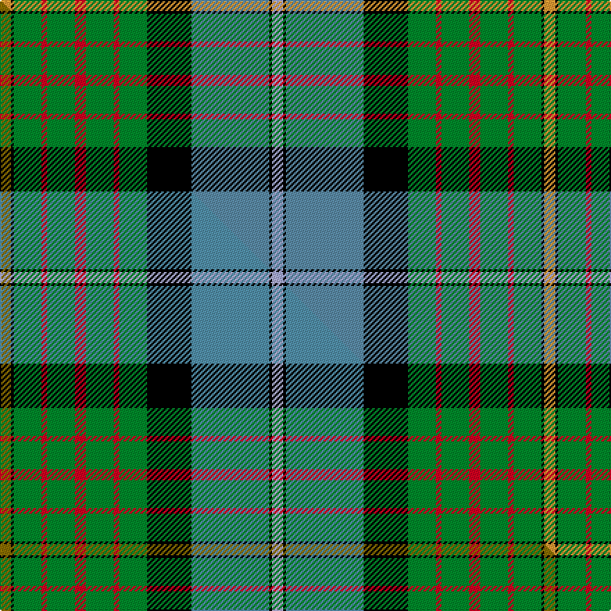

This is one **variant** — a specific cloth: this exact thread count and colourway, with its own
provenance below. It is one weaving of the [sett](/tartans/c/ca/california-state/) (the scale-free proportion — the
same cloth at any scale or shade), whose colour order is pattern [WKBKGRGRGRGKY](/stripes/wkbkgrgrgrgky/).

Part of the [California State](/tartans/c/ca/california-state/) tartan — the named design grouping this sett with its other cloths.

Sourced from house-of-tartan.  It is a [13 stripe tartan](/stripes/stripes13/).

Original link [http://www.house-of-tartan.scotland.net/house/TartanViewjs.asp?colr=Def&tnam=2454](http://www.house-of-tartan.scotland.net/house/TartanViewjs.asp?colr=Def&tnam=2454)

## Provenance

Earliest known date: 1998 Designed by J.Howard Standing of Tarzana, California and Thomas Ferguson of Sydney, British Columbia. Adopted as the 'official' California State tartan by the State Legislature. For general use by all those living in the State. Based on Muir, after the famous botanist and environmentalist John Muir who lived in California. Assembly Bill 2362, february 20th 1998.

Dataset <small>— provenance for this record, inherited from the source manifest</small>

<dl class="dataset-prov">
<dt>source</dt><dd><a href="/sources/house-of-tartan/">House of Tartan</a></dd>
<dt>data captured from</dt><dd><a href="https://github.com/thetartan/tartan-database/blob/master/data/house-of-tartan/data.csv">https://github.com/thetartan/tartan-database/blob/master/data/house-of-tartan/data.csv</a></dd>
<dt>data date</dt><dd>1998 <small>(this record)</small></dd>
<dt>licence</dt><dd><a href="https://creativecommons.org/licenses/by-nc-nd/4.0/">CC BY-NC-ND 4.0</a></dd>
</dl>

Capture chain <small>— the hands this data passed through, oldest first; each capture carries its own licence</small>

<ol class="capture-chain">
<li><a href="http://www.house-of-tartan.scotland.net/">House of Tartan</a> <small>the weaver/retailer's database — the site is now offline; the URL is kept as the ultimate source's identity</small></li>
<li><a href="https://github.com/thetartan/tartan-database">thetartan/tartan-database</a> <small>2016-2017</small> · <a href="https://creativecommons.org/licenses/by-nc-nd/4.0/">CC BY-NC-ND 4.0</a> <small>Levko Kravets's frozen compilation — the capture we vendored, and where its CC licence text came from</small></li>
<li>this dictionary <small>captured 2026-06-10 · commit 5bf86c7566</small> <small>each re-capture is a git commit to data/sources</small></li>
</ol>

## Thread count
LO/8 K2 G20 R4 G20 R8 G20 R4 G20 K32 T56 K2 LB/8

One full sett is **392 threads**.

## Palette
<table><thead><tr><th>Colour</th><th>Shade</th><th>OKLCh</th></tr></thead><tbody><tr><td>T</td><td><code style="background-color:#00879F;">#00879F</code> <small style="color:#888">#00879F</small></td><td><small style="color:#888">oklch(57.4% 0.102 216.1)</small></td></tr><tr><td>T</td><td><code style="background-color:#5C8CA8;">#5C8CA8</code> <small style="color:#888">#5C8CA8</small></td><td><small style="color:#888">oklch(61.7% 0.067 235.0)</small></td></tr><tr><td>DB</td><td><code style="background-color:#082077;">#082077</code> <small style="color:#888">#082077</small></td><td><small style="color:#888">oklch(30.0% 0.149 265.1)</small></td></tr><tr><td>R</td><td><code style="background-color:#D60020;">#D60020</code> <small style="color:#888">#D60020</small></td><td><small style="color:#888">oklch(55.2% 0.224 25.5)</small></td></tr><tr><td>LO</td><td><code style="background-color:#FF9C34;">#FF9C34</code> <small style="color:#888">#FF9C34</small></td><td><small style="color:#888">oklch(77.9% 0.161 61.8)</small></td></tr><tr><td>G</td><td><code style="background-color:#008B2A;">#008B2A</code> <small style="color:#888">#008B2A</small></td><td><small style="color:#888">oklch(55.4% 0.170 145.9)</small></td></tr><tr><td>K</td><td><code style="background-color:#000000;">#000000</code> <small style="color:#888">#000000</small></td><td><small style="color:#888">oklch(0.0% 0.000 0.0)</small></td></tr><tr><td>LB</td><td><code style="background-color:#A8ACE8;">#A8ACE8</code> <small style="color:#888">#A8ACE8</small></td><td><small style="color:#888">oklch(76.3% 0.086 281.2)</small></td></tr></tbody></table>

# Sample pattern

## Compared to the master

This cloth is one sett of its design; the master sett (the exemplar the design is anchored on) is below for comparison.

Its **ΔTartan distance** from the master is **0.31** — the same measure the nearest-tartans table ranks by (0 is identical; a re-scale of the same cloth is near 0, a recolour or a different proportion further).

<figure class="master-compare" style="margin:0">

this sett
master sett ★

<figcaption style="color:#888;font-size:smaller">One weave of this sett against the <a href="/setts/y4k1g10r2g10r4g10r2g10k16t28k1lb4/">master sett ★</a>, split on the diagonal: a shared proportion runs seamlessly across it with only the shades shifting; a different proportion breaks on it.</figcaption>
</figure>

## Nearest tartan variants

The nearest existing variants by ΔTartan distance, with this cloth at the top so the swatches line up against it.

ΔTartan

Threads

Variant

Sett

—

392

<a href="/variants/s13/lo4k1g10r2g10r4g10r2g10k16t28k1lb4~x2~t2503227-lb3103284/">California State American District Tartan</a>

<a href="/ttd/edit/#slug=y4k1g10r2g10r4g10r2g10k16t28k1lb4~x2~t2503227-lb3103284&amp;base=lo4k1g10r2g10r4g10r2g10k16t28k1lb4~x2~t2503227-lb3103284" title="compare in the TTD">0.30</a>

392

<a href="/variants/s13/y4k1g10r2g10r4g10r2g10k16t28k1lb4~x2~t2503227-lb3103284/">California State</a>

<a href="/ttd/edit/#slug=y4k1g10r2g10r4g10r2g10k16db28k1b4~x2&amp;base=lo4k1g10r2g10r4g10r2g10k16t28k1lb4~x2~t2503227-lb3103284" title="compare in the TTD">0.41</a>

392

<a href="/variants/s13/y4k1g10r2g10r4g10r2g10k16db28k1b4~x2/">California</a>

<a href="/ttd/edit/#slug=w4k1r2k1g9k2t24k2r6k2g12y2~x2&amp;base=lo4k1g10r2g10r4g10r2g10k16t28k1lb4~x2~t2503227-lb3103284" title="compare in the TTD">1.81</a>

256

<a href="/variants/s12/w4k1r2k1g9k2t24k2r6k2g12y2~x2/">Tait #2</a>

<a href="/ttd/edit/#slug=dr4w6k10db5k3y16k3g33k1w4~x2&amp;base=lo4k1g10r2g10r4g10r2g10k16t28k1lb4~x2~t2503227-lb3103284" title="compare in the TTD">2.03</a>

324

<a href="/variants/s10/dr4w6k10db5k3y16k3g33k1w4~x2/">Fermanagh County, Crest Range</a>

<a href="/ttd/edit/#slug=g30dp4r6w6db6dp3k14w14db50g50w2&amp;base=lo4k1g10r2g10r4g10r2g10k16t28k1lb4~x2~t2503227-lb3103284" title="compare in the TTD">2.26</a>

338

<a href="/variants/s11/g30dp4r6w6db6dp3k14w14db50g50w2/">Brehat (Personal)</a>

<a href="/ttd/edit/#slug=w4k1db16k1g32dr6k6lo6g4lo2g1~x2&amp;base=lo4k1g10r2g10r4g10r2g10k16t28k1lb4~x2~t2503227-lb3103284" title="compare in the TTD">2.37</a>

306

<a href="/variants/s11/w4k1db16k1g32dr6k6lo6g4lo2g1~x2/">Zambia</a>

<a href="/ttd/edit/#slug=dr4w6k10db5k3ly16k3g33k1w4~x2&amp;base=lo4k1g10r2g10r4g10r2g10k16t28k1lb4~x2~t2503227-lb3103284" title="compare in the TTD">2.39</a>

324

<a href="/variants/s10/dr4w6k10db5k3ly16k3g33k1w4~x2/">Fermanagh County Crest (Fashion)</a>

<a href="/ttd/edit/#slug=g18dr1g2dr2g16dr1k16n1k2dr2b20dr1w2~x4&amp;base=lo4k1g10r2g10r4g10r2g10k16t28k1lb4~x2~t2503227-lb3103284" title="compare in the TTD">2.45</a>

592

<a href="/variants/s13/g18dr1g2dr2g16dr1k16n1k2dr2b20dr1w2~x4/">Canadian Estate</a>

<a href="/ttd/edit/#slug=k14r2k2r2k2g18r2g18w1db12lb1r8~x2&amp;base=lo4k1g10r2g10r4g10r2g10k16t28k1lb4~x2~t2503227-lb3103284" title="compare in the TTD">2.46</a>

284

<a href="/variants/s12/k14r2k2r2k2g18r2g18w1db12lb1r8~x2/">Princess Diana</a>

<a href="/ttd/edit/#slug=y9k1o31g30db36g3db3g3db36g30o31k1w9~x2&amp;base=lo4k1g10r2g10r4g10r2g10k16t28k1lb4~x2~t2503227-lb3103284" title="compare in the TTD">2.46</a>

856

<a href="/variants/s13/y9k1o31g30db36g3db3g3db36g30o31k1w9~x2/">Campbell, Brown (Personal)</a>

## Neighbour map

Every grey dot is one of 13656 variants placed by the first two principal components of the ΔTartan feature space (42% of its variance). Red is this tartan; blue dots are its nearest — click one to open its page. The map is a flat projection of a many-dimensional space — [how to read it](/posts/neighbourhood-maps/).

<svg viewBox="0 0 640 380" role="img" style="max-width:100%;height:auto;border:1px solid #e0e0e0;border-radius:4px;display:block" xmlns="http://www.w3.org/2000/svg"><image href="/nn/cloud.v1.png" width="640" height="380"/><a href="/variants/s13/y4k1g10r2g10r4g10r2g10k16t28k1lb4~x2~t2503227-lb3103284/"><circle cx="149.5" cy="99.2" r="4" fill="#3465a4"><title>California State</title></circle></a><a href="/variants/s13/y4k1g10r2g10r4g10r2g10k16db28k1b4~x2/"><circle cx="148.4" cy="96.9" r="4" fill="#3465a4"><title>California</title></circle></a><a href="/variants/s12/w4k1r2k1g9k2t24k2r6k2g12y2~x2/"><circle cx="145.0" cy="92.3" r="4" fill="#3465a4"><title>Tait #2</title></circle></a><a href="/variants/s10/dr4w6k10db5k3y16k3g33k1w4~x2/"><circle cx="141.0" cy="86.6" r="4" fill="#3465a4"><title>Fermanagh County, Crest Range</title></circle></a><a href="/variants/s11/g30dp4r6w6db6dp3k14w14db50g50w2/"><circle cx="170.4" cy="100.8" r="4" fill="#3465a4"><title>Brehat (Personal)</title></circle></a><a href="/variants/s11/w4k1db16k1g32dr6k6lo6g4lo2g1~x2/"><circle cx="193.8" cy="76.3" r="4" fill="#3465a4"><title>Zambia</title></circle></a><a href="/variants/s10/dr4w6k10db5k3ly16k3g33k1w4~x2/"><circle cx="133.4" cy="84.8" r="4" fill="#3465a4"><title>Fermanagh County Crest (Fashion)</title></circle></a><a href="/variants/s13/g18dr1g2dr2g16dr1k16n1k2dr2b20dr1w2~x4/"><circle cx="163.9" cy="94.4" r="4" fill="#3465a4"><title>Canadian Estate</title></circle></a><a href="/variants/s12/k14r2k2r2k2g18r2g18w1db12lb1r8~x2/"><circle cx="145.4" cy="105.1" r="4" fill="#3465a4"><title>Princess Diana</title></circle></a><a href="/variants/s13/y9k1o31g30db36g3db3g3db36g30o31k1w9~x2/"><circle cx="160.4" cy="103.2" r="4" fill="#3465a4"><title>Campbell, Brown (Personal)</title></circle></a><circle cx="145.8" cy="97.6" r="5" fill="#c00000"/><text x="320" y="376" text-anchor="middle" font-size="11" fill="#999">ground</text><text x="11" y="190" text-anchor="middle" font-size="11" fill="#999" transform="rotate(-90 11 190)">complexity</text></svg>

ID: /variants/s13/lo4k1g10r2g10r4g10r2g10k16t28k1lb4~x2~t2503227-lb3103284/
